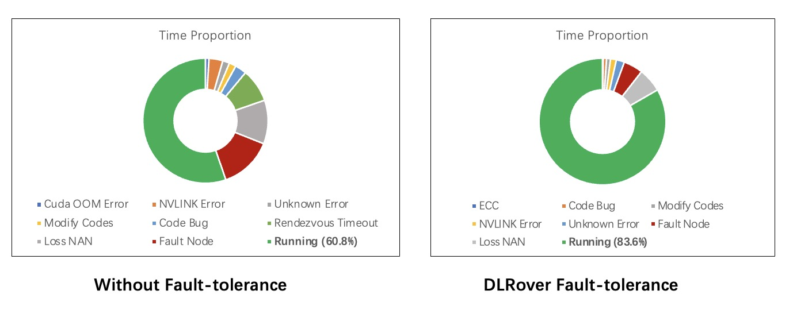

# DLRover

<div align="center">

</div>

<div id="top" align="center">
DLRover: An Automatic Distributed Deep Learning System
</div>

[](https://github.com/intelligent-machine-learning/easydl/actions/workflows/main.yml)
[](https://codecov.io/gh/intelligent-machine-learning/dlrover)
[](https://pypi.org/project/dlrover/)

DLRover makes the distributed training of large AI models easy, stable, fast and green.
It can automatically train the Deep Learning model on the distributed cluster.
It helps model developers to focus on model arichtecture, without taking care of
any engineering stuff, say, hardware acceleration, distributed running, etc.
Now, it provides automated operation and maintenance for deep learning
training jobs on K8s/Ray. Major features as

- **Fault-Tolerance**, single node failover without restarting the entire job.
- **Auto-Scaling**, Automatically scale up/down resources at both
node level and CPU/memory level.
- **Dynamic data sharding**, dynamic dispatch training data to each worker
instead of dividing equally, faster worker more data.
- **Automatic Resource Optimization**, Automatically optimize the job resource
to improve the training performance and resources utilization.

## Latest News

- [2023/11] [ATorch supporting efficient and easy-to-use model training is released.](atorch/README.md)
- [2023/10] [AGD: an Auto-switchable Optimizer using Stepwise Gradient Difference as Preconditioning Matrix, NeurIPS 2023.](atorch/docs/README-AGD.md)
- [2023/09] [Weighted Sharpness-Aware Minimization (WSAM) has been accepted by KDD'23.](atorch/docs/README-WSAM.md)
- [2023/08] [DLRover improves the stability of pre-trained model training over thousands of GPUs.](docs/blogs/stabilize_llm_training_cn.md)
- [2023/04] [DLRover auto-scales nodes of a DeepRec distributed training job.](docs/blogs/deeprec_autoscale_cn.md)

## Why DLRover?

### Fault Tolerance to Improve the Stability of Job

DLRover can restore the training when the process fails without stopping the
training job. The actions to restore training in DLRover are:

1. Diagnose the failure reason.
2. Restart the process not the node due to software errors.
3. Restart the failed nodes due to hardward errors.

For detail, we can see [experiments](docs/tutorial/fault_tolerations.md)
of fault-tolerance and elasticity.

#### Fault Tolerance of PyTorch Distributed Training

DLRover supports fault tolerance of the process failure and the node failure
to restore trainig. Compared with restarting a new job, DLRover can
reduce the overhead to schedule all Pods, pull image and
install  packages on all nodes.  

|  Step to restore training |  Failure without DLRover  |     Node failure with DLRover     |    Process failure with DLRover   |
|:-------------------------:|:-------------------------:|:---------------------------------:|:---------------------------------:|
|       Restore action      |        Restart Job        |        Restart failed nodes       |      Restart training process     |
|  Schedule node, pull image and install packages   |  All nodes |       Only new nodes      |                 No                |
| Node health check         |            No             | All nodes execute a simple allgtather task | All nodes execute a allgtather simple task |
| Start training process    |            Yes            |                Yes                |                Yes                |

<div align="center">

</div>

#### Fault Tolerance of TensorFlow PS Distributed Training

DLRover can recover failed parameter servers and workers to
resume training. Compared with manual restarting jobs, DLRover
can reduce the overhead to restore the training.

|             Step to restore training            |  Failure without DLRover  |   PS failure with DLRover  | Worker failure with DLRover |
|:-----------------------------------------------:|:-------------------------:|:--------------------------:|:---------------------------:|
|                  Restore action                 |        Restart Job        |      Restart failed PS     |    Restart failed workers   |
| Schedule node, pull image and install packages  |   All nodes               |         Only new PS        |     Only new workers        |
|                  Start session                  |         all nodes         |          all nodes         |       Only new workers      |
|                 Initialize Graph                |            Yes            |             Yes            |       Only new workers      |
|                Restore checkpoint               |            Yes            |             Yes            |              No             |

What's more, DLRover also can automatic diagnose the reason of failure. For example,
the OOM is the common error due to user's insufficient memory configuration.
DLRover can automatically launch a Pod with more memory to recover the OOM node.
In AntGroup, DLRover manages hundreds of DL training jobs every day on the customized Kubernetes cluster in AntGroup.
Except for the failed job resulting from code errors, the rate of completed jobs raise 89%
with tf-operator in KubeFlow to 95%. Other unrecoverable failure reasons of a job are data error,
NaN loss of the model, network breakdown, and so on.

<div align="center">

</div>

### Auto-Scaling to Improve Training Performance and Resource Utilization

DLRover automatically scales up/down resources (for parameter servers or workers) at the runtime of a training job.
By monitoring the workload of nodes and throughput, DLRover can diagnose the bottleneck of the resource configuration.
The common bottleneck contains node straggler, the unbalanced workload of PS, insufficient CPU cores of nodes,
and the insufficient number of nodes. DLRover can improve the training performance by dynamic resource adjustment.

In order to improve the training througphput, users prefer to
configure their jobs with over-provision resources to
avoid any potential risk from insufficient resources.
This usually ends up in huge resource waste. DLRover Auto-Scaling
can allocate resources by the demand of model training to reduce
the waste of resources.

<div align="center">

</div>

### Dynamic Data Sharding For Elasticity and Fault-tolerance

Dynamic data sharding splits the dataset into many small shards and each shard only
contains a few batches of training samples. The worker will get a shard only when it using up
samples of the last one. With the dynaic sharding, DLRover can

- recover the shard if the worker fails before using up samples of the shard.
- mitigate the worker straggler by assigning more shards to the fast worker.

### Integration to Offline and Online Deep Learning

With the data source transparency provided by dynamic data sharding, DLRover can be integrated with
offline training which consumes batch data, and also supports online learning with real-time streaming data.
(fed with a message queue like RocketMQ/Kafka/Pulsar/...,
or executed as a training sink node inside Flink/Spark/Ray/...)

By practice, DLRover is an ideal component to build an end-to-end industrial online learning system,
[estimator.md](docs/tutorial/estimator.md) provides a detailed example implemented with `tf.estimator.Estimator`.

## How to Use DLRover to Train Your Models?

We can use `dlrover-run` to run the training script which
`torchrun` or `torch.distributed.run` can run.

### Local Run to Train a PyTorch Model

We run DLRover locally like

```bash
pip install dlrover[torch]
dlrover-run --standalone --nproc_per_node=$NUM_TRAINERS train_scripts.py
```

### Distributed Run to Train a PyTorch Model

#### Run in a DLRover ElasticJob

Firstly, the user need to deploy the DLRover elasticjob controller in a kubernetes
cluster by followding the [tutorial](docs/deployment/controller.md). Then, we need
to install `dlrover[torch]` and execute `dlrover-run` in
the command of the Pod container like the example [torch_mnist_job.yaml](examples/pytorch/mnist/elastic_job.yaml).

```bash
pip install dlrover[torch] && \
dlrover-run --network-check --nnodes=$NODE_NUM --nproc_per_node=$NUM_TRAINERS train_scripts.py
```

`--nnodes` is the number of nodes and `--nproc_per_node` is the number of process
on each node. They are the same as the arguments of [torchrun](https://pytorch.org/docs/stable/elastic/run.html).

#### Run in other k8s Jobs

We can also use `dlrover-run` in other k8s jobs like [kubeflow/PyTorchJob](https://www.kubeflow.org/docs/components/training/pytorch/).
We need to set the `NODE_RANK` and `DLROVER_MASTER_ADDR` before `dlrover-run`.
For example, the `PyTorchJob` has set the `RANK`, `MASTER_ADDR` and `MASTER_PORT`
into environments. We can run `dlrover-run` like

```bash
NODE_RANK=$RANK DLROVER_MASTER_ADDR=$MASTER_ADDR:$MASTER_PORT \
dlrover-run --standalone --network-check --nnodes=$NODE_NUM --nproc_per_node=$NUM_TRAINERS  train_script.py
```

**Note**:

- `dlrover-run` extends `torchrun` which dynamically configures `MASTER_ADDR` and `MASTER_PORT`
for training processes. We can use the static `MASTER_ADDR` and `MASTER_PORT` of PyTorchJob as the address
of DLRover job master.

- The elastic scheduling of DLRover to restore or scale up/down Pods
is not enabled without DLRover ElasticJob.

### Train a TensorFlow Model

We can use DLRover to train a TensorFlow by the following steps:

- Use TensorFlow estimator to develop the TensorFlow model.
- Define the input of `tf.dataset` in a training configuration of DLRover.
- Define your reader to read samples from the dataset file.

We can refer to the [estimator.md](docs/tutorial/estimator.md) to train
a model with DLRover.

## What's Next?

- Aysnchronously save the checkpoint to the storage.
  - Significantly reduce checkpoint saving/restore time which blocks training.
  - Save the checkpoint from the CPU memory even if the training process fails.
- Fine-grained automatic distributed training for GPU Synchronous jobs
  - hybrid-parallel mode
  - adapted hyper parameters adjustment with dynamic resources
  - more strategies for Fine-grained scenarioes
- Full stack solution for Online Deep Learning
- High performance extension library for Tensorflow/Pytorch to speed up training
- ...

## Contributing

Please refer to the [DEVELOPMENT](docs/developer_guide.md)

## Quick Start

[Train a TensorFlow Estimator on Kubernetes](docs/tutorial/tf_ps_on_cloud.md)

[Train a PyTorch Model on Kubernetes](docs/tutorial/torch_on_cloud.md)

[Train a GPT Model on Kubernetes](docs/tutorial/torch_ddp_nanogpt.md)

[Train a llama2 model.](examples/pytorch/llama2/README.md)
