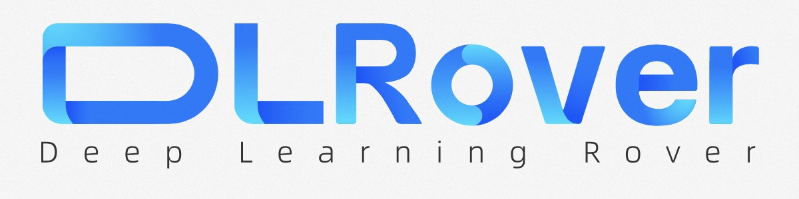

# DLRover

<div align="center">

</div>

<div id="top" align="center">
DLRover: An Automatic Distributed Deep Learning System
</div>

[](https://github.com/intelligent-machine-learning/easydl/actions/workflows/main.yml)
[](https://codecov.io/gh/intelligent-machine-learning/dlrover)
[](https://pypi.org/project/dlrover/)

DLRover makes the distributed training of large AI models easy, stable, fast and green.
It can automatically train the Deep Learning model on the distributed cluster.
It helps model developers to focus on model arichtecture, without taking care of
any engineering stuff, say, hardware acceleration, distributed running, etc.
Now, it provides automated operation and maintenance for deep learning
training jobs on K8s/Ray. Major features as

- **Fault-Tolerance**: The distributed training can continue running in the event of failures.
- **Flash Checkpoint**: The distributed training can recover failures from the in-memory checkpoint in seconds.
- **Auto-Scaling**: The distributed training can scale up/down resources to improve the stability, throughput
and resource utilization.

What's more, DLRover provides extension libraries of PyTorch and TensorFlow to Speed Up Training.

- [ATorch](atorch/README.md): an extension library of PyTorch to Speed Up Training of Large LLM.
- [TFPlus](tfplus/README.md): an extension library of TensorFlow to Speed Up Training of Search, Recommendation and Advertisement.

## Latest News

- [2024/06] [DLRover-RM has been accepted by VLDB'24.](docs/blogs/dlrover_rm.md)
- [2024/04] [Flash Checkpoint Supports HuggingFace transformers.Trainer to Asynchronously persist checkpoints.](docs/blogs/flash_checkpoint.md#huggingface-transformerstrainer)
- [2024/02] [Flash Checkpoint Saves the Megatron-LM Checkpoint in Seconds.](docs/blogs/megatron_flash_checkpoint.md)
- [2024/01] [Flash Checkpoint to Recover Large Model Training From Failure in Seconds.](docs/blogs/flash_checkpoint.md)
- [2023/11] [ATorch supporting efficient and easy-to-use model training is released.](atorch/README.md)
- [2023/10] [AGD: an Auto-switchable Optimizer using Stepwise Gradient Difference as Preconditioning Matrix, NeurIPS 2023.](atorch/docs/README-AGD.md)
- [2023/09] [Weighted Sharpness-Aware Minimization (WSAM) has been accepted by KDD'23.](atorch/docs/README-WSAM.md)
- [2023/08] [DLRover improves the stability of pre-trained model training over thousands of GPUs.](docs/blogs/stabilize_llm_training_cn.md)
- [2023/04] [DLRover auto-scales nodes of a DeepRec distributed training job.](docs/blogs/deeprec_autoscale_cn.md)

## Why DLRover?

### Fault Tolerance to Reduce the Downtime of a Large Scale Training Job

DLRover can restore the training when the process fails without stopping the
training job. The actions to restore training in DLRover are:

1. Automatically diagnose the failure reason.
2. Restart the process not the node due to software errors.
3. Restart the failed nodes due to hardward errors.

For detail, we can see the [blog of fault-tolerance and elasticity](docs/blogs/stabilize_llm_training_cn.md).
**With fault tolerance, the goodput of GLM-65B training
on thousands of GPUs increased from 69% to 95%**. The goodput is the time spent computing
useful new steps over the elapsed time of the training job.
The downtime details are shown:

<div align="center">

</div>

#### Fault Tolerance and Flash Checkpoint to Reduce Downtime of PyTorch Training

In addition to fault tolerance, DLRover provides the [flash checkpoint](docs/blogs/flash_checkpoint.md) to
save/load checkpoint in seconds. With flash checkpoint, the training can
frequently save checkpoints and reduce the roll-back step to resume training
from the latest checkpoint when a failure happens. The features of flash checkpoint are:

1. Asynchronously persist the checkpoint to the storage.
2. Persist the checkpoint to the storage once the training process fails.
3. Load the checkpoint from the host memory after the training process restarts.
4. APIs for DDP, FSDP, DeepSpeed and Megatron-LM([cb995d5](https://github.com/NVIDIA/Megatron-LM/tree/cb995d571faea19d01a1bf55ed0fd89523b9ce64)).

<div align="center">


<text> The Performance of DLRover Flash Checkpoint to Save/Load GPT2-1.5B.</text>
</div>

The figure illustrates that the I/O time of different DL frameworks to read checkpoint files
when resuming training processes. With DLRover Flash Checkpoint,
recovery could be completed in the order of seconds by loading checkpoints directly from shared memory,
which is much faster compared to loading checkpoints from SSD and NAS.

#### Fault Tolerance Improves the Stability of TensorFlow PS Training

DLRover can recover failed parameter servers and workers to resume training.

1. DLRover can automatically launch a Pod with more memory to recover the OOM node.
2. DLRover can reassign the training data of a failed worker to other workers.
3. DLRover can automatically scale up the parameter servers to fit the model size.

In AntGroup, DLRover manages hundreds of DL training jobs every day on the customized Kubernetes cluster in AntGroup.
Except for the failed job resulting from code errors, **the rate of completed jobs increase from 89%
with tf-operator in KubeFlow to 95%**. Other unrecoverable failure reasons of a job are data error,
NaN loss of the model, network breakdown, and so on.

<div align="center">

</div>

### Auto-Scaling to Improve Training Performance and Resource Utilization

DLRover automatically scales up/down resources (for parameter servers or workers) at the runtime of a training job.
By monitoring the workload of nodes and throughput, DLRover can diagnose the bottleneck of the resource configuration.
The common bottleneck contains node straggler, the unbalanced workload of PS, insufficient CPU cores of nodes,
and the insufficient number of nodes. DLRover can improve the training performance by dynamic resource adjustment.

In order to improve the training througphput, users prefer to
configure their jobs with over-provision resources to
avoid any potential risk from insufficient resources.
This usually ends up in huge resource waste. DLRover Auto-Scaling
can allocate resources by the demand of model training to reduce
the waste of resources.

<div align="center">

</div>

### Dynamic Data Sharding For Elasticity and Fault-tolerance

Dynamic data sharding splits the dataset into many small shards and each shard only
contains a few batches of training samples. The worker will get a shard only when it using up
samples of the last one. With the dynaic sharding, DLRover can

- recover the shard if the worker fails before using up samples of the shard.
- mitigate the worker straggler by assigning more shards to the fast worker.

### Integration to Offline and Online Deep Learning

With the data source transparency provided by dynamic data sharding, DLRover can be integrated with
offline training which consumes batch data, and also supports online learning with real-time streaming data.
(fed with a message queue like RocketMQ/Kafka/Pulsar/...,
or executed as a training sink node inside Flink/Spark/Ray/...)

By practice, DLRover is an ideal component to build an end-to-end industrial online learning system,
[estimator.md](docs/tutorial/estimator.md) provides a detailed example implemented with `tf.estimator.Estimator`.

## How to Use DLRover to Train Your Models?

### Train a PyTorch Model

We can use `dlrover-run` to run the training script which
`torchrun` or `torch.distributed.run` can run.

```bash
pip install dlrover[torch]
dlrover-run --nnodes=1 --nproc_per_node=$NUM_TRAINERS train_scripts.py
```

The more detail tutorials are:

- [Elastic scheduling tutorial](docs/tutorial/torch_elasticjob_on_k8s.md) to
support elasticity and fault tolerance of Pod on k8s.
- [Node detection tutorial](docs/tutorial/check_node_health.md) to check the fault or slow node in a distributed job.
- [Flash Checkpoint](docs/blogs/flash_checkpoint.md) to speed up checkpoint during training.

### Train a TensorFlow Model

We can use DLRover to train a TensorFlow by the following steps:

- Use TensorFlow estimator to develop the TensorFlow model.
- Define the input of `tf.dataset` in a training configuration of DLRover.
- Define your reader to read samples from the dataset file.

We can refer to the [estimator.md](docs/tutorial/estimator.md) to train
a model with DLRover.

## What's Next?

- Multi-node in-memory redundant backup checkpoint to fast failure recovery.
- Fine-grained automatic distributed training for GPU Synchronous jobs
  - hybrid-parallel mode
  - adapted hyper parameters adjustment with dynamic resources
  - more strategies for Fine-grained scenarioes
- Full stack solution for Online Deep Learning
- High performance extension library for Tensorflow/Pytorch to speed up training
- ...

## Contributing

Please refer to the [DEVELOPMENT](docs/developer_guide.md)

## Quick Start

[An Example of Flash Checkpoint.](examples/pytorch/fcp_demo.py)

[Train a PyTorch Model on Kubernetes.](docs/tutorial/torch_elasticjob_on_k8s.md)

[Train a GPT Model on Kubernetes.](docs/tutorial/torch_nanogpt.md)

[Train a TensorFlow Estimator on Kubernetes.](docs/tutorial/tf_elasticjob_on_k8s.md)

## Community

Welcome to scan the DingTalk QR or search "AI Infra" in WeChat(微信) to join DLRover group.
The DingTalk QR is:

<div align="center">

</div>

<div align="center">

</div>
