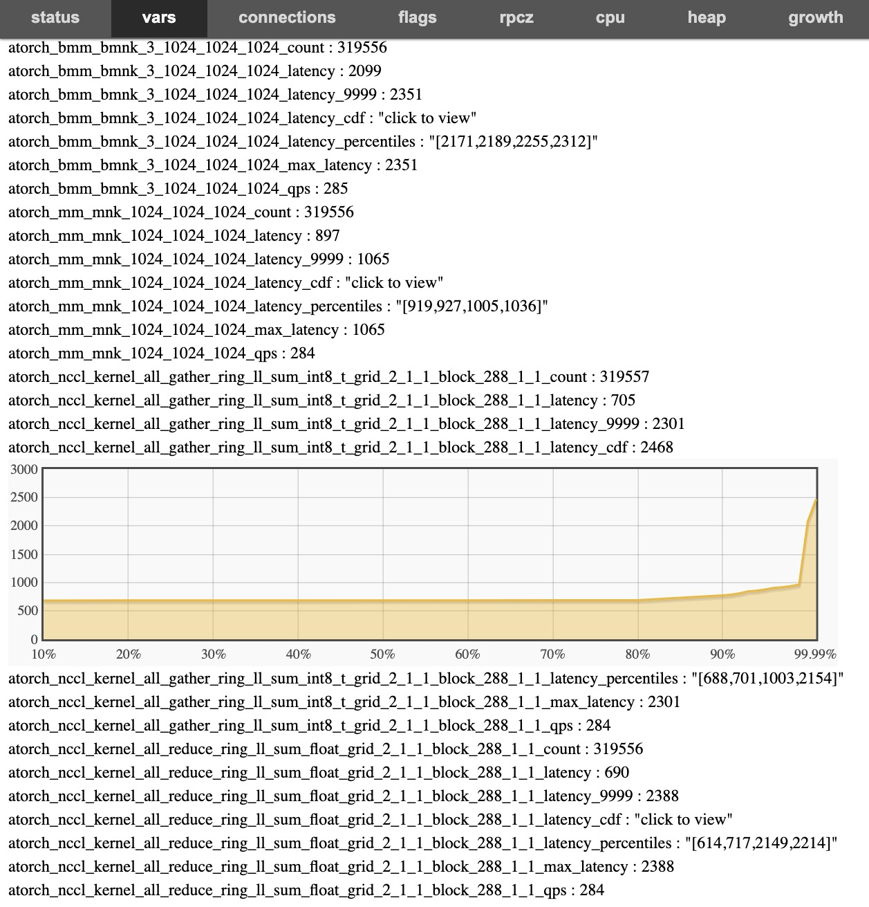

# xpu timer

This project hooking device runtime api to timing gemm or collective operations.

```bash
        ┌───────────────────────────────────┐                                                                                    
        │              apps                 │                                                                                    
        └───────────────────────────────────┘                                          ┌──────►restful                           
                                                  ┌───────┐                            │                                         
        ┌──────────────┐     ┌──────────────┐     │ nccl  │   ┌──────────────┐    ┌────┴───┐                                     
        │ other api    │     │  cuda api    ├────►│       ├──►│  cuda event  ├───►│  bvar  │                                     
        └──────────────┘     └──────────────┘     │ gemm  │   └──────────────┘    └────┬───┘                                     
                                                  └───────┘                            │                                         
        ┌───────────────────────────────────┐                                          └──────►prometheus expoter                
        │               driver              │                                                                                    
        └───────────────────────────────────┘                                                                                    
```

# BUILD

```bash
# current impl is for nvidia, maybe other platform will supported.

bazel build -c opt //:libevent_hook.so --//:GPU_PLATFORM=NVIDIA
bazel build -c opt //:libevent_hook.so --//:GPU_PLATFORM=OTHERS
```

# HOW TO USE

This need the device api is dynamic linked.

Use `LD_PRELOAD` to start your training process, then it will open prometheus server is opened at `0.0.0.0:28888+10000+local_rank`.

You can also start a brpc http server at `0.0.0.0:28888+local_rank` by set env `XPU_TIMER_OPENBRPC=1`, and you can view web browser.

Or you can use RESTFUL api to query metrics, `curl 127.0.0.1:28888/vars/atorch*` to get metrocs from brpc or `curl 127.0.0.1:38888/metrics` to get metrics from prometheus.


```bash
XPU_ENV=xxx LD_PRELOAD=`path to libevent_hook.so` python xxx
```

By default, we collect those kernel:

- torch.mm
- torch.bmm
- collection operator in `torch.distributed`

The gemm kernel is clustered by bmnk, collective operation is clustered by grid/block.

Time unit is microsecond.

## METRICS NAMING

### Matmul

For prometheus

```bash
curl 127.0.0.1:38888/metrics
# TYPE atorch_mm_mnk_1024_1024_1024_qps gauge
atorch_mm_mnk_1024_1024_1024_qps{host_name="unknown",job_name="unknown",pod_name="unknown",rank="1",type="mm"} 335
# TYPE atorch_mm_mnk_1024_1024_1024_avg_latency gauge
atorch_mm_mnk_1024_1024_1024_avg_latency{host_name="unknown",job_name="unknown",pod_name="unknown",rank="1",type="mm"} 776
# TYPE atorch_mm_mnk_1024_1024_1024_max_latency gauge
atorch_mm_mnk_1024_1024_1024_max_latency{host_name="unknown",job_name="unknown",pod_name="unknown",rank="1",type="mm"} 813
# TYPE atorch_mm_mnk_1024_1024_1024_p99_latency gauge
atorch_mm_mnk_1024_1024_1024_p99_latency{host_name="unknown",job_name="unknown",pod_name="unknown",rank="1",type="mm"} 799
# TYPE atorch_mm_mnk_1024_1024_1024_p9999_latency gauge
atorch_mm_mnk_1024_1024_1024_p9999_latency{host_name="unknown",job_name="unknown",pod_name="unknown",rank="1",type="mm"} 807
# TYPE atorch_bmm_bmnk_3_1024_1024_1024_qps gauge
atorch_bmm_bmnk_3_1024_1024_1024_qps{host_name="unknown",job_name="unknown",pod_name="unknown",rank="1",type="bmm"} 335
# TYPE atorch_bmm_bmnk_3_1024_1024_1024_avg_latency gauge
atorch_bmm_bmnk_3_1024_1024_1024_avg_latency{host_name="unknown",job_name="unknown",pod_name="unknown",rank="1",type="bmm"} 2205
# TYPE atorch_bmm_bmnk_3_1024_1024_1024_max_latency gauge
atorch_bmm_bmnk_3_1024_1024_1024_max_latency{host_name="unknown",job_name="unknown",pod_name="unknown",rank="1",type="bmm"} 2280
# TYPE atorch_bmm_bmnk_3_1024_1024_1024_p99_latency gauge
atorch_bmm_bmnk_3_1024_1024_1024_p99_latency{host_name="unknown",job_name="unknown",pod_name="unknown",rank="1",type="bmm"} 2273
# TYPE atorch_bmm_bmnk_3_1024_1024_1024_p9999_latency gauge
atorch_bmm_bmnk_3_1024_1024_1024_p9999_latency{host_name="unknown",job_name="unknown",pod_name="unknown",rank="1",type="bmm"} 2279
```

For brpc
```bash
curl 127.0.0.1:28888/vars/atorch*
atorch_bmm_bmnk_3_1024_1024_1024_count : 3115
atorch_bmm_bmnk_3_1024_1024_1024_latency : 2187
atorch_bmm_bmnk_3_1024_1024_1024_latency_80 : 2211
atorch_bmm_bmnk_3_1024_1024_1024_latency_90 : 2235
atorch_bmm_bmnk_3_1024_1024_1024_latency_99 : 2465
atorch_bmm_bmnk_3_1024_1024_1024_latency_999 : 2768
atorch_bmm_bmnk_3_1024_1024_1024_latency_9999 : 2775
atorch_bmm_bmnk_3_1024_1024_1024_max_latency : 2793
atorch_bmm_bmnk_3_1024_1024_1024_qps : 343
atorch_mm_mnk_1024_1024_1024_count : 3116
atorch_mm_mnk_1024_1024_1024_latency : 775
atorch_mm_mnk_1024_1024_1024_latency_80 : 786
atorch_mm_mnk_1024_1024_1024_latency_90 : 792
atorch_mm_mnk_1024_1024_1024_latency_99 : 831
atorch_mm_mnk_1024_1024_1024_latency_999 : 984
atorch_mm_mnk_1024_1024_1024_latency_9999 : 1309
atorch_mm_mnk_1024_1024_1024_max_latency : 1309
atorch_mm_mnk_1024_1024_1024_qps : 343
```

# USEFUL ENVAR

## Internal env var

| name   | description   | default |
|------------|------------| ----- |
| `XPU_TIMER_BASEPORT` | brpc/prometheus base port | defaults to 28888|
| `XPU_TIMER_LIB_PATH` | path of pytorch device shared object, if set, find nccl symbol in this file | defaults to "" |
| `XPU_TIMER_OPENBRPC` | open brpc server or not | defaults to 0|
| `XPU_TIMER_PROMETHEUS_UPDATE_INTERVAL` | interval(seconds) of gaute update in prometheus service| defaults to 5|

## Other env var

| name   | description   | must set |
|------------|------------| ----- |
| `RANK` | global rank | N |
| `LOCAL_RANK` | local rank, port offset of each rank | Y |
| `POD_IP` | IP of pod, use to label gauge | N|
| `ENV_ARGO_WORKFLOW_NAME` | job name of aistudio,  use to label gauge | N|
| `POD_NAME` | pod name of aistudio,  use to label gauge | N|



