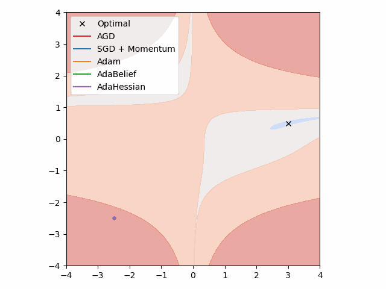
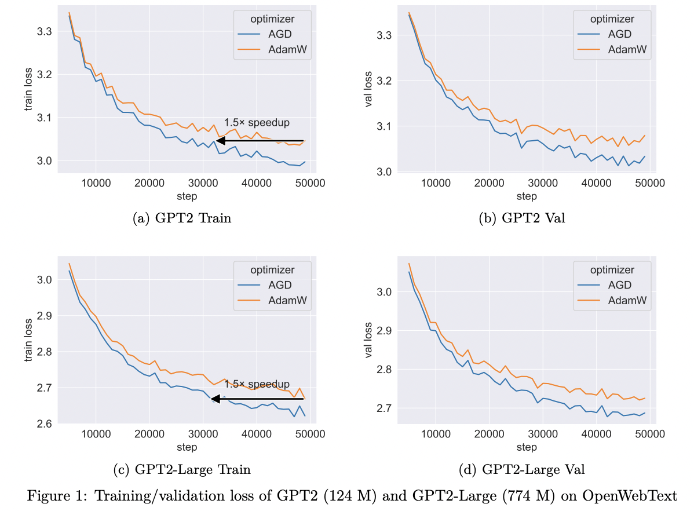

<h1 align="center"><b>AGD Optimizer</b></h1>
<h3 align="center"><b>an Auto-switchable Optimizer using Stepwise Gradient Difference as Preconditioning Matrix</b></h3>

We present PyTorch code for [AGD: an Auto-switchable Optimizer using Stepwise Gradient Difference as Preconditioning Matrix](https://openreview.net/forum?id=A954O4tDmU&noteId=wLS9DFtY0I), NeurIPS 2023.

AGD employs the gradient difference between the current and previous steps to form the preconditioning matrix, which can dynamically transition between the adaptive and stochastic forms through an automated switching mechanism. Thanks to these dual approaches, AGD attains swifter convergence and superior generalization performance compared to state-of-the-art optimizers.

<p align="center">
  
</p>

## Usage

AGD can be a drop-in replacement for AdamW.

```python
from atorch.optimizers.agd import AGD
```

## Hyperparameters

- `lr`: Empirically set to 1/10 of AdamW's value.
- `delta`: Please refer to the settings in the paper. For Transformer-like models, you can typically keep the default value at 1e-14.
- `clip`: Generally, there's no need to set it, but if you encounter training instability, you can try clip=5.
- Others: Set them based on general empirical guidelines.

## AGD's performance on nanoGPT

Given the popularity of large-scale models, we also tested the effectiveness of AGD on nanoGPT. As expected, AGD converges very quickly, providing up to a 1.5x acceleration compared to AdamW. This can significantly save training time and reduce training costs.

<p align="center">
  
</p>
