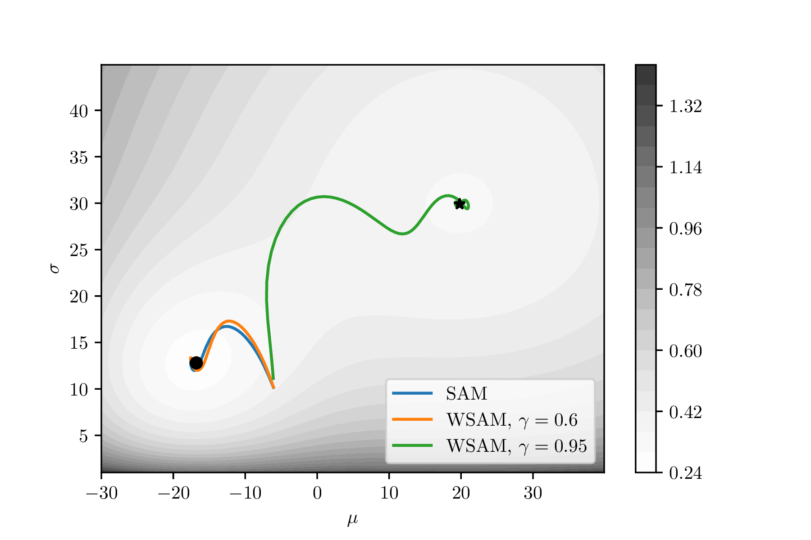

<h1 align="center"><b>WSAM Optimizer</b></h1>
<h3 align="center"><b>Weighted Sharpness as
a Regularization Term</b></h3>

[](https://arxiv.org/abs/2305.15817)
[](https://arxiv.org/abs/2305.15817)

We present PyTorch code for [Sharpness-Aware Minimization Revisited: Weighted Sharpness as a Regularization Term](https://arxiv.org/abs/2305.15817), KDD'23. The code is based on <https://github.com/davda54/sam>.

Deep Neural Networks (DNNs) generalization is known to be closely related to the flatness of minima, leading to the development of Sharpness-Aware Minimization (SAM) for seeking flatter minima and better generalization.
We propose a more general method, called WSAM, by incorporating sharpness as a regularization term.
WSAM can achieve improved generalization, or is at least highly competitive, compared to the vanilla optimizer, SAM and its variants.

<p align="center">
  
</p>

<p align="center">
  <sub><em>WSAM can achieve different (flatter) minima by choosing
different 𝛾.</em></sub>
</p>

## Usage

Similar to SAM, WSAM can be used in a two-step manner or with a single
closure-based function.

```python
from atorch.optimizers.wsam import WeightedSAM
from atorch.optimizers.utils import enable_running_stats, disable_running_stats

...

model = YourModel()
base_optimizer = torch.optim.SGD(model.parameters(), lr=0.001) # initialize the base optimizer
optimizer = WeightedSAM(model, base_optimizer, rho=0.05, gamma=0.9, adaptive=False, decouple=True, max_norm=None)
...
# 1. two-step method
for input, output in data:
  enable_running_stats(model)
  with model.no_sync():
    # first forward-backward pass
    loss = loss_function(output, model(input))  # use this loss for any training statistics
    loss.backward()
  optimizer.first_step(zero_grad=True)
  disable_running_stats(model)

  # second forward-backward pass
  loss_function(output, model(input)).backward()  # make sure to do a full forward pass
  optimizer.second_step(zero_grad=True)
...
# 2. closure-based method
for input, output in data:
  def closure():
    loss = loss_function(output, model(input))
    loss.backward()
    return loss

  loss = loss_function(output, model(input))
  loss.backward()
  optimizer.step(closure)
  optimizer.zero_grad()
...
```

## Extra Notes

- **Regulatization mode**: It is recommended to perform a decoupled update of the sharpness term, as used in our paper.
- **Gradient clipping**: To ensure training stability, if `max_norm` is not `None`, WSAM will perform gradient clipping.
- **Gradient sync**: This implementation synchronizes gradients correctly, corresponding to the m-sharpness used in the SAM paper.
- **Rho selection**: If you try to reproduce ViT results from [this paper](https://arxiv.org/abs/2106.01548), use a larger rho when having less GPUs. For more information, see this related link.

<!--
## Citation

```text
@inproceedings{
yue2023wsam,
title={Sharpness-Aware Minimization Revisited: Weighted Sharpness as a Regularization Term},
author={Yun and Yue, Jiadi and Jiang, Zhiling and Ye, Gao and Ning, Yongchao and Liu, Ke and Zhang},
booktitle={Proceedings of the 29th ACM SIGKDD Conference on Knowledge Discovery \& Data Mining},
year={2023},
url={https://openreview.net/forum?id=V9MTso2JW1}
}
```
-->
