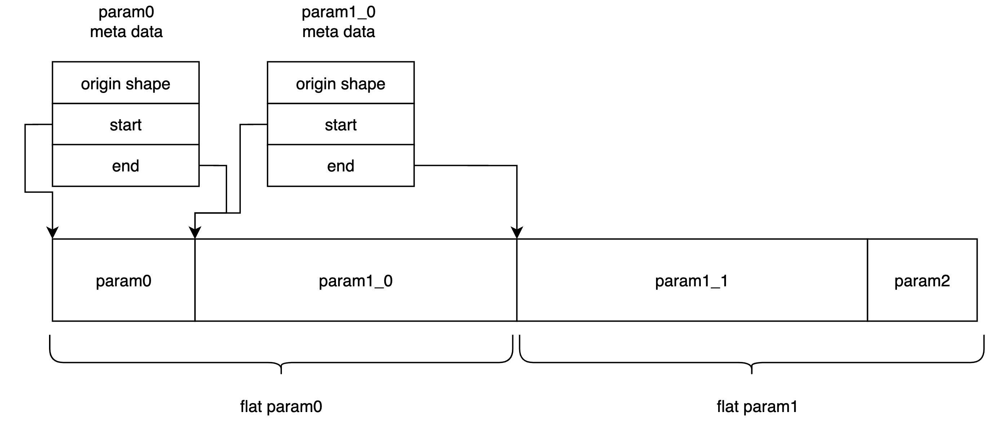
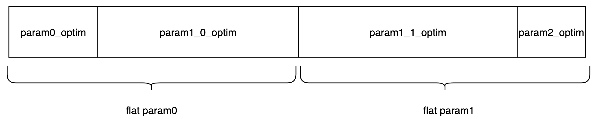
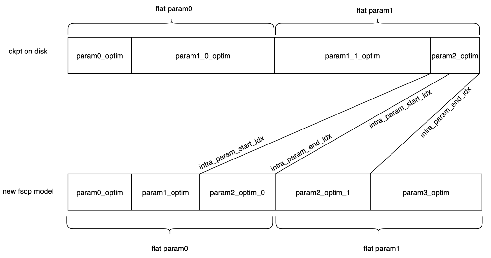

# FSDP shard 保存/加载

需要解决的问题：

- 如果所有参数/state都到一个rank保存，可能OOM.
- 如果load一个全量checkpoint到内存，可能OOM.
- 读取/写全量数据性能可能不好。

## streaming save/lazy load

原始 torch save 是将整个参数进行 pickle，load 时整体进行 unpickle，因此内存会出现峰值，为解决该问题，基于 huggingface 的 safetensors 进行开发。由于 safetensors 支持 lazy load，只需要开发 streaming save 即可。

safetensors 在进行 save 时是将整个 tensor 的字典进行 pickle 序列化，可能会产生 OOM。在 atorch 中将 save 的过程拆开，先生成 safetensors 的 meta data，之后按需逐个序列化每个 tensor，再进行写入。

## 参数保存/加载

在保存时，直接保存每个 rank 上的 flat param，同时保存一份该 flat param 的 meta 信息。

如下图所示，每个 flat param 中保存了多个 meta 信息，每个 meta 信息代表这个 flat param 中原始参数的 shape 和在 flat param 中的 start 和 end，因此在恢复参数时，只需要按照顺序将所有的 param 找出来，拼接到一起后，再进行 reshape 即可获得原始的参数。



### 代码示例

#### 参数保存

这里要在每个 rank 上都去保存，所有 rank 之间是不会进行同步的。

buffer 只会保留 rank0 上的。

```python
from atorch.utils.fsdp_save_util import save_fsdp_flat_param
model = ... # atorch 转换 FSDP 的模型
save_fsdp_flat_param(model, "ckpt")
"""
ckpt 为文件夹
如果有两个 rank，则路径如下
ckpt
├── buffers
├── flat_meta.00000-00002
├── flat_meta.00001-00002
├── flat_param.00000-00002
└── flat_param.00001-00002
"""
```

#### 参数加载

参数加载分为两种：
1. 直接根据 tensor 名字加载
2. 结合 FSDP meta init，在 FSDP 初始化时进行加载

**根据 tensor 名字加载**

获取 `ckpt` 文件夹中的所有 weight/buffer
```python
from atorch.utils.fsdp_save_util import ShardTensorUtil

util = ShardTensorUtil("ckpt",
                        rank=0,
                        world_size=1,
                        device="cpu")

buffers = {i:util.load_tensor_by_name(i) for i in util.buffers.keys()}
params = {i:util.load_tensor_by_name(i) for i in util.param_meta.keys()}
weights = {**buffers, **params}
```

**结合 FSDP 加载**

atorch 中提供 init_empty_weights_with_disk_offload 上下文管理，指定模型创建时参数的行为，将该函数中指定 ckpt 地址，会将模型全部在 meta 上。初始化，在 FSDP 转换时按需加载 ckpt 地址。

需要注意的是，有可能会出现加载参数名字对不上的问题，比如原始的 ckpt 中，embedding 的参数
名字为 `glm.embedding.weight`，但是在新的模型中，假设 top module 为 model，需要使用 glm 模型，那么在加载的时候 embedding 在新的模型的命名为 `glm.glm.embedding.weight`，其中 glm 这个前缀是因为进行了赋值，model.glm = glm <- 实际要加载的模型
因此在 init_empty_weights_with_disk_offload时，我们提供用户自定义的函数来制定每个名字之间怎么映射的，比如在如上场景下，需要给每个加载的 key 去掉  glm. 前缀。

除此之外，也可能会出现实际加载时没有参数的情况，比如为模型增加了新的参数，但是旧的 ckpt 中没有，我们提供传入函数，自定义这些 tensor 的创建。

```python

from atorch.utils.meta_model_utils import init_empty_weights_with_disk_offload
with init_empty_weights_with_disk_offload(ckpt_path='ckpt'):
    ... # build your model

# 使用函数 lambda x: x[4:]，去掉前缀 glm.，加入 name_mapping_func_or_dict 字段
# 如果出现 key 对不上的情况，会打印出目前 ckpt 中有的 key 和 buffer，
# 再根据函数进行修改。

# 如果加载时遇到查不到 key 的情况，传入 create_param_cb 字段，指定如何创建 tensor

shard_kwargs={
    "name_mapping_func_or_dict": lambda name: name[4:],
    "create_param_cb": lambda name: torch.randn(1,1)
}
with init_empty_weights_with_disk_offload(ckpt_path='ckpt',
                                          shard_kwargs=shard_kwargs):
    ... # build your model
```


## 优化器状态保存/加载

在 FSDP 中，优化器是基于 FSDP 转化后的模型创建的，atorch 会配置 FSDP 的 use_orig_param。这时优化器状态的结构与 flat param 结构相同。如果某些参数不在 flat param 中，则优化器状态获取到的参数为空。同时还保存了优化器状态的 meta 信息，为优化器状态的 param group 信息。



因此在保存的时候，优化器状态也是 flatten 为 1D 的数据。
在恢复优化器状态时，使用了 FSDP 提供的 FSDP.shard_full_optim_state_dict函数，该函数接收的参数为完整的优化器状态和 FSDP wrap 好的模型来重新切分优化器状态。
该函数最终调用 torch.distributed.fsdp._optim_utils._shard_orig_param_state 函数来切分状态，并且该函数在 torch 内部只有这一处调用，因此 hook 该函数的实现。

实际在内部实现时，reshard 根据 FSDP 包好的模型来获取优化器状态的数值区间，该区间在 FSDP 内部为
intra_param_start_idx，intra_param_end_idx 参数，含义为新的参数在原始 flatten 权重的取值范围。如下图所示，如果由于修改了 rank/wrap 使得 FSDP 的模型产生了变化，则需要重新切分优化器参数。





### 代码示例

#### 优化器状态保存

每个 rank 都需要进行保存，保存后与参数一样，有一个元数据，world size 个数的状态分片。

```python
from atorch.utils.fsdp_save_util import save_fsdp_optim_param
# model, optimizer 均是经过 atorch FSDP 转换的对象
save_fsdp_optim_param(model, optimizer, 'ckpt')

"""
ckpt
├── optim_meta
├── optim_param.00000-00002
└── optim_param.00001-00002
"""
```

#### 优化器状态加载

加载时提供存储的文件夹，根据 FSDP 优化后的模型进行 reshard，之后直接让优化器加载 reshard 后的优化器状态即可。

```python
from atorch.utils.fsdp_save_util import ShardOptim
sm = ShardOptim("ckpt")
model = ... # atorch 自动优化产出的 FSDP 模型
optimizer = ... # atorch 自动优化产出的 FSDP 优化器
reshard_optim_state = sm.reshard_optim_state_dict(model)
optimizer.load_state_dict(reshard_optim_state)
```
