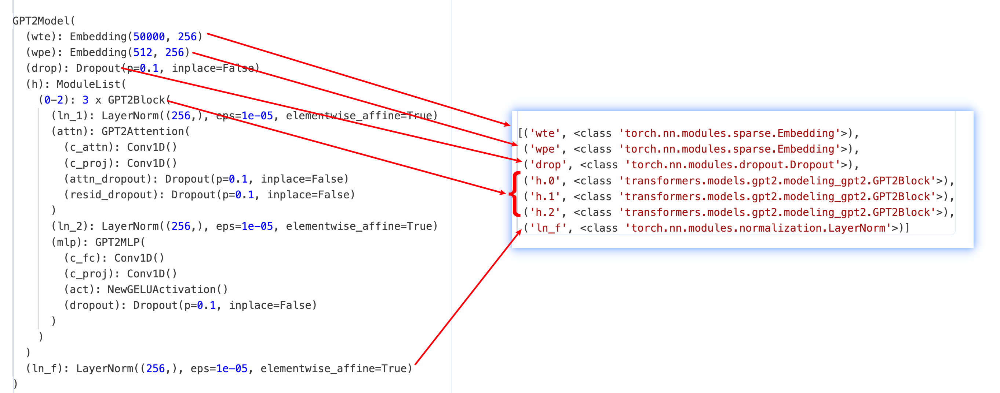
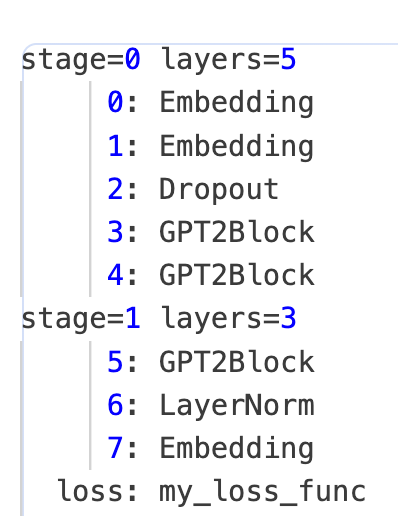

# Goal
- For large-scale model training (with 100B+ levels), besides using FSDP/zero3 parallelism, 3D parallelism is widely used in deep learning community. 3D parallelism includes tensor parallel, pipeline parallel, and data parallel. Megatron-LM and DeepSpeed provide excellent 3D parallelism implementation which are popular among users.
- Megatron-LM offers a Col/Row parallel layer that users can incorporate into the model definition to achieve tensor parallelism. DeepSpeed's pipeline parallel feature requires converting the model into a sequential list of LayerSpec, making its usage complicated especially for non-sequential models.

    <details>
    <summary>Megatron-LM embeds ParallelLinear</summary>

    ```python
    class ParallelAttention(MegatronModule):
        def __init__(self, ...):
            ...
            self.query_key_value = mpu.ColumnParallelLinear(
                args.hidden_size,
                3 * projection_size,
                gather_output=False,
                init_method=init_method)
            ...
            self.dense = mpu.RowParallelLinear(
                projection_size,
                args.hidden_size,
                input_is_parallel=True,
                init_method=output_layer_init_method,
                skip_bias_add=True)
            ...
    ```

    </details>


    <details>
    <summary>Deepspeed pipeline retrofitting</summary>


    ```python
    def model_provider(pre_process=True, post_process=True):
        ...
        if args.deepspeed and not args.no_pipeline_parallel:
            model = GPTModelPipe(
                num_tokentypes=0,
                parallel_output=True
            )
        else:
            model = GPTModel(
                num_tokentypes=0,
                parallel_output=True,
                pre_process=pre_process,
                post_process=post_process
            )

    class GPTModelPipe(PipelineModule,MegatronModule):
        def __init__(self, ...):
            ...
            # Embedding layer
            self.specs.append(TiedLayerSpec('embed',
                                            EmbeddingPipe,
                                            args.hidden_size,
                                            args.padded_vocab_size,
                                            args.max_position_embeddings,
                                            args.hidden_dropout,
                                            init_method=init_method,
                                            num_tokentypes=num_tokentypes,
                                            tied_weight_attr='word_embeddings_weight'))

            for layer_idx in range(args.num_layers):
                self.specs.append(
                    LayerSpec(ParallelTransformerLayerPipe,
                        init_method=init_method,
                        output_layer_init_method=scaled_init_method_normal(args.init_method_std,
                                                                        args.num_layers),
                        layer_number=layer_idx,
                        self_attn_mask_type=AttnMaskType.causal))
                        
            def _logits_helper(embedding, lm_output):
                """A wrapper to massage inputs/outputs from pipeline. """
                return parallel_lm_logits(
                    lm_output,
                    embedding.word_embeddings_weight,
                    self.parallel_output)

            self.specs.append(
                TiedLayerSpec('embed',
                            EmbeddingPipe,
                            args.hidden_size,
                            args.padded_vocab_size,
                            args.max_position_embeddings,
                            args.hidden_dropout,
                            init_method=init_method,
                            num_tokentypes=num_tokentypes,
                            forward_fn=_logits_helper,
                            tied_weight_attr='word_embeddings_weight')
            )
    ```

    </details>


- ATorch supports 3D parallel training based on DeepSpeed/Megatron, and supports easy usage by using auto_accelerate with ds_3d_parallel optimization method.
# User Interface
- A simple example of using Interface for 3D parallelization of Transformers Model

    <details>
    <summary>example</summary>


    ```python
    from transformers.xxx import XXXConfig, XXXModel

    from atorch.auto.opt_lib.ds_3d_parallel_optimization import DeepSpeed3DParallelConfig
    from atorch.utils.meta_model_utils import record_module_init

    # init distributed environment and create 3d parallel groups
    atorch.init_distributed("nccl")

    # meta model for ds 3d parallel
    with record_module_init():
        meta_model = XXXModel(XXXConfig(...))

    # tensor parallel info and pipeline forward patcher
    ds_3d_parallel_cfg = DeepSpeed3DParallelConfig(
            tpinfo=get_xxx_tpinfo(),
            custom_patcher=get_xxx_custom_patcher(),
        )
    strategy = [
        ("parallel_mode", ([("tensor", tensor_size), ("data", data_size), ("pipeline", pipeline_size)], None)),
        ("deepspeed_3d_parallel", ds_3d_parallel_cfg),
    ]

    # auto_accelerate
    status, result, best_strategy = auto_accelerate(
            meta_model,
            loss_func=my_loss_func,
            load_strategy=strategy,
            ignore_dryrun_on_load_strategy=True,
        )

    # DeepSpeed PipelineEngine model
    model = result.model
    ```
    </details>


- Omits optim and dataset related batch_fn.
- The user specifies the module name information of Tensor Parallel Shard, and the customized forward patcheres if some modules in the pipeline need.
# Design

- The main problems with 3D parallelization of the native Torch implementation model:
   - Graphics memory limitations, large-scale models can't be instantiated as a whole on a single GPU before slicing. Also efficiency issues.
   - Randomness control, model initialization/dropout, etc., need to control the same/different in different parallel dimensions.

## Record init

- Megatron's embedded Col/Row Linear has been split horizontally and vertically, and deepspeed LayerSpec delays instantiating the required layers. But Transformers `XXXModel(XXXConfig(…))` instantiates the full model directly.
- Solution: `record_module_init` context manager. Initialize parameters to meta tensor and record each module build-time entry into `_init_args`, `_init_kwargs` attributes for subsequent rebuilds.

<details>
<summary>record_module_init</summary>

```python
@contextmanager
def record_module_init():
    """
    Record modules' init args and kwargs while meta constructing model. Since we don't
    save or offload the initial weight, we should reset_paramters or (hf)_init_weights
    after building the real modules with the recorded args/kwargs.
    This contextmanager was originally designed for building deepspeed PipelineModule from
    native torch model implementation.
    """

    def init_record_helper(f):
        @functools.wraps(f)
        def wrapper(module: torch.nn.Module, *args, **kwargs):
            f(module, *args, **kwargs)
            # record args/kwargs after original init, in case parent cls init covers them
            # in mistake; it must be satisfied that args/kwargs not changed in init
            module._init_args = args
            module._init_kwargs = kwargs
            # torch.device('meta') contextmanager may not handle nn.Parameter(...),
            # .to('meta') manually to force everything in meta
            module.to("meta")

        return wrapper

    def _enable_class(cls):
        cls._old_init = cls.__init__
        cls.__init__ = init_record_helper(cls.__init__)

    def _disable_class(cls):
        cls.__init__ = cls._old_init
        delattr(cls, "_old_init")

    def _init_subclass(cls, **kwargs):
        cls.__init__ = init_record_helper(cls.__init__)

    def substitute_init_recursively(cls, func, visited):
        for subcls in cls.__subclasses__():
            substitute_init_recursively(subcls, func, visited)
            if subcls not in visited:
                func(subcls)
                visited.add(subcls)

    try:
        substitute_init_recursively(torch.nn.modules.module.Module, _enable_class, set())
        torch.nn.modules.module.Module._old_init_subclass = torch.nn.modules.module.Module.__init_subclass__
        torch.nn.modules.module.Module.__init_subclass__ = classmethod(_init_subclass)
        # torch meta init
        torch.device("meta").__enter__()
        yield
    finally:
        substitute_init_recursively(torch.nn.modules.module.Module, _disable_class, set())
        torch.nn.modules.module.Module.__init_subclass__ = torch.nn.modules.module.Module._old_init_subclass
        delattr(torch.nn.modules.module.Module, "_old_init_subclass")
        torch.device("meta").__exit__()
```
</details>

- The `build_recorded_module` API, which instantiates the recorded meta module, supports recursive build and customization of `_build_fn`/`_post_fn`.

<details>
<summary>build_recorded_module</summary>

```python
def build_recorded_module(meta_module):
    """
    Build the real module from the recorded meta module, supports recursively building
    the meta submodules in args/kwargs.
    Support custom build function and post process function.
    """
    if len(meta_module._parameters) == 0 and len(meta_module._buffers) == 0:
        # Module without param/buffer, regards itself as builded module after build child modules
        assert not hasattr(
            meta_module, "_build_fn"
        ), f"module {meta_module.__class__.__name__} without param/buffer should have not _build_fn."
        memos = dict()
        for child_name, child_module in meta_module._modules.items():
            if child_module not in memos:
                memos[child_module] = child_name
                meta_module._modules[child_name] = build_recorded_module(child_module)
            else:
                memoried_name = memos[child_module]
                meta_module._modules[child_name] = meta_module._modules[memoried_name]
        builded_module = meta_module
    else:
        # Build from init args/kwargs, check if has children module
        if len(meta_module._modules) != 0:
            logger.info(
                f"Meta_module {meta_module.__class__.__name__} has its own param/buffer "
                f"{[k for k in chain(meta_module._parameters, meta_module._buffers)]}, "
                f"but has submodules {[k for k in meta_module._modules]}. Building it "
                f"from init args/kwargs may lead to coarse-grained materialization (OOM) "
                f"and repeatly building if submodule has custom _build_fn/_post_fn."
            )

        # recursively build module in args and kwargs
        assert hasattr(meta_module, "_init_args") and hasattr(
            meta_module, "_init_kwargs"
        ), "must construct meta module with record_module_init contextmanager"
        args = []
        for arg in meta_module._init_args:
            if isinstance(arg, torch.nn.Module):
                arg = build_recorded_module(arg)
            args.append(arg)
        kwargs = dict()
        for k, v in meta_module._init_kwargs.items():
            if isinstance(v, torch.nn.Module):
                v = build_recorded_module(v)
            kwargs[k] = v

        # support custom build fn
        if hasattr(meta_module, "_build_fn"):
            build_callable = meta_module._build_fn
        else:
            build_callable = meta_module.__class__
        builded_module = build_callable(*args, **kwargs)

        # if submodules have custom _build_fn/_post_fn, rebuild and substitute them
        for submodule_name, submodule in list(meta_module.named_modules())[1:]:
            if hasattr(submodule, "_build_fn") or hasattr(submodule, "_post_fn"):
                builded_submodule = build_recorded_module(submodule)
                recursive_setattr(builded_module, submodule_name, builded_submodule)

    # support custom post process fn
    if hasattr(meta_module, "_post_fn"):
        builded_module = meta_module._post_fn(builded_module)

    return builded_module
```

</details>

### PipeModule
Deepspeed builds the PipelineModule by writing LayerSpec and passing it into the PipelineEngine to achieve pipeline parallelism. Atorch ds 3d parallel reused this part of the pipeline power to eventually turn the recorded meta model into PipelineModule.

  1. Inherit ds `LayerSpec` to implement `RecordedMetaLayerSpec` (Tied has a corresponding version), overrides the build method call `build_recorded_module`, and reuses deepspeed to delay the build ability.
  2. Traverse the meta model to convert the layers and non-layer leaf modules in the ModuleList/Sequential into lists in traversal order, and finally converts them into the required layer_specs.




3. In the pipeline implementation of deepspeed, tensor or tensor tuple is passed between layers, so deepspeed needs to modify the implementation of the model layer layer to adapt the input and supplement the output with the tensor required by the subsequent layer.


    <details>
    <summary>ParallelTransformerLayerPipe</summary>

    ```python
    class ParallelTransformerLayerPipe(ParallelTransformerLayer):
        """Extends ParallelTransformerLayer to forward attention_mask through the pipeline.

        Forward has two usages that affect attention mask communication:

        1) forward((input, attn_mask) , **kwargs) -> (output, mask)
        When the attention mask is provided as the second positional
        argument, typical pipeline behavior is used and both the output
        *and* mask are returned in a tuple. This tuple is then forwarded
        to the next stage in the pipeline.

        This version is useful if masks are dynamic.

        2) forward(input, **kwargs) -> output
        When the mask is static over all samples, it is advantageous to
        cache the mask and avoid communicating it.

        If no mask is provided, the module will query `self._args.attn_mask`
        for the mask and only return `super().forward(...)`
        """
        def forward(self, inputs, **kwargs):
            assert torch.is_tensor(inputs) or isinstance(inputs, tuple)
            if torch.is_tensor(inputs) or len(inputs) == 1:
                # No attention mask forwarded, search for args.attn_mask
                if not hasattr(self, '_args'):
                    self._args = get_args()
                hidden_states, attention_mask = inputs, self._args.attn_mask
                # HACK: currently MoE model does not support pipeline parallel, so
                # here we just ignore the moe_loss returned by forward()
                return super().forward(hidden_states, attention_mask, **kwargs)[0]
            elif len(inputs) == 2:
                # Attention mask is an activation.
                hidden_states, attention_mask = inputs[0], inputs[1]
                # HACK: currently MoE model does not support pipeline parallel, so
                # here we just ignore the moe_loss returned by forward()
                return super().forward(*inputs, **kwargs)[0], attention_mask
            else:
                raise RuntimeError('Received more inputs than understood.')
    ```
    </details>


- Atorch ds 3d Parallel provides a `_default_forward_patcher` for this, taking the tensors in number of the forward signature of the input tensor tuple as input, and filling the output tuple to the equivalent number of outputs.


    <details>
    <summary>_default_forward_patcher</summary>

    ```python
    def _default_forward_patcher(forward_fn, self):
        """
        Patch the pipeline layers' ``forward``. Many modules (embed, layernorm, etc.)
        take one or fewer inputs, but we must convey through all the needed tensors to satisfy
        pipeline send/recv mechanism, e.g. attention mask in transformer-like models.
        The default patcher would take the previous tensors to match fn signature, and
        replace them to output the same numbers of tensors.
        One can customize patch_fn in `RecordedMetaLayerSpec` or `RecordedMetaTiedLayerSpec`
        if there is extra compute logic or different input/output format.

        note:
            Deepspeed pipeline engine only supports passing a tensor or a tuple of tensors, while
            those in `float` dtype must requires grad (thus attn mask must in `int`)
        """
        f_sig = inspect.signature(forward_fn)
        input_len = len(f_sig.parameters)

        @functools.wraps(forward_fn)
        def wrapper(inputs, **kwargs):
            assert (
                isinstance(inputs, (torch.Tensor, tuple)) and len(kwargs) == 0
            ), "deepspeed pipeline should only pass tensor or tuple of tensors"
            if isinstance(inputs, torch.Tensor):
                output = forward_fn(inputs)
            else:
                output = forward_fn(*inputs[:input_len])
            if not isinstance(output, tuple):
                output = (output,)
            return *output, *inputs[len(output) :]

        return wrapper
    ```

    </details>


- This can satisfy most of the layer input and output, such as Embedding, Dropout, LayerNorm, etc. For cases where the default patcher cannot be satisfied, an interface to customize the forward patcher is also provided. GPT2 example:

    <details>
    <summary>gpt2_custom_patcher</summary>

    ```python
    def gpt2_custom_patcher(cfg):
        def wpe_patcher(fw, self):
            @functools.wraps(fw)
            def fw_wrapper(input):
                assert (
                    isinstance(input, tuple) and len(input) == 3
                ), "input should be (hidden_states, position_ids, attention_mask)"
                hidden_states, position_ids, attention_mask = input
                position_embeddings = fw(position_ids)
                hidden_states = hidden_states + position_embeddings
                return hidden_states, attention_mask

            return fw_wrapper

        def h_patcher(fw, self):
            @functools.wraps(fw)
            def fw_wrapper(input):
                assert isinstance(input, tuple) and len(input) == 2, "input should be (hidden_states, attention_mask)"
                hidden_states, attention_mask = input
                ori_attn_mask = attention_mask
                attention_mask = attention_mask[:, None, None, :]
                attention_mask = attention_mask.to(hidden_states.dtype)  # fp16 compatibility
                attention_mask = (1.0 - attention_mask) * torch.finfo(hidden_states.dtype).min
                outputs = fw(hidden_states, attention_mask=attention_mask)
                hidden_states = outputs[0]
                return hidden_states, ori_attn_mask

            return fw_wrapper

        gpt2_custom_forward_patchers = {"wpe": wpe_patcher}
        gpt2_custom_forward_patchers.update({f"h.{i}": h_patcher for i in range(cfg.n_layer)})
        return gpt2_custom_forward_patchers
    ```

    </details>

Note: DeepSpeed needs to require_grad the float tensor passed in the middle, GPT2 h patcher converts the mask, and then returns the original int tensor mask in output.

- Through meta init records, and then converted to ds PipelineModule, it is possible to delay instantiation and pipeline of native torch models without the need for handwritten Model/LayerPipe classes and LayerSpecs.
- Some details: batch_fn, HF _init_weight, tied embedding layer, logit_helper …


### TP _build_fn/_post_fn

- Megatron implements the Transformer model from Col/Row Linear, Attention/MLP, to Encoder/Decoder to achieve tensor parallelism. Implementing HF transformers library GPT/Llama/GLM etc. by Megatron would cost too much effort.
- Tensor Parallel essentially replaces the Embed/Linear in the model with the corresponding TPlayer. Atorch has an off-the-shelf `ATorchTPLayer`, similar to Megatron's operator capabilities, which supports initializing builds from orig_module.
- The `build_recorded_module` instantiation layer in the pipeline above supports custom _build_fn/_post_fn, and you can register the TP operation of the model.

1. `tp_shard_helper` generates the _build_fn to TP the model.

    <details>
    <summary>tp_shard_helper</summary>

    ```python
    def tp_shard_helper(meta_module, tp_layer_cls, **tp_kwargs):
        """
        Custom _build_fn to shard tensor parallel Linear/Embedding. The original build fn will be under tensor
        group randomizer to get the same master weight.

        Arguments::
            - meta_module: the meta module requires _build_fn to hook tensor parallel sharding.
            - tp_layer_cls: ATorchTPLayer successors. e.g. ColumnParallelLinear.
            - tp_kwargs: keyword arguments for tp_layer_cls.
        """
        ori_build_fn = meta_module._build_fn if hasattr(meta_module, "_build_fn") else meta_module.__class__

        def _build_fn(*args, **kwargs):
            # embedding size divided by tensor parallel size
            if isinstance(meta_module, torch.nn.Embedding):
                bound_args = inspect.signature(torch.nn.Embedding).bind(*args, **kwargs)
                args, kwargs = bound_args.args, bound_args.kwargs
                num_embeddings, tp_size = args[0], parallel_group_size("tensor")
                padded_num_embeddings = num_embeddings + (-num_embeddings) % tp_size
                args = (
                    padded_num_embeddings,
                    *args[1:],
                )

            # init master weight in same randomizer
            with get_randomizer("tensor", "data").fork():
                builded_module = ori_build_fn(*args, **kwargs)

            # gpt2 Conv1D compat
            if isinstance(builded_module, Conv1D):
                builded_module.in_features, builded_module.out_features = builded_module.weight.shape
                builded_module.weight.data = builded_module.weight.t()

            builded_module = tp_layer_cls(orig_module=builded_module, **tp_kwargs)
            return builded_module

        return _build_fn
    ```

    </details>

   Note: randomizer(“tensor”, “data”) controls the same tensor/data distribution group, and the parameters are initialized consistently.

2. `TPInfo` Module name information for tensor paralle shard, configured by the user via `DeepSpeed3DParallelConfig`.


    <details>
    <summary>TPInfo</summary>

    ```python
    class TPInfo:
        """
        Manual tensor parallel information class.

        Example:
            >>> gpt2_tpinfo = TPInfo()
            >>> gpt2_tpinfo.shard_col({"attn.c_attn": {"stride": 3}}, "mlp.c_fc")
            >>> gpt2_tpinfo.shard_row("attn.c_proj", "mlp.c_proj")
            >>> gpt2_tpinfo.shard_vocab("wte")
            >>> gpt2_tpinfo.replic_drop("resid_dropout", "mlp.dropout", "drop")
            >>> gpt2_tpinfo.parallel_drop("attn_dropout")
            >>> gpt2_tpinfo.shrink({".attn": {"embed_dim", "split_size", "num_heads"}})
            >>> tp_manual_shard_custom_fn(meta_gpt2, gpt2_tpinfo)
        """
        ...
    ```

    </details>

    Note: Shrink divides some attributes by tp size to accommodate some reshape operations in forward. replic/parallel drop forwards to Dropout operations, wrapping randomizers to control randomness.

2. `tp_manual_shard_custom_fn` traverse model's module, Register _build_fn/_post_fn according to the corresponding name information.


    <details>
    <summary>tp_manual_shard_custom_fn</summary>

    ```python
    def tp_manual_shard_custom_fn(meta_model, tpinfo):
        # maybe wrap randomizer for flash attn ops; patch _forward fn which called indirectly
        # check if wrapped to avoid repeated wrapping
        if flash_attn is not None:
            for fn_name in dir(flash_attn.flash_attn_interface):
                fn = getattr(flash_attn.flash_attn_interface, fn_name)
                if fn_name.endswith("forward") and not is_wrapped_by_context_manager(fn):
                    randomized_fn = get_randomizer().fork()(fn)
                    setattr(flash_attn.flash_attn_interface, fn_name, randomized_fn)
        if dropout_add_layer_norm is not None:
            fn_name = "_dropout_add_layer_norm_forward"
            fn = getattr(flash_attn.ops.layer_norm, fn_name)
            if not is_wrapped_by_context_manager(fn):
                randomized_fn = get_randomizer("tensor").fork()(fn)
                setattr(flash_attn.ops.layer_norm, fn_name, randomized_fn)

        # hook _post_fn/_build_fn for tensor parallel
        registry_dict = dict()
        for name, module in meta_model.named_modules():
            # tp shard module
            for tp_layer_cls, shard_suffix in tpinfo.Shard.items():
                for suffix, tp_kwargs in shard_suffix.items():
                    if name.endswith(suffix):
                        registry_dict[name] = f"[tp_shard] {tp_layer_cls.__name__}, {tp_kwargs}"
                        module._build_fn = tp_shard_helper(module, tp_layer_cls, **tp_kwargs)

            # dropout randomizer
            for same_groups, drop_suffix in tpinfo.Drop.items():
                if any(name.endswith(suffix) for suffix in drop_suffix):
                    registry_dict[name] = f"[randomizer] {same_groups}"
                    module._post_fn = randomizer_helper(*same_groups)

            # shrink attribute
            for suffix, attrs in tpinfo.Shrink.items():
                if name.endswith(suffix):
                    registry_dict[name] = f"[shrink_attr] {attrs}"
                    module._post_fn = shrink_attr_helper(attrs)
        _print_tp_tree(registry_dict)
    ```

    </details>

- logger information for the registered module. 

    <details>
    <summary>tp tree log</summary>

    ```shell
    'model'
    'wte -> [tp_shard] VocabParallelEmbedding, {}'
    "drop -> [randomizer] ('tensor',)"
    'h'
        ['0', '1', '2']
        "attn -> [shrink_attr] {'num_heads', 'split_size', 'embed_dim'}"
            "c_attn -> [tp_shard] ColumnParallelLinear, {'stride': 3}"
            'c_proj -> [tp_shard] RowParallelLinear, {}'
            'attn_dropout -> [randomizer] ()'
            "resid_dropout -> [randomizer] ('tensor',)"
        'mlp'
            'c_fc -> [tp_shard] ColumnParallelLinear, {}'
            'c_proj -> [tp_shard] RowParallelLinear, {}'
            "dropout -> [randomizer] ('tensor',)"
    ```

    </details>

- The corresponding _build_fn/_post_fn is registered, and the model of the corresponding pipe part is built by PipelineModule and TP it. The built model is consistent with the tp model built by Megatron handwriting.
- Some details: vocab_parallel_logit_helper …
## Randomizer

- In 3D parallelism, randomness between different dimensions needs to be controlled:
   - In model initialization, tensor/data parallel dimensions require the same parameters (ATorchTPLayer splits the same orig_module to achieve tpization), and different parameters are required between different pipes.
   - dropout in tensor parallelism:
      - Replica tenosr(embed dropout, output dropout) requires the same random pattern;
      - Parallel tensor (attn dropout), attn maps of different heads should not have a consistent drop pattern.
- Atorch ds 3D Parallel designs a unified multidimensional Randomizer for management.

### Multi-dimension Parallel Randomizer

1. `_Randomizer` uses seed to initialize cuda_rng/cpu_rng and toggle RNG in the fork context manager.

    <details>
    <summary>_Randomizer</summary>

    ```python
    class _Randomizer:
        """
        Torch random number generator (both cuda and cpu) state tracker.
        Init with seeded state, and track the state under fork contextmanager.
        """

        def __init__(self, seed):
            self.seed = seed
            # cuda rng
            ori_cuda_rng = torch.cuda.get_rng_state()
            torch.cuda.manual_seed(self.seed)
            self.cuda_rng = torch.cuda.get_rng_state()
            torch.cuda.set_rng_state(ori_cuda_rng)
            # cpu rng
            ori_cpu_rng = torch.get_rng_state()
            torch.manual_seed(self.seed)
            self.cpu_rng = torch.get_rng_state()
            torch.set_rng_state(ori_cpu_rng)

        @contextmanager
        def fork(self):
            ori_cuda_rng = torch.cuda.get_rng_state()
            torch.cuda.set_rng_state(self.cuda_rng)
            ori_cpu = torch.get_rng_state()
            torch.set_rng_state(self.cpu_rng)
            try:
                yield
            finally:
                self.cuda_rng = torch.cuda.get_rng_state()
                torch.cuda.set_rng_state(ori_cuda_rng)
                self.cpu_rng = torch.get_rng_state()
                torch.set_rng_state(ori_cpu)
    ```

    </details>

2. `MultiDimParallelRandomizer` manages randomizers of dimensions requires the same/different seeds. Make the initial seed the same/different by adding different offsets to the base seed. `get_randomizer` gets randomizers where the groups requires the same seed. Supports set/get states to save and restore the state of the entire MDPR.

    <details>
    <summary>MultiDimParallelRandomizer</summary>

    ```python
    class MultiDimParallelRandomizer:
        """
        Multiple dimension parallel randomizers manager that handles the same/different seeded states.
        """

        def __init__(self, base_seed):
            if not dc.INITIALIZED:
                logger.warning("_DistributedContext not initialized.")
                return
            self.base_seed = base_seed
            # parallel group info
            self.parallel_group_names = list(dc.PARALLEL_GROUP.keys())
            self.parallel_group_sizes = [dc.PARALLEL_GROUP_SIZE[n] for n in self.parallel_group_names]
            self.parallel_ranks = [dc.PARALLEL_RANK[n] for n in self.parallel_group_names]
            # seed offset multiply factor
            self.m_factor = [1]
            for size in self.parallel_group_sizes:
                self.m_factor.append(size * self.m_factor[-1])

            self._randomizers = dict()

        def get_randomizer(self, *same_groups):
            """
            Get the randomizer for same_groups. Every same_groups configuration initializes its randomizer
            in the first call and stored in _randomizers.
            Use same_tuple as _randomizers' key, default all False and turned True if group name in same_groups.

            Arguments::
            - same_groups: any number of parallel group names. Each assigned group use the same seed to start tracked rng.

            Example::
            >>> # parallel_group_names = ['tenosr', 'data', 'pipeline']
            >>> # initializing weight (assume tp parts are initialized in whole and further splitted, thus in same)
            >>> with get_randomizer("tensor", "data"):
            >>>     get_model()
            >>> # dropout of replica inputs, tp needs the same dropout pattern
            >>> with get_randomizer("tensor"):
            >>>     drop(m)
            >>> # dropout of parallel input, needing all the different seed
            >>> with get_randomizer():
            >>>     drop(m)
            """
            assert all(
                name in self.parallel_group_names for name in same_groups
            ), f"same_groups {same_groups} has elements not in parallel_group_names {self.parallel_group_names}"
            same_tuple = tuple(True if name in same_groups else False for name in self.parallel_group_names)
            if same_tuple in self._randomizers:
                return self._randomizers[same_tuple]

            # init the randomizer for this same_tuple
            same_code = sum(2**i * int(same) for i, same in enumerate(same_tuple))
            offset = same_code * self.m_factor[-1]
            for i, same in enumerate(same_tuple):
                offset += 0 if same else self.parallel_ranks[i] * self.m_factor[i]
            seed = self.base_seed + offset
            self._randomizers[same_tuple] = _Randomizer(seed)
            return self._randomizers[same_tuple]

        def get_states(self):
            states = {
                same_tuple: {
                    "cuda_rng": _randomizer.cuda_rng,
                    "cpu_rng": _randomizer.cpu_rng,
                }
                for same_tuple, _randomizer in self._randomizers.items()
            }
            return states

        def set_states(self, states):
            assert set(self._randomizers.keys()) == set(states.keys()), (
                f"Keys mismatch, self._randomizers: {set(self._randomizers.keys())}, " f"states: {set(states.keys())}."
            )
            for name in states:
                self._randomizers[name].cuda_rng = states[name]["cuda_rng"]
                self._randomizers[name].cpu_rng = states[name]["cpu_rng"]
    ```

    </details>

- 8 devices 222 3D parallel example

   
```python
("parallel_mode", ([("tensor", $), ("data", $), ("pipeline", $)], None))
# tensor:     [0, 1], [2, 3], [4, 5], [6, 7]
# data:       [0, 2], [1, 3], [4, 6], [5, 7]
# pipeline:   [0, 4], [1, 5], [2, 6], [3, 7]
```

   - Base seed is 0, the initial seed of each randomizer.


| get_randomizer                 | Rank0 | Rank1 | Rank2 | Rank3 | Rank4 | Rank5 | Rank6 | Rank7 |
|--------------------------------|------:|------:|------:|------:|------:|------:|------:|------:|
| ()                             |     0 |     1 |     2 |     3 |     4 |     5 |     6 |     7 |
| ('tensor',)                    |     8 |     8 |    10 |    10 |    12 |    12 |    14 |    14 |
| ('data',)                      |    16 |    17 |    16 |    17 |    20 |    21 |    20 |    21 |
| ('tensor', 'data')             |    24 |    24 |    24 |    24 |    28 |    28 |    28 |    28 |
| ('pipeline',)                  |    32 |    33 |    34 |    35 |    32 |    33 |    34 |    35 |
| ('tensor', 'pipeline')         |    40 |    40 |    42 |    42 |    40 |    40 |    42 |    42 |
| ('data', 'pipeline')           |    48 |    49 |    48 |    49 |    48 |    49 |    48 |    49 |
| ('tensor', 'data', 'pipeline') |    56 |    56 |    56 |    56 |    56 |    56 |    56 |    56 |

- In TP shard, the forward wrapper of replic dropout is get_randomizer(‘tensor’,), and parallel dropout is wrapped in get_randomizer().

    <details>
    <summary>randomizer_helper</summary>

    ```python
    def randomizer_helper(*same_groups):
        """
        Custom _post_fn to wrap randomizer contextmanager for builded module's `forward`
        """

        def _post_fn(builded_module):
            builded_module.forward = get_randomizer(*same_groups).fork()(builded_module.forward)
            return builded_module

        return _post_fn
    ```

    </details>

3. `init_randomizer` builds a singleton _MDPRInstance, The `get_MDPRInstance` method obtains the singleton object.

### recompute rng tracker

- In activation checkpointing, CheckpointFunction saves the cuda_rng/cpu_rng before forward and restores on backward to maintain consistent randomness (e.g. dropout). Since MultiDimParallelRandomizer controls the randomness of some calculations alone, activation checkpointing only restores the default cuda_rng/cpu_rng and does not guarantee fw/bw randomness consistency for all calculations.
- In the activation checkpointing of deepspeed, this is done by get/set states of `get_cuda_rng_tracker()`.

    <details>
    <summary>Deepspeed CheckpointFunction</summary>

    ```python
    class CheckpointFunction(torch.autograd.Function):
        @staticmethod
        def forward(ctx, run_function, all_outputs, *args):
            ...
            # Copy the rng states.
            ctx.fwd_cpu_rng_state = torch.get_rng_state()
            ctx.fwd_cuda_rng_state = get_accelerator().get_rng_state()
            ctx.fwd_cuda_rng_state_tracker = get_cuda_rng_tracker().get_states()
            ...

        @staticmethod
        def backward(ctx, *grads):
            ...
            bwd_cpu_rng_state = torch.get_rng_state()
            bwd_cuda_rng_state = get_accelerator().get_rng_state()
            bwd_cuda_rng_state_tracker = get_cuda_rng_tracker().get_states()

            # Set the states to what it used to be before the forward pass.
            torch.set_rng_state(ctx.fwd_cpu_rng_state)
            _set_cuda_rng_state(ctx.fwd_cuda_rng_state)
            get_cuda_rng_tracker().set_states(ctx.fwd_cuda_rng_state_tracker)
            ...
            
            # Set the states back to what it was at the start of this function.
            torch.set_rng_state(bwd_cpu_rng_state)
            _set_cuda_rng_state(bwd_cuda_rng_state)
            get_cuda_rng_tracker().set_states(bwd_cuda_rng_state_tracker)
            ...
    ```

    </details>

- Atorch ds 3d parallel reuses the activation checkpointing of deepspeed, while `MultiDimParallelRandomizer` implements equivalent get/set states, so we only need to patch the `get_MDPRInstance` to the `get_cuda_rng_tracker` of the deepspeed.

    <details>
    <summary>patch get_MDPRInstance</summary>

    ```python
    class DeepSpeed3DParallelOptimization(Optimization):
        ...
        @staticmethod
        def apply_wrapper(model_context, wrapper_name, wrapper_config=None):
            ...
            # init randomizer and patch deepspeed checkpointing get_cuda_rng_tracker
            init_randomizer(cfg.base_seed)
            deepspeed.checkpointing.get_cuda_rng_tracker = get_MDPRInstance
            ...
    ```

    </details>

