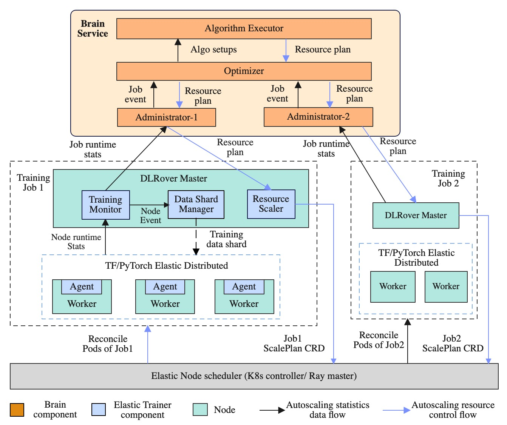
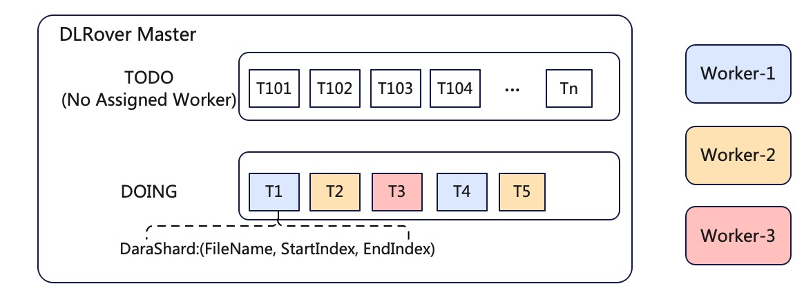

# DLRover: 云上自动扩缩容 DeepRec 分布式训练作业

## 背景

如今，深度学习已广泛应用在搜索、广告、推荐等业务中，这类业务场景普遍有两个特点：
1）训练样本量大，需要分布式训练提升训练速度；
2）模型稀疏，即模型结构中离散特征计算逻辑占比较高。

[DeepRec](https://github.com/alibaba/DeepRec) 是阿里云机器学习平台PAI开源的面向推荐场景的高性能深度学习框架，针对稀疏模型在分布式、图优化、算子、Runtime等方面进行了深度的性能优化，同时提供了搜索、推荐、广告场景下特有的动态弹性特征，动态弹性维度，自适应EmbeddingVariable、增量模型导出及加载等一系列功能。

越来越多的公司为了节省成本开始在云上训练 AI 模型。通常，用户在云上提交一个分布式训练作业需要给作业配置资源，
包括节点的数量和每个节点的资源（CPU & memory 等）。资源是影响训练性能的一个重要因素。
在观察蚂蚁的 kubernetes 集群上几千个训练作业后，我们发现大量的训练作业存在资源配置不合理的现象。比如：

1. PS 或 worker 节点的资源规格太少。CPU 不够会导致训练慢，memory 不够会导致 OOM 并导致作业失败。
2. PS 很少，worker 很多。PS 资源成为了训练瓶颈，worker 很多也没法提升训练速度。
3. PS 和 worker 的资源太多。用户给每个 PS 和worker 都配置了大量的CPU 和memory，利用率低下。
4. 每个节点的 PS 资源规格一样，但是存在热点 PS。PS 上的负载不均衡可能导致部分 PS 的CPU 负载显著高于其他 PS，热点 PS 成了训练瓶颈。

因为模型结构千差万别，用户很难在作业提交时准确地配置合适资源。想要寻找合理配置，
用户需要反复地调整资源和启动作业以便观察性能。这个过程是十分费时的。为此，DLRover 自动地为分布式训练作业配置资源，
并在训练过程中针对资源瓶颈进行自动扩缩容，达成充分利用资源来提升训练性能的目的。
使用 DLRover 的 auto-scale 功能，用户提交训练作业时无需关心资源配置。

<div align="center">

</div>

## 基于运行时优化的自动扩缩容

DLRover 采用运行时优化思想来对分布式训练作业进行自动扩缩容。DLRover 首先让训练作业跑起来，
然后监控训练作业所有节点的负载和整体训练性能，并根据监控指标来动态调整作业的资源，从而提升训练性能和资源利用率。
为了实现自动扩缩容，DLRover 需要支持如下功能：

1. 资源自动优化：监控训练性能和节点负载，并根据当前性能和负载给出最优的资源配置，包括节点数量和资源规格。
2. 弹性调度：在训练运行时动态地给作业增加节点、减少节点或者用新资源规格的节点来替换原有节点。
3. 训练框架支持节点容错和弹性：在训练运行时，新的节点可以加入训练；缩减部分节点时，其他的节点不受影响，可以持续训练。

为此，我们设计的 DLRover 的整体设计架构如下：

<div align="center">

</div>

- Brain Service: 负责资源自动优化。基于实时采集的训练速度和各个节点负载来自动优化作业的资源配置。
- DLRover Master：负责弹性调度。每个训练作业拥有一个 master 节点，
master 节点负责训练速度采集、节点负载收集、训练样本管理和弹性调度。
- Elastic Agent：负责与训练框架协调来支持训练的容错和弹性。每个节点上都有一个 Elastic Agent，
Agent 从 master 上获取作业当前运行的节点信息，通知训练框架更新分布式训练状态。
Agent 还负责从 master 获取训练样本信息来供训练框架迭代模型，从而使训练样本分片支持 worker 的弹性。

## 系统模块介绍

### 负载感知的自动资源配置策略

训练作业自动资源配置主要分为3个阶段：启动阶段、资源预估阶段、动态调优阶段。

#### 启动阶段

DLRover 的 Brain Service 会将所有运行过的训练作业的信息存入数据库中，
包括运行时各节点的负载、训练速度、用户信息、数据集信息等。在作业启动阶段，
DLRover Brain 会根据新作业的用户和数据集信息寻找相关的历史作业，
并根据历史作业来配置 PS 资源（PS节点数量和节点的 CPU & memory）和第一个 worker（chief）的资源。

PS 启动资源预估：

- 预估 PS CPU 和 memory 总量：从历史作业中，计算每个相关作业的所有 PS 节点的 CPU 和 memory消耗总量。
取 CPU 总量的均值作为新作业的 PS CPU 总量（total_PSCPU），取内存总量的最大值作业新作业 PS 内存的总量（total_PSMEM）。
- PS 节点的 CPU 预估：取历史作业中所有 PS 节点的 CPU 使用的最大值作业 PSCPU。
- PS 数量预估：PSNUM = total_PSCPU / PSCPU。
- PS 节点的 memory 预估：PSMEM = total_PSMEM / PSNUM。

Chief 资源预估：取历史作业中所有 worker 的 CPU 消耗和内存消耗的最大值。

启动阶段的特殊情况：

1. 没有历史相关作业，比如新用户使用新数据集提交的训练作业。此时，DLRover
采用默认资源配置来启动 PS 和 chief。比如 PSNUM=1，PSCPU=8，PSMEM=8G，chiefCPU=8，chiefMEM=8G。
2. 初始资源导致节点失败，最常见的是，内存不足导致 OOM。当节点发生 OOM 时，
DLRover 通过容错机制会自动增加节点的内存来重启节点，直到训练正常运行。

#### 资源预估阶段

该阶段，训练已经正常开始。当模型迭代一小段时间后（比如 3min）， DLRover 开始资源预估。
此时，DLRover 已经采集到了 chief 训练模型时的各个节点的负载，
包括 chief 的 CPU 使用量（chiefUsedCPU） 和内存使用量（chiefUsedMem），
PS 总的 CPU 使用量（total_PSUsedCPU）和内存使用量 （total_PSUsedMem）。
该阶段，我们假设 PS 的负载是均匀分布的，worker 的机器性能完全一样，来计算训练作业的最优资源配置。

- worker 数量预估：在 PS 异步训练中，各个 worker 互相独立且角色一样，
所以一个 worker 迭代模型对 CPU 的需求量为`trainingCPU  =chiefUsedCPU + total_PSUsedCPU`。
这样我们根据 Job 配置的总 CPU 量 limitCPU 可以计算 worker 的数量`workerNUM = limitCPU/trianingCPU`。

- worker CPU 和内存预估：因为 worker 的模型完全相同，所以 CPU 和 内存消耗也是相似的，
新的 `workerCPU = chiefUsedCPU * factor`,`workerMem = chiefUsedMem * factor`，
factor 为冗余因子，比如1.2。

- PS 数量预估：异步训练中，PS 的 CPU 负载与 worker 数量成正比，
所以`PSNUM = total_PSUsedCPU * workerNUM / PSCPU`。

- PS 内存预估：PS 存储模型参数，内存使用量并不会随 worker 的增加而增加。
如果模型包含稀疏 embedding，PS 的内存会随着训练的进行而增加，为此 PS 的内存预估分为两种情况：
    1. PS 的内存在训练开始后保持稳定，PSMEM= (total_PSUsedMem / PSNUM)* factor，factor 为冗余因子，一般要大于1。
    2. PS 的内存持续增长，那么 DLRover Brain 会计算 PS 内存随迭代步数的增长率 memRate，
然后计算总的 totalPSMEM = memRate * totalStep，则每个 PS 的内存 PSMEM = totalPSMEM / PSNUM。

#### 动态调优阶段

资源预估阶段假设：PS负载均匀分布和 worker 性能完全一致，并不一定完全成立。
PS 的负载可能存在不均衡的情况，比如 TensorFlow 使用 RoundRobin 策略给 PS 分配 Variable ，
如果 variable 的大小差异很大，PS 的负载就可能不均衡。
同时我们的节点负载采样也可能存在误差，导致预估不准。
所以，动态调优阶段会实时监控训练速度和节点负载，并采用启发式策略来调整作业资源配置。

- PS 热点检查：如果发现某些 PS  节点的 CPU 负载很高，
DLRover 会新拉起一个 CPU 更多的节点来替换热点  PS 节点，从而缓解热点 PS 的瓶颈。

- OOM 风险预查：如果发现节点的内存使用量达到风险门限，
DLRover 会新拉起一个内存更多的节点来替换有OOM 风险的节点。因为在稀疏模型中，
PS 的embedding 表中的item 数量可能越来越多，导致 PS 内存增长。

- worker 数量动态调整：如果发现 PS 的CPU负载还有较大的余量，DLRover 会增加一定数量的 worker，
然后观察 PS 的CPU 负载以及训练速度是否提升，直到 PS CPU 负载大于阈值或者新增 worker 没有提升训练速度。

### 弹性调度

训练的弹性调度包括：
1）能动态地拉起或者删除节点，
2）新拉起的节点能够获取训练样本训练模型，
3）被删除的节点未消费的数据能给其他节点使用。
为此，DLRover 实现了支持在 k8s 上动态调整作业节点的 ElasticJob controller 和动态样本分发服务。

#### 弹性调度 ElasticJob Controller

在 DLRover 的 Job master 拿到新的资源优化结果 plan 后，
master 会生成一个 ScalePlan CRD 来通知 ElasticJob Controller 更改训练作业的节点规模。
例如，下面的 ScalePlan 指定了 worker 为 4 个。

```yaml
apiVersion: elastic.iml.github.io/v1alpha1
kind: ScalePlan
metadata:
  labels:
    scale-type: auto
  name: deepctr-auto-job-scaleplan-2
spec:
  createPods: []
  ownerJob: deepctr-auto-job
  psHosts:
  - deepctr-auto-job-edljob-ps-0.dlrover.svc:2222
  removePods: []
  replicaResourceSpecs:
    worker:
      replicas: 4
      resource:
        cpu: "1"
        memory: 4170Mi
```

当 ElasticJob Controller 拿到 ScalePlan 后，会检查 deepctr-auto-job 这个作业当前的 worker 数量，
如果worker 数量少于4个，就会新加worker；如果大于4个，就会减少 worker。

#### 动态样本分发服务

在 PS 异步数据并行训练中，我们需要将训练样本分给不同的 worker。如果 worker 数量固定，
我们可以将样本等分给 worker。但是在弹性过程中，worker数量会变化，所以等分策略并不适合弹性训练。
为此，DLRover 的master 实现了一个动态样本分发服务。

master 会根据样本索引在数据集切分为很多小的 shard，放入一个 TODO 队列，每个shard 并不包含样本数据，
而是包含样本索引。worker 启动后，需要从 Job master 节点请求 shard，master 每次给 worker 分一个 shard，
并将 shard 放入 DOING 队列。worker 拿到 shard 后就可以根据索引读取相应样本来训练模型。
这样新worker 启动后只需要向 master 请求shard 即可。worker 消费完 shard的数据后，
向 master 汇报 shard 已完成，master会将shard 从 DOING 队列移除。如果 worker 挂了，
master 会将对应的 shard 会重新放入 TODO 队列。

<div align="center">

</div>

### 基于 DeepRec 的弹性 PS 训练

#### DeepRec EmbeddingVariable 支持 PS 扩缩容

对于搜索广告和推荐模型，模型网络参数主要有两部分：一部分是 user 或者 item 的稀疏 embedding，另一部分是 dense 层。
随着模型不断遇到新的 user 或者 item，embedding 表会不断增加，导致 PS 的内存不断增加。
正是由于这种原因，算法工程师无法准确预估ps资源规格（并发度和内存）。
并且经常出现以下情况：在提交作业的时候资源规格是足够的，随着任务运行，PS 内存逐渐增加，直到最终OOM。
此外 PS 数量不合理也有可能影响训练速度。这就要求我们能在训练过程中扩充 PS 的数量。
扩充 PS 后，训练框架需要对 embedding 重新 partition，从而让 embedding 参数重新均分分布到新的 PS 节点集合上。

为解决上述问题，DeepRec 新设计了一套支持动态 Embedding 语义的 EmbeddingVariable，
在特征无损训练的同时以最经济的方式使用内存资源。具体可以参考[DeepRec](https://github.com/alibaba/DeepRec)。

#### 基于 checkpoint 的 PS 弹性扩缩容

PS 架构中，模型的权重是存储在 PS 内存的。如果 PS 变化，模型训练需要将权重重新分配到 PS 上。
为了保障训练的连续性和一致性，DLRover 采用 checkpoint 的方案实现 PS 弹性扩缩容。
在扩缩容开始前，DLRover 会通知 PS 将模型权重保持到 checkpoint中。
扩缩容完成后，PS 会从 checkpoint 中恢复模型权重。

DLrover在 PS 扩容/缩容时主动保存 checkpoint，流程如下：
worker 在每一个step之后会运行相关 hook，在 hook 中会向 DLRover master 轮询 PS 集合。
当 worker-0  发现新的 PS 集合与现有的 PS 结合不一致时，worker-0 会通知所有 worker 停止训练，
并通知 PS 保持 checkpoint。在 PS checkpoint 保持完后，
worker-0 会根据新的 PS 集合来构造计算图，更新 session，重新组网，
然后通知新的 PS 加载 checkpoint。最后 worker-0 通知所有的 worker 连接新的 PS 开始训练。

## 阿里云 ACK 上验证 DLRover 自动扩缩容

为了验证自动扩缩容的可行性，我们在阿里云的 ACK 上创建了一个小的 Kubernetes 集群。
然后我们针对 CRITEO 广告点击预测数据集开发了一个 DeepFM 模型，
将[训练作业](../../examples/tensorflow/criteo_deeprec/autoscale_job.yaml)
的 CPU 限制配置为 15 核。在作业起始阶段，DLRover 给作业启动了一个 PS 和一个 worker，如下所示：

```shell
NAME                                          READY   STATUS    RESTARTS   AGE
dlrover-auto-scale-edljob-chief-0             1/1     Running   0          32s
dlrover-auto-scale-edljob-ps-0                1/1     Running   0          32s
elasticjob-torch-mnist-dlrover-master         1/1     Running   0          39s
```

此时的训练速度约为 30 step/s。大约 3 min 后，DLRover 自动给作业新增了 3 个 worker，速度提升到 100 steps/s
如下所示：

```shell
NAME                                          READY   STATUS    RESTARTS   AGE
dlrover-auto-scale-edljob-chief-0             1/1     Running   0          6m17s
dlrover-auto-scale-edljob-ps-0                1/1     Running   0          6m17s
dlrover-auto-scale-edljob-worker-0            1/1     Running   0          3m19s
dlrover-auto-scale-edljob-worker-1            1/1     Running   0          3m19s
dlrover-auto-scale-edljob-worker-2            1/1     Running   0          3m19s
elasticjob-torch-mnist-dlrover-master         1/1     Running   0          6m24s
```

## 后续计划

DLRover 支持了 PS 异步训练的自动扩缩容来提升训练速度。下一步我们将针对 DeepRec
的同步训练提供自动扩缩容功能。除了搜推广场景，DLRover 也将探索 foundation model
的分布式训练的自动扩缩容，以提升预训练大模型的训练效率和降低训练成本。
