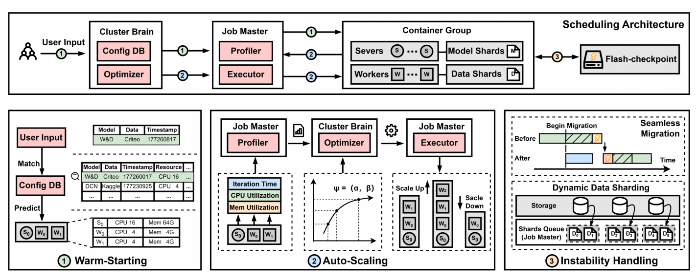
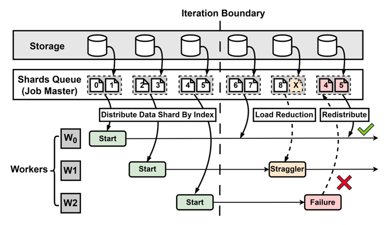
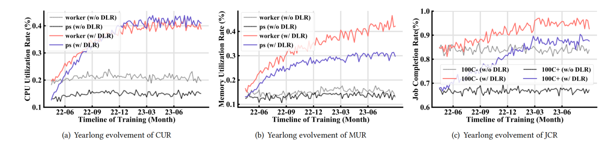

# DLRover-RM: An Automatic Resource Optimization System for Recommendation Model Training

[中文](./dlrover_rm_cn.md)

Deep learning recommendation models (DLRM) have been widely used in recommendation business. Due to
the large amount of training samples, distributed training is often required to improve the training
speed. Usually, when users submit a distributed training job on the cloud, they need to configure
computing resources for the job, including the number of nodes and the resources of each node (CPU
number & memory size, etc.). Users do not want to allocate too many resources, which will lead to
resource wastage, and they are also worried about allocating too few resources, which will lead to
failure of the training job. Currently, a large number of training jobs on kubernetes clusters
suffer from irrational resource allocation and generally low utilization of computing resources.
In addition, the high instability of cloud environments leads to high failure rates and frequent
anomalies (e.g., slow nodes) in DLRM training.

To this end, this paper develops a cloud-based deep learning training system specifically designed
for DLRM, which takes into account training runtime information to accurately allocate and
elastically schedule resources for training jobs, and introduces a series of new mechanisms,
including dynamic data sharding, flash checkpoint, seamless migration, and pre-tuning-based OOM
prevention. DLRover achieves excellent throughput, high resource utilization and robust fault
tolerance with these mechanisms. In summary, our contributions are as follows:

- We build a resource-performance model. With this model, we design a three-stage algorithm that can
dynamically allocate resources during DLRM training and significantly reduce the job completion time.
- We invent a dynamic data sharding mechanism to maintain the model quality when scaling in the cloud
or a job failure happens. We further develop seamless migration and flash checkpoint strategies to
reduce the overhead of scaling jobs.
- We conduct a comprehensive evaluation of thousands of jobs from production environments. The
evaluation shows that DLRover improves CPU utilization by 21.0% to 27.6%, memory utilization by 17.3%
to 31.6%, and reduces job completion time by 30.9% without compromising model accuracy.

## System Overview

DLRover consists of two main components:

(1) a cluster-level central coordinator, called Cluster Brain, and (2) a job-level distributed
training agent, called Job Master.

The Cluster Brain consists of two sub-components: the Optimizer and the Configuration Database. The
Optimizer periodically receives runtime profiles (e.g., CPU and memory utilization) of training jobs
from each Profiler. Using these information, the Optimizer creates resource plans and sends them to
the appropriate Executor. At the same time, the Config DB stores the information as historical jobs.

Each Job Master also includes two sub-components: a Profiler and an Executor. The Profiler monitors
and collects runtime information about each job and reports it to Cluster Brain's Optimizer at
regular intervals. The Executor provides data fragments (e.g., a slice of the training data) to the
job's worker node (e.g., hosted in a pod) for training.

<text>Figure 1: Overview of DLRover and Model Training Workflow</text>

After submission of a job by the user, Cluster Brain quickly learns the characteristics of the job
and generates an initialized (warm-starting) resource plan by leveraging the relevant historical
data from the config DB. Note that, at this moment, we choose a reasonable configuration near the
optimal configuration (hence, with fewer scaling operations and shorter scaling times for
auto-scaling) instead of pursuing an optimal configuration. Subsequently, Cluster Brain sends the
warm-starting resource plan to the respective job master for job initialization.

During the runtime of the job, Analyzer periodically analyses the runtime statistics of the job and
reports them to Optimizer at regular intervals. Based on this updated runtime information, Optimizer  
can generate a fine-grained resource plan, based on which Executer dynamically adjusts the number
of job node worker or PS, as well as their resource allocation, i.e., the execution plan.

DLRover further provides a set of reliable instability handling mechanisms to ensure stable execution
of training jobs. For failed/slow worker nodes, DLRover implements a dynamic data sharding mechanism
to redistribute lost data and rebalance the workload among worker nodes. For failed/slow PS, DLRover
designs seamless migration and flash checkpoint policies using memory checkpoints to minimise the
overhead of failure recovery and job migration

## Explore the Optimal Configuration

### Guidelines

While allocating more resources ensures that jobs run successfully, it is more costly and does not
necessarily result in a steady increase in throughput. Our optimization goal is to minimise the
"resource cost" (i.e., the cost of allocating additional resources) while maximising the "throughput
gain" (i.e., the increase in throughput resulting from allocating additional resources). To solve
this problem, we develop a heuristic "auto-scaling" algorithm by building a resource-performance
model.

### Three-stage Resource Optimization Algorithm

Given a DLRM training job, the system first analyses its runtime information and generates an optimal
resource plan based on the resource-performance model using an auto-scaling algorithm (Stage 2). To
make job training more robust in practice, we design a pre-scaling phase (Stage 1) to start the job
and a post-scaling phase (Stage 3) to handle cloud instability. Specifically, as opposed to scaling
a training job from scratch (i.e., cold-starting), users would like to see the job perform well
after submission rather than waiting for a long scaling process. Therefore, we introduce a
pre-scaling phase to allocate appropriate startup configurations (i.e., the previously mentioned
warm-starting). On the other hand, even if optimal resources are provided, training jobs can still
experience performance degradation (e.g., straggler) due to cloud instability. Therefore, we
introduce a post-scaling phase to ensure smooth training in the cloud.

## Instability Handling in Cloud

### Dynamic Data Sharding

DLRover introduces a dynamic data sharding mechanism that enables fine-grained data services by
splitting the training data into many small shard of different sizes. These data shard can be
dynamically allocated/reallocated on-demand to (1) slow working nodes (i.e., procrastinators) to keep
their data processing and model updating paces in line with other normal nodes to ensure the training
speed, and (2) new/healthy working nodes for fast resilience or fault tolerance.

<text>Figure 2: Dynamic Data Sharding</text>

### Seamless Migration

DLRover develops a seamless migration mechanism that effectively reduces training downtime by
overlaying node scaling with ongoing trainin to minimise resource scaling overheads. To further
reduce scaling overheads, DLRover invents flash checkpoint, a fast checkpointing mechanism that
accelerates checkpointing by using shared memory and asynchronous data persistence.

<text>Figure 3: Seamless Migration</text>

## Experiment

### Production Adoption and Evaluation

The following graph shows the changes in CPU utilisation, memory utilisation and job completion rate
in the production cluster. It can be seen that the cluster resource utilisation is increasing.

<text>Figure 4: Increase in CPU utilization, memory utilization, and Job completion rate.</text>

### Ablation Study

#### warm-starting

We collected one month of job training data from a production cluster. The results show that DLRover
with a warm-starting algorithm provides an initial resource allocation very close to the final
configuration.

<text>Figure 5: Warm-starting Strategy</text>

#### Resource-Performance Model Validation

We sample a set of training data points under different resource settings. The fit coefficients for
the most suitable data points are found using NNLS. As shown in the figure, our model describes the
relationship between training throughput and resource configuration well.

<text>Figure 6: Model Fitting</text>

#### Handling Instability

For the hot parameter server scenario, we observe that:

1) DLRover reduces JCT by 36.4% and 27.6% compared to "no intervention" and "traditional migration" approaches.
2) Unlike "traditional migration", DLRover enables continuous training (i.e., seamless migration)
when straggler is detected, saving about 5 minutes of training time.
3) With the flash checkpoint mechanism, DLRover can significantly reduce disk I/O overheads due to
the use of shared memory to store checkpoints.

<text>Figure 7: Handle Hot PS</text>

