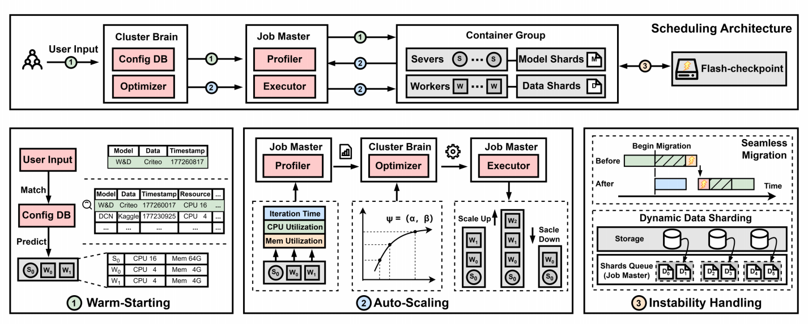
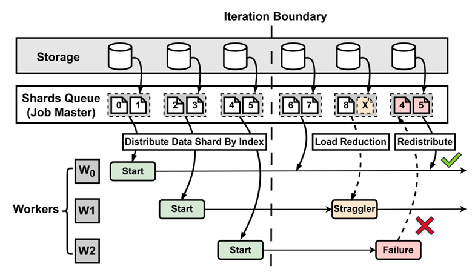
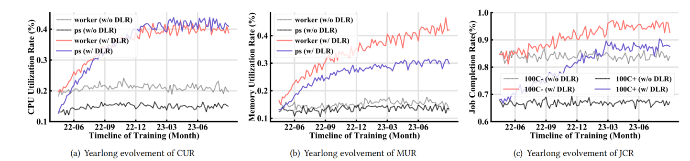
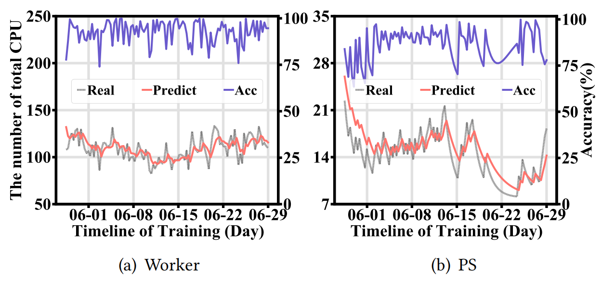
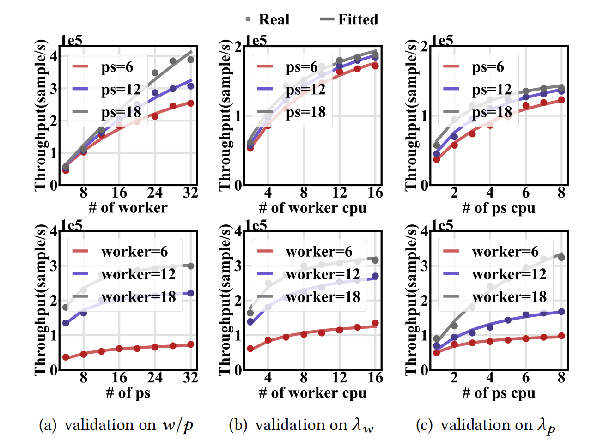
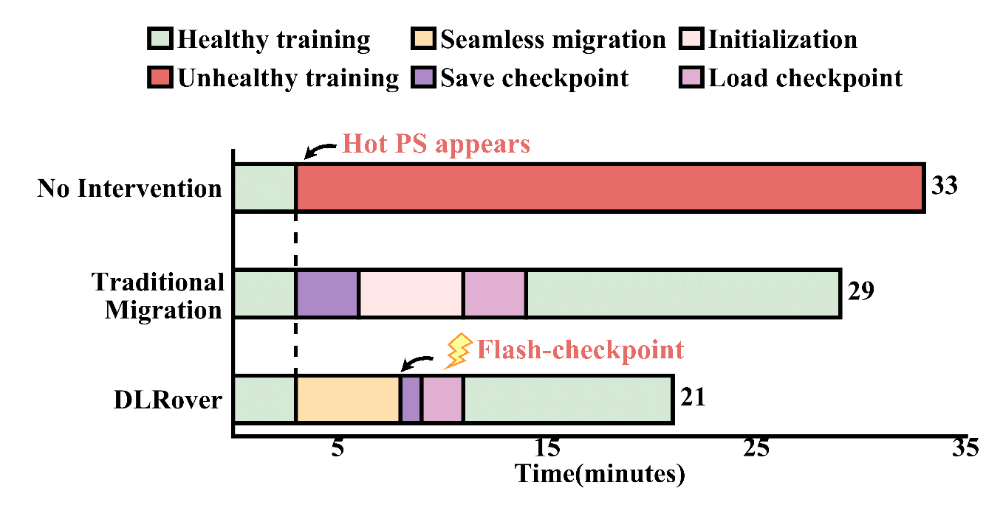

# DLRover-RM: 针对推荐模型训练的自动资源优化系统

[English](./dlrover_rm.md)

深度学习推荐模型（DLRM）已广泛应用在推荐业务中，由于训练样本量大，往往需要分布式训练提升训练速度。通常，用户在
云上提交一个分布式训练作业时，需要给作业配置计算资源，包括节点的数量和每个节点的资源（CPU 数量 & memory 大小
等）。用户既不想分配过多资源，导致资源浪费，也担心分配过少，导致训练作业失败。目前，kubernetes 集群上大量的训练
作业存在资源配置不合理的现象，计算资源普遍利用率低下。另外，云环境的高不稳定性导致 DLRM 训练存在高失败率，并经
常遇到异常情况（例如慢节点）。

为此，本文开发了一个专为 DLRM 设计的基于云的深度学习训练系统，考虑了运行时训练信息，以准确分配和弹性调度训练作
业的资源，并引入了一系列新机制，包括动态数据分片、Flash Checkpoint、无缝迁移和基于预调整的 OOM 预防。DLRover
通过这些机制实现了出色的吞吐量、高资源利用率和强大的容错性。总的来说，我们的贡献如下：

- 我们建立了一个资源-性能模型，利用这个模型，设计了一个三阶段算法，在 DLRM 训练时动态分配资源，显著缩短作业完成时间。
- 我们发明了一个动态数据分片机制，以在云中扩展或作业失败时保持模型质量，并进一步开发了无缝迁移和 Flash Checkpoint 策略，以减少扩展作业的开销。
- 我们对来自生产环境的数千个作业进行了全面评估，评估结果显示，DLRover 可以将CPU利用率提高21.0%至27.6%，将内存利用率提高17.3%至31.6%，并将作业完成时间缩短30.9%，而不会影响模型的准确性。

## 系统概览

DLRover 包括两个主要组件（见下图）：

（1）集群级中央协调器，称为 Cluster Brain；（2）作业级分布式训练代理，称为 Job Master。

Cluster Brain 包括两个子组件：优化器和配置数据库。优化器周期性地从每个分析器接收训练作业的运行时配置文件（例
如，CPU和内存利用率）。利用这些信息，优化器创建资源计划并将其发送给相应的执行器。同时，配置数据库将信息存储为历
史作业。

每个 Job Master 也包括两个子组件：分析器和执行器。分析器监视和收集每个作业的运行时信息，并在固定间隔内向
Cluster Brain 的优化器报告。执行器将数据片段（例如，训练数据的一个切片）提供给作业的工作节点（例如，托管在pod
中）进行训练。

<text>图1: 系统概览与模型训练流程</text>

用户提交作业后，Cluster Brain 迅速学习作业的特征，通过利用配置数据库中的相关历史数据，生成一个初始化（热启动）
资源计划。需要注意的是，在这一刻，我们选择一个接近最优配置的合理配置（因此，自动缩放的缩放操作较少，缩放时间较
短），而不是追求最优配置。随后，Cluster Brain 将热启动的资源计划发送给相应的 Job Master 进行作业初始化。

在作业运行期间，分析器定期对作业的运行时统计信息进行分析，并将其定期报告给优化器。根据这些更新的运行时信息，优化
器可以生成一个精细化的资源计划，根据该计划，执行器动态调整工作节点 worker 或 PS 的数量，以及它们的资源配置，即
执行计划。

DLRover 进一步提供一套可靠的不稳定性处理机制，以确保训练作业的稳定执行。对于失败/慢的工作节点，DLRover 实现了
动态数据分片机制，以重新分配丢失的数据并在工作节点之间重新平衡工作负载。对于失败/慢的 PS，DLRover 设计了无缝迁
移和 Flash Checkpoint 策略，使用内存检查点进行最小化故障恢复和作业迁移的开销。

## 探索最优配置

### 指导原则

虽然分配更多的资源能保证作业成功运行，但会带来更高的成本，且不一定使吞吐量稳步上升。我们的优化目标是在最小化“资
源成本”（即额外分配资源的成本）的同时最大化“吞吐量增益”（即额外分配资源带来的吞吐量提升）。为了解决这个问题，我
们通过建立资源-性能模型开发了一种启发式的“自动缩放”算法。

### 三阶段资源优化算法

给定一个 DLRM 训练作业，系统首先对其运行时信息进行分析，基于资源-性能模型，使用自动缩放算法生成一个最优资源计划
（阶段2）。为了使作业训练在实践中更加稳健，我们设计了一个预缩放阶段（阶段1）来启动作业，并设计了一个后缩放阶段
（阶段3）来处理云不稳定性。具体来说，与从头开始扩展训练作业（即冷启动）相比，用户希望在提交后看到作业表现良好，
而不是等待漫长的扩展过程。因此，我们引入了一个预缩放阶段来分配适当的启动配置（即前文提到的热启动）。另一方面，即
使提供了最佳资源，训练作业仍然会因为云的不稳定性而遇到性能下降（例如掉队者）。因此，我们引入了一个后缩放阶段来确
保在云中进行顺畅的训练。

## 云中不稳定性处理

### 动态数据分片

DLRover 引入了一种动态数据分片机制，通过将训练数据分割成许多不同大小的小分片，实现了细粒度的数据服务。这些数据
分片可以按需动态分配/重新分配给：1）慢速工作节点（即拖延者），以使它们的数据处理和模型更新步调与其它正常节点保
持一致，以确保训练速度；2）新的/健康的工作节点，以实现快速弹性或容错。

<text>图2: 数据分片</text>

### 无缝迁移

DLRover 开发了一种无缝迁移机制，通过在训练期间将节点缩放与正在进行的训练重叠，以最小化资源扩展开销，有效减少了
训练停机时间。为了进一步减少扩展开销，DLRover 发明了 Flash Checkpoint，一种快速检查点机制，通过使用共享内存和
异步数据持久化加速检查点。

<text>图3: 无缝迁移</text>

## 实验

### 集群环境测试

下图显示了生产集群中 CPU 利用率、内存利用率和作业完成率的变化情况。可见，集群资源利用率不断上升。

<text>图4: 变化趋势</text>

### 消融实验

#### 热启动

我们从生产集群中收集了一个月的作业训练数据。结果显示，具有热启动算法的 DLRover 提供了非常接近最终配置的初始资源
分配。

<text>图5: 热启动</text>

#### 资源-性能模型验证

我们在不同资源设置下对一组训练数据点进行采样。使用 NNLS 找到最适合的数据点的拟合系数。如图所示，我们的模型可以
很好地描述训练吞吐量和资源配置之间的关系。

<text>图6: 模型拟合情况</text>

#### 不稳定性处理

对于热参数服务器情况，我们观察到：
1）与“无干预”和“传统迁移”方法相比，DLRover 可以将 JCT 减少 36.4% 和 27.6%。
2）与“传统迁移”不同，当检测到 straggler 时，DLRover 启用连续训练（即无缝迁移，节省了约 5 分钟的训练时间。
3）通过 Flash Checkpoint 机制，DLRover 由于使用共享内存存储检查点，可以显著减少磁盘I/O开销。

<text>图7: 热点 PS 处理</text>

