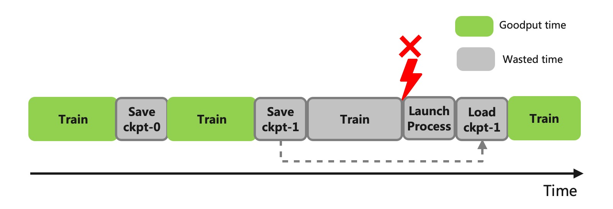
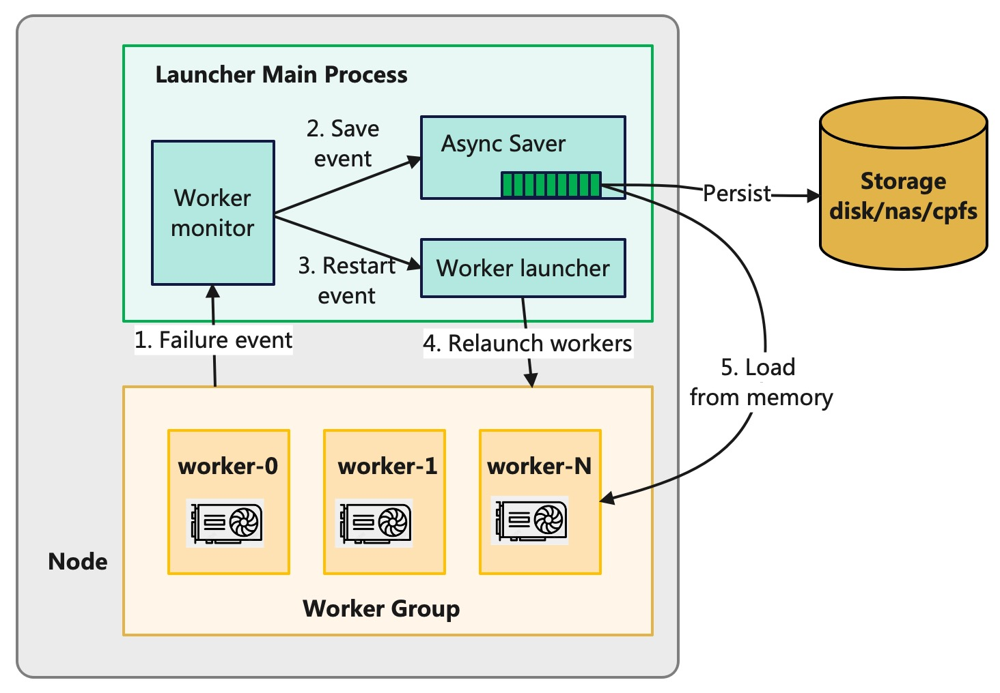
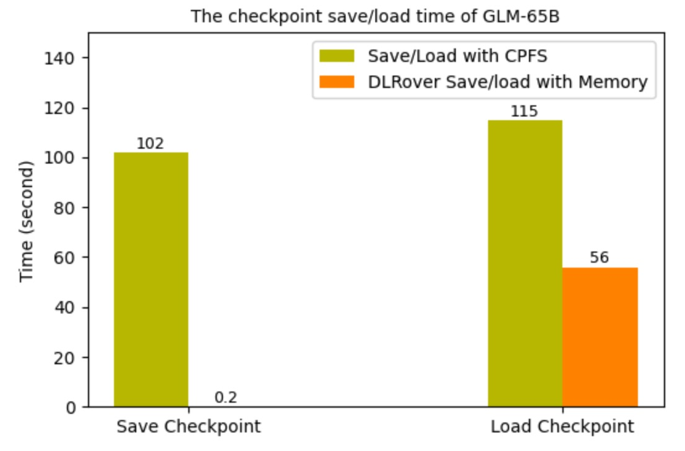
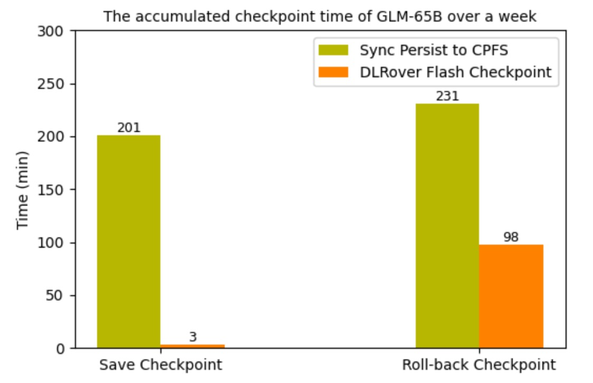

# Flash Checkpoint to Recover Large Model Training From Failure in Seconds

[中文](./flash_checkpoint_cn.md)

## BackGround

Currently, training large models needs hundreds to thousands of accelerators and runs from
several weeks to several months. During the training process, interruptions due to failures often occur.
Typical issues includes GPU or network failure. To achieve fault tolerance in training, the training system
must meet the following two requirements:

1. After a failure occurs, the system should be able to quickly resume the training process.
2. The training program should be able to recover to the state of the model and optimizer
prior to the failure and continue training.

DLRover have released elastic and fault tolerant training on Kubernetes (K8s) to meet the first requirement.
To meet the second requirement, the training program generally adopts a periodic checkpoint scheme to persist
the training state to storage. To ensure the consistency of the training state, training needs to be
paused during the checkpoint. Conventional checkpoints are currently facing the following issues:

1. The consumed time is closely related to the size of the model and the IO performance of the storage,
often ranging from a few minutes to several tens of minutes.
2. Too frequent checkpoint can significantly reduce the available time to train.
3. Low-frequency checkpoints have too long intervals, leading to a waste of
too many iteration steps after a failure.

<div align="center">


<text>Figure 1: The Wasted Time of Checkpoint</text>
</div>

A low-overhead checkpoint scheme can significantly reduce pause time during training and also support
high-frequency checkpoints to reduce the number of wasted iteration steps. DLRover has introduced the
Flash Checkpoint (FCP) scheme, which reduces the checkpoint time overhead to the level of seconds.
Comparative experiments have shown that Flash Checkpoint reduces the time overhead
by 10 times compared to storing on SSD, and about 100 times compared to storing
on remote systems like NAS. When applied to the training of the 65B model with thousands of GPUs,
the wasted time to checkpoints was reduced by about 5 times, where the persistence time was
reduced by about 70 times, effectively increasing the goodput of training from 90% to 95%.
The goodput is the time spent computing useful new steps over the elapsed time of the training job.

## Features

1. Asynchronous Persist: DLRover Flash Checkpoint synchronously writes the training
state to shared memory, and then asynchronously writes from shared memory to the storage system.
This can minimize the paused time of training to checkpoint.
2. Persist at BreakPoint: In the event of a failure, DLRover can urgently persist
the checkpoint in memory to storage. This prevents the loss of checkpointing state and
reduces the wastage of training iteration step.
3. Load from Memory: If the reason of failure is not fault hardware, DLRover can simply restart
the training process, at which point the checkpoint can be directly loaded from the host memory without
the IO overhead to read storage files.
4. Simple and Easy-to-Use Interface: It supports common large model training frameworks such as
DDP (Distributed Data Parallel), FSDP (Fully Sharded Data Parallel), DeepSpeed, and
Megatron-LM([cb995d5](https://github.com/NVIDIA/Megatron-LM/tree/cb995d571faea19d01a1bf55ed0fd89523b9ce64)),
with interfaces consistent with the original framework.

## System Design

### Asynchronous Persistence

DLRover's Flash Checkpoint employs an asynchronous persistence approach to reduce the time overhead for checkpoints.
At the first checkpoint Flash Checkpoint allocates a contiguous buffer of shared memory on the host
according to the size of the Tensors of states on the GPU. Flash Checkpoint then directly copies the Tensors
from the device memory to the shared memory in bytes without pickle serialization. When it is necessary to
persist the checkpoint, the main process on the host will asynchronously write checkpoint data from shared memory
to the storage system. Therefore, the time overhead for each checkpoint is only to copy Tensor data
from device memory to host memory, which is primarily determined by the model size and
the communication bandwidth of PCIe. For instance, the PCIe 4.0 used by A100 can achieve a
unidirectional bandwidth of up to 32GB/s and the copy can be completed in seconds.

<div align="center">


<text>Figure 2: Flash Checkpoint Async Persistence</text>
</div>

### Persist at Break Point and In-Memory Recovery

If a training process exits due to a fault, the training state in the GPU's VRAM is lost.
However, if the checkpoint data in shared memory has not been lost,
the launcher process can persist the checkpoint data from shared memory to the storage system.
DLRover has customized an PyTorch ElasticAgent for the launcher based on TorchElastic.
When ElasticAgent detects a failure in the training subprocess, it will persist the checkpoint data from shared memory.

After a process failure, ElasticAgent attempts to resume training by restarting the training process.
In actual training jobs with thousands of cards, we found that about 75% of the faults could be recovered by
restarting the training process. These faults mainly include NCCL anomalies or network jitter.
Since the checkpoint data in the host's shared memory is not lost, the newly started training process can directly
read the checkpoint data from shared memory to load the model and optimizer states.
This can avoid the IO overhead to read the remote storage system.

<div align="center">


<text>Figure 3: Flash Checkpoint Persistence at Break Point and In-Memory Recovery</text>
</div>

### Simple and Easy-to-Use APIs

To enable users to conveniently apply DLRover's Flash Checkpoint to training jobs,
DLRover provide APIs to support Distributed Data Parallel (DDP),
Fully Sharded Data Parallel (FSDP), DeepSpeed, and
Megatron-LM([cb995d5](https://github.com/NVIDIA/Megatron-LM/tree/cb995d571faea19d01a1bf55ed0fd89523b9ce64)).

### DDP

```Python
from dlrover.trainer.torch.flash_checkpoint.ddp import (
    DdpCheckpointer,
    StorageType,
)

checkpointer = DdpCheckpointer(checkpoint_dir)

state_dict = {
    "model": model.state_dict(),
    "optimizer": optimizer.state_dict(),
    "step": step,
}
# The path of storage.
ckpt_path = os.path.join(checkpoint_dir, f"checkpoint-{iter_num}.pt")

# Save the checkpoint to the memory which is very fast.
if iter_num % save_memory_interval == 0:
    checkpointer.save_checkpoint(
        step, state_dict, ckpt_path, storage_type=StorageType.MEMORY
    )

# Asynchronously persist the checkpoint to the storage which will not
# pause training.
if iter_num % save_storage_interval == 0:
    checkpointer.save_checkpoint(
        step, state_dict, ckpt_path, storage_type=StorageType.DISK
    )
ckpt_dict = checkpointer.load_checkpoint()
model.load_state_dict(ckpt_dict["model"])
optimizer.load_state_dict(ckpt_dict["optimizer"]

```

#### FSDP

API to save checkpoint.

```Python
from dlrover.trainer.torch.flash_checkpoint.fsdp import (
    FsdpShardCheckpointer,
    StorageType,
)

checkpointer = FsdpShardCheckpointer(checkpoint_dir)

with FSDP.state_dict_type(model, StateDictType.SHARDED_STATE_DICT):
    state_dict = {
        "model": model.state_dict(),
        "optim": FSDP.optim_state_dict(model, optimizer),
        "step": step,
    }
    # The path of storage.
    ckpt_dir = os.path.join(checkpoint_dir, str(step))
    
    # Save the checkpoint to the memory which is very fast.
    if step % save_memory_interval == 0:
        checkpointer.save_checkpoint(
            step, state_dict, ckpt_dir, storage_type=StorageType.MEMORY
        )
    
    # Asynchronously persist the checkpoint to the storage which will not
    # pause training.
    if step % save_storage_interval == 0:
        checkpointer.save_checkpoint(
            step, state_dict, ckpt_dir, storage_type=StorageType.DISK
        )
```

APIs to load checkpoint. The APIs to load checkpoints are consistent with PyTorch's Distributed Checkpoint API.
Users only need to configure the storage reader for Fully Sharded Data Parallel (FSDP).

```Python
checkpointer = FsdpShardCheckpointer(checkpoint_dir)

with FSDP.state_dict_type(model, StateDictType.SHARDED_STATE_DICT):
    state_dict = {
        "model": model.state_dict(),
        "step": 0,
    }
    storage_reader = checkpointer.get_storage_reader()
    if not storage_reader:
        return
    dist_cp.load_state_dict(
        state_dict=state_dict,
        storage_reader=storage_reader,
    )
    model.load_state_dict(state_dict["model"])

    optim_state = load_sharded_optimizer_state_dict(
        model_state_dict=state_dict["model"],
        optimizer_key="optim",
        storage_reader=storage_reader,
    )

    flattened_osd = FSDP.optim_state_dict_to_load(
        model, optimizer, optim_state["optim"]
    )
    optimizer.load_state_dict(flattened_osd)
```

#### DeepSpeed

Flash Checkpoint supports DeepSpeed by simply adding a `storage_type` parameter to
the native DeepSpeed `save_checkpoint` function. `storage_type` controls whether to save to memory or
to the storage system. The `load_checkpoint` is completely consistent with DeepSpeed's native
load_checkpoint function.

```Python
from dlrover.trainer.torch.flash_checkpoint.deepspeed import (
    DeepSpeedCheckpointer,
    StorageType,
)

checkpointer = DeepSpeedCheckpointer(model, checkpoint_dir)

 # Save the checkpoint to the memory which is very fast.
if step % save_memory_interval == 0:
    checkpointer.save_checkpoint(
        checkpoint_dir,
        tag=step,
        storage_type=StorageType.MEMORY,
    )

# Asynchronously persist the checkpoint to the storage which will not
# pause training.
if step % save_storage_interval == 0:
    checkpointer.save_checkpoint(
        checkpoint_dir, tag=step, storage_type=StorageType.DISK
    )

# Load checkpoint
checkpointer.load_checkpoint(checkpoint_dir)
```

#### Megatron-LM

Flash Checkpoint only adds a storage_type argument to the native Megatron-LM([cb995d5](https://github.com/NVIDIA/Megatron-LM/tree/cb995d571faea19d01a1bf55ed0fd89523b9ce64))
`save_checkpoint` to control whether to save to memory or to a storage system.
The `load_checkpoint` is completely consistent with
Megatron-LM's native `load_checkpoint`. Users only need to modify the megatron/training.py file in Megatron-LM repo
to use the Flash Checkpoint.

The native imports of Megatron-LM

```Python
from megatron.checkpointing import load_checkpoint
from megatron.checkpointing import save_checkpoint
```

Use flash checkpoint

```Python
from dlrover.trainer.torch.flash_checkpoint.megatron_dist_ckpt import save_checkpoint
from dlrover.trainer.torch.flash_checkpoint.megatron_dist_ckpt import load_checkpoint
from dlrover.trainer.torch.flash_checkpoint.megatron import StorageType
```

If users want to save checkpoints to memory with high frequency,
they can add two lines of code in the while loop of train function in megatron/training.py.
Specifically, they need to include the `storage_type=StorageType.MEM` argument to call
`save_checkpoint`.

```Python
if args.save and iteration % save_memory_interval == 0:
    save_checkpoint(iteration, model, optimizer,
                    opt_param_scheduler, storage_type=StorageType.MEMORY,)
```

**Note**: To use the Flash Checkpoint, the training script needs to be launched with dlrover-run.
If we launch the training process by other command like `torchrun`, the training can only
use the asynchronously persistence. The usage of dlrover-run is consistent with torchrun. The following example demonstrates
how to start single-node multi-GPU training:

```bash
dlrover-run --nnodes=1 --max_restarts=2 --nproc_per_node=2 train.py 
```

#### HuggingFace transformers.Trainer

Users can replace `transformers.Trainer` with `FlashCkptTrainer`. The only difference
between `FlashCkptTrainer` and `transformers.Tainer` is the implmentation
to save checkpoint. The other features of `FlashCkptTrainer` are same as `transformers.Trainer`.

**Note**: `transformers==4.37.2` is recommended becase we have test `FlashCkptTrainer` with it.
Now, `FlashCkptTrainer` only supports saving the DeepSpeed or peft model not FSDP model in the Trainer.

```python
from dlrover.trainer.torch.flash_checkpoint.hf_trainer import FlashCkptTrainer

# Replace `Trainer` with `FlashCkptTrainer`.
trainer = FlashCkptTrainer(
    model=model,
    train_dataset=train_data,
    eval_dataset=val_data,
    args=training_arguments,
    data_collator=data_collator,
)

# Get the latest checkpoint path.
last_ckpt_path = trainer.get_last_checkpoint()
trainer.train(resume_from_checkpoint=last_ckpt_path)
```

### Cleanup Checkpoint Strategy

Using the Flash Checkpoint, training can export the model's checkpoints to disk at a very high frequency
which will use a lot of storage space. To reduce storage costs, Flash Checkpoint can clean up previous
checkpoint files after a new checkpoint is successfully saved. Currently, Flash Checkpoint offers two checkpoint
cleanup strategies:

`KeepStepIntervalStrategy(keep_interval: int, checkpoint_dir: str)`: Only retain checkpoint files whose
iteration steps are an integer multiple of `keep_interval`.

`KeepLatestStepStrategy(max_to_keep: int, checkpoint_dir: str)`: Only keep the latest
`max_to_keep` checkpoint files.

The example to use a cleanup strategy

```Python
from dlrover.trainer.torch.flash_checkpoint.deepspeed import (
    DeepSpeedCheckpointer,
    StorageType,
)
from dlrover.python.common.store import KeepStepIntervalStrategy

strategy = KeepStepIntervalStrategy(keep_interval=100, checkpoint_dir=checkpoint_dir)

checkpointer = DeepSpeedCheckpointer(model, checkpoint_dir, deletion_strategy=strategy)
```

Besides this, users can also customize their cleanup strategies.

```Python
class CustomStrategy(CheckpointDeletionStrategy):

    def __init__(self, *args, **kwargs):
        ...


    def clean_up(self, step, delete_func):
        """
        Clean up the checkpoint of step.

        Arguments:
            step (int): the iteration step of a checkpoint.
            delete_func: A function to remove a directory, the argument
                is a directory of a folder.
        """
```

## Benchmark Experiments

### Train GPT-1.5B on single-node multi-GPUs

To validate the performance of Flash Checkpoint, we conducted experiments with the GPT-2 xl model on A100 GPUs,
comparing the time taken to store checkpoints using different storages.
The specific experimental parameters are as follows:

|Experiment setup| parameters|
|------|---|
|Accelerator|  A100 * 2 on one node|
|Model | GPT-2 xl （--n_layer 48 --n_head 16 --n_embd 1600）|
|The number of parameters |1.5B|
|NAS IO rate |100MB/s|
|NVMe SSD IO rate |2GB/s|

The figure shows a comparison of the time to pause training when exporting checkpoints.
The blocking time for DLRover Flash Checkpoint (FCP) asynchronous persistence is generally
on the order of seconds. Compared to high-performance SSD storage, the blocking time is reduced by about 10 times.
Compared to NAS remote file systems, FCP reduces the blocking time by nearly a hundredfold.

<div align="center">


<text>Figure 4: The Paused Training Time to Save Checkpoint.</text>
</div>

Note: The experiment has not used `distributed_optimizer` of Megatron-LM. The checkpoint of `distributed_optimizer`
needs to gather all optimizer shards from other ranks which takes a lone time.

The figure illustrates that the I/O time to read checkpoint files
when resuming training processes. With DLRover Flash Checkpoint,
recovery could be completed in the order of seconds by loading checkpoints directly from shared memory,
which is much faster compared to loading checkpoints from SSD and NAS.

<div align="center">


<text>Figure 5: The Time to Restore Checkpoint.</text>
</div>

### Train GLM-65B on Thousands of GPUs

After applying DLRover's Flash Checkpoint to the FSDP distributed training job of GLM-65B on 1536 H800 GPUs,
the time overhead for checkpointing was significantly reduced. Before the Flash Checkpoint was implemented,
checkpoints were saved to CPFS every 250 steps, which was approximately every 1.5 hours,
and each checkpoint operation blocked training for about 2 minutes. After the implementation,
each checkpoint operation only blocks the training for 0.2 seconds, and the frequency of checkpointing
has increased to once every 10 steps. However, the persistence to CPFS still occurs every 250 steps.
The below figure shows the time overhead for saving and loading checkpoints
before and after using DLRover Flash Checkpoint.

Additionally, we tracked the cumulative time overhead for checkpointing over the course of a week
before and after the implementation of Flash Checkpoint. It can be observed that although the frequency
of Flash Checkpoint has increased by a factor of 20, the cumulative time overhead has decreased by several dozen times.
Meanwhile, the wasted time wasted due to failures has also been reduced by approximately 3 times.

<div align="center">

&nbsp;&nbsp;&nbsp;&nbsp;&nbsp;


<text>Figure 6: The Checkpoint Time of GLM-65B. </text>
&nbsp;&nbsp;&nbsp;&nbsp;
<text> Figure 7: The Wasted time of GLM-65B due to Checkpoint Over a Week.</text>
</div>

### Quick Start Examples

DLRover provides examples to train GPT-2 using [DDP](../../examples/pytorch/nanogpt/train.py),
[FSDP](../../examples/pytorch/nanogpt/fsdp_train.py), and [DeepSpeed](../../examples/pytorch/nanogpt/ds_train.py).

#### Run on on single-node multi-GPUs

Firstly, we need to install dlrover.

```bash
pip install dlrover[torch] -U
```

Then, we can start the training using `dlrover-run`.

```bash
dlrover-run --nproc_per_node=2 fsdp_train.py \
  --n_layer 48 --n_head 16 --n_embd 1600 --data_dir './' \
    --epochs 50 --save_memory_interval 50 --save_storage_interval 500
```

#### Run a Distributed Job on a k8s Cluster

Firstly, we need to deploy DLRover's ElasticJob Custom Resource Definition (CRD) on a k8s cluster
by the [tutorial](../tutorial/torch_elasticjob_on_k8s.md). Then, we can use `dlrover-run` in
the command of Pod container like

```bash
# NODE_NUM is the default env of ElasticJob
dlrover-run --nnodes=${NODE_NUM} --max_restarts=2 --nproc_per_node=8 \
    fsdp_train.py --n_layer 48 --n_head 16 --n_embd 1600 \
    --data_dir './' --epochs 50 --save_memory_interval 50 \
    --save_storage_interval 500
```

If Kubeflow/PytorchJob has been deployed on the k8s cluster, we can directly use `dlrover-run` in the
command of a PytorchJob Pod container. Just two environment variables need to be set up.

```bash
NODE_RANK=$RANK DLROVER_MASTER_ADDR=$MASTER_ADDR:$MASTER_PORT \
dlrover-run --nnodes=$NODE_NUM --nproc_per_node=$NUM_TRAINERS \
fsdp_train.py --n_layer 48 --n_head 16 --n_embd 1600 \
    --data_dir './' --epochs 50 --save_memory_interval 50 \
    --save_storage_interval 500
```

In this case, we use PyTorchJob's MASTER_ADDR and MASTER_PORT for the master process of DLRover.
`dlrover-run` adopts the dynamic networking strategy of torchrun, which does not require
pre-configuring MASTER_ADDR and MASTER_PORT.

### Future Plans

Multi-node in-memory redundant backup checkpoint: DLRover's Flash Checkpoint currently allows for direct
recovery from memory after a process restarts. However, if a node crashes, its memory is also cleared,
and the training can only restore checkpoint from storage system. Subsequently, we will experiment
with multi-node memory backup of checkpoint model and optimizer states. This way, if some machines fail,
DLRover can read its own checkpoint data from the memory of other surviving Pods to avoid reading
from the storage system.

Distributed cache with SSD: It is now possible to deploy filesystems such as Alluxio on k8s,
which can centrally utilize the SSDs in the cluster. After a failure occurs, Flash Checkpoint
could write checkpoints to a distributed cache weith SSD rather than a remote filesystem,
which could also significantly reduce I/O overhead.
