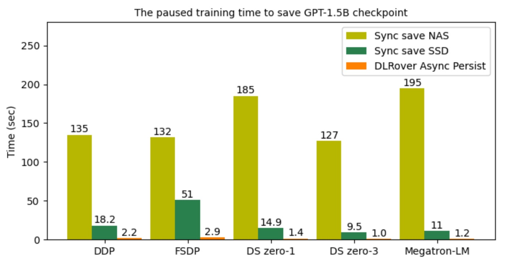
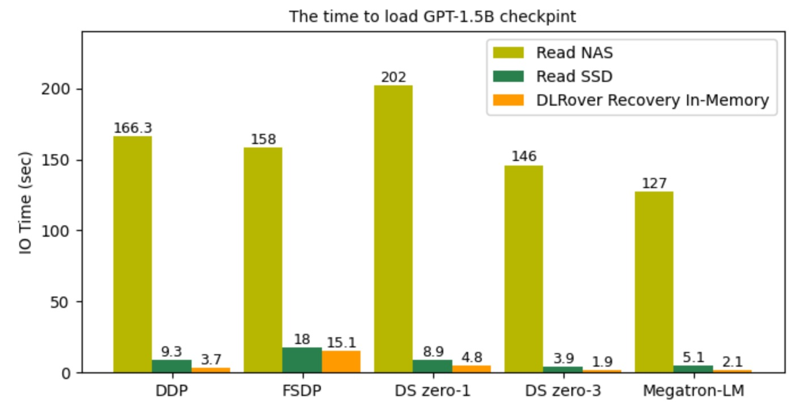

# DLRover 发布 Flash Checkpoint 实现大模型训练的秒级容错

[English](./flash_checkpoint.md)

## 背景

当前，大模型训练往往使用成百上千加速卡训练几周到几个月不等。在训练过程中，故障导致训练中断经常发生.
常见的故障有 GPU 掉卡等硬件故障、NCCL 超时等网络故障。为了实现训练容错，训练系统必须满足以下两个需求：

1. 故障发生后能快速恢复训练进程开始继续训练。
2. 训练程序能恢复到故障之前的模型和优化器的状态继续训练。

DLRover 之前已经发布了 K8s 的弹性容错和故障检测来满足第一个需求。为了满足第二个需求，训练程序一般采用周期
checkpoint 方案来将训练状态持久化到存储。为了保证训练状态的一致性，checkpoint
的时候训练需要暂停。常规的 checkpoint 当前面临以下问题：

1. 耗时与模型大小和存储的 IO 性能密切相关，往往需要几分钟到几十分钟不等。
2. 太频繁的 checkpoint 会大幅降低训练可用时间。
3. 低频的 checkpoint 的间隔太长，会导致故障后浪费的迭代步数太多。

<div align="center">


<text>图1: Checkpoint 的时间损耗</text>
</div>

低开销的 checkpoint 方案可以大幅降低训练暂停时间，也能支持高频的 checkpoint 来减少容错时浪费的迭代步数。
为此，DLRover 推出了 Flash Checkpoint (FCP) 方案，将 checkpoint 时间开销降低到秒级。
经对比实验，Flash Checkpoint 相比存储到 SSD 的时间开销降低 10 倍，相比存储到 NAS 等远程系统降低约 100 倍。
应用在千卡 65B 模型训练上后，checkpoint 导致的训练浪费时间降低约5倍，其中持久化时间降低约70倍，有效训练时间从90% 提升至 95%。

## 功能介绍

- **异步持久化**：DLRover Flash Checkpoint 采用同步将训练状态写到共享内存，然后异步从共享内存写到存储系统，将训练阻塞时间降低到最小。
- **断点续存**：故障发生后，DLRover 可以紧急将内存中的 Checkpoint 持久化到存储中。防止 Checkpoint 数据丢失，减少训练迭代时间的浪费。
- **内存热加载**：如果非机器宕机故障，DLRover 可以直接重启训练进程，这时可以直接从主机内存中加载 Checkpoint，省去读存储文件的 IO 开销。
- **简单易用的接口**：支持了 DDP、FSDP、DeepSpeed 和 Megatron-LM 等主流的大模型训练框架，接口上与原生框架保持一致。

## 技术方案

### 异步持久化

DLRover 的 Flash Checkpoint 方案采用异步持久化的方案来降低 checkpoint 暂停训练的时间。Flash Checkpoint
在第一次 Checkpoint 的时候，会根据 GPU 上 Tensor 的大小在 Host 上开辟一段连续的共享内存。然后 Flash Checkpoint
会将设备内存上的 Tensor 直接以 byte 形式拷贝到共享内存，这样可以省去 pickle 序列化的时间。当需要将
Checkpoint 持久化的时候，主机上的主进程会异步地将 checkpoint 数据从共享内存写入到存储系统，此过程是不会干扰训练的。所以每次
checkpoint 的时间开销只有将 Tensor 数据从设备内存拷贝到主机内存的过程，该时间开销主要有模型大小和 PCIe
的通信带宽决定，比如 A100 使用的 PCIe 4.0 的单向带宽能到 32GB/s，所有每次拷贝的时间能秒级完成。

<div align="center">


<text>图2: Flash Checkpoint 的异步持久化</text>
</div>

### 断点续存与内存热加载

如果训练进程因为故障而推出，GPU 显存中的训练状态也就丢失了。如果主机中 launcher 进程还存活着，共享内存中的
checkpoint 数据并未丢失，launcher 进程还可以将共享内存的 checkpoint 数据持久化到存储系统中。DLRover 基于
TorchElastic 自定义了 launcher 的 ElasticAgent，当 ElasticAgent 监听到训练子进程失败后，就会将共享内存中的
checkpoint 数据持久化。

在进程失败后，ElasticAgent 会通过重启训练进程来尝试恢复训练。在实际千卡训练作业中，我们发现有大约
75% 的故障发生后，都是可以通过重启训练进程来恢复训练的。这类故障主要包括，NCCL 异常或者网络抖动导致的训练中断。由于主机共享内存中的
checkpoint 数据并未丢失，新启动的训练进程可以直接读取共享内存中的 checkpoint 数据来加载模型和优化器状态，从而省去了读取存储系统的 IO 开销。

<div align="center">


<text>图3: Flash Checkpoint 的断点续传与内存热加载</text>
</div>

### 与原生框架一致的 Save/Load 接口

为了让用户能方便的将 DLRover 的 Flash Checkpoint 功能应用到训练作业中，DLRover 支持了 DDP、FSDP、DeepSpeed 和 Megatron-LM。

#### DDP

```Python
from dlrover.trainer.torch.flash_checkpoint.ddp import (
    DdpCheckpointer,
    StorageType,
)

checkpointer = DdpCheckpointer(checkpoint_dir)

state_dict = {
    "model": model.state_dict(),
    "optimizer": optimizer.state_dict(),
    "step": step,
}
# 存储系统的 path
ckpt_path = os.path.join(checkpoint_dir, f"checkpoint-{iter_num}.pt")

# 将 checkpoint 秒级存入到内存中，可以很高频的写。如果训练进程失败，会自动
# 将内存中最近的 checkpoint 写入存储。
if iter_num % save_memory_interval == 0:
    checkpointer.save_checkpoint(
        step, state_dict, ckpt_path, storage_type=StorageType.MEMORY
    )
# 将 checkpoint 异步存入到存储中，可以低频导出，也可以高频导出，但是高频导出会
# 占据很多存储空间，用户需要自行清理老的Checkpoint。
if iter_num % save_storage_interval == 0:
    checkpointer.save_checkpoint(
        step, state_dict, ckpt_path, storage_type=StorageType.DISK
    )
ckpt_dict = checkpointer.load_checkpoint()
model.load_state_dict(ckpt_dict["model"])
optimizer.load_state_dict(ckpt_dict["optimizer"]
```

#### FSDP

存 checkpoint 的 API

```Python
from dlrover.trainer.torch.flash_checkpoint.fsdp import (
    FsdpShardCheckpointer,
    StorageType,
)

checkpointer = FsdpShardCheckpointer(checkpoint_dir)

with FSDP.state_dict_type(model, StateDictType.SHARDED_STATE_DICT):
    state_dict = {
        "model": model.state_dict(),
        "optim": FSDP.optim_state_dict(model, optimizer),
        "step": step,
    }
    # 存储系统的 directory
    ckpt_dir = os.path.join(checkpoint_dir, str(step))
    # 将 checkpoint 秒级存入到内存中，可以很高频的写。如果训练进程失败，会自动
    # 将内存中最近的 checkpoint 写入存储。
    if step % save_memory_interval == 0:
        checkpointer.save_checkpoint(
            step, state_dict, ckpt_dir, storage_type=StorageType.MEMORY
        )
    # 将 checkpoint 异步存入到存储中，可以低频导出，也可以高频导出，但是高频导出会
    # 占据很多存储空间，用户需要自行清理老的Checkpoint。
    if step % save_storage_interval == 0:
        checkpointer.save_checkpoint(
            step, state_dict, ckpt_dir, storage_type=StorageType.DISK
        )
```

加载 Checkpoint 的 API 与 PyTorch 的  Distributed Checkpoint API 保持一致，只需要将
storage reader 配置为 Flash Checkpoint 支持 FSDP 的 reader 即可。

```Python
checkpointer = FsdpShardCheckpointer(checkpoint_dir)

with FSDP.state_dict_type(model, StateDictType.SHARDED_STATE_DICT):
    state_dict = {
        "model": model.state_dict(),
        "step": 0,
    }
    storage_reader = checkpointer.get_storage_reader()
    if not storage_reader:
        return
    dist_cp.load_state_dict(
        state_dict=state_dict,
        storage_reader=storage_reader,
    )
    model.load_state_dict(state_dict["model"])

    optim_state = load_sharded_optimizer_state_dict(
        model_state_dict=state_dict["model"],
        optimizer_key="optim",
        storage_reader=storage_reader,
    )

    flattened_osd = FSDP.optim_state_dict_to_load(
        model, optimizer, optim_state["optim"]
    )
    optimizer.load_state_dict(flattened_osd)
```

#### DeepSpeed

Flash Checkpoint 支持 DeepSpeed 的 save_checkpoint 只是在 DeepSpeed 原生的
save_checkpoint 接口上增加了一个 `storage_type` 参数来控制是存入内存还是存储系统，其他完全一致。
load_checkpoint 与 DeepSpeed 原生的 load_checkpoint 接口完全一致。用户可以无缝切换到 Flash Checkpoint。

```Python
from dlrover.trainer.torch.flash_checkpoint.deepspeed import (
    DeepSpeedCheckpointer,
    StorageType,
)

checkpointer = DeepSpeedCheckpointer(model, checkpoint_dir)

# 将 checkpoint 秒级存入到内存中，可以很高频的写。继续训练进程失败，会自动
# 将内存中最近的 checkpoint 写入存储。
if step % save_memory_interval == 0:
    checkpointer.save_checkpoint(
        checkpoint_dir,
        tag=step,
        storage_type=StorageType.MEMORY,
    )
# 将 checkpoint 异步存入到存储中，可以低频导出。也可以高频导出，但是高频导出会
# 占据很多存储空间，用户需要自行清理老的Checkpoint。
if step % save_storage_interval == 0:
    checkpointer.save_checkpoint(
        checkpoint_dir, tag=step, storage_type=StorageType.DISK
    )


checkpointer.load_checkpoint(checkpoint_dir)
```

#### Megatron-LM

Flash Checkpoint 只是在 Megatron-LM 原生的 save_checkpoint 接口上增加了一个
`storage_type` 参数，来控制是存入内存还是存储系统，其他完全一致。load_checkpoint
与 Megatron-LM 原生的 load_checkpoint 接口完全一致。用户可以无缝切换到 Flash Checkpoint。
用户只需要将 Megatron-LM 中的 megatron/training.py 文件中的

```Python
from megatron.checkpointing import load_checkpoint
from megatron.checkpointing import save_checkpoint
```

改成

```Python
from dlrover.trainer.torch.flash_checkpoint.megatron_dist_ckpt import save_checkpoint
from dlrover.trainer.torch.flash_checkpoint.megatron_dist_ckpt import load_checkpoint
from dlrover.trainer.torch.flash_checkpoint.megatron import StorageType
```

如果想支持更加高频地导出到内存，用户可以在 megatron/training.py 的 train 函数的
while 循环中加入两行代码，即在 save_checkpoint 中增加 storage_type=StorageType.MEMORY即可。

```Python
if args.save and iteration % save_memory_interval == 0:
    save_checkpoint(iteration, model, optimizer,
                    opt_param_scheduler, storage_type=StorageType.MEMORY,)
```

**注意**：Flash Checkpoint 的断点续存和内存热加载需要使用`dlrover-run`来启动训练脚本。如果使用其他的方式例如`torchrun`来启动，
则只能使用异步持久化功能。`dlrover-run` 的使用方法与`torchrun`保持一致，如下所示启动单机多卡训练：

```bash
dlrover-run --nnodes=1 --max_restarts=2 --nproc_per_node=2 train.py 
```

#### HuggingFace transformers.Trainer

用户可以使用 Flash Checkpoint 的 `FlashCkptTrainer` 来替换 `transformers.Trainer`。这两者的
唯一区别就是 `FlashCkptTrainer` 重新实现了 `_save_checkpoint` 接口来支持异步保存 Checkpoint。
其他功能，`FlashCkptTrainer` 与 `transformers.Trainer` 完全一致。

**注意**: 推荐使用 `transformers==4.37.2`，因为我们在这个版本上测试 `FlashCkptTrainer`，
`FlashCkptTrainer` 当前支持上 Trainer 使用 DeepSpeed 训练或者 peft 训练，不支持 FSDP 训练。

```python
from dlrover.trainer.torch.flash_checkpoint.hf_trainer import FlashCkptTrainer

# Replace `Trainer` with `FlashCkptTrainer`.
trainer = FlashCkptTrainer(
    model=model,
    train_dataset=train_data,
    eval_dataset=val_data,
    args=training_arguments,
    data_collator=data_collator,
)

# Get the latest checkpoint path.
last_ckpt_path = trainer.get_last_checkpoint()
trainer.train(resume_from_checkpoint=last_ckpt_path)
```

### Checkpoint 清理策略

使用 Flash Checkpoint 功能，训练可以非常高频的导出模型的 checkpoint 到磁盘。但是高频地导出 checkpoint 会使用
大量的存储空间。为了降低存储成本，Flash Checkpoint 可以在新的 checkpoint 保存成功后清理之前的 checkpoint 文件。
当前，Flash Checkpoint 提供了两种 checkpoint 清理策略，分别为：

`KeepStepIntervalStrategy(keep_interval: int, checkpoint_dir: str)`: 只保留迭代步数为 keep_interval 的
整数倍的 checkpoint 文件。

`KeepLatestStepStrategy(max_to_keep: int, checkpoint_dir: str)`: 只保留最近 max_to_keep 个 checkpoint
文件。

使用示例：

```Python
from dlrover.trainer.torch.flash_checkpoint.deepspeed import (
    DeepSpeedCheckpointer,
    StorageType,
)
from dlrover.python.common.store import KeepStepIntervalStrategy

strategy = KeepStepIntervalStrategy(keep_interval=100, checkpoint_dir=checkpoint_dir)

checkpointer = DeepSpeedCheckpointer(model, checkpoint_dir, deletion_strategy=strategy)
```

除此之外，用户可以可以自定义清理策略。

```Python
class CustomStrategy(CheckpointDeletionStrategy):

    def __init__(self, *args, **kwargs):
        ...


    def clean_up(self, step, delete_func):
        """
        Clean up the checkpoint of step.

        Arguments:
            step (int): the iteration step of a checkpoint.
            delete_func: A function to remove a directory, the argument
                is a directory of a folder.
        """
```

## Benchmark 实验

### 单机多卡训练 GPT-1.5B 模型

为了验证 Flash Checkpoint 的性能，我们使用了 GPT-2 xl 模型在 A100 上做实验，对比使用不同存储来存放checkpoint的耗时，具体实验参数如下：
|实验环境|参数配置|
|-------|------|
|硬件|单机两卡 A100 * 2|
|模型类型|GPT-2 xl （--n_layer 48 --n_head 16 --n_embd 1600）|
|参数量|1.5B|
|NAS 文件网速| 100MB/s|
|NVMe SSD|2GB/s|

下图显示了导出 checkpoint 时对训练阻塞的耗时对比。DLRover Flash Checkpint (FCP)
的异步持久化的阻塞时间基本都在秒级。相比高性能的 NVMe SSD 存储，阻塞时间降低了约 10 倍。相比 NAS 远程文件系统
DLRover Flash Checkpoint 更是降低了近百倍的阻塞时间。

<div align="center">


<text>图4: checkpoint 持久化的时间开销</text>
</div>

注意：Megatron-LM 的实验没有开 `distributed_optimizer`。因为 `distributed_optimizer` 保存 checkpoint 的时候
，rank 0 需要从其他 rank 获取 optimizer 参数后保存。这个过程会耗费比较长的时间。

下图显示了，可以通过重启训练进程恢复时读取 checkpoint 文件的 IO 时间开销，
DLRover Flash Checkpoint 直接从共享内存恢复比读 NVMe SSD 快一倍以上，比 NAS 快几十倍。

<div align="center">


<text>图5: checkpoint 加载时间</text>
</div>

### 千卡训练 GLM-65B 模型

我们将 DLRover 的 Flash Checkpoint 应用在 1536 张 H800 卡的 FSDP 分布式训练 GLM-65B 的作业上后，
checkpoint 的时间开销明显降低。上线前，训练进行Checkpoint的频次是每 250 步（约1.5h）保存到 CPFS 中。每次
checkpoint 需要阻塞训练约 2 min。上线后每次 checkpoint 只需要阻塞训练 0.2s，checkpoint 频次也变成了每 10 步一次。但是依然每
250 步持久化到 CPFS。图 6 显示了使用 DLRover Flash Checkpoint 前后的 save/load checkpoint 的时间开销。
图 6 中加载 checkpoint 的时间只缩短了一倍，主要原因是 FSDP 是逐层初始化的，时间开销比较大。

同时，我们统计一周内上线 Flash Checkpoint 前后 checkpoint 的累积时间开销。可以看出，Flash
Checkpoint 频次虽然变高了很多20倍，但是累积时间开销却却降低了几十倍。同时，故障浪费的训练时间也降低了约3倍。

<div align="center">

&nbsp;&nbsp;&nbsp;&nbsp;&nbsp;


<text>图6: GLM-65B checkpoint 时间.</text>
&nbsp;&nbsp;&nbsp;&nbsp;&nbsp;&nbsp;&nbsp;&nbsp;
<text>图7: 一周内 GLM-65B 训练因为checkpoint浪费的时间</text>
</div>

## 快速开始例子

DLRover 中提供了 DDP、FSDP 和 DeepSpeed 训练 GPT-2 的例子，
[DDP 例子](../../examples/pytorch/nanogpt/train.py), [FSDP 例子](../../examples/pytorch/nanogpt/fsdp_train.py),
[DeepSpeed 例子](../../examples/pytorch/nanogpt/ds_train.py)。我们可以快速体验 Flash Checkpoint 的极致性能。

### 单机多卡运行

首先我们需要在运行环境中按照 dlrover[torch]。

```bash
pip install dlrover[torch] -U
```

然后使用 dlrover-run 来启动训练。

```bash
dlrover-run --nproc_per_node=2 fsdp_train.py \
 --n_layer 48 --n_head 16 --n_embd 1600 --data_dir './' \
    --epochs 50 --save_memory_interval 50 --save_storage_interval 500
```

### k8s 上分布式运行

在 k8s 上分布式运行 DLRover 需要在 k8s 上先部署 DLRover 的 ElasticJob CRD，详细见[文档](../tutorial/torch_elasticjob_on_k8s.md)。
部署后只需要将 command 的启动命令配置成如下即可：

```bash
# NODE_NUM 是 ElasticJob 自动配置在 Pod 里的 env，用户无需更改。
dlrover-run --nnodes=${NODE_NUM} --max_restarts=2 --nproc_per_node=8 \
    fsdp_train.py --n_layer 48 --n_head 16 --n_embd 1600 \
    --data_dir './' --epochs 50 --save_memory_interval 50 \
    --save_storage_interval 500
```

如果 k8s 上已经部署了 Kubeflow/PytorchJob，用户也可以直接在 PytorchJob 的command 中使用  dlrover-run。只需要设置两个环境变量即可。

```bash
NODE_RANK=$RANK DLROVER_MASTER_ADDR=$MASTER_ADDR:$MASTER_PORT \
dlrover-run --nnodes=$NODE_NUM --nproc_per_node=$NUM_TRAINERS \
fsdp_train.py --n_layer 48 --n_head 16 --n_embd 1600 \
    --data_dir './' --epochs 50 --save_memory_interval 50 \
    --save_storage_interval 500
```

此处，我们将 PyTorchJob 的 MASTER_ADDR 用于 DLRover 的 master 进程来启动服务，而且
torch 的集合通信组网则采用 torchrun 的动态组网策略，无需提前配置 MASTER_ADDR 和 MASTER_PORT。

## 后续计划

**多节点内存冗余热备份**：DLRover 的 Flash Checkpoint 当前实现了重启进程后直接从内存恢复 Checkpoint，
但是如果节点宕机后，节点的内存也被清除掉了，只能读取存储系统的 Checkpoint 文件。
后续我们将实验多机内存互相备份 checkpoint 的模型和优化器状态，这样部分机器失败后，DLRover
通过重新拉起的 Pod 也能从其他存活的 Pod 的内存中读取自己的 Checkpoint 内容，避免读取存储系统。

**缓存 checkpoint 到分布式 SSD**：现在 k8s 上可以部署 Alluxio 这样文件系统，可以把集群中的 SSD 集中利用起来。
这样 Flash Checkpoint 可以故障后将 checkpoint 写入到分布式的 SSD 中，
而不是写入到远程文件系统重，也能大幅降低 IO 开销。
