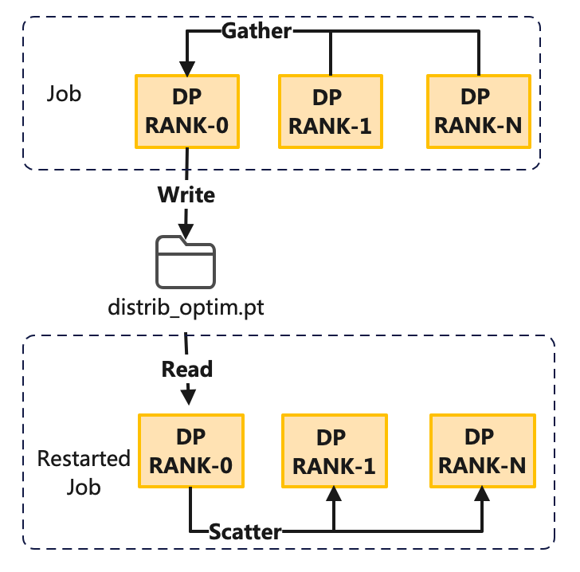
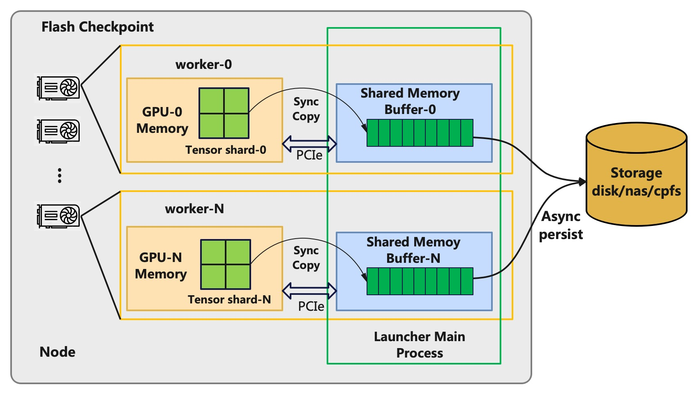
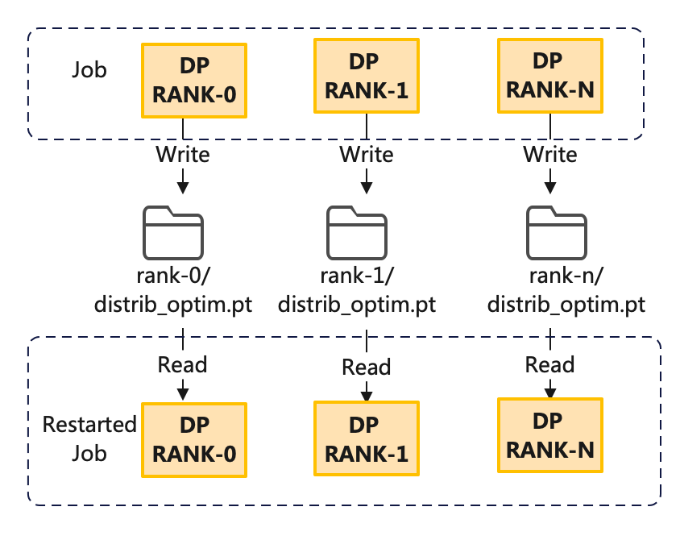

# DLRover Flash Checkpoint Saves the Megatron-LM Checkpoint in Seconds

[中文](./megatron_flash_checkpoint_cn.md)

## Background

Megatron-LM is a widely used LLM (large language model) training framework that
implements 3D parallel training for Transformer models. In the large-scale training,
machine failures that cause training interruptions are common issues.
To be able to recover the training state after an interruption,
we typically rely on periodically persisting the model and optimizer states as checkpoints to disk.
Training must be paused while saving checkpoints, and the pause duration is closely related to the model size
and the IO speed of the storage system, The paused duration often requires several minutes to tens of minutes.
The current practice of periodically exporting checkpoints faces the following issues:

- Too frequent checkpointing can lead to excessively long training pauses,
resulting in significant waste of GPU computational power.
- The interval between checkpoints is too long if the checkpoint frequency is low,
resulting in too many wasted iteration steps after a failure, also wasting GPU computational power.

If we could reduce the training pause time of checkpointing to the level of seconds,
the training could export checkpoints very frequently which can significantly reduce
the wasted computational power due to failures. DLRover has newly released Flash Checkpoint
which can export of Megatron-LM checkpoints in seconds and persist them to disk asynchronously.
During asynchronous saving, the training can continue, thereby greatly reducing
the waste of computational power.

## The Mechanism of Saving Checkpoint in Megatron-LM

Now, the processes of DP RNAK 0 save the checkpoint to the storage and other proceesses waits through `barrier()`.
To reduce the GPU memory usage on each GPU, the training can use a
distributed optimizer with `--use-distributed-optimizer=true`.
The distributed optimizer employs a ZERO-1 strategy to partition the optimizer states across all ranks.
When exporting the checkpoint of a distributed optimizer, the processes of DP RNAK 0
will gather the optimizer states from other processes. Then, the DP RANK 0 process will persist it to storage.
Upon loading a checkpoint of distributed optimizer, DP RANK 0 processes first read the checkpoint file,
and then distributes the optimizer states to all ranks using a scatter communication operation, as illustrated below:

<div align="center">


<text>Figure 1: Megatron-LM Saves Checkpoint</text>
</div>

To prevent the gather communication from occupying GPU memory,
Megatron-LM uses gloo as the communication backend.
It firstly copies the optimizer's tensors from the GPU to the CPU, then uses gloo for communication to transfer the data.
Since gloo does not utilize RDMA networks, its performance is considerably slower than NCCL.
Therefore, when using a distributed optimizer, the time consumed by gather and scatter operations
is also significant.

## Fast Save and Load in Flash Checkpoint

DLRover's Flash Checkpoint significantly reduces the time overhead to export Megatron-LM Checkpoints
in parallel and asynchronously persist the checkpoint to the storage.
It provides a user-friendly interface and users only need to replace `save_checkpoint` and `load_checkpoint`
with the APIs provided by DLRover.

### Asynchronously Persistence

To reduce the time to export Megatron-LM checkpoints during, DLRover has introduced the Flash Checkpoint.
Flash Checkpoint synchronously exports the training state from GPU memory to CPU memory
and asynchronously persist the checkpoint from CPU memory to disk. During asynchronous persistence,
the training can continue, significantly reducing idle computational power time.
The principle of asynchronous export is illustrated in the following diagram:

<div align="center">


<text>Figure 2: Asynchronously Persistence in Flash Checkpoint</text>
</div>

### Save and Load Distributed Optimizer in Parallel

To eliminate the communication overhead when exporting distributed optimizer checkpoints in Megatron-LM,
Flash Checkpoint exports the checkpoint by each rank in parallel. Subsequently, an agent on the main process of each machine
asynchronously exports the optimizer state of each DP rank to disk,
without additional communication. When loading checkpoints, each rank reads its corresponding checkpoint file to recover,
also without additional communication. This can significantly reduce the time to load checkpoints.
The process is illustrated in the diagram below:

<div align="center">


<text>Figure 3: Flash Checkpoint Saves and Loads Megatron-LM Distributed Optimizer</text>
</div>

### Easy Interfaces

Users need to install the DLRover package with `pip install dlrover[torch] -U`,
and then replace the `save_checkpoint` and `load_checkpoint`
with DLRover's Flash Checkpoint interfaces in megatron/training.py
of Megatron-LM([cb995d5](https://github.com/NVIDIA/Megatron-LM/tree/cb995d571faea19d01a1bf55ed0fd89523b9ce64)).

```Python
# from megatron.checkpointing import load_checkpoint
# from megatron.checkpointing import save_checkpoint

from dlrover.trainer.torch.flash_checkpoint.megatron_dist_ckpt import save_checkpoint
from dlrover.trainer.torch.flash_checkpoint.megatron_dist_ckpt import load_checkpoint
```

## Experiment using GPT-1.5B on Multi-Node Multi-GPU

The experiment using 2 node and each node has 8 A100 GPUs. The tensor parallelism size is 8
and pipeline parallelism size is 1. The Storage is NAS on aliyun Cloud whose IO speed is
100MB/s. The experiments used the [GPT example](https://github.com/NVIDIA/Megatron-LM/blob/main/examples/pretrain_gpt_distributed.sh)
in Megatron-LM and the start command is

```bash
export CUDA_DEVICE_MAX_CONNECTIONS=1

GPUS_PER_NODE=8
NNODES=2

CHECKPOINT_PATH=<Specify path>
VOCAB_FILE=<Specify path to file>/gpt2-vocab.json
MERGE_FILE=<Specify path to file>/gpt2-merges.txt
DATA_PATH=<Specify path and file prefix>_text_document

# We can also use torchrun to start.
# --max_restarts is the number to restart training process for fault tolerance.
dlrover-run --nnodes=$NNODES --nproc_per_node=$GPUS_PER_NODE --max_restarts=3 pretrain_gpt.py \
       --tensor-model-parallel-size 8 \
       --pipeline-model-parallel-size 1 \
       --use-distributed-optimizer \
       --num-layers 48 \
       --hidden-size 1600 \
       --num-attention-heads 16 \
       --seq-length 1024 \
       --max-position-embeddings 1024 \
       --micro-batch-size 4 \
       --global-batch-size 8 \
       --train-iters 5000 \
       --lr-decay-iters 320000 \
       --save $CHECKPOINT_PATH \
       --load $CHECKPOINT_PATH \
       --data-path $DATA_PATH \
       --vocab-file $VOCAB_FILE \
       --merge-file $MERGE_FILE \
       --split 900,50,50 \
       --distributed-backend nccl \
       --lr 0.00015 \
       --min-lr 1.0e-5 \
       --lr-decay-style cosine \
       --weight-decay 1e-2 \
       --clip-grad 1.0 \
       --lr-warmup-fraction .01 \
       --log-interval 10 \
       --save-interval 50 \
       --eval-interval 1000 \
       --eval-iters 10
```

The experiment results are：

|  Optimizer Type  | Checkpoint Size|  Megatron-LM Save| Flash Checkpoint Save| Megatron-LM Load| Flash Checkpoint Load |
| --- | --- | --- | --- | --- |  --- |
| no distributed optimizer | 18GB | 151s | **0.5s** | 205s | 207s |
| distributed optimizer | 24GB | 242s | **0.5s** | 242s | **156s** |

Note: The time of the first export by Flash Checkpoint is relatively longer,
approximately 20s, because it requires initiating the process to asynchronous export.
The above table excludes the duration of the first export.

The experiments indicate that the time overhead for checkpoints has been
reduced from several hundred seconds to less than 1 second after employing DLRover's Flash Checkpoint.
Furthermore, parallel loading has saved 90 seconds in comparison to the native implementation of Megatron-LM.

## Future Work

The current asynchronous export feature of DLRover's Flash Checkpoint already supports distributed
training frameworks such as DDP, FSDP, DeepSpeed, and Megatron-LM.
Subsequently, Flash Checkpoint will explore the possibility of directly loading checkpoints
from node memory after a training failure,
thereby supporting exporting the checkpoint with higher frequency and reducing checkpoint recovery time.
DLRover will also further explore fault self-healing in large-scale distributed training,
making failures almost imperceptible to users.
