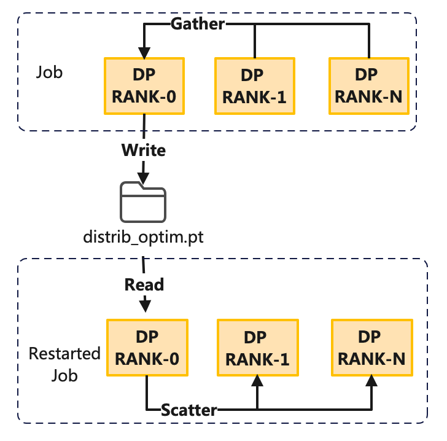
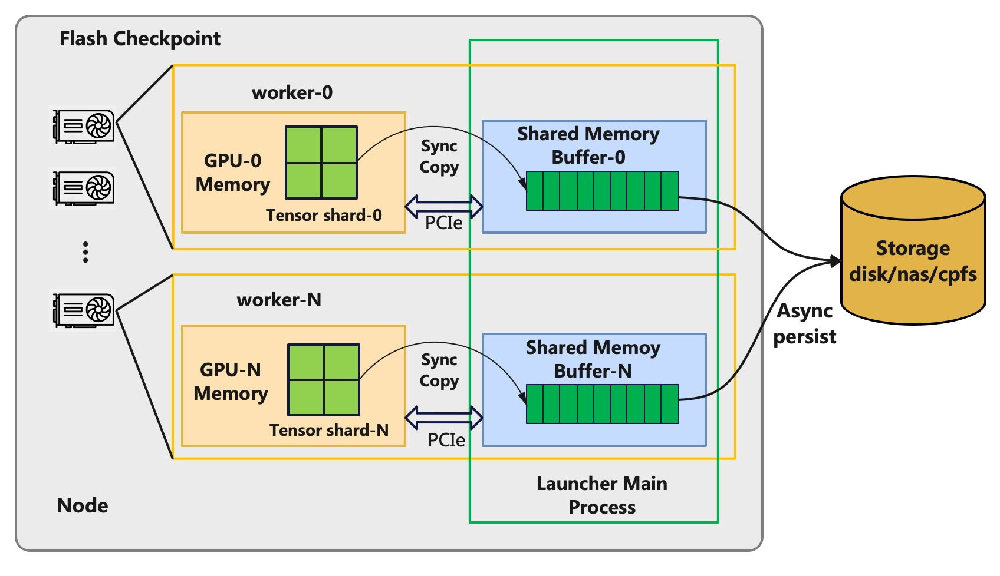
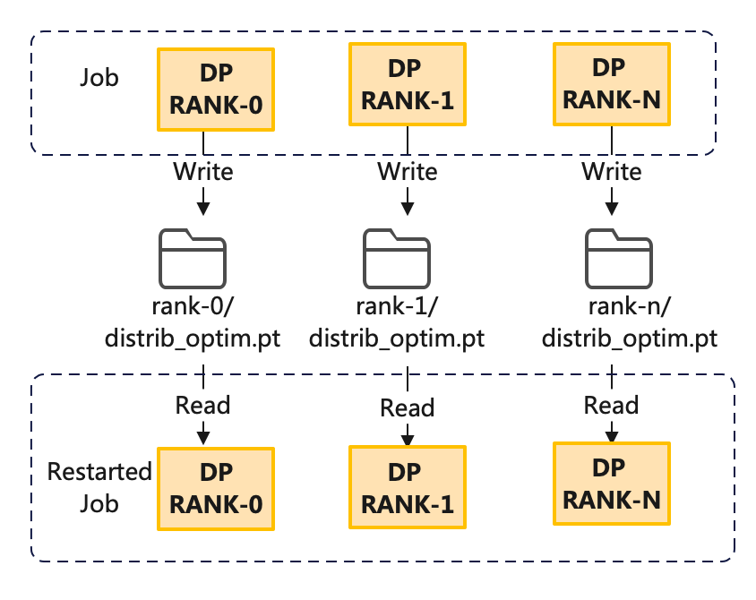

# DLRover Flash Checkpoint 实现秒级导出 Megatron-LM 的训练状态

[English](./megatron_flash_checkpoint.md)

## 背景

Megatron-LM 是当前使用非常广泛的 LLM 训练框架，其针对 Transformer 模型实现了 3D 并行训练，
可以将 LLM 训练扩展到几千张卡。大规模训练中，机器故障导致训练中断是很常见的问题。
比如 meta 在训练 LLAMA-65B 时，平均 2 天训练作业会中断一次。为了能在训练中断后恢复训练状态，
我们一般采用周期性地持久化模型和优化器状态的 checkpoint 到磁盘中。
保存 checkpoint 时训练需要暂停，暂停时间与模型大小和存储的 IO 性能密切相关，往往需要几分钟到几十分钟。
当前周期性导出 checkpoint 面临如下问题：

- 太频繁 checkpoint 会导致训练暂停时间过长，导致 GPU 算力大量浪费。
- 低频 checkpoint 的间隔时间太长，会导致故障后浪费的迭代步数太多，也会浪费 GPU 算力。

如果我们能将 checkpoint 时训练暂停时间降低到秒级，那么训练就可以非常频繁地导出
checkpoint 来大幅减少因为故障而浪费的算力。DLRover 发布的 Flash Checkpoint
可以实现秒级导出 Megatron-LM 的 checkpoint，并异步持久化到磁盘。异步保存的时候，
训练可以继续进行，从而大幅降低算力浪费。

## Megatron-LM 的 Checkpoint 保存方案

当前 Megatron-LM 的 Checkpoint 保存方案是由第一个数据并行( DP RANK 0)单元导出，
然后其他的节点则通过 barrier() 等待 DP RANK 0 的进程导出 Checkpoint。
为了降低单卡显存使用量，训练可以使用 distributed optimizer即--use-distributed-optimizer=true，
distributed optimizer 采用 ZERO-1 的策略将优化器状态切分到各个 rank 上。
在导出 distributed optimizer 的 checkpoint 时候，DP RANK 0 的进程会 gather 非 DP RANK 0 进程的 optimizer 状态，
然后由 DP RANK 0 的进程持久化到存储。加载 distributed optimizer 时，
DP RANK 0 先读取 checkpiont 文件，然后将优化器状态通过 scatter 通信操作分发到各个 RANK 上。如下图所示：

<div align="center">


<text>图 1: Megatron-LM 保存 checkpoint 的方案</text>
</div>

为了防止 gather 通信占用 GPU 显存，Megatron-LM 采用了 gloo 作为通信后端。这就需要先将
optimizer 的 tensor 从 GPU 拷贝到 CPU，然后使用 gloo 来通信来传输数据。
gloo 没有用 RDMA 网络，性能比 NCCL 慢不少。所以使用 distributed optimizer 时，
gather 和 scatter 的耗时也是非常显著的。

## Flash Checkpoint 快速导出与加载

DLRover 的 Flash Checkpoint 通过并行导出和异步持久化可以大幅降低导出 Megatron-LM
Checkpoint 的时间开销，并提供了简单易用接口，用户只需将 `save_checkpoint` 和 `load_checkpoint`
替换成 DLRover 提供的 API 即可。

### 异步持久化 checkpoint

为了降低 Megatron-LM 训练导出 Checkpoint 的时间，DLRover 提出了
Flash Checkpoint 方案。Flash Checkpoint 采用同步将训练状态从设备内存导出到 CPU 内存，
然后异步从 CPU 内存持久化到磁盘。异步持久化的时候，训练可以继续迭代，
大幅降低算力空闲时间。异步导出原理如下图所示：

<div align="center">


<text>图2: Flash Checkpoint 的异步持久化</text>
</div>

### 分布式 save/load Distributed Optimizer

为了省去 Megatron-LM 导出 distributed optimizer 的 checkpoint 时的通信开销。
Flash Checkpoint 导出 Checkpoint 的时候，每个 rank 先将自己的优化器状态导出到共享内存中。
然后每个机器上主进程的 agent 会异步将每个 DP rank 的优化器状态导出到磁盘中，
无需额外的通信。加载 checkpoint 的时候，每个 rank 读取对应的 checkpoint 文件来恢复，
也无需额外通信。这样可以大幅降低加载 checkpoint 的耗时。如下图所示：

<div align="center">


<text>图2: Flash Checkpoint 并行导出 Megatron-LM 的 Distributed Optimizer</text>
</div>

### 简单易用的接口

安装 DLRover 包pip install dlrover[torch] -U，
然后在 megatron/training.py 中将原有的 save_checkpoint 和
load_checkpoint 换成 DLRover 的 flash Checkpoint 接口即可。

```Python
# from megatron.checkpointing import load_checkpoint
# from megatron.checkpointing import save_checkpoint

from dlrover.trainer.torch.flash_checkpoint.megatron_dist_ckpt import save_checkpoint
from dlrover.trainer.torch.flash_checkpoint.megatron_dist_ckpt import load_checkpoint
```

## GPT-1.5B 多机多卡实验效果

2 机 16 卡的 A100，TP size 为8 ， PP size 为1。存储采用阿里云的 NAS 网盘
IO 速度约 100MB/s。我们实验基于 Megatron-LM 提供的
gpt 的例子：<https://github.com/NVIDIA/Megatron-LM/blob/main/examples/pretrain_gpt_distributed.sh>
进行了修改，启动命令如下：

```bash
export CUDA_DEVICE_MAX_CONNECTIONS=1

GPUS_PER_NODE=8
NNODES=2

CHECKPOINT_PATH=<Specify path>
VOCAB_FILE=<Specify path to file>/gpt2-vocab.json
MERGE_FILE=<Specify path to file>/gpt2-merges.txt
DATA_PATH=<Specify path and file prefix>_text_document

# 也可以使用 torchrun 启动
# --max_restarts 是支持容错的重启次数
dlrover-run --nnodes=$NNODES --nproc_per_node=$GPUS_PER_NODE --max_restarts=3 pretrain_gpt.py \
       --tensor-model-parallel-size 8 \
       --pipeline-model-parallel-size 1 \
       --use-distributed-optimizer \
       --num-layers 48 \
       --hidden-size 1600 \
       --num-attention-heads 16 \
       --seq-length 1024 \
       --max-position-embeddings 1024 \
       --micro-batch-size 4 \
       --global-batch-size 8 \
       --train-iters 5000 \
       --lr-decay-iters 320000 \
       --save $CHECKPOINT_PATH \
       --load $CHECKPOINT_PATH \
       --data-path $DATA_PATH \
       --vocab-file $VOCAB_FILE \
       --merge-file $MERGE_FILE \
       --split 900,50,50 \
       --distributed-backend nccl \
       --lr 0.00015 \
       --min-lr 1.0e-5 \
       --lr-decay-style cosine \
       --weight-decay 1e-2 \
       --clip-grad 1.0 \
       --lr-warmup-fraction .01 \
       --log-interval 10 \
       --save-interval 50 \
       --eval-interval 1000 \
       --eval-iters 10
```

实验结果如下：

|  Optimizer 类型  | Checkpoint Size |Megatron-LM Save| Flash Checkpoint Save| Megatron-LM Load| Flash Checkpoint Load |
| --- | --- | --- | --- | --- | --- |
| 非 distributed optimizer | 18GB | 151s | **0.5s** | 205s | 207s |
| distributed optimizer | 24GB | 242s | **0.5s** | 242s | **156s** |

备注：Flash Checkpoint 第一次导出的耗时相对较长，约 20s，因为需要启动异步导出的进程。上述表格去掉了第一次导出的耗时。

从实验可以看出，使用DLRover 的 Flash Checkpoint 异步并行导出后，checkpoint
的时间开销有原来的几百秒降低到了 1s 以内。同时并行加载相比原生的 Megatron-LM 的实现也节省了90s。

## 后续计划

当前 DLRover 的 Flash Checkpoint 的异步导出功能已经支持了 DDP、FSDP、DeepSpeed 和
Megatron-LM 等分布式训练框架。后续 Flash Checkpoint 将探索训练故障后直接从节点内存加载
Checkpoint，从而支持更快的 checkpoint 导出并缩短 checkpoint 恢复时间。
DLRover 后续也将在大规模分布式训练的故障自愈上进一步探索，让用户几乎感知不到故障的发生。
