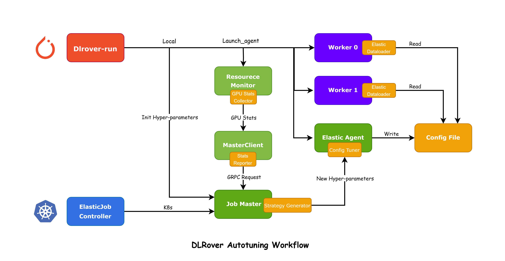

# 开源之夏OSPP结项报告

作者：兰霆峰

## PR链接

### 所有PR

[Antlera: PR Counts: 55](<https://github.com/intelligent-machine-learning/dlrover/commits?author=Antlera>)

### 主要PR

[#632](https://github.com/intelligent-machine-learning/dlrover/pull/632)
[#677](https://github.com/intelligent-machine-learning/dlrover/pull/677)
[#684](https://github.com/intelligent-machine-learning/dlrover/pull/684)
[#686](https://github.com/intelligent-machine-learning/dlrover/pull/686)
[#613](https://github.com/intelligent-machine-learning/dlrover/pull/613)
[#611](https://github.com/intelligent-machine-learning/dlrover/pull/611)
[#610](https://github.com/intelligent-machine-learning/dlrover/pull/610)

### 致谢与感悟

这次活动最大的收获是结识了
[DLRover](https://github.com/intelligent-machine-learning/dlrover)，认识了几位
特别优秀的mentor @[长凡](https://github.com/workingloong) @[旧
客](https://github.com/samplise) @弘历. 特别感谢长凡老师带领我了解DLRover自动机
器学习框架精妙的设计与实现，也在每一次PR提交的过程中通过review以及实时沟通给我
提出非常多的宝贵意见与建议。在这样的过程中，我学习到非常多关于代码规范、开发流
程，以及最重要的如何设计一个适合大规模训练系统的自动调优框架的宝贵经验。

同时，我要特别感谢**四川大学 AI-System Lab**的[唐明
洁](https://cs.scu.edu.cn/info/1288/17205.htm)老师对我的项目所给予的大力支持。
唐老师不仅为我提供了项目开发和测试所需的硬件支持，时常关心项目的进展并与我讨论
开发的计划与方向，同时还积极鼓励实验室的同学们参与DLRover的项目，以推动共建开源
的力量。

还要感谢同期一起参与[开源之夏项目](https://summer-ospp.ac.cn/)的[王泽
钜](https://github.com/Major-333)同学，在和他沟通合作解决问题的同时，学习到非常
多代码开发，项目汇报与同步的宝贵经验。

最后，感谢[开源之夏组委会](https://summer-ospp.ac.cn/)以及DLR over社区为我提供
了这次宝贵的机会，让我认识到开源是一件非常酷的事，之后我也会持续关注DLRover以及
其他开源项目。让更多的人参与到开源社区共建当时，为社区的发展贡献自己的力量与想
法。也欢迎对分布式机器学习、对
[DLRover](https://github.com/intelligent-machine-learning/dlrover)大规模自动机
器学习框架感兴趣加入我们的大家庭。

在完成本篇报告时已经是中秋佳节的深夜，在这里祝各位老师们，开源社区的同学们，中
秋快乐！！！

## 简介

本报告描述了DLRover的自动超参数调整功能的设计和实现。随着深度学习模型变得越来越
大，手动配置调整变得越来越具有挑战性，而我们的目标是通过自动化找到最佳超参数配
置以实现高效的训练速度。为此，我们研究了不同的超参数调整方法和工具，并为DLRover
设计了一个综合了多种优化策略的自动超参数调整模块。

## 背景

在自然语言处理领域，大规模语言模型（LLM）的重要性正日益凸显，然而，训练这些庞大
的模型无疑是充满挑战的，尤其是在为每个 GPU 确定最佳的 mini-batch 大小和学习速率
方面。由于模型参数数量庞大、需要更多的激活值、额外的 GPU 内存缓存，并且还要使用
如“gradient checkpoints”、“ZERO”和“host-mem offload”等各种优化技术，用户在配置
训练任务时往往感到困难重重。这种复杂性常常导致用户需要进行多次实验，以找到最优
的设置，从而可能会产生频繁重启和不佳的训练体验。

为了解决这一问题，我们不仅深入研究了现有的超参数调整技术，并且依据 DLRover 的实
际需求，设计并实现了一套高度自动化的超参数调整模块。这个模块可以极大地简化用户
在大规模语言模型训练中的工作，减轻用户的配置负担，优化训练效率，从而提高整体的
训练体验。

## 相关工作

DeepSpeed是由微软研究院推出的一个深度学习优化库，专为大规模模型和并行训练设计。
它提供了一系列优化技术，旨在提高模型训练的速度和效率，同时降低内存占用，从而使
得在常规硬件上也能够训练百亿甚至万亿参数的模型。下面是DLRover-AutoTuning和
DeepSpeed-AutoTuning的特性对比。

|              | DLRover-AutoTuning         | DeepSpeed-AutoTuning |
| ------------ | -------------------------- | -------------------- |
| 训练代码修改 | 使用ElasticTrainer包装启用 | 需要修改训练循环结构 |
| 配置文件     | 自动生成/手动调整          | 手动配置             |
| 调整模式     | 单次快速调整/实时微调      | 搜索调整             |
| 训练精度     | mbs-lr联合调整             | mbs调整              |
| 调整过程     | 无需重启训练进程           | 需重启训练进程       |

## 目标

我们的目标是缓解上述痛点，通过自动化发现最佳超参数配置来实现高效的训练速度。我
们开发了深度学习训练的性能监控和动态优化模块来提升训练效率。该模
块的主要功能包括：

**收集运行时指标**: 在训练期间监控和记录各种性能指标，例如GPU内存使用情况、利用
率、batch size和learning rate。

**实时分析性能指标**: 实时分析收集到的性能数据，以根据当前的训练状态提供优化策
略。

**实时自适应micro batch size配置**: 使用一个弹性的dataloader，以持续最大化GPU资
源的利用，从而消除了用户因性能调优而需要重启job的需求。

**实时learning rate配置**: 优先考虑吞吐量和模型质量，通过动态配置和更新learning
rate来响应batch size的变化。

## 设计文档

### 过程和组件设计

#### 关键组件

**GPU Stats Collector**：`resource monitor`的一个子组件，负责收集GPU状态。

**Strategy Generator**：优化算法的核心生成组件，生成在JobMaster内，用于优化节点
训练配置。

**Elastic Dataloader**：动态配置的主要执行组件，根据生成的超参配置动态调整训练
batch size。

#### 工作流

<div align="center">

</div>
如图所示，DLRover中的自动超参数调整包括以下步骤：

`ElasticAgent.ResourceMonitor`中的`GPU Stats Collector`收集训练性能指标和资源信
息，以创建`ResourceStat[used_mem, current_cpu, gpu_stats]`。

`Master_Client`将`ResourceStat`报告给`gRPC Server`。

`Master.Servicer`通过`gRPC Request`接收`ResourceStat`并更新`NodeResource`。

`Master.Node.JobManager`从`NodeResource`获取`ResourceStat`，然后进入`Strategy
Generator`的等待状态。 `Strategy Generator`生成一个新的`ParallelConfigPlan`并向
`ElasticAgent`下发新的超参数配置。

`ElasticAgent.ConfigTuner`更新`Config File`。

`Worker`中的`Trainer`实时检查`Config File`，并根据其内容调整超参数。例
如，`Elastic Dataloader`根据新配置微调`batch size`。

#### 模型显存测算

下面以`transformer`结构模型为例介绍DLRover-Autotuning的显存测算调优。

##### 梯度显存计算 ≈ 模型显存

##### 前向显存计算

###### Embedding

- 输入: **[batch_size, sequence_length]**
- 输出: **[batch_size, sequence_length, embed_dim]**
- 显存增加量: **(batch_size * sequence_length * embed_dim * 4 bytes)**

###### Transformer

- **Self-Attention**:
  - Q, K, V: 每个都是 **[batch_size, sequence_length, embed_dim]**
    - 显存：**3 * batch_size * sequence_length * (embed_dim/num_heads) * 4 bytes**
  - Attention Scores: **[batch_size, num_heads, sequence_length, sequence_length]**
    - 显存：**batch_size * num_heads * sequence_length * sequence_length * 4 bytes**
  - **Softmax(Normalization) of Scores**:
    - 和Attention Scores一样大
    - 显存：**batch_size * num_heads * sequence_length * sequence_length * 4 bytes**
  - Attn Output: **[batch_size, sequence_length, embed_dim]**
    - 显存：**batch_size * sequence_length * embed_dim * 4 bytes**
- **Feed Forward Network**:
  - **First Linear Layer**:
    - 输入： **[batch_size, sequence_length, embed_dim]**
    - 输出（ReLU前）： **[batch_size, sequence_length, d_ff]**
    - 显存增加： **(batch_size * sequence_length * d_ff * 4 bytes)**
  - **Second Linear Layer**:
    - 输入： **[batch_size, sequence_length, d_ff]**
    - 输出： **[batch_size, sequence_length, embed_dim]**
    - 显存增加： **batch_size * sequence_length * embed_dim * 4 bytes**
- **Residual Connections and Normalization**:

每一层都会有残差连接和层标准化。这通常不会增加太多的额外内存使用，因为它主要涉及原地操作。

###### Linear Layer

- 输入: **[batch_size, sequence_length, embed_dim]**
- 输出: **[batch_size, sequence_length, vocab_size]**
- 显存增加量: **(batch_size * sequence_length * vocab_size * 4 bytes)**

###### 策略生成

因此，对于`transformer`结构的模型的显存策略生成如下。

```python
activation_memory_mb = (
    (
        34 * batch_size * block_size * n_embd
        + 5 * batch_size * (block_size**2) * n_heads
    )
    * n_layer
    / (1024**2)
)
try:
    updated_batch_size = int(
        batch_size
        + batch_size * min_remain_memory / activation_memory_mb
    )
except ZeroDivisionError:
    updated_batch_size = batch_size
```

#### 学习率调整

根据`(OSDI 2021) Pollux: Co-adaptive Cluster Scheduling for Goodput-Optimized
Deep Learning`[1]的研究结果，我们需要在调整batch size的同时保证training efficiency
也就是模型训练精度的效果。

因此，同时我们需要对学习率调整进行协同设计，对于transformer结构模型，通常使用
AdamW优化器，并使用Square-Root Scaler。

[1] Qiao A, Choe S K, Subramanya S J, et al. Pollux: Co-adaptive cluster
scheduling for goodput-optimized deep learning[C]//15th {USENIX} Symposium on
Operating Systems Design and Implementation ({OSDI} 21). 2021.

##### 策略生成

因此，对于`transformer`结构的模型的基础学习率策略生成如下。

```python
batch_size = dataloader_config.batch_size
last_batch_size = dataloader_config.last_batch_size

# Calculate the ratio between the latest batch_size
# and the previous batch_size
try:
    ratio = batch_size / last_batch_size
except ZeroDivisionError:
    ratio = 1
coefficient = math.sqrt(ratio)

update_version = optimizer_config.version + 1

# When the batch size is increased by a factor of ratio
# increase the learning rate by a factor of sqrt(ratio)
update_learning_rate = optimizer_config.learning_rate * coefficient
```

### 数据结构设计

#### GPUStats

<!-- markdownlint-disable MD046 -->
```python
@dataclass
class GPUStats:
    """GPU performance metrics for Nodes."""
    
    index: int
    """The index of the GPU."""
    
    total_memory_mb: int
    """The total memory of the GPU in megabytes (MB)."""
    
    used_memory_mb: int
    """The amount of used memory on the GPU in megabytes (MB)."""
    
    gpu_utilization: float
    """The GPU utilization as a percentage."""
```

#### HyperParams

```python
@dataclass
class DataLoaderConfig(Message):
    """The configured parameters of DataLoader.
    Attr:
        dataloader_name: a DataLoader instance has an unique name in a job.
        batch_size: the number of samples in a batch.
        num_workers: how many subprocesses to use for data loading.
            0 means that the data will be loaded in the main process.
        pin_memory: If True, the data loader will copy Tensors into
            device/CUDA pinned memory before returning them.
    """

    version: int = 0
    dataloader_name: str = ""
    batch_size: int = 0
    num_workers: int = 0
    pin_memory: int = 0


@dataclass
class OptimizerConfig(Message):
    version: int = 0
    optimizer_name: str = ""
    learning_rate: float = 0.0


@dataclass
class ParallelConfigRequest(Message):
    pass


@dataclass
class ParallelConfig(Message):
    dataloader: DataLoaderConfig = DataLoaderConfig()
    optimizer: OptimizerConfig = OptimizerConfig()
```

### API 设计

#### `GPU Stats Collector`

##### Description

This API allows you to monitor GPU statistics, providing insights into memory
usage and utilization.

#### Methods

##### `get_gpu_stats`

##### Description

The `get_gpu_stats` function is designed to retrieve information regarding the
utilization of GPUs within the container. It extracts and returns the GPU
statistics, including index, total memory, used memory, and GPU utilization. If
the `gpus` parameter is not provided, the function will gather statistics for
all available GPUs.

##### Inputs

- **gpus** (Optional; Type: `List[int]`)
  - A list containing the indices of the GPUs to monitor.
  - Default is an empty list, in which case the function retrieves the
    statistics for all available GPUs.

##### Outputs

- **gpu_stats** (Type: `List[GPUStats]`)
  - A list of `GPUStats` objects, each representing the statistics of a single
    GPU, including the index, total memory in MB, used memory in MB, and GPU
    utilization.

##### Example

```python
# Getting stats for all available GPUs
all_gpu_stats = get_gpu_stats()

# Getting stats for specific GPUs
specific_gpu_stats = get_gpu_stats(gpus=[0, 2])
```

In the example above, `all_gpu_stats` will hold the statistics for all GPUs
available, and `specific_gpu_stats` will hold the statistics for GPUs at
indices 0 and 2.

##### Notes

- The function uses the `pynvml` library to interact with the NVML API for
  retrieving the GPU information.
- The `GPUStats` class should be defined to hold the GPU statistics, with
  attributes like `index`, `total_memory_mb`, `used_memory_mb`, and
  `gpu_utilization`.

### Example of `GPUStats` Class

```python
@dataclass
class GPUStats:
    def __init__(self, index, total_memory_mb, used_memory_mb, gpu_utilization):
        self.index = index
        self.total_memory_mb = total_memory_mb
        self.used_memory_mb = used_memory_mb
        self.gpu_utilization = gpu_utilization
```

The `GPUStats` class, as illustrated, will hold the GPU statistics and can be
used to store the output of the `get_gpu_stats` function.

#### `SimpleStrategyGenerator`

##### Description

The `SimpleStrategyGenerator` class is a strategy generator focusing on local
optimization. It is designed to generate optimal configurations for data
loaders and optimizers based on the available GPU statistics and the provided
model configuration. It collects stats and produces parallel configurations
optimizing data loading and processing according to available resources.

#### Methods

##### `__init__(self, job_uuid)`

- **Description**:
  Initializes a new instance of the `SimpleStrategyGenerator` class.
  
- **Inputs**:
  - **job_uuid** (Type: `str`)
    - The unique identifier for the job.

- **Outputs**:
  - A new instance of `SimpleStrategyGenerator`.

##### `generate_opt_strategy(self, gpu_stats=[], model_config=mock_model_config)`

- **Description**:
  Generates optimal strategy configurations for data loaders and optimizers.
  
- **Inputs**:
  - **gpu_stats** (Optional; Type: `List[GPUMetric]`)
    - A list of GPU metrics including index, total memory, used memory, and GPU
      utilization.
    - Default is an empty list.
  - **model_config** (Optional)
    - The configuration of the model.
    - Default is `mock_model_config`.

- **Outputs**:
  - **paral_configs** (Type: `Dict[str, ParallelConfig]`)
    - A dictionary containing parallel configurations for each node id,
      including configurations for data loaders and optimizers.

##### `_generate_dataloader_config(self, gpu_stats, model_config, dataloader_config)`

- **Description**: Generates and returns an optimized data loader configuration
  based on GPU stats and model configuration.
  
- **Inputs**:
  - **gpu_stats** (Type: `List[GPUMetric]`)
    - A list of GPU metrics including index, total memory, used memory, and GPU
      utilization.
  - **model_config**
    - The configuration of the model.
  - **dataloader_config**
    - The current configuration of the data loader.

- **Outputs**:
  - An instance of `DataLoaderConfig` representing the updated configuration for the data loader.

##### `_generate_optimizer_config(self)`

- **Description**:
  Generates and returns an optimizer configuration.
  
- **Outputs**:
  - An instance of `OptimizerConfig` representing the configuration for the optimizer.

##### `_extract_node_resource(self)`

- **Description**:
  Extracts and returns the resource usage of nodes, focusing on worker nodes.
  
- **Outputs**:
  - **node_used_resources** (Type: `Dict[str, List[List[Node]]]`)
    - A dictionary representing the resource usage of nodes categorized by node
      types.

### Notes

The `_generate_dataloader_config` method will use the GPU stats and model
configuration to optimize the batch size for the data loader, and will keep the
dataloader configuration unchanged if the minimum remaining memory is not
greater than 2400 MB.

### Example

```python
job_uuid = "some_job_uuid"
strategy_generator = SimpleStrategyGenerator(job_uuid=job_uuid)
optimal_strategy = strategy_generator.generate_opt_strategy(gpu_stats=some_gpu_stats, model_config=some_model_config)
```

Here, `some_gpu_stats` should be a list of `GPUMetric` objects, and
`some_model_config` should be the configuration of the model. The
`optimal_strategy` will be a dictionary containing optimal parallel
configurations for each node id.

#### `Class: Elastic Dataloader`

- Description
  - This class extends the DataLoader class to enable dynamic batch size
    adjustments during data loading. This feature allows users to modify batch
    sizes in real-time, enhancing memory management and training efficiency.

- Methods
  - *init*
    - Description: Initializes the `ElasticDataLoader` instance.
      Inherits and extends the initialization behavior of the parent
      `DataLoader` class.

  - *\_\_iter\_\_*
    - Description: Overrides the iteration behavior of the parent
      `DataLoader` class. Uses a `BatchSampler` with the current batch size
      to yield batches of data from the dataset.

  - *set_batch_size*
    - Parameters: batch_size (Integer)
    - Description: Sets the current batch size to the specified value. This
      method enables users to dynamically adjust the batch size during runtime,
      affecting subsequent data loading iterations.

  - *update_batch_size_from_config*
    - **Parameters**: config_path (String)
    - Description: Reads the batch size information from a configuration file
      located at `config_path` and updates the current batch size accordingly.
      This method allows for convenient configuration-based adjustment of the
      batch size.

```python
class ElasticDataLoader(DataLoader):
    def init(self, *args, **kwargs):
        super(ElasticDataLoader, self).init(*args, **kwargs)

    def update_batch_size(self, batch_size):
        self.batch_sampler.batch_size = batch_size

    def update_batch_size_from_config(self, config_path):
        batch_size_from_config = self._read_batch_size_from_config(config_path)
        self.update_batch_size(batch_size_from_config)

    def _read_batch_size_from_config(self, config_path):
        # Return the batch size value
        pass
```

### 开发流程设计

#### 性能评估

为了确保DLRover能够有效地自动调整超参数，我们将实现一个性能评估系统。该系统将持
续监控模型的训练速度、GPU使用情况、模型质量（例如，验证集上的损失或准确率）等指
标。

评估系统将记录这些指标，并在每个epoch或一定数量的迭代后，使用这些数据计算一个综
合性能得分。这个得分将考虑多个因素，例如：

训练速度：每秒处理的样本数量。 GPU使用情况：GPU内存的使用情况和GPU的计算能力的
使用情况。模型质量：例如，验证集上的损失或准确率。综合性能得分将用于指导超参数
的调整。例如，如果当前的batch size导致GPU内存不足，但模型质量仍然很高，那么我们
可能会考虑降低batch size以减轻内存负担，而不是牺牲模型质量。

弹性调整在DLRover中，超参数的调整不仅限于单个训练节点。我们将实施一个全局优化策
略，该策略将考虑所有训练节点的性能和资源使用情况。

例如，如果一个节点的GPU内存使用率高于其他节点，我们可能会考虑减小该节点的batch
size，而增加其他节点的batch size。这样可以确保整个系统的资源得到最大化的利用，
从而提高训练的总体效率。

此外，我们还将考虑其他因素，例如网络带宽和存储I/O，以确保整个系统的性能得到最大
化的优化。

#### 错误处理

##### 超参数调整失败

在`Strategy Generator`中，我们调整了训练的超参数，例如`learning_rate`和
`batch_size`。这是一个根据`gpu_stats`和`hyper_param_args`来生成
`tuned_hyper_params`的过程。这个过程可能会失败，例如，由于某个超参数的范围设置
不正确，或者GPU的状态信息不完整。

我们需要设计一个错误处理机制来捕获这些错误，并采取适当的行动。例如，如果超参数
调整失败，我们可以选择保持当前的超参数不变，并记录一条错误日志。

#### 配置文件错误

在`Elastic DataLoader`的`update_batch_size_from_config`方法中，我们从配置文件中
读取`batch_size`的值。如果配置文件不存在或者配置文件的格式不正确，这个方法将失
败。

我们需要设计一个错误处理机制来捕获这些错误，并采取适当的行动。例如，如果读取配
置文件失败，我们可以选择保持当前的`batch_size`不变，并记录一条错误日志。

#### 日志记录

我们需要在关键的操作步骤中记录日志，以方便排查问题。例如：

在`GPU Stats Collector`中，每当收集到GPU的状态信息时，记录一条日志。在`Strategy
Generator`中，每当调整了一个超参数的值时，记录一条日志。在`Elastic DataLoader`
的`update_batch_size_from_config`方法中，每当从配置文件中读取了`batch_size`的值
时，记录一条日志。测试用例我们需要设计测试用例来验证我们的代码是否能够正确地工
作。例如：

对于`GPU Stats Collector`，我们可以设计一个测试用例，模拟GPU的状态信息，然后验
证`get_gpu_stats`方法能否正确地返回这些信息。对于`Strategy Generator`，我们可以
设计一个测试用例，提供一组`gpu_stats`和`hyper_param_args`，然后验证
`tune_hyper_params`方法能否正确地返回`tuned_hyper_params`。对于`Elastic
DataLoader`，我们可以设计一个测试用例，提供一个配置文件，然后验证
`update_batch_size_from_config`方法能否正确地从配置文件中读取`batch_size`的值。
性能优化我们的代码涉及到GPU状态信息的收集、超参数的调整、和动态地调整
`batch_size`。这些操作可能会对训练的性能产生影响。我们需要考虑一些性能优化的措
施，例如：

在`GPU Stats Collector`中，我们可以考虑异步地收集GPU状态信息，以减少对训练的影
响。在`Strategy Generator`中，我们可以考虑使用更高效的算法来调整超参数的值。在
`Elastic DataLoader`中，我们可以考虑异步地从配置文件中读取batch_size的值，以减
少对数据加载的影响。

# 效果测评

## 环境配置

Ubuntu 22.04

Nvidia RTX 4090 24G

DLRover v2.0

Torch v2.0.1

Model Link: <https://github.com/intelligent-machine-learning/dlrover/tree/master/examples/pytorch/nanogpt>

## 代码用例

使用DLRover的Elastic组件来包装原有torch的dataloader等组件以启用运行时动态调优。

```python
    dataloader = ElasticDataLoader(
        dataset, batch_size=batch_size, shuffle=True, pin_memory=True
    )

    elastic_trainer = ElasticTrainer(
        model=model,
        dataloader=dataloader,
    )
    optimizer = elastic_trainer.prepare(optimizer)

    for X, Y in dataloader:
        with elastic_trainer.step():
            # Determine and set the learning rate for this iteration
            lr = get_lr(iter_num, args) if decay_lr else learning_rate
            for param_group in optimizer.param_groups:
                param_group["lr"] = lr
            for micro_step in range(gradient_accumulation_steps):
```

## nanogpt模型

- **模型参数：** 10.45M
- **初始批量大小：** 32

### 调整前

- **显存：** 2.211Gi (8%)
- **吞吐量：** 416 samples/s


### 调整后

- **显存：** 22.336Gi (93%)
- **吞吐量：** 3372.72 samples/s
- **吞吐量提升：** 710%
- **显存使用率提升：** 85个百分点


## gpt2-medium模型

- **模型参数：** 393.35M
- **初始批量大小：** 32

### 调整前

- **显存：** 13.284Gi (55%)
- **吞吐量：** 119.36 samples/s


### 调整后

- **显存：** 23.828Gi (99%)
- **吞吐量：** 238.65 samples/s
- **吞吐量提升：** 50%
- **显存使用率提升：** 44个百分点


## 总结

| 模型        | 参数量  | 初始批量大小 | 调整前显存    | 调整前吞吐量     | 调整后批量大小 | 调整后显存    | 调整后吞吐量      | 吞吐量提升 | 显存使用率提升 |
| ----------- | ------- | ------------ | ------------- | ---------------- | -------------- | ------------- | ----------------- | ---------- | -------------- |
| nanogpt     | 10.45M  | 32           | 2.211Gi(8%)   | 416 samples/s    | 1833           | 22.336Gi(93%) | 3372.72 samples/s | 710%       | 85%            |
| gpt2-medium | 393.35M | 32           | 13.284Gi(55%) | 119.36 samples/s | 111            | 23.828Gi(99%) | 238.65 samples/s  | 50%        | 44%            |

## 分析

**显存使用率与吞吐量：** 在两个模型中，通过`DLRover-autotuing`提高显存使用率，
都显著地提高了模型的吞吐量。特别是在小型的nanogpt模型中，吞吐量提升显著，达到了
原来的约8倍。

**批量大小：** 调整显存后，两个模型的批量大小都得到了显著的提升。这对于提高模型
的训练和推理速度是非常重要的，因为较大的批量大小通常可以更充分地利用GPU的计算能
力。
