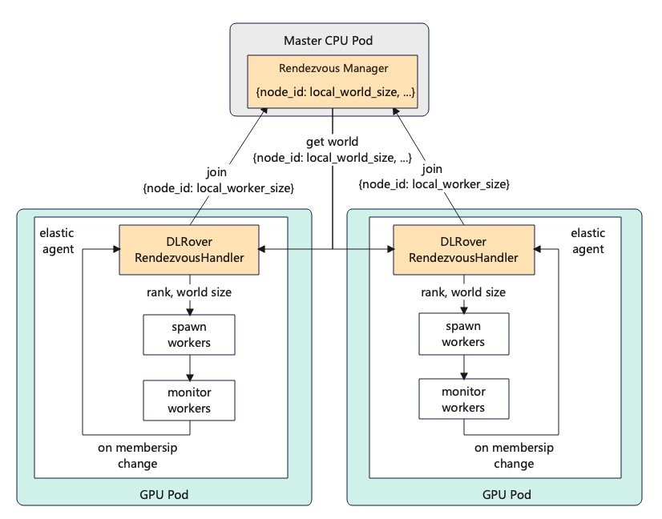
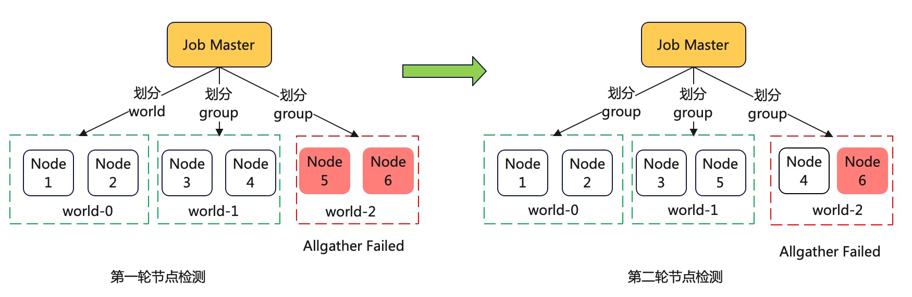
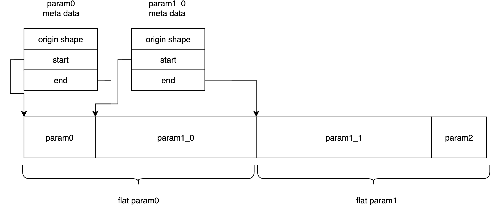
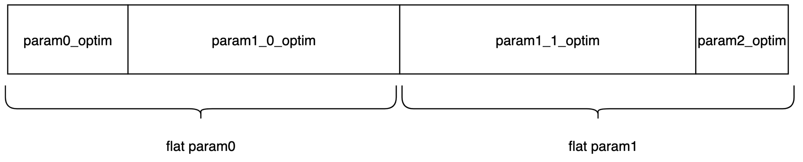
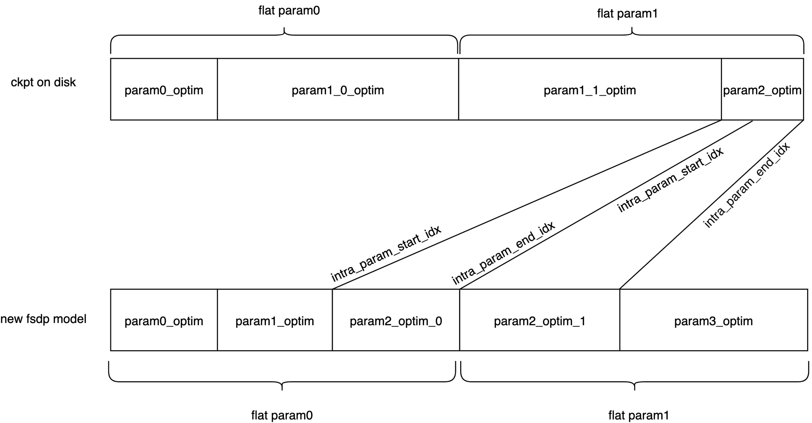
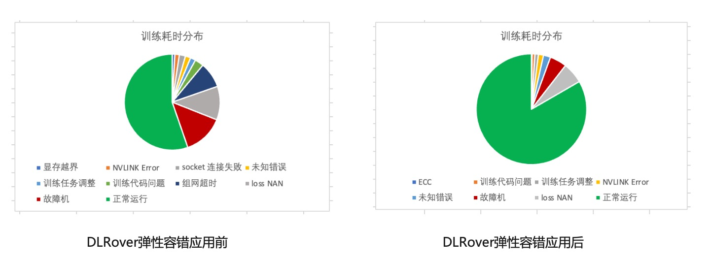

# DLRover在Kubernetes上千卡级大模型训练稳定性保障的技术实践

## 背景

如今大语言模型（LLM）的分布式训练节点规模越来越大，训练耗时长。比如 OpenAI 在 1024 个
NVIDIA A100 GPU 上训练 GPT-3 大约需要 34 天。训练节点越多，耗时越长，训练期间节点故障概率就越大，况且
A100 GPU 的故障率也相对较高。所以大规模训练作业难免会遇到节点故障。据我们在蚂蚁 GPU
训练集群上观察，一个月内，单卡的故障率约8%，那么一天单卡的故障率约为0.27%。常见的故障原因有
Xid、ECC、NVLINK error 和 NCCL error 故障等。对于一个千卡训练作业来说，
卡故障导致一天内训练失败的概率高达到 93%。所以训练作业几乎每天都会失败。作业失败后，
用户需要手动重启作业，运维成本很高。如果用户重启不及时，中间间隔的时间就会导致 GPU 卡空闲，浪费昂贵的算力资源。
有些故障会导致机器不可用，从而导致可用节点数量不能达到用户指定的数量。这时，训练就不能启动，
用户需要手动减少节点数量后重新提交作业。待故障机修复后，用户又需要手动增加作业的节点数来重启作业。
这样增大了用户的运维成本，也导致了新节点无法及时加入训练。
为此，DLRover 在 Kubernetes 上基于 Torch Elastic 开发了弹性训练功能，实现
PyTorch 分布式训练的自动容错和弹性。具体功能如下：

1. 出现故障后，快速执行节点健康检测，定位故障机并将其隔离，然后重启 Pod 来替换故障节点。
2. 健康检测通过后，重启训练子进程来自动恢复模型训练，无需重启作业或者所有Pod。
3. 节点故障导致可用机器少于作业配置，自动缩容来继续训练。集群新增机器后，自动扩容来恢复节点数量。
4. 优化FSDP并行训练的模型save/load，支持根据实际卡数reshard 模型参数，缩短checkpoint保存和加载时间。

在 DLRover 弹性容错应用在蚂蚁大模型训练前，一周内千卡训练运行时间占 60.8%，有效训练时间约 32.9%。
有效训练时间 = 模型迭代的步数 * 每步的时间，除此之外，训练运行时间还包括checkpoint 保存时间和训练回退时间等。
DLRover 上线后，一周内千卡训练运行时间占比提升至 83.6%，有效训练时间提升至 58.9%。

## PyTorch 弹性训练框架

弹性训练是指在训练过程中可以伸缩节点数量。当前支持 PyTroch 弹性训练的框架有 Torch Elastic 和 Elastic Horovod。
二者显著的区别在于节点数量变化后是否需要重启训练子进程来恢复训练。Torch Elastic 感知到新节点加入后会立刻重启所有节点的子进程，
集合通信组网，然后从 checkpoint 文件里恢复训练状态来继续训练。而 Elastic Horovod 则是每个训练子进程在每个 step 后检查新节点加入
，子进程不退出的情况下重新集合通信组网，然后有rank0将模型广播给所有rank。二者的优劣对比如下：

|  | Torch Elastic | Elastic Horovod |
| --- | --- | --- |
| 是否需要修改训练代码 | 否 | 需要 hvd.elastic.run 来包装train 函数，以便重组网 |
| 支持的backend | NCCL/gloo | gloo |
| 模型保存于恢复方式 | checkpoint 到磁盘 | 各个进程保持到内存 |
| 支持的训练模式 | DDP/FSDP | DDP |
| 支持的模型大小 | 大 | 小，只能是单机能存下的 |

通过上述对比可以看出，Torch Elastic 重启训练子进程的方案对用户更加友好，支持更多的分布式训练策略和模型。
而FSDP和NCCL是当前大模型分布式训练使用最为广泛的技术。所以 DLRover 选择使用 Torch Elastic 重启子进程的方案来实现 Kubernetes 集群上分布式训练的弹性容错。

## 集合通信动态组网

动态组网是指训练进程可以自动根据动态变化的节点数量来组网集合通信，无需固定给各个节点指定集合通信的 rank 和 world size。
动态组网是弹性容错训练必须的，因为弹性容错作业中，节点的失败、扩容或者缩容都会导致节点的 rank 和 world size 变化。
所以我们无法在作业启动前给节点指定 rank 和 world size。

### Torch Elastic 动态组网

Torch Elastic 启动子进程后，所有子进程需要进行集合通信组网。Torch Elastic 使用 Dynamic Rendezvous 机制来协助子进程组网。
每个节点上运行一个 ElasticAgent，ElasticAgent 会从一个共享存储中获取作业节点的 host group，然后将自己的 host 加入 group
并同步到共享存储里。这个共享存储当前默认使用 TCPStore。接着，ElasticAgent 不断从共享存储里获取查询 host group，
直到 host group 里的节点数量达到最小节点数量 min_nodes 且一段时间内没有变化，即认为所有节点都准备好了。然后，
ElasticAgent 就可以从 host group 里获取自己的节点rank （PyTorch 中称为 group rank） 和 world size。这样，
ElasticAgent 就可以给拉起的子进程配置 local rank、global rank 和 world size了。有了这些信息，子进程就可以进程集合通信组网。
但是使用 Torch Elastic 原生方案中，我们发现一些问题：

1. 节点不能容错。TCPStore 在一个训练节点上，如果该节点挂了，重组网就没法继续了。
2. 节点 rank 是随机的。 ElasticAgent 同步 host 到共享存储的顺序是随机的，导致节点 rank 的随机。
在训练代码中，用户一般会将模型迭代信息输出在 rank-0 的日志里，比如 step、loss 和耗时等。
用户只能通过进程日志寻找 rank-0 ，对于多节点的作业，这是比较麻烦的。
3. Torch Elastic 的动态组网不能控制组网的节点数量。比如 LLM 模型训练中，
用户可能会将4个节点作为一个数据预处理的组，那么弹性伸缩需要保证节点数量是4的整数倍。
而 Torch Elastic 只要发现有一个新节点加入就会立刻重启训练。

### DLRover 动态组网

针对上面问题，DLRover 重新实现了 PyTorch ElasticAgent 的动态组网模块 RendezvousHandler，
利用 ElasticJob 点 master 来协助 PyTorch 组网。master 是一个纯 CPU 节点，不参与训练，稳定性比 GPU 节点高很多。

<div align="center">

</div>

DLRover ElasticJob 动态组网
DLRover 的 ElasticJob 在启动 Pod 时会给每个 Pod 一个唯一的编号 Pod ID 并配置到 Pod 的环境变量里。
训练节点的 ElasticAgent的 RendezvousHandler 会将自己的编号 Pod ID 和GPU卡数上报给 Master 的 Rendezvous Manager。
然后不断从 master 中请求通信 world，即所有节点的信息。master 的 Rendezvous Manager 会将接收到的 node
信息存储到一个列表里。当列表中的节点数量达到可组网的条件后，master 会将通信 world 发送给所有节点。通信 world
会根据 Pod ID 排序，内容如 {0:8, 1:8, 2:8, 3:8} 其中 key 表示 Pod ID，value 为 Pod 的 GPU 卡数。
Pod ID 在 world 中的次序即为其 Rank。这样我们就可以固定 Pod ID 最小的为 Rank-0。
如果用户需要训练节点数量是 N 的整数倍，那边 master 只需要将 world 根据 N 的整数倍裁剪即可。例如，
训练作业配置了6个节点，由于机器故障导致 Pod-5 失败了，重新拉起的 Pod-6 因为没有资源而 pending。此时，
master 收到的节点信息为 {0:8, 1:8, 2:8, 3:8, 4:8}。但是用户要求节点是 2 的整数倍，那么master可以将
Pod-4 从 world 中踢出，然后发送给 Pod-0 到 Pod-3。而 Pod-4 会等着 Pod-6 起来后再加入训练实现扩容。如下图所示：

<div align="center">

</div>

## 分布式训练容错

训练容错是指训练出现故障后能在无人工介入的情况下快速恢复训练。训练恢复需要如下步骤：

- 定位错误排原因，判断错误是否可以恢复。
- 启动训练进程加载训练代码，训练进程能重新集合通信组网。
- 训进程能加载模型导出的 checkpoint 来恢复训练状态。
- 如果存在故障机，要及时将故障机排除，避免新节点继续调度在故障机。

### DLRover 容错方案

Torch Elastic 在子进程出错后，无论什么错误会直接重启所有子进程来恢复训练。但是节点故障导致的失败，
重启子进程也是没法恢复的，需要在其他机器上启动一个新 Pod。为此 DLRover 提供了进程恢复、Pod 恢复和故障机自动检测机制。
对于无故障机的错误，DLRover 重启进程来恢复训练。对于故障机的错误，DLRover 会通知 SRE 隔离故障机并重新拉起
Pod 来替换出错的 Pod，对于正常运行的Pod 重启其训练进程，减少 Pod 调度时间开销。

| 恢复训练的步骤 | 没有容错 | DLRover Pod容错 | DLRover进程容错 |
| --- | --- | --- | --- |
| 错误排查 | 手动搜索日志 | DLRover 错误日志报警 | DLRover 错误日志报警 |
| 恢复方式 | 重启整个作业 | 重启失败的 Pod | 重启训练进程 |
| 节点启动：资源调度、镜像下载、安装依赖包 | 所有 Pod 耗时的最大值 | 单个 Pod 的耗时 | 无需重启 Pod |
| 节点健康检测 | 无 | 简单allgather任务耗时 | 简单allgather任务耗时 |
| 通信组网 | 有 | 有 | 有 |
| 启动训练进程 | 有 | 有 | 有 |
| checkpoint 恢复 | 有 | 有 | 有 |

### DLRover 故障机检测

DLRover 在重启训练子进程前运行一个简单的 allgather 任务来排查故障机。job master 先将所有节点两两划分为多个
world，每个 world 内的节点上执行 allgather 任务并将成功与否上报给 job master。
如果有 world 里的allgather 任务失败，则此 world 的节点为潜在故障机，否则为正常机器。
然后开始第二轮测试，master 会将潜在故障机和正常节点再次两两划分 world。每个 world 的节点继续执行 allgather，
这样就找到故障节点。比如作业有6个节点，第一轮的划分结果为 [{1,2}, {3,4}, {5,6}]， {5, 6}] 执行 allgather 失败了，
那么节点5 和 6 就是潜在故障节点。为此第二轮的划分为[{1,2}, {3,5}, {4,6}] 。如果{4,6} 失败了，
说明节点6 就是故障节点。然后，DLRover 会重新拉起一个 Pod，替换节点6。

<div align="center">

</div>

### DLRover 错误日志收集

在 PyTorch 分布式训练中，一个节点的进程出错后，Torch Elastic 会停止所有节点的进程。
各个进程的日志都是单独存在各自日志文件中。为了找到训练失败是哪个进程出错导致的，我们需要搜索所有进程的日志
。这个工作对于千卡作业是十分耗时且繁琐的。为此，我们在 ElasticAgent 中开发了错误日志收集供功能。
当 ElasticAgent 发现子进程失败后，后将其错误日志的 message 发送给 job master。
job master 会在其日志中展示具体哪个节点的那个进程失败了，以及错误日志。
这样用户只需看下 job master 的节点日志就可以定位训练失败原因了。同时我们也支持将错误信息上报给钉钉。

```json
任务 torch-train 训练进程失败 torch-train-edljob worker-116 restart 0 fails: {
  "784": {
    "local_rank": 0,
    "exitcode": -6,
    "message": {
      "message": "RuntimeError: CUDA error: uncorrectable NVLink error detected during the execution\nCUDA kernel errors might be asynchronously reported at some other API call, so the stacktrace below might be incorrect.\nFor debugging consider passing CUDA_LAUNCH_BLOCKING=1.\nCompile with `TORCH_USE_CUDA_DSA` to enable device-side assertions.\n",
      "extraInfo": {
        "py_callstack": "Traceback (most recent call last):\n"  
        "timestamp": "1689298411"
      }
    },
    "datetime": "2023-07-14 09:33:31"
  }
} 
```

## FSDP 并行的 save/load 优化

DLRover 弹性容错需要依赖 checkpoint 来恢复模型状态。当前我们的大模型训练采用 FSDP 的并行方式，
FSDP 保存 checkpoint 的方案有两种：1. rank0_only ：由 RANK-0 节点获取所有的模型参数和优化器状态存入磁盘，
2.sharding方式：所有 RANK 各自保存其模型参数和优化器状态。但是这两个方案都没法满足弹性容错训练的需求。
rank0_only：

- RANK-0 需要加载所有的模型参数和优化器状态，可能导致 OOM。
- RANK-0 需要通过 allgather 获取所有模型参数和优化器状态并依次写入磁盘，耗时过长。

sharding 方式：

- 保存 checkpoint 的 RANK 数量必须和加载 checkpoint 的 RANK 数量必须一致。而弹性容错作业中并不能保证 RANK 数量不变。

### 参数支持 reshard 的 save/load

原始 torch save 是将整个参数进行 pickle，load 时整体进行 unpickle，因此内存会出现峰值。
为解决该问题，我们在 ATorch 中将 save 的过程拆开，先生成 safetensors 的 meta data，之后按需逐个序列化每个 tensor，再进行写入。
在保存时，直接保存每个 rank 上的 flat param，同时保存一份对应的 meta 信息。如下图所示，
每个 flat param 中保存了多个 meta 信息，每个 meta 信息代表这个 flat param 中原始参数的 shape 和在 flat param 中的 start 和 end，
因此在恢复参数时，只需要按照顺序将所有的 param 找出来，拼接到一起后，再进行 reshape 即可获得原始的参数。

<div align="center">

</div>

FSDP flat param 的逻辑格式
代码示例：

```python
from atorch.utils.fsdp_save_util import save_fsdp_flat_param
model = ... # atorch 转换 FSDP 的模型
save_fsdp_flat_param(model, "ckpt")

"""
如果有两个 rank，则路径如下
ckpt
├── buffers
├── flat_meta.00000-00002
├── flat_meta.00001-00002
├── flat_param.00000-00002
└── flat_param.00001-00002
"""
```

```python
# init_empty_weights_with_disk_offload 时指定 ckpt 地址，会将模型全部在 meta 上
# 初始化，在 FSDP 转换时按需加载 ckpt 地址
from atorch.utils.meta_model_utils import init_empty_weights_with_disk_offload
with init_empty_weights_with_disk_offload(ckpt_path='ckpt'):
    ... # build your model
```

### 优化器状态支持 reshard 的save/load

FSDP 并行训练时，优化器是基于 FSDP 转化后的模型创建的，atorch 会配置 FSDP 的 use_orig_param。这时优化器状态的结构与
flat param 结构相同。如果某些参数不在 flat param 中，则优化器状态获取到的参数为空。同时还保存了优化器状态的 meta 信息，为优化器状态的 param group 信息。

<div align="center">

</div>

FSDP use_orig_param 的优化器状态的逻辑格式
因此在保存的时候，优化器状态也是 flatten 为 1D 的数据。在恢复优化器状态时，使用了 FSDP 提供的 `FSDP.shard_full_optim_state_dict`函数，
该函数接收的参数为完整的优化器状态和 FSDP wrap 好的模型来重新切分优化器状态。
该函数最终调用 `torch.distributed.fsdp._optim_utils._shard_orig_param_state` 函数来切分状态，
并且该函数在 torch 内部只有这一处调用，因此 hook 该函数的实现。
实际在内部实现时，reshard 根据 FSDP 包好的模型来获取优化器状态的数值区间，
该区间在 FSDP 内部为intra_param_start_idx，intra_param_end_idx 参数，含义为新的参数在原始 flatten 权重的取值范围。
如下图所示，如果由于修改了 rank/wrap 使得 FSDP 的模型产生了变化，则需要重新切分优化器参数。

<div align="center">

</div>

FSDP 优化器状态 reshard 示意图
代码示例

```python
from atorch.utils.fsdp_save_util import save_fsdp_optim_param
# model, optimizer 均是经过 atorch FSDP 转换的对象
save_fsdp_optim_param(model, optimizer, 'ckpt')

"""
ckpt
├── optim_meta
├── optim_param.00000-00002
└── optim_param.00001-00002
"""
```

```python
from atorch.utils.fsdp_save_util import ShardOptim
sm = ShardOptim("ckpt")
reshard_optim_state = sm.reshard_optim_state_dict(model)
optimizer.load_state_dict(reshard_optim_state)
```

## 弹性容错在千亿级大模型训练的应用效果

在使用 DLRover 弹性容错之前，Torch 大模型训练只要出错就要重启训练作业。为了及时重启作业，
用户写了个程序每隔10min 来检测作业状态。如果失败，就会重启作业。

<div align="center">

</div>

下面对比了训练失败时使用 DLRover 弹性容错前后的耗时。

|| 没有弹性容错 | DLRover 弹性容错 |  |
| --- | --- | --- | --- |
| 训练恢复步骤 | 任何故障 | 机器硬件故障 | 软件故障 |
| 作业启动，包括作业失败检测、作业提交 | 约 10 min | 无需重启作业 | 无需重启作业 |
| Pod 调度、镜像下载、安装依赖包等 | 资源充足，所有 Pod 成功拉起的时间约5min。 | 资源充足，单个 Pod 拉起约 2min。 | 无需拉起 Pod |
|  | 资源不足，只能等到资源足够或者手动减少资源重启。 | 自动缩容约 3min。 | 无需拉起 Pod |
| 节点健康检测 | 无节点健康检测 | 验证节点约 2-3min | 验证节点约 1min |
|  | 节点网络故障，手动检测约 2h | 自动检测约 5min | 自动检测 5min |
|  | 其他硬件错误，取决于SRE 巡检的周期。 | 自动检测约 5min | 自动检测5min |
| checkpoint 保存 | 10 min | 1 min | 1 min |
| checkpoint 加载 | 8 min | 4min | 4min |

## Kubernetes 上提交 GPT 弹性容错作业

1. 在 Kubernetes 集群上部署 DLRover ElasticJob CRD。

```python
git clone git@github.com:intelligent-machine-learning/dlrover.git
cd dlrover/go/operator/
make deploy IMG=easydl/elasticjob-controller:master
```

2. 在构造训练镜像的 dockerfile 中安装 dlrover[torch]。

```python
FROM registry.cn-hangzhou.aliyuncs.com/easydl/dlrover-train:torch201-py38  as base

WORKDIR /dlrover

RUN apt-get install sudo
RUN pip install dlrover[torch] -U
COPY ./model_zoo ./model_zoo

```

3. 在 ElasticJob 的container 的 command里使用 dlrover-run 在运行训练脚本。
在镜像 registry.cn-hangzhou.aliyuncs.com/easydl/dlrover-train:nanogpt-test
我们已经准备好了代码和训练数据，可以直接用如下 ElasticJob 来提交示例作业。

```yaml
apiVersion: elastic.iml.github.io/v1alpha1
kind: ElasticJob
metadata:
  name: torch-nanogpt
  namespace: dlrover
spec:
  distributionStrategy: AllreduceStrategy
  optimizeMode: single-job
  replicaSpecs:
    worker:
      replicas: 2
      template:
        spec:
          restartPolicy: Never
          containers:
            - name: main
              # yamllint disable-line rule:line-length
              image: registry.cn-hangzhou.aliyuncs.com/easydl/dlrover-train:nanogpt-test
              imagePullPolicy: IfNotPresent
              command:
                - /bin/bash
                - -c
                - "dlrover-run --nnodes=1:$WORKER_NUM \
                  --nproc_per_node=1 --max_restarts=1  \
                  examples/pytorch/nanogpt/train.py \
                  --data_dir '/data/nanogpt/'"
              resources:
                limits:
                  cpu: "8"
                  memory: 16Gi
                  # nvidia.com/gpu: 1 # optional
                requests:
                  cpu: "4"
                  memory: 16Gi
                  # nvidia.com/gpu: 1 # optional

```

## 总结 & 未来计划

DLRover 目前已经在蚂蚁千亿模型训练训练上落地，将GPU故障导致训练暂停时间由 30%降低到了约 12%。
我们希望 DLRover 在大规模分布式训练上提供智能化运维功能，降低用户运维成本，提升训练的稳定性。
后续我们将介绍蚂蚁在千亿模型训练上的 PyTorch 性能优化方案的扩展包 ATorch，ATorch 旨在提升大规模
GPU 训练的硬件算力效率 HFU (Hardware Flops Utilization) 和训练的稳定性，当前蚂蚁千亿大模型训练使用
Atorch 的 HFU 为 49.6%。我们欢迎不同机构的开发者也能根据自身特点，同我们一起共建 DLRover 项目，推进分布式自动化。
