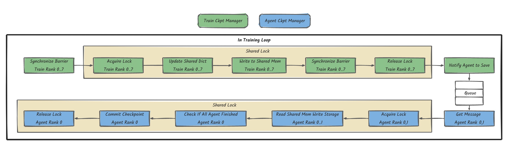
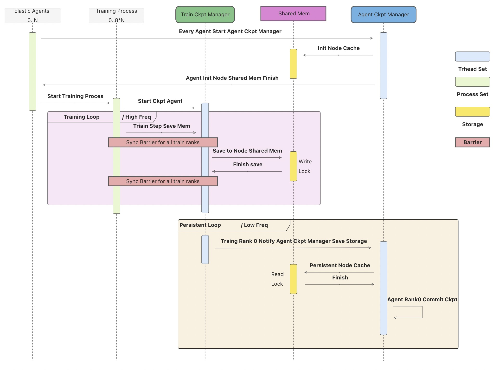

# Fastly Save and Load Checkpoint to Resume Training

The design to introduce how to speed up saving and loading the checkpoint
to resume training.

## Background

It is very difficult to keep training a foundational model during a long time period
without any interruption. Hardware failure, OS failure or network breakdown
may often happen during the training. Users usually periodically checkpoint
the model and optimizer states to the storage and resume the training
after an interruption. Now, It takes a few minutes to use  `torch.save` to
checkpoint a large foundational model. Frequent checkpointing may waste
many hours of the accelerator (GPU, NPU, TPU) since the training must stop
until the checkpointing is completed. On the other hand, infrequent checkpoints
could reduce the overhead but take the risk of wasting more training steps
when resuming the training from the latest checkpoint file. Reducing the checkpointing
overhead is necessary to improve the training efficiency and the accelerator utilization
when we train a foundation model using thousands of accelerators.

## Target

- Reduce the checkpointing time overhead to accelerate the training for
  DDP, FSDP, DeepSpeed or Megatron.
- Speed up loading the checkpoint file when the training restarts.
- Automatically configure the checkpoint period to improve the efficient
  training time as soon as possible if the failure probability is given.

## Design

Save a checkpoint in PyTorch contains the following steps:

- Allocate CPU memory to place parameters.
- Copy parameters from GPU to CPU memory.
- Using `pickle` to serialize parameters.
- Write the serialized data into a file in the storage.

By experiments to save a checkpoint of 3GB GPT model from A100 to a disk, we find
the 1st step needs 2.3s, the 2nd step needs 0.12s, the 3rd and 4th steps
need 6.5s. So, it is very fast to copy the model parameters from GPU to the CPU memory.
So, we can copy the weights from GPU to CPU memory in the training loop
and asynchronously save weights from CPU memory to the storage. The solution
will block the training to save checkpoint with a little time.

## A daemon Subprocess of the Training Process Asynchronously Saves Checkpoint to the Storage

We can start a daemon subprocess in the training process to save checkpoint to the storage.

- Start a thread to save states from GPU to CPU memory.
- Make the memory buffer to place Torch tensors of states.
- Write state dict to pinned memory.
- Start a subprocess to asynchronously save states to storage.

We can start a subprocess in the training process and share the
tensor buffer by the shared memory of multiprocessing.

## The ElasticAgent Asynchronously Saves the Checkpoint into Storage

If we start a daemon subprocess of the GPU training process, the daemon
subprocess will exit if the training process fails. In this case, the
parameters in CPU memory of the daemon subprocess will be cleaned. So, the elastic agent
in the main process can allocate the shared memory with the training
process. The training process saves the state dict to the shared memory and
the agent save them into the storage.

The agent and training process need to do the following steps:

- The agent monitors the training process to create the meta of model and
optimizer state dict.
- The training process firstly notifies to the agent the checkpointing meta when the
training process saves the state dict into the memory.
- The agent allocates the shared memory with the checkpointing meta and notifies
the training process to copy the state dict from GPU to the shared CPU memory.
- The agent saves the state dict in the shared memory into the storage when one of the conditions
is satisfied:
  - The training process notifies the agent to save the storage with a checkpointing path.
  - The training process fails. If one training process fails, the job master needs
    to notify all agents to save the buffer into the storage.
- One of agents on nodes checks the integrity of the checkpointing file.

### Load checkpoint from the multiple-level storage

If the training process fails and the elastic agent of PyTorch can restart the
training process to resume the training, the training process can load the checkpoint
from the shared memory not from the storage. Loading from the memory is much faster
than the storage.

### The Classes Design

As we need a global thread to keep and sync the checkpointing state in storage, and an agent
thread per node to save the checkpointing state into the storage, we design three classes to
implement the checkpointing process.

<div align="center">

</div>

- **AgentCkptManager**
  - One instance runs in each agent process.
      memory and the storage.
  - Get the Shared lock of shared memory and save the checkpoint state into the storage.
  - One of Agent check if all agents finish the writing and commit the checkpoint.

- **TrainCkptManager**
  - One instance runs in each training process.
  - Is responsible for coping the checkpointing state from GPU to shared memory.
  - Notifies the AgentCkptManger to save the checkpoint state into the storage.

### Async Checkpointing Saving Steps

<div align="center">

</div>

The agent and training process need to do the following steps:

1. The agent monitors the training process to create the meta of model and
  optimizer state dict.
2. TrainCkptManager acquires the shared lock and update the meta of model and optimizer
  state dict.
3. TrainCkptManager copies the state dict from GPU to the shared memory.
4. TrainCkptManager releases the shared lock.
5. TrainCkptManager notifies the AgentCkptManager to save the checkpointing state into the
  storage.
6. AgentCkptManager acquires the shared lock and write the checkpoint state into the storage.
7. AgentCkptManager in rank 0 checks if all agents finish the writing and commit the checkpoint.
8. AgentCkptManager releases the shared lock.

The following figure shows the checkpointing process in sequence diagram.

<div align="center">

</div>

### Last Words when the Training Process Fails

When any of the training processes fails, or the agent is killed by SIGTERM, we can automatically
save the latest checkpoint state into the storage.

### Consistency of the Checkpointing State

For the shared memory checkpointing consistency and correctness, we use a shared lock
to protect the shared memory. If the Agent writing process takes too long time, for training
efficiency, the TrainCkptManager will skip a memory checkpointing and keep training.

For the storage checkpointing consistency and correctness, every agent will write the checkpoint
to a temporary directory, and one of the AgentCkptManager will commit the checkpointing after all agents
finish the writing.

## Checkpoint APIs Design

The engine synchronously saves the checkpointing state dict into the CPU memory
buffer and notifies the checkpoint saver to save the checkpoint from CPU memory
buffer to the storage.

```Python

class CheckpointEngine(object):
    """
    Attributes:
        checkpoint_dir: str, the directory to save the checkpoint.
        max_to_keep: int, the number of checkpoint files to keep.
        save_mem_interval: int, the interval of iteration steps to save the model and
            optimizer states into the CPU memory.
        save_storage_interval: int, the interval of iteration steps to save the model
            and optimizer states from CPU memory to the storage.
    """

    def __init__(
        self,
        checkpoint_dir,
        max_to_keep=1,
        save_mem_interval=0,
        save_storage_interval=0,
        auto_save=False,
    ):
        pass

    def save(self, step, state_dict):
        """
        Save the state dict if the step is multiple of save_mem_interval.

        Args:
            step: the iteration step in the training loop.
            state_dict: a dictionary.
        """
        pass

    def load(self, resume_path=""):
        """
        Load the state dict from the CPU memory if the state dict is complete in
        CPU memory. Otherwise, the function will load the state dict from the storage. 

        Args:
            resume_path: str, If the resume_path is an empty
                string, the function will load the latest checkpoint file in the checkpoint
                directory.
        
        Returns:
            A dict.
        """
        pass
```

The handler writes and reads the shared memory with the state dict.

```Python
class SharedMemoryHandler(object):
    def save_state_dict(self, step, state_dict, ckpt_name=""):
        """Copy the state dict from CPU memory buffer into the shared memory."""

    def load_state_dict(self):
        """Load the state dict from the shared memory."""
```

CheckpointSaver saves the state dict from the shared memory into the storage.

```Python
class CheckpointSaver(object):
    def save_shm_to_storage(self):
        """Save the state dict in the shared memory into the storage."""
```

The meta class stores the checkpoint tensor meta information.

```Python
class TensorMeta(object):
    """
    TensorMeta is used to restore the tensor from the memory buffer.

    Args:
        shape (tuple(int)): tensor shape.
        dtype (torch.dtype): tensor dtype.
        element_size (int): the size of each element.
        numel (int): the element number of tensor.
        offset (int): the offset in the memory buffer. 
    """
    shape: Tuple[int] = None  # type: ignore
    dtype: torch.dtype = None  # type: ignore
    element_size: int = 0
    numel: int = 0
    offset: int = 0
```

The shared lock between local processes is implemented to avoid conflicts when multiple
processes concurrently read and write to the shared memory.

```Python
class SharedLock(object):
    def acquire(self) -> bool:
        """Acquire a lock shared by multiple processes."""

    def release(self) -> None:
        """Release the lock."""
```

The shared queue between local processes is implemented for the training process to notify
the agent to save the state dict from the shared memory into the storage.

```Python
class SharedQueue(object):
    def put(self, obj, block=True, timeout=None):
        """Put a value into the queue."""

    def get(self, block=True, timeout=None):
        """Get the value and remove it from the queue."""

    def qsize(self):
        """The size fo queue."""

    def empty(self):
        """Verify the queue is empty."""
```

The shared dictionary across multiple processes on a node.

```Python
class SharedDict(object):
    def set(self, new_dict):
        """Set the dict to the remote shared Dict."""

    def get(self):
        """Return a Python Dict from the shared Dict."""
```
