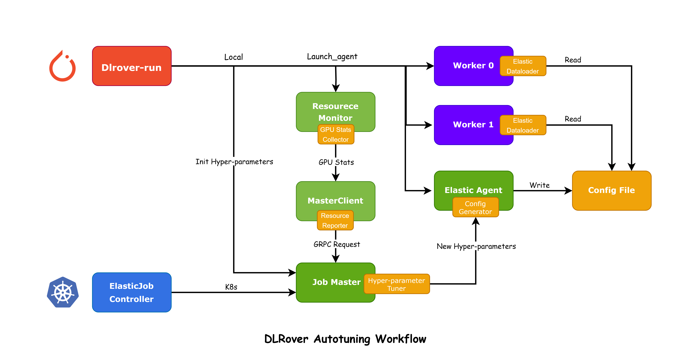

# Design to Auto-Tuning Hyperparameters with DLRover

This design doc describes how DLrover auto-tunes hyperparameters of a job.

## Background

  In the fast-paced world of deep learning, large-scale language models have
  become prominent in natural language processing. However, training these
  models presents a significant challenge, particularly in determining the
  optimal micro-batch sizes per GPU and learning rates.

  As models grow larger and optimization techniques become more complex, manual
  configuration tuning becomes increasingly challenging for users. Larger model
  parameters result in extensive activation values and additional GPU memory
  cache usage. Even minor batch size adjustments can unexpectedly increase GPU
  memory requirements, leading to job crashes due to out-of-memory issues.
  Additionally, various methods such as "gradient checkpoints," "ZERO," and
  "host-mem offload" have been introduced to mitigate these memory
  requirements. However, these optimization techniques introduce a vast array
  of configuration options, which can be overwhelming for beginners.
  Consequently, configuring training jobs has become highly challenging for
  users. This often leads users to resort to repetitive experimentation to find
  the optimal settings, resulting in an unsatisfactory training experience due
  to extended restart times.

## Target

We aim to alleviate this pain point by automating the discovery of optimal
hyperparameter configurations for efficient training speed. In this design, we
develop a performance monitoring and optimization module for distributed deep
learning training to enhance efficiency and effectiveness.
This includes:

 **Collecting Runtime Metrics:** Monitoring and recording various performance
 metrics during training, such as GPU memory usage, utilization, batch size,
 and learning rates.

 **Real-time Analysis of Performance Metrics:** Analyzing the collected
 performance data in real-time to provide optimization strategies based on the
 current training status. This involves suggesting new batch sizes and learning
 rates to maximize GPU resource utilization.

 **Real-time Adaptive Batch Size Configuration in No-Stop Manner:**  We utilize an elastic
 dataloader to maximize GPU resource utilization continuously, eliminating the
 need for users to restart their jobs for performance tuning.

 **Real-time Learning Rate Configuration:** We prioritize both throughput and
 model quality by dynamically configuring and updating learning rates in
 response to changes in batch size.

## Design

### Process and Component Design

#### Key Components

`GPU Stats Collector`: A subcomponent of the resource monitor responsible for
collecting GPU status.

`Hyper-parameter Tuner`: The central generative component of the optimization
algorithm generated within `JobMaster` to optimize node training
configurations.

`Elastic Dataloader`: The primary execution component of dynamic configuration,
dynamically adjusting the training batch size based on the generated
hyper-referenced configuration.

#### Main Workflow

<div align="center">

</div>
As shown in the figure, introspective hyper-parameter tuning in **DLRover**
contains the following steps:

- The `GPU Stats Collector` within `ElasticAgent.ResourceMonitor` gathers
  training performance metrics and resource information to create  a
  `ResourceStat`[used_mem, current_cpu, gpu_stats].
- The `Master_Client` reports `ResourceStat` to `gRPC Server`
- The `Master.Servicer`receives the `ResourceStat` through a  `gRPC Request`
  and updates `NodeResource`
- `Master.Node.JobManager` obtains the  `ResourceStat` from `NodeResource` and
  and enters waiting state for `HyperParameterTuner`.
- `HyperParameterTuner` generates a new `HyperParameterConfigPlan` and
  dispatches a query to `ElasticAgent`
- `ElasticAgent.ConfigGenerator` updates the `Config File`.
- The `Trainer` in `Worker` checks the `Config File` timely and  adjust the
  hpyer-parameters based on its contents. For example, the `Elastic Dataloader`
  fine-tunes the batch size in accordance with the new configuration.

### Data Structure Design

#### GPUMetric

<!-- markdownlint-disable MD046 -->
```python
@dataclass
class GPUMetric:
    """GPU performance metrics for Container."""
    
    index: int
    """The index of the GPU."""
    
    total_memory_mb: int
    """The total memory of the GPU in megabytes (MB)."""
    
    used_memory_mb: int
    """The amount of used memory on the GPU in megabytes (MB)."""
    
    gpu_utilization: float
    """The GPU utilization as a percentage."""
```

#### HyperParams

```python
@dataclass
class HyperParams:
    """Hyperparameters for model training."""
    
    micro_batch_size: int
    """The size of the micro-batch used in training."""
    
    learning_rate: float
    """The rate at which the model's parameters are updated during training."""
    
    optimizer: str
    """The optimization algorithm used to adjust the model's parameters."""
    
    scheduler: str
    """The learning rate scheduler used to dynamically adjust the learning rate during training."""
```

### API Design

#### `GPU Stats Collector`

##### Description

This API allows you to monitor GPU statistics, providing insights into memory
usage and utilization.

#### Inputs

- **gpus** (optional)
  - Type: List
  - Description: List of GPU indices to monitor.

#### Outputs

- **gpu_stats**
  - Type: List[GPUMetric]
  - Description: List of GPU metrics including index, total memory, used
    memory, and GPU utilization.

```python
def get_gpu_stats(gpus=[]):
    """Get the used gpu info of the container"""
    if not gpus:
        # get gpu index from device list
        pass
    for gpu in gpus:
        # get each gpu's stats and append to gpu_stats
        pass
    return gpu_stats
```

#### `Hyper-parameters Tuner`

- **Description**
  - This API performs hyper-parameter tuning based on GPU metrics and user-submitted training arguments.

- **Inputs**
  - *gpu_stats*
    - Type: List[GPUMetric]
    - Description: List of GPU metrics including index, total memory, used memory, and GPU utilization.

  - *hyper_param_args*
    - Type: HyperParams
    - Description: Dataclass containing training arguments submitted by the user.

- **Outputs**
  - *tuned_hyper_paras*
    - Type: HyperParams
    - Description: Dataclass containing hyper parameters tuned by the hyper-parameter tuner.

```python
def tune_hyper_params(gpu_stats=[], hyper_param_args=[]):
    """Tune a good hyper_paras config"""

    # Iterate through each hyperparameter and call the corresponding tuning method
    for hyper_param in hyper_param_args:
        param_name = hyper_param.name
        
        if param_name == "learning_rate":
            # Call the method to tune learning rate
            tuned_value = tune_learning_rate(hyper_param, gpu_stats)
            hyper_param.learning_rate = tuned_value
        
        elif param_name == "batch_size":
            # Call the method to tune batch size
            tuned_value = tune_batch_size(hyper_param, gpu_stats)
            hyper_param.batch_size = tuned_value
        
        # Add more elif branches for other hyperparameters
        
    return tuned_hyper_params

def tune_learning_rate(hyper_param, gpu_stats):
    """Tune the learning rate hyperparameter"""
    #Return the tuned learning rate value
    pass

def tune_batch_size(hyper_param, gpu_stats):
    """Tune the batch size hyperparameter"""
    # Return the tuned batch size value
    pass
```

#### `Class: Elastic Dataloader`

- Description
  - This class extends the DataLoader class to enable dynamic batch size
    adjustments during data loading. This feature allows users to modify batch
    sizes in real-time, enhancing memory management and training efficiency.

- Methods
  - *init*
    - Description: Initializes the `ElasticDataLoader` instance.
      Inherits and extends the initialization behavior of the parent
      `DataLoader` class.

  - *\_\_iter\_\_*
    - Description: Overrides the iteration behavior of the parent
      `DataLoader` class. Uses a `BatchSampler` with the current batch size
      to yield batches of data from the dataset.

  - *set_batch_size*
    - Parameters: batch_size (Integer)
    - Description: Sets the current batch size to the specified value. This
      method enables users to dynamically adjust the batch size during runtime,
      affecting subsequent data loading iterations.

  - *update_batch_size_from_config*
    - **Parameters**: config_path (String)
    - Description: Reads the batch size information from a configuration file
      located at `config_path` and updates the current batch size accordingly.
      This method allows for convenient configuration-based adjustment of the
      batch size.

```python
class ElasticDataLoader(DataLoader):
    def init(self, *args, **kwargs):
        super(ElasticDataLoader, self).init(*args, **kwargs)

    def update_batch_size(self, batch_size):
        self.batch_sampler.batch_size = batch_size

    def update_batch_size_from_config(self, config_path):
        batch_size_from_config = self._read_batch_size_from_config(config_path)
        self.update_batch_size(batch_size_from_config)

    def _read_batch_size_from_config(self, config_path):
        # Return the batch size value
        pass
```
