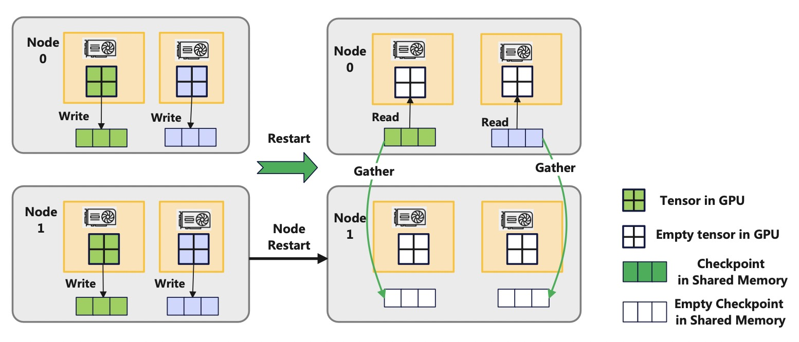
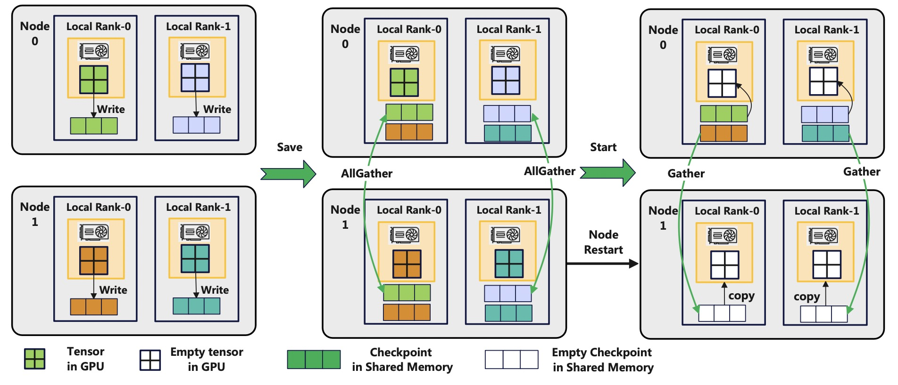

# Flash Checkpoint Loads Checkpoint in Memory for Fault Tolerance

The design describes how to load the checkpoint in the memory
of nodes to support fast fault tolerance. After a failure happens, DLRover
can restart training processes and resume the training from the checkpoint
in the memory of nodes not from the storage.

## Backgroup

Now, the training job loads the checkpoint from the storage after the training
process restarts. The IO speed of storage is a bottleneck to speed up the
model initialization. Meanwhile, the memory of nodes is usually not fully utilized
and the node usually has a large amount of memory. For example, a machine with
8 A100 GPUs can has up to 1TB memory. The training can utilize the memory of node
to store and load the checkpoint after the training process restarts.

However, the checkpoint in the memory will be lost if the node fails. The training
need to backup copy the checkpoint of a node to other nodes which can reduce
the probability to loss the checkpoint if some nodes fail. So, we need to implement
the following features.

- The training can backup copy the checkpoint shard of a node to other nodes.
- The node can restore the checkpoint from other nodes if a node restarts.
- The training can load checkpoint from the memory of nodes.

## Design

Now, Flash Checkpoint can synchronously copy the model and optimizer states from
device memory to the CPU memory. After saving checkpoint in the memory, the node
can send its checkpoint to other nodes to backup. If a node fails and restarts,
it can restore its checkpoint from the memory of another node.

With different distributed training strategy,
the layout of the model and optimizer shards is different. We need to implement different
backup strategies for different distributed training strategies.

### Backup Checkpoint Shards of Data Parallelism

The ranks in different DP units has the same model replica. If a node breakdowns and restarts,
the retarted node can gather the model checkpoint from the memory of the node in other DP unit.

### Backup Checkpoint Shards of ZERO Optimizer or FSDP

The each rank has an unique shard of model and optimizer states using DeepSpeed ZERO or FSDP.
After saving the checkpoint into the shared memory, the job can split nodes into backup groups
with two nodes. The ranks of a node in a backup group can exchange checkpoint shards in the shared memory by
`torch.distributed.all_gather`. After allgathering checkpoint shards,
each rank has two checkpoint shards in the shared memory. If a node in a group breakdowns and restarts,
the ranks of the node can gather its checkpoint shard from the memory of backup nodes.
If the nodes in a group all fails, the training can only resume from the checkpoint in the storage.

### Group Nodes to Backup Checkpoint

The job can pair the nodes in groups with two nodes according to their sequence numbers. For example,
the groups are [{0, 1}, {2, 3}, {4, 5}, {6, 7}] if there are 8 nodes. After the training restarts,
each rank will read checkpoint from its shared memory. The ranks of restarted nodes
will gather the checkpoint from the back up nodes. Then, all ranks will use an AllReduce operation
to check whether the step in the checkpoint of all ranks are the same. All ranks will read the
checkpoint from the storage if the steps are not consistent.
