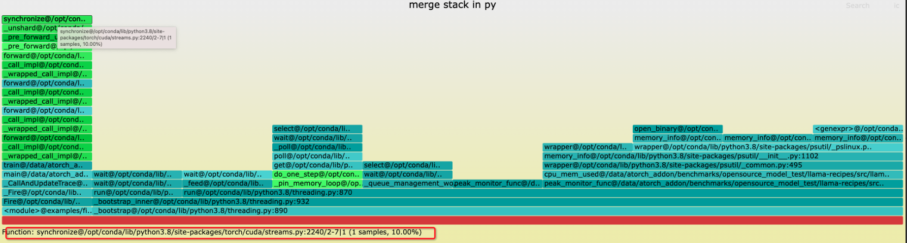

# DLRover Diagnosis System Design

A training job may encounter various issues during runtime. While some issues lead
to immediate failure, others may not manifest right away. Presently, many systems
resort to resuming training on new machines to diagnose errors, significantly
prolonging the job's training time—especially for errors that do not immediately
trigger failure. For instance, a training job might hang for reasons unknown, only
presenting timeout errors after 30 minutes or longer.

Hence, we've devised a diagnosis system in DLRover capable of swiftly
identifying and diagnosing faults upon failure or when potential failures arise.

## Overview

During a training job, various types of runtime data are generated, providing
insights into the job's status. Based on rules
learned from our experiences, we can identify and diagnose training faults from those data.

However, the availability of detailed runtime data varies depending on the
training framework and cluster configuration. DLRover cannot assume uniform data
provision across all training jobs, necessitating a flexible diagnosis system.
For instance, while detailed CUDA runtime logs directly indicate a training hang
error, the absence of such logs requires alternative approaches, such as
monitoring GPU chip metrics like temperature.

Upon detecting a failure, the diagnosis system must pinpoint its root causes and
execute appropriate actions to restore the training process. For example, a brief
network jitter causing a network timeout may erroneously flag a machine as faulty,
leading to unnecessary replacement. A simple retry could suffice, avoiding the
heavier recovery process. To minimize recovery overhead, we propose four levels of
diagnosis actions, ranging from light to heavy intervention:

1. retry, when the error is temporary.
2. restart training process.
3. re-configure training job, e.g., replace a failure node.
4. fail the job and report, when there is a fatal error leading to a complete stop.

## The Architecture of the Diagnosis System

As shown in the figure, the general diagnosis procedure consists of four stages:
Firstly, collecting runtime data (**Collector**); then observing training issues (**Observer**); after that, 
exploring solutions (**Resolver**); finally executing solutions. 

Due to the possible quick iteration of hardware, software and training approaches, 
we have to keep handling new and diverse issues. Therefore, all those components
are designed as plugin. Then the diagnosis methods could also be iterated swiftly.

### Collector

Collector is to collect necessary data to resolve the issues during training.

### DataStore

DataStore aggregates and stores the data reported by DataCollector. Since analysis
may require historical data, DataStore retains data collected over a specified
period.

### Analyst and Diagnostician

Analyst and Diagnostician are responsible for faults detection and diagnosis,
respectively. Leveraging the data stored in DataStore, Analyst assesses if any
faults have arisen. Upon identifying a problem, Diagnostician delves into its root
cause and generates solutions (i.e., treatments).

Both Analyst and Diagnostician employ **Rule-based Inference Chains** for reasoning.
Each chain comprises multiple inference steps, with each step leveraging a
specific type of data (training logs, chip metrics, or CUDA events) to identify
the immediate cause. Subsequently, each inference step builds upon the previous
step's output, progressively moving towards the root cause.

The generation of an inference chain is tailored to the nature of the problem and
the available data. For example, in the case of a hang fault, the system
prioritizes CUDA events, initiating inference steps based on them. However,
in the absence of CUDA events, the system adapts the inference chain to
utilize chip metrics for inference instead.

## Example: Identify Hang Error with CUDA Events

Assuming we can collect the CUDA events that record the CUDA kernel stacktrace of
each worker, we can easily track the execution of the training. When there is a
hang error, one or more workers must be suspended for some reasons while the other workers are waiting
for suspended workers.

The figure shows a hang error case in a LLM7B SFT training job on a single node with
8 GPUs. We can observe worker 0 and worker 2-7 all wait at synchronize function while
worker 1 is absent. Clearly, worker 1 is suspended elsewhere that results in a hang
error. With those CUDA events, the Analyst can identify that a hang error happened and
Diagnostician could explore the root cause further and diagnose the problem.
