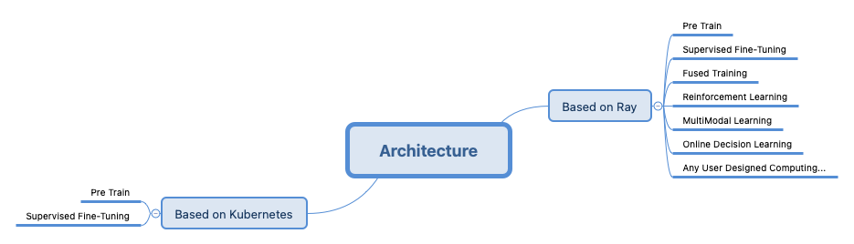
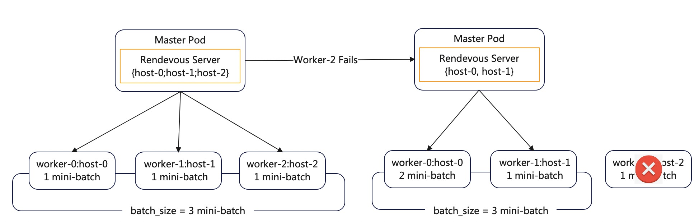

# DLRover Design

DLRover is an automatic distributed deep learning system.
DLRover can help users train their models with minimal efforts. For example,
with DLRover, users need not provide any resource configuration for their
deep learning training jobs. Instead, DLRover can pick up the appropriate resource
configuration for each job smartly and continue to optimize those jobs during their runtime.

DLRover's short-term goal is to support automatic resource configuration for DL training jobs.
However, the long-term goal of DLRover is to make the whole deep learning model
training completely automatic.

## Background

### Traditional Search and Recommendation Computing

In distributed deep learning, resource configuration is key to the training
performance. More resource may not result in higher throughput. Using parameter
server to training a job, we need to take account of the computation
and communication capability of parameter servers when configuring
workers. Using allreduce architecture, we need to take
account of the increasing communication cost with more workers.
It is difficult to configure the appropriate resource with different models.

Model developers (users) have to learn more rather than model training
algorithms when they are using those jobs to train their models. To
run a training job, those users have to specify the required resources for their
this job. Then the Kubernetes cluster can allocate the required resources and
start the job. Unfortunately, we found it is quite an ineffective way
to ask the users to take care of the resource configuration.
At first, users are usually the
experts on model design but not training jobs and Kubernetes cluster. It is
not an easy task for them to have the optimal configuration in the first place.
Secondly, a training job's resources requirement may vary during its runtime.
A static resource configuration usually can not be the optimal one all the time.
We have observed jobs failure, poor performance and inefficient resources since
users fail to provide the optimal resource configuration for their jobs.

### Large Model Computing

With the arrival of the era of large models computing, the dramatic increase in 
computational demand has shifted more computations from traditional CPUs to GPUs. 
The expansion of model scale (distributed scale) and the inherent instability 
of GPUs compared to CPUs are two primary factors that significantly increase 
the instability of large model computations. Consequently, this has become a 
key pain point that DLRover aims to address. To better align with market needs, 
DLRover has also focused its development around the core library, Torch. 
Therefore, since 2023, DLRover's efforts have primarily concentrated on enhancing 
the stability of Torch-based training, with the core objective of reducing the 
increased costs caused by various instability factors in large model training.
Additionally, to support a wider user base, DLRover has invested in compatibility 
with multiple hardware devices (beyond NVIDIA GPUs).


## RoadMap

DLRover's development has primarily gone through the following stages:

```
    ~ 2022 : Optimizing resources for CPU-intensive computing
    2022 ~ 2023 : Providing more comprehensive job lifecycle management and fault tolerance support
    2023 ~ 2024 : Enhancing fault tolerance for large model computing
    2025 ~ : Extending to general deep learning
```

It is precisely because of the iterative roadmap history described above, 
DLRover during its evolution, has also developed two architectural implementations: 
- based on Kubernetes 
- based on Ray

Below, we will discuss these two architectures separately.

## Overview for Different Architecture

Before discussing the two architectures in detail, let's first take a holistic 
look at their overall design and differences:

<div align="center">

</div>

To help users better understand the new Ray-based architecture, we recommend 
reading about the [ordinary architecture](#ordinary-architecturebased-on-kubernetes) 
first, thus making it easier to understand the current state and the 
manifestation of their differences.

### New Unified Architecture（Based on Ray）

#### Target

The proposal of the new Ray-based architecture fundamentally aims to address 
the limitations of the current computing paradigm. The existing architecture 
can only handle large model computations based on paradigms like Torch's SPMD. 
As scenarios diversify and algorithm implementations become more varied, the 
SPMD model—a single, homogeneous computational load pattern—increasingly fails 
to meet these evolving demands. Consequently, it is essential to extend Torch's 
current computational paradigms to enable the composition of more complex and 
general distributed computations. Namely, a architecture that supports MPMD 
heterogeneous computational workloads. This is also the reason why the new 
architecture is named the "Unified Architecture".

For further details on this core background and objectives, please refer to 
this [proposal](./unified-mpmd-control-proposal.md).

#### Design Overview

First of all, the most fundamental and significant change in the new 
architecture is replacing the underlying platform from Kubernetes to Ray. 
The core rationale for this change is to enable support for distributed 
computing with heterogeneous workloads and asynchronous computation. Ray's 
distributed usage pattern is well-suited to fulfill this requirements. 

Of course, using Ray also offers other advantages: 
1) More flexible scheduling, allowing easy orchestration of process-level 
   resource affinity and anti-affinity across different types of resource nodes 
   via APIs.
2) By leveraging Ray's built-in actor fault tolerance combined with DLRover's
   current practices in stability management, the overall process reliability 
   can be enhanced in a more cost-effective and flexible manner. 
3) It allows for direct reuse of Ray's communication mechanisms, eliminating 
   the need to build a custom server/client architecture from scratch.
4) and so on...

The diagram below illustrates the overall design of DLRover based on the Ray 
architecture:

<div align="center">

</div>

1. The primary unit managed by DLRover has shifted from Nodes to Actors (process).  
2. Actor processes can represent arbitrary user workloads and are not limited 
   to Torch's elastic agents.  
3. The actual deployment of Ray remains flexible—it can be deployed on 
   Kubernetes, IaaS platforms, or directly on bare-metal servers.

More design details please refer to [here](./unified-architecture.md).

It is important to emphasize that while implementing the above functionalities 
is not entirely impossible within a Kubernetes-based architecture, doing so 
would incur significantly higher costs compared to the Ray-based approach, and 
thus further elaboration on this point will be omitted here.


#### Advantage
##### Full-Scenario Support

The core advantage of the new architecture is its ability to support highly 
flexible computational expression. As illustrated in the diagram below, 
existing architectures typically only accommodate standard pre-training and 
supervised fine-tuning scenarios. Through long-term production practice, we have 
observed that in many real-world AI training scenarios, model training is not 
entirely equivalent to expressing computations solely via PyTorch APIs; 
auxiliary implementations for associated training processes are equally crucial. 
Furthermore, with the rapid evolution of the AI field, new algorithm 
implementations and computational paradigms are iterating at an accelerated pace, 
demanding greater flexibility from engineering frameworks. To address this, our 
new architecture integrates Ray, significantly expanding the expressive capacity 
for computational scenarios, even enabling the simultaneous representation of 
both offline and online computing.

<div align="center">

</div>


##### Loosely Coupled Algorithm Implementation

To keep pace with the rapid evolution of algorithms and the ever-changing 
paradigms of deep learning computation, DLRover adopts a loosely coupled design 
in its architecture. It is not tightly bound to any specific algorithm 
implementation, allowing users to customize implementations for various 
algorithms and computational paradigms according to their specific scenarios. 
This approach aligns with DLRover's design philosophy as an engineering 
application. Interested users can refer to existing examples to see how 
DLRover can be easily integrated with algorithmic frameworks like OpenRLHF.  

However, this loosely coupled design also has certain drawbacks in complex 
scenarios, primarily the inability to achieve deep-level engineering 
optimizations (as such optimizations often require close integration with 
specific algorithmic implementations). Therefore, in the future, DLRover may 
launch sub-projects dedicated to targeted optimizations for specific algorithms 
or computational scenarios.

##### More Flexible Scheduling

On Kubernetes, scheduling across different resources primarily relies on 
expressions defined in Pod YAML. Additionally, due to practical constraints in 
usage, the granularity of Pods is generally defined at the machine level. 
These two factors significantly reduce the flexibility of computational workload 
orchestration. 

In contrast to the practices on Kubernetes, Ray enables flexible process-level(actor) 
scheduling across heterogeneous resources directly through the PlacementGroup API.

Here are a few examples of common scenarios:
1. Multi Processes Collocate on Device:
2. Per Process per Device with affinity
3. Per Process per Device with anti-affinity
<div align="center">

</div>

##### Consistent Fault Tolerance

Building upon DLRover's previous work on stability and leveraging Ray's inherent 
capabilities, the new architecture further simplifies the fault tolerance 
implementation process. As illustrated in the design overview above, the fault 
tolerance mechanism based on the current three-layer structure: PrimeMaster, 
SubMaster, and Worker is as shown in the diagram below:

<div align="center">

</div>

Both Masters and Workers possess inherent recovery capabilities. Additionally, 
for complex heterogeneous scenarios, the system supports further localized 
fault tolerance, significantly enhancing the efficiency of fault handling.

For specific details, please refer to [failover-design](./unified-failover.md).

##### Extensible Components

In our daily practice, we have observed that certain localized implementations 
within engineering pipelines are highly specific to particular deployment 
environments, resulting in poor generalizability. To better adapt to the 
diverse production environments of our users, we have introduced interfaces 
and flexible extension mechanisms. This allows users to seamlessly integrate 
their own implementations into DLRover's engineering pipelines. For specific 
details, please refer to [extension-instruction](../tutorial/unified/unified-extension-guide.md).

##### Easy to Use

To accommodate diverse scenarios and reduce user overhead, DLRover provides a 
unified API designed to be as generalizable as possible across different contexts.

```python
from dlrover.python.unified.api.builder import DLJobBuilder


# build job
job = (
    DLJobBuilder()
    # global config
    .config(xxx)
    ... 
    # setup worklaod
    .workload(xxx)
        # workload config
        ...
    ...
    .build()
)

# submit job
job.submit(job_name="testing")
```

Users can leverage this API to express computations for various scenarios. 
Additionally, users can further encapsulate this API to create templated 
implementations tailored to specific algorithms or computational scenarios. 
For more detailed usage guidelines, please refer to
[API-instruction](../tutorial/unified/02-unified-api-guide.md).


### Legacy Architecture（Based on Kubernetes）

#### Target

We hope to design and implement a system which can free users from resource
configuration completely and focus on the model training itself. Without any
input (on resource configuration), DLRover can still provide the optimal
resource plan for each training job. Meanwhile, DLRover can optimize the
performance of training jobs further through resource adjustment when a job
is running.

Considering users may run their training jobs in different ways, DLRover is
supporting three different modes to satisfy users' requirements.

##### Manual Mode

Sometimes users want to explore a single job's performance through manually scaling this
job's resources during runtime. DLRover allows users to apply new resource configuration
for a running job without restarting the job.

##### Single-Job Mode

During DL model development, users usually repeatedly train and test a model before
the model reaches a stable status. In this scenario, users only need to run a single job
without deploying extra components. However, single-job mode also supports resource auto-configuration
for the job. In this mode, auto-scale algorithms are located in the master of the job
The runtime statistics (e.g. resource usage of all Pods, training speed and so on)
of the job is stored in the memory of the master. Thus the master can generate
the optimized resource configuration directly.
However, if the master fails, all statistics data will be missing. So, it does
not support the fault-tolerance of the master.

##### Cluster Mode

In the cluster mode, DLRover handles all training jobs in a cluster and
executes with complete functions.

Unlike single-job mode, DLRover in cluster mode has a separate service called
*Brain* which provides resource plans for each running job in the cluster.
The brain service persists all runtime statistics
of jobs into a database. The algorithm can utilize information of all
finished and running jobs to optimize the resources of new jobs. After
jobs finish, users can evaluate their algorithm by the data in database.
What's more, the master of a job only executes the resource plans from
brain service. When the master fails, DLRover can simply restart a new one
and the job can continue to run.

#### Design Overview

DLRover consists of four main components: ElasticJob, Elastic Trainer,
Brain service and Cluster Monitor.

<div align="center">

</div>

The upper figure shows how DLRover manages DL training jobs on a k8s cluster.
Users wrap up a training job as an ElasticJob CRD and submit it to the cluster.
After receiving the CRD, ElasticJob operator creates an Elastic Trainer for
the job by starting a master Pod. Then Elastic Trainer queries a initial resource
plan from the Brain service. After that, Elastic Trainer creates Scale CRDs
from the plan and apply the Scale CRD to notify ElasticJob controller to
launch required Pods and each Pod will start an Elastic Agent on it.
During training, the training master of Elastic Trainer dispatches data shards
to workers. Meanwhile, the Cluster Monitor is monitoring
each job's running status (e.g., resource workload of each node) and
cluster status (e.g., idle resources). Those data will be reported to Brain periodically and
Brain persists the data into database. Then based on the job’s running status,
DLRover Brain picks up appropriate algorithms to
generate new resource plans and informs Elastic Trainer to
start resources adjustment.

##### ElasticJob to Support Elastic Scheduling

ElasticJob is a customized k8s controller to support elastic scheduling
of Pods for DL training jobs. ElasticJob is responsible to launch/delete
Pods on a k8s cluster according to a Scale CRD.
We can apply a Scale CRD to scale up/down the number of
parameter servers or workers and relaunch new Pods with more resource
to replace Pods with insuffient resources. For example, we relaunch
a new Pod with more CPU cores to replace a Pod of parameter server
if CPU cores of the parameter server is bottleneck.

In automatic resource of DLRover,
the controller can create a training master for the training job
when a training job is submitted.
The master will generate a Scale CRD to notity the ElasticJob controller
to launch/delete paramter servers and workers.

##### Elastic Trainer to Support Auto-scaling of a Single Job

For each training job, there is an Elastic Trainer to manage the job during
the job's whole life cycle.  Elastic Trainer is to:

1. provide dynamic data sharding to support elasticity of a job.
2. collect runtime statistics of all nodes fo a job.
3. generate a Scale CRD to scale up/down nodes of a job.

Elastic Trainer mainly contains two components:

1. the training master which collects runtime statistics of all Pods,
generates a Scale CRD notify ElasticJob, and dispatches data shards
to workers.
2. the elastic agent which runs on each Pod of the job. The elastic
agent samples resource workload (e.g., CPU and memory usage)
of the Pod and reports the workload
data to the training master. The elastic agent of the worker also
queries data shards from the training master to build input data
pipeline of training frameworks.

##### Dynamic Data Sharding

The training master split the dataset into shards and the Elastic Agent
of the worker queries the shard to train a model. Note a shard does not
contain samples directly. Instead, a shard only includes indices of
those samples. All shards are placed into a TODO queue.
After a worker starts to run, the data input pipeline of a worker
will query one shard from Elastic Trainer and read samples by indices
in the shard. Meanwhile, Data Shard Manager marks this shard with the
id of the worker and moves the shard from the TODO to the DOING queue.
After a worker consumes samples in the shard and updates parameters in PS,
it reports to the training master and queries a new shard.
Then Data Shard Manager deletes the finished shard from the DOING queue.

<div align="center">

</div>

##### Elasticity of PS Training

1. Worker elasticity. In asynchronous SGD, each PS updates parameters with gradients
from a worker independently and does not synchronize with other workers.
Thus, Elastic Trainer can add or remove workers without influencing other workers.
After a new worker starts, it connects to all PS and queries shards from Data Shard Manager
and consume shards to compute gradients. If a worker is terminated,
Data Shard Manager moves uncompleted shards of this worker back to the TODO queue from the DOING queue.
Later the shard can be dispatched to another workers.

2. Parameter server elasticity. When to scale up/down parameter servers, the Elastic Agent of chief (the
first worker in TensorFlow) will checkpoint model parameters on
parameter servers.  After the ElasticJob adjusts the number
of parameter servers, the training master will notiy new hosts of
parameter servers to the Elastic Agent of all Pods. Then the Elastic
Agent will notify the training framework (e.g. TensorFlow) to restart
training and restore model paremeters from a checkpoint.

##### Elasticity of AllReduce Training

DLRover implements Fault-tolerance of allreduce
based elastic HOROVOD/TorchElastic. There is a rendezvous server on the master
node. The master can monitor all workers and assign a rank to each worker.
Workers can build a communication world by the rendezvous server on the master.
If the number of worker changes, the master can re-assign new ranks to workers.
Then, workers build a new world with new ranks.

1. Fault-tolerance. Using elastic HOROVOD/TorchElastic,
the alive worker will raise a Python Exception if some workers
fail in the phase of all-reduce or all-gather at runtime. Workers will catch the exception
and query a new rank from the master to build a new communication world by ‘hvd.init‘.
Meanwhile, the master watches the event of the failed worker by K8s APIs and
re-assign new ranks for alive workers. The oldest worker will get
the rank 0 and broadcast its model and optimization states
in the memory to other workers. Because the oldest worker certainly has the whole
model at the time of worker fail. Then, the training continues.

2. Scalable. After new worker starts, it will send a start signal to the master
and the master will re-assign ranks with all alive workers. The worker
periodically queries rank allocation from the master. If the new rank
is different from the current rank, the worker will stop training and build
a new world with the new rank.

3. Fixed batch size. Not like Asynchronous training, the batch size $B$ of
synchronous stochastic gradient descent (SGD) is $𝐵 = 𝑁 ∗ 𝐵_𝑚$ . 𝑁 is the number
of workers and 𝐵𝑚 is the size of mini-batch performed by each worker at each step.
However, the batch size of synchronous SGD affects the model accuracy.
So, the model accuracy may fluctuate if the number of workers changes at runtime.
In order to overcome the challenge, DLRover supports fixed batch size at runtime
if the maximum number $N$ of workers is configured. Before the phase of al-reduce,
the master assigns the number of mini-batch computations to workers according to
the number $N_0$ of existing workers. The worker 𝑖 will perform $𝑚_𝑖$ mini-batch
before merging gradients across workers by all-reduce. $𝑚_𝑖 =⌊𝑁/𝑁_0⌋+1$ if $𝑖<𝑁\%𝑁_0$,
otherwise, $𝑚_𝑖 =⌊𝑁/𝑁_0⌋$ .

<div align="center">

</div>

##### Fault Tolerance

Parameter servers and workers can fail at any time. Thus the trainer will checkpoint
the parameters periodically. When a parameter server fail, the trainer starts
another parameter server and resume the checkpointing. For worker failure,
the trainer just starts a worker and let the work picks up a shard for computation.

#### Brain Service to Support Auto-scaling Jobs in a Cluster

The Brain service of DLRover is to persist runtime statistics of jobs
from the training master into a database and provide the optimal
resource plans for each job
to the training master. Beside the training master,
it can optimize the job resource according to the information of all jobs.
The optimization algorithm
can more quickly provide more accurate resource configuration for the job
with consideration of fairness of jobs.
What's more, we can adopt more complicated algorithms like
reinforcement learning to optimize the job resource. The Brain service
includes three components.

##### Administer

When a training job is created, the corresponding administor is also created
in the brain. This administor will administer the job during the job's whole
lifetime. When to initialize the job or observe a performance issue in the job,
the administor will create an optimize event for a new resource plan.

##### Optimize Processor

The optimize processor is to process the optimize events created by the administors.

Since DLRover waives the input from the users, optimize processor has to determine
the appropriate optimize algorithms for the training jobs. For example, we should
use different algorithms to process unbalance workload on PS and insufficient PS numbers.
Then we can have the optimal resource plans.

##### Algorithm Executor

After the optimize processor decides the algorithm for the job, the algorithm
executor executes the algorithm and generates the resource plan.

#### Cluster Monitor

In order to detach Brain from a particular platform, Brain only use data in the database
to generate optimized resource plans for jobs. In this way, we can easily reuse similar algorithm
for different cluster platform (e.g., Kubernetes and Ray). Therefore, the Cluster Monitor is
implemented for particular platform to collect jobs and cluster statistic data.
