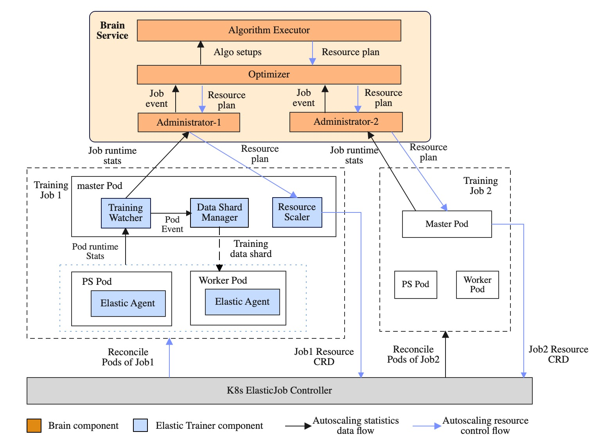
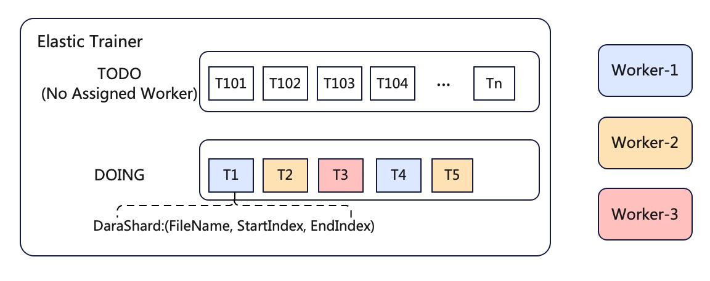

# DLRover Design

DLRover is an automatic distributed deep learning system.
DLRover can help users train their models with minimal efforts. For example,
with DLRover, users need not provide any resource configuration for their 
deep learning training jobs. Instead, DLRover can pick up the appropriate resource 
configuration for each job smartly and continue to optimize those jobs during their runtime.

Currently, DLRover has supported automatic resource configuration. 
However, the final goal of DLRover is to make the whole deep learning model
training automatic.

## Background

In parameter server training jobs, all model parameters
are distributed across parameter servers. Each worker takes partial training data
as input and compute gradients of parameters. After that, the worker node sends 
update gradients to the parameter server node which is keeping parameters. 

However, model developers (users) have to learn more rather than model training 
algorithms when they are using those jobs to train their models. To 
run a training job, those users have to specify the required resources for their 
this job. Then the Kubernetes cluster can allocate the required resources and 
start the job. Unfortunately, we found it is quite an ineffective way
to ask the usersto take care of the resource configuration.
At first, users are usually the 
experts on model design but not training jobs and Kubernetes cluster. It is 
not an easy task for them to have the optimal configuration in the first place.
Secondly, a training job's resources requirement may vary during its runtime.
A static resource configuration usually can not be the optimal one all the time.
We have observed jobs failure, poor performance and inefficient resources since
users fail to provide the optimal resource configuration for their jobs.

## Target

We hope to design and implement a system which can free users from resource
configuration completely and focus on the model training itself. Without any
input (on resource configuration), DLRover can still provide the optimal
resource plan for each training job, Meanwhile, DLRover can optimize the 
performance of training jobs further through resource adjustment when a job
is running.

There are 3 scenarios to satisfy different requirements from the simple
to the complex.

### Elasticity of a Single Job 
In the scenario, users can launch an elastic training job and manually scale
up/down Pods of the job.

### Auto-scaling of a single Job
In the scenario, users implement algorithms in the master
to auto-scale a training job using runtime statistics 
(e.g. resource usage of all Pods, training speed and so on)
of the job. Runtime statistics is stored in the memory of the master of
job. If the master fails, all statistics data will be missing. So, it does
not support the fault-tolerance of the master.

### Auto-scaling of Jobs in a Cluster
In the scenario, users can implement algorithms in a service to auto-scale
training jobs in a cluster. The service can persist all runtime statistics
of jobs in a database. The algorithm can utilize information of all
finished and running jobs to optimize the resources of new jobs. After
jobs finish, users can evaluate their algorithm by the data in database.
What's more, the master of a job does not need to store runtime
statistics in the memory in the scenario, so we only need to
launch a new master if the master fails.

## Design

DLRover consists of three main components: ElasticJob, Elastic Trainer,
and Brain service.

The upper figure shows how DLRover manages DL training jobs on a k8s cluster.
Users wrap up a training job as an ElasticJob CRD and submit it to the cluster.
After receiving the CRD, ElasticJob operator creates an Elastic Trainer for
the job by starting a master Pod. Then Elastic Trainer queries a initial resource
plan from the Brain service. After that, Elastic Trainer creates Scale CRDs
from the plan and apply the Scale CRD to notify ElasticJob controller to
launch required Pods and each Pod will start an Elastic Agent on it.
During training, the training master of Elastic Trainer dispatches data shards
to workers, keeps collecting runtime statistics
(e.g., CPU, memory usage, and training progress)
and reports them to EasyDL Brain to persist those data in database
periodically. Based on the job’s running status, 
EasyDL Brain picks up appropriate algorithms to
generate new resource plans and informs Elastic Trainer to
start resources adjustment.

### ElasticJob to Support Elastic Scheduling
ElasticJob is a customized k8s controller to support elastic scheduling
of Pods for DL training jobs. ElasticJob is responsible to launch/delete
Pods on a k8s cluster according to a Scale CRD.
We can apply a Scale CRD to scale up/down the number of
parameter servers or workers and relaunch new Pods with more resource
to replace Pods with insuffient resources. For example, we relaunch
a new Pod with more CPU cores to replace a Pod of parameter server
if CPU cores of the parameter server is bottleneck.

In automatic resource of DLRover,
the controller can create a training master for the training job
when a training job is submitted.
The master will generate a Scale CRD to notity the ElasticJob controller
to launch/delete paramter servers and workers.

### Elastic Trainer to Support Auto-scaling of a Single Job

For each training job, there is an Elastic Trainer to manage the job during 
the job's whole life cycle.  Elastic Trainer is to:

1. provide dynamic data sharding to support elasticity of a job.
2. collect runtime statistics of all nodes fo a job.
3. generate a Scale CRD to scale up/down nodes of a job.

Elastic Trainer mainly contains two components:

1. the training master which collects runtime statistics of all Pods,
generates a Scale CRD notify ElasticJob, and dispatches data shards
to workers.
2. the elastic agent which runs on each Pod of the job. The elastic
agent samples resource workload (e.g., CPU and memory usage)
of the Pod and reports the workload
data to the training master. The elastic agent of the worker also
queries data shards from the training master to build input data
pipeline of training frameworks.

#### Dynamic Data Sharding

The training master split the dataset into shards and the Elastic Agent
of the worker queries the shard to train a model. Note a shard does not
contain samples directly. Instead, a shard only includes indices of
those samples. All shards are placed into a TODO queue.
After a worker starts to run, the data input pipeline of a worker
will query one shard from Elastic Trainer and read samples by indices
in the shard. Meanwhile, Data Shard Manager marks this shard with the
id of the worker and moves the shard from the TODO to the DOING queue. 
After a worker consumes samples in the shard and updates parameters in PS,
it reports to the training master and queries a new shard.
Then Data Shard Manager deletes the finished shard from the DOING queue.

#### Elasticity of PS Training

1. Worker elasticity. In asynchronous SGD, each PS updates parameters with gradients
from a worker independently and does not synchronize with other workers.
Thus, Elastic Trainer can add or remove workers without influencing other workers. A
fter a new worker starts, it connects to all PS and queries shards from Data Shard Manager
and consume shards to compute gradients. If a worker is terminated,
Data Shard Manager moves uncompleted shards of this worker back to the TODO queue from the DOING queue.
Later the shard can be dispatched to another workers.

1. Parameter server elasticity. When to scale up/down parameter servers, the Elastic Agent of chief (the
first worker in TensorFlow) will checkpoint model parameters on
parameter servers.  After the ElasticJob adjusts the number
of parameter servers, the training master will notiy new hosts of
parameter servers to the Elastic Agent of all Pods. Then the Elastic
Agent will notify the training framework (e.g. TensorFlow) to restart
training and restore model paremeters from a checkpoint.

#### Fault Tolerance

Parameter servers and workers can fail at any time. Thus the trainer will checkpoint
the parameters periodically. When a parameter server failed, the trainer starts
another parameter server and resume the checkpointing. For worker failure, 
the trainer just starts a worker and let the work picks up a shard for computation.

### Brain Service to Support Auto-scaling Jobs in a Cluster

The Brain service of DLRover is to persist runtime statistics of jobs
from the training master into a database and provide the optimal
resource plans for each job
to the training master. Beside the training master,
it can optimize the job resource according to the information of all jobs.
The optimization algorithm
can more quickly provide more accurate resource configuration for the job
with consideration of fairness of jobs.
What's more, we can adopt more complicated algorithms like
reinforcement learning to optimize the job resource. The Brain service
includes three components.

#### Administor

When a training job is created, the corresponding administor is also created 
in the brain. This administor will administer the job during the job's whole
lifetime. When to initializ the job or observe a performance issue in the job,
the administor will create an optimize event for a new resource plan.

#### Optimize Processor

The optimize processor is to process the optimize events created by the administors.

Since DLRover waives the input from the users, optimize processor has to determine
the appropriate optimize algorithms for the training jobs. For example, we should
use different algorithms to process unbalance workload on PS and insufficient PS numbers.
Then we can have the optimal resource plans.

#### Algorithm Executor

After the optimize processor decides the algorithm for the job, the algorithm 
executor executes the algorithm and generate the resource plan.
