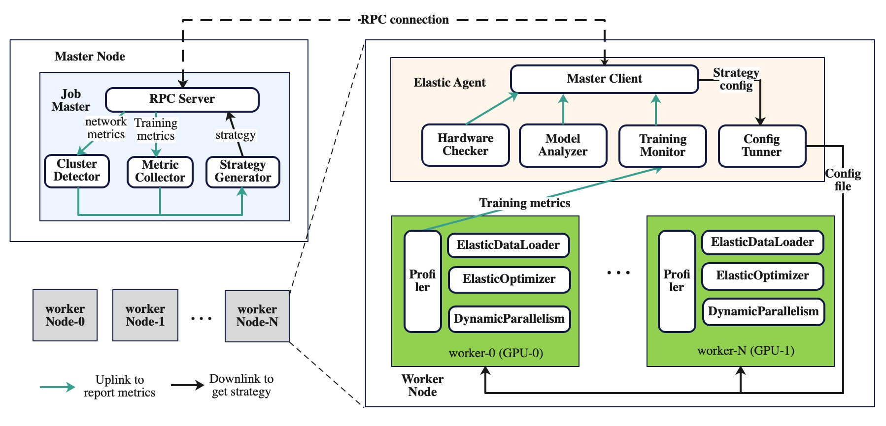

# Dynamic Optimization of Distributed Training

The design describes how to implement dynamic optimization of distributed
training in an ElasticJob of DLRover.

## BackGround

One pain point in model training is to configure training parameters and
strategy to to fully utilize the hardware to improve throughput. The
configuration contains:

1. perfarmance-relevant parameters such as micro-batch size and the strategy of
activation checkpoint.

1. the strategy to split model such as the split of pipelining stage and
the FDSP unit.

Now, the user need to mannually figure out those configuration before submitting
a training job and have to resort to trail-and-error to fing an appropriate
configuration. A trial-and-error approach is expensive and time-consuming and the outcome
is hardware-dependent and model-dependent. This means that a good configuration
of one model on one hardware might not be the best for one model on another
different hardware.

The DLRover dynamic performance optimizer is designed to discover the
optimal configuration and apply the configuration to the distributed
training without restarting a job.

## Target

The dynamic optimization will support the following features:

1. Automatically profiling distributed training and analyzer
to detect the bottleneck.

1. Automatically adjust performance-relevant configurations like the micro batch
size per GPU, the num_workers of dataloader without pausing
the training to checkpoint.

1. Automatically adjust the sharding strategy of [FSDP](https://arxiv.org/pdf/2304.11277.pdf)
to improve the training performance without restarting the job.

## System Design

To achieve those targets by dynamic optimization, DLRover
launches a master node to collect the training runtime metrics of all workers
and generate training strategy with those metrics.

<div align="center">

</div>

As showed in the above figure, a job of DLRover has a master node and
worker nodes. The worker node connects with the master node by GRPC to
report the training metrics and acquire the training strategy config from
the master node.

### Job Master

The job master can runs in a dependent node of a distributed job or
in the worker node of a local job. The job master gathers all metrics
from the worker node and generates the training strategy by those
metrics. There are 3 modules in the job master:

- Cluster detector checks the node healthy and communication performance
like latency, bandwidth and cluster topology.

- Metric Collector gathers all training metrics such as static model
characteristics, runtime workload and throughput.

- Strategy generator generates the distributed strategy configuration
by the collected metrics and send the configuration to the worker.

### ElasticAgent

The worker node runs the `ElasticAgent` in the main
process and `ElasticAgent` spawns sub-processes to run the training script
in the accelerator like GPU. `ElasticAgent` inherits the `LocalElasticAgent`
in PyTorch and adds the following modules:

- Hardware checker collects hardware characteristics which includes the CPU
cores, RAM, GPU and network bandwidth of the node.

- Model analyzer collects the number of floating point operations, memory
consumption, activation memory of the model.

- Training monitor collects the usage of CPU cores, RAM, GPU kernels and CUDA
memory.

- Config tuner generates a config file to notify the training process to
update configured parameters.

The format of config file is a json string like

```json
{
    "version": 1,
    "dataloader": {
        "batch_size": 4,
        "num_workers": 2,
        "pin_memory": false
    },
    "optimizer": {
        "learning_rate": 0.001
    }
}
```

### Dynamic Adjustment Extensions

To dynamically adjust the training configured strategy, the user need to use
the elastic training extension in the training program. The elastic extension
can adjust the configured parameters or paralllelism strategy when the config
file is updated. Now, we will implement the following extensions:

- Profiler automatically analyzes the timeline to detect the bottleneck of
performance.

- ElasticDataLoader dynamically adjusts the number of workers and micro
batch size without interrupting the training.

- ElasticOptimizer dynamically adjusts the learning rate to improve speed up
convergence.

- DynamicParallelism dynamically adjusts the sharding strategy of model to
improve the throughput.

## Related Work

In recent years, the community has introduced and investigated numerous
advanced methodologies to  autotune configurations on a single
node with multiple GPUs. [DeepSpeed autotuning](https://github.com/microsoft/DeepSpeed/tree/master/deepspeed/autotuning)
can automatically discover the optimal DeepSpeed configuration
that delivers good training speed. DeepSpeep autotuning can search
the optimal micro batch size and ZeRO optimization stage by performing
experiments with different configurations. Each experiment need to restart
the training process. The training does not start until the autotuning
generete the optimal configurations.
[Collossal-Auto](https://github.com/hpcaitech/ColossalAI/tree/main/colossalai/auto_parallel)
provides automation of intra-op parallelism and activation
checkpoint but it need to generate all valid parallelism startegies of
all operators in PyTorch.

In a distributed training job with mutilple nodes, it is more difficult
to automatically optimize the parallelism strategy and configuration
to improve the throughput as soon as possible.
