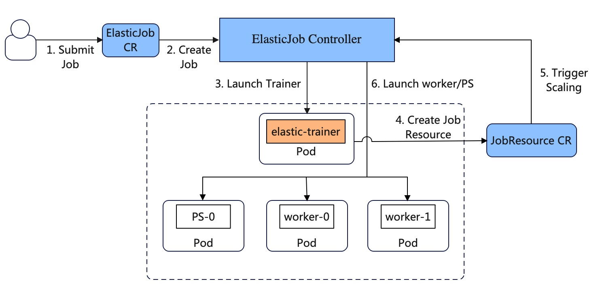

# Elastic Training Operator For DLRover

The design described how the elastic operator manages Pods of a DLRover
training job.

## Motivation

Computing Resources is important for training performance. DLRover can
automatically configure resources of a job and dynamically adjust
resources of a job during training to optimize training performance.
The operator should be capable of modifying resoures of a job according
to a resource plan, such as scale up/down the number of Pods.

## Design

The `elastic-operator` consists of 2 new CRDs, `ElasticJob` and `Scaler`.
Users use `ElasticJob` to submit an Elastic training job and use `Scaler`
to configure Pods of the job.

<div align="center">

</div>

### ElasticJob

Users submit an `ElasticJob` to specify the job detail including the trainer's,
parameter server's and worker's image, entrypoint command. Users do not need to
specify any resource information like CPU/memory and replicas of workers
in `ElasticJob`.  An example of `ElasticJob` is

```yaml
apiVersion: "elastic.iml.github.io/v1alpha1"
kind: "ElasticJob"
metadata:
  name: "elastic-deepctr-job"
spec:
  distributionStrategy: parameter_server
  replicaSpecs:
    ps:
        restartCount: 3
        template:
            metadata:
            annotations:
                sidecar.istio.io/inject: "false"
            spec:
            containers:
                - name: main
                image: easydl/tf-estimator:iris_dnn_v0
                command:
                    - python
                    - -m
                    - model_zoo.iris.dnn_estimator
                    - --batch_size=32
                    - --training_steps=1000
    worker:
        restartCount: 3
        template:
            metadata:
            annotations:
                sidecar.istio.io/inject: "false"
            spec:
            containers:
                - name: main
                image: easydl/tf-estimator:iris_dnn_v0
                command:
                    - python
                    - -m
                    - model_zoo.iris.dnn_estimator
                    - --batch_size=32
                    - --training_steps=1000
```

The `spec.distributionStrategy` specifies the distribution strategy of
a job. Now, `ElasticJob` supports `parameter_server` for [TensorFlow](https://www.tensorflow.org/tutorials/distribute/parameter_server_training)
`ParameterServerStrategy` and `ring-allreduce` for [Horovod](https://horovod.readthedocs.io/en/stable/)
and PyTorch [DistributedDataParallel](DistributedDataParallel).

Firstly, the `elastic-operator` only creates a trainer Pod
and create PS/worker Pods by `Scaler` generated by the trainer.

### Scaler

We can submit a `Scaler` to specify resources of parameter servers and
workers. The `elastic-operator` will receive creation/updation events of
the `Scaler` and create corresponding Pods according resources spec in
the `Scaler`. An example of `Scaler` is

```yaml
apiVersion: "elastic.easydl.org/v1alpha1"
kind: "Scaler"
metadata:
  name: "elastic-training-resource"
spec:
  selector:
    name: elastic-deepctr-job  // Job Name
  ps:
    replicas: 4
    resource:
      cpu: 4
      memory: 4096
      disk: 8192
      gpu: 1
  worker:
    replicas: 4
    resource:
      cpu: 4
      memory: 4096
      disk: 8192
      gpu: 1
  evaluator:
    replicas: 1
    resource:
      cpu: 4
      memory: 4096
      disk: 8192
      gpu: 1
  resource_updation:
    - name: "elastic-deepctr-job-ps-0"
      resource:
        cpu: 8
        memory: 8192
    - name: "elastic-deepctr-job-ps-1"
      resource:
        cpu: 16
        memory: 8192
```

After a job starts, we can submit a `Scaler` for the job.
`elastic-operator` will reconcile Pods of the job against this definition.
If the `spec.resource_updation` is not null, `elastic-operator` will
launch a new Pod with the `resource` in `resource_updation` to replace
the Pod with the `resource_updation.name`.

### DLRover Automatically and Dynamically Configures Resources

At the submission of a job, `elastic-operator` only launches a Pod for
`ElasticTrainer`. `ElasticTrainer` extracts features from the job and queries
the startup resources from DLRover `Brain`. Then, `ElasticTrainer` generate and
apply a `Scaler` with the startup resources. `elastic-operator` creates
Pods according to the `Scaler` after watching a creation event of
the `Scaler`. After workers and parameter servers starts, `ElasticTrainer`
will query new sources plans periodically from `Brain` and update the
`Scaler`. `elastic-operator` will adjust resources of workers and
parameter servers according the `Scaler` once it watches a
updation event.
