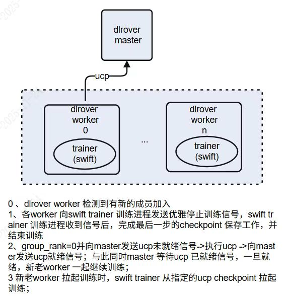

# 弹性训练设计

## 概述

本文档介绍 DLRover 与 DeepSpeed 结合的弹性训练设计方案，重点解决在弹性扩缩容场景下的 checkpoint 恢复、数据重划分和优化器状态恢复等问题。

## 设计思想

### 基本概念

- **job**：整个训练任务
- **node**：在本语境中，一台机器或者一个容器
- **worker**：根据 WorkerSpec 创建出来的一个 worker instance，生命周期由 ElasticAgent 管理，可以理解为一个训练进程
- **workergroup**：一组 worker 实例
- **ElasticAgent**：是 TorchElastic 控制面组件，一个独立的进程，用于管理当前节点内的 worker 生命周期、响应成员加入退出、监控 worker 健康状态等生命活动

## DeepSpeed Universal Checkpoint

### 并行技术

| 缩写   | 含义                 | 说明       |
| ------ | -------------------- | ---------- |
| **DP** | Data Parallelism     | 数据并行   |
| **TP** | Tensor Parallelism   | 张量并行   |
| **PP** | Pipeline Parallelism | 流水线并行 |
| **SP** | Sequence Parallelism | 序列并行   |

每种并行方式在保存模型时，都会生成分布式 checkpoint（检查点文件），例如每个 GPU 上保存自己那份权重切片或优化器状态。问题在于：这些分布式 checkpoint 文件的结构彼此不同，无法直接互相加载。

你在 8 张卡（TP=8）上训练好的 checkpoint，想在下一次实验中用 4 张卡（TP=4）继续训练。→ 传统做法要先"合并再拆分"，非常麻烦，不同的分片策略专门写一个脚本处理。

### Universal Checkpoint（以下简称 UCP）

```
┌────────────────────┐
│  Source Checkpoint │ (DP / TP / PP / SP)
└──────────┬─────────┘
           │
           ▼
   ┌──────────────────┐
   │  UCP Atomic Files │  ← 每个参数独立存储（通用格式）
   └──────────┬────────┘
              │
              ▼
┌────────────────────────┐
│  Target Checkpoint      │ (新配置：不同GPU数量或并行模式)
└────────────────────────┘
```


UCP 引入了一个中间层概念：

**Atomic checkpoint** = 每个参数 + 优化器状态的独立、精细化存储文件，也就是说：不再按 GPU 保存分布式碎片，而是直接保存"每个模型参数"的完整副本，同时记录优化器状态（比如 Adam 的 momentum, variance）。

## 核心问题

DLRover + DeepSpeed 弹性训练需要解决以下三个核心问题：

1. **实现适用于 DeepSpeed 的 ElasticAgent**
2. **扩缩容前后的数据如何重新划分**
3. **扩缩容前后优化器状态、模型参数如何恢复**

DLRover 与 Swift 的关系如下图所示：



## 解决方案

### 1. 实现适用于 DeepSpeed 的 ElasticAgent（DLRover 侧）

**ElasticAgent**：是 TorchElastic 控制面组件，一个独立的进程，用于管理当前节点内的 worker 生命周期、响应成员加入退出、监控 worker 健康状态等生命活动。每个训练节点上运行一个独立的 Agent 进程，负责启动和管理本地的 Worker 进程，它会分配每个进程的 WORLD_SIZE、RANK 等信息，并持续监控 Worker 的健康状态。当发现某个 Worker 失败或崩溃时，Elastic Agent 会终止当前所有 Worker，并根据新的节点成员情况重启所有进程；当有新节点加入时，也会触发 Agent 重新启动新的 Worker。

从前文介绍中，ElasticAgent 是一个控制面组件，它控制着整个训练过程中 worker 的生命周期、成员的加入和退出。我们需要实现的逻辑是在检测到有新的 worker 加入（退出）时，做好 checkpoint 的保存工作（扩缩容前的收尾），做好新一轮训练的断点续训工作（扩缩容后的训练恢复）。我们需要在 worker 端和 ElasticAgent 都加入这部分收尾逻辑。

#### 1.1 Worker 端逻辑

ElasticAgent.invoke_run() 方法中检测到成员变化 → 发送 universal checkpoint（后简称 ucp）未就绪信号给 master 节点（只有 group_rank=0 发送）→ 执行 ucp 流程 → 发送 ucp 已完成信号到 master 节点。

#### 1.2 Master 端逻辑

利用 ucp（universal checkpoint）是否完成标识来调控 worker 组队轮次，如果收到 worker ucp 就绪的信号，可以开启下一轮 Rendezvous。

### 2. 实现 Elastic Trainer（Swift 侧）

#### 2.1 实现 ElasticSampler

需要剔除已有处理的数据，根据新的成员数目重新分配数据。

- Swift 目前本身的数据加载器就具备这样的能力，只需要在重新恢复时，指定需要跳过的样本和新的 batch_size 即可。

#### 2.2 成员数变化后，batchsize 和 lr 的处理

通过调整 gradient accumulation 保证总 batchsize 不变，所以不用修改学习率。

#### 2.3 成员数变化后，trainer 优化器状态等如何恢复

在成员变化时 group_rank=0 的 worker 会使用 universal checkpoint（ds_to_universal.py）将 checkpoint 保存到指定路径下，重新拉起训练时增加 `--universal-checkpoint` 参数并从 universal checkpoint 保存的路径下加载 checkpoint 即可。

ms-wift 侧实现：https://github.com/modelscope/ms-swift/pull/6955
