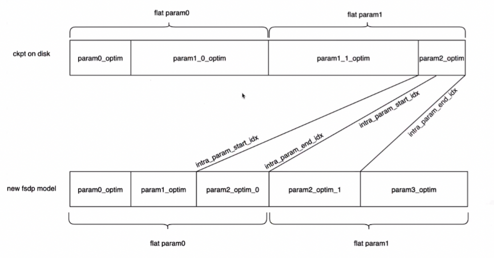

# DLRover 支持 FSDP 弹性训练设计文档

## 1. 背景

随着大规模机器学习模型的持续增长，分布式训练已经成为该领域的核心技术。DLRover 系统已展现出其在多个方面的优势，特别是在节点故障、资源动态分配和自动恢复等关键场景下。尽管 PyTorch 原生支持 Fully Sharded Data Parallelism (FSDP) 策略，但 DLRover 作为一个天然的弹性训练系统，当面临动态的资源扩缩容和容错场景时，简单的使用 PyTorch 的 FSDP 可能会导致 OOM 或者当 world size 变化时无法重新 load 之前保存的被分片了的 checkpoint 的问题，并且用户手工 save/load 中间状态在编写训练脚本时增加了负担。

**动机**

考虑DLRover系统级别上支持FSDP的主要动机如下：

1. **系统级别支持 FSDP 弹性训练：** PyTorch 提供了 FSDP 的支持，但在 DLRover 的弹性环境中，DLRover 的 Trainer 需要感知 FSDP 训练过程，进而帮助用户在一定 step 或 epoch 后自动保存 checkpoint，不需要用户手动保存；并在发生 FailOver 或者 Elastic 时自动加载上一checkpoint 进行模型参数和优化器状态的恢复，不需要用户自己加载。
2. **弹性训练时扩展 Pytorch FSDP 的 resharding 功能：** DLRover在弹性扩缩容和容错时，Pytorch 保存 checkpoint 的方式有两种，rank0_only 和 sharding。使用 rank0_only 策略保存 checkpoint 会容易导致 OOM，不符合弹性容错的需求；Pytorch 目前的 sharding 方式不支持 world size 改变后的重新 load，因此我们需要设计一种 resharding 方案来支持 world size 动态调整下的 load/save。

**主要挑战**

在 DLRover 中支持 FSDP 的过程中，我们主要解决以下技术难点：

1. **系统级别支持 FSDP 弹性训练的接口设计**：ElasticTrianer 需要设计间接易扩展的接口，让用户可以配置 FSDP 弹性训练任务时尽可能简单，并且支持传入自定义的保存 checkpoint 的策略和共享存储路径。存储路径的设计需要隔离不同任务并避免路径冲突。
2. **resharding 方式的 load/save**：由于 DLRover 的弹性容错特性，使用 rank0_only 策略保存 checkpoint 会容易导致 OOM，不符合弹性容错的需求。所以我们必须以 sharding 形式保存 checkpoint。但由于 Pytorch 目前没有支持 resharding 的 save/load，因此在 world size 发生变化时，需要基于将分片后保存的 checkpoint 进行 reshard 来恢复模型参数和优化器状态，这需要对 Pytorch _shard 和 fsdp 包进行功能上的扩展。

综上所述，为DLRover系统引入对FSDP的深度支持不仅是技术上的延展，更是为了确保在复杂、动态的弹性训练环境中，大模型的训练可以稳定、高效地进行。

## 2. 概要设计

将主要对 DLRover 系统中的 ElasticTrainer 模块、Master 模块进行修改。ElasticTrainer 是管理模型训练的 manager，因此将主要修改这个模块使其能够支持在fsdp训练策略下，每过一段step或者epoch后保存模型分片，然后在pod数量发生变化时reaload 模型和优化器状态的分片。

### **2.1 ElasticTrainer 增加的属性**

- **use_fsdp：** 是否采用 FSDP 训练策略
- **shared_storage_path：** 指定 worker pod 之间共享存储的路径，fsdp 的相关数据是其中的一部分
- **checkpoint_interval：** CheckpointInterval 的实例用来表达存储 checkpoint 的策略。保存策略由用户指定，可以按照多少个epoch来保存，也可以按照多少个step来保存

```python
class CheckpointInterval:
    def __init__(self, steps=None, epochs=None):
        if steps and epochs:
            raise ValueError("Only one of 'steps' or 'epochs' should be set.")
        self.steps = steps
        self.epochs = epochs

    def should_save(self, current_step=None, current_epoch=None):
        if self.steps and current_step and current_step % self.steps == 0:
            return True
        if self.epochs and current_epoch and current_epoch % self.epochs == 0:
            return True
        return False
```

### **2.2 ElasticTrainer 新增和修改的 public 函数**

- **增加** **epoch 函数**：这是一个 contextmanager 装饰器，在 epoch 开始前后做一些操作。比如 reset 和在 fsdp 策略下保存模型和优化器状态参数分片。
- **修改** **step 函数**：这是一个 contextmanager 装饰器，在 step 结束后检测是否需要保存模型和优化器状态参数分片。
- **prepare 函数的修改**：初始化时需要检查是否需要先load模型和优化器状态参数分片，如果分片和当前 worker 数不一致需要reshard load。

### **2.3 ElasticTrainer 对 save/load 时 reshard 的支持**

考虑到弹性训练的动态性，目前 PyTorch 在分片参数上的 reshard 支持有限，因此需要支持在 save 时保存分片的 meta 信息，在 load 时进行 reshard 操作等。在ElasticTrainer中增加：_save_fsdp_state 和 _load_fsdp_state 函数来实现

## 3. ElasticTrainer 详细设计

### 3.1 增加 shared_storage_path 、use_fsdp 和 **checkpoint_interval** 属性

我们将在 ElasticTrainer 中只增加 shared_storage_path 和 use_fsdp 属性

1. use_fsdp: bool ，use_fsdp 从构造函数中获取，默认值是 False。当为True 时 ElasticTrainer 将检测 shared_storage_path 是否存在，并且在符合 `checkpoint_interval` 的时候将模型参数和优化器状态 checkpoint，保存到shared_storage_path。
2. shared_storage_path：str，从构造函数中获取，默认值是None。用来暂存这次训练用于实现弹性训练而存放checkpoint的path（这个共享路径还可以存储其他数据）。
  
    ```bash
    shared_storage_path/
    │
    └── fsdp_checkpoint/
        │
        ├── <job1_name>_<timestamp>/
        │   ├── epoch_1/
        │   ├── epoch_2/
        │   ├── ...
        │   └── step_100/
        │
        ├── <job2_name>_<timestamp>/
        │   ├── epoch_1/
        │   ├── epoch_2/
        │   ├── ...
        │   └── step_150/
        │
        └── <job3_name>_<timestamp>/
            ├── epoch_1/
            ├── epoch_2/
            ├── ...
            └── step_200/
    ```

3. checkpoint_interval

``` python
class ElasticTrainer:
    def __init__(self, checkpoint_interval: CheckpointInterval, ...):  # 其他参数
        ...
        self.checkpoint_interval = checkpoint_interval

class CheckpointInterval:
    def __init__(self, steps=None, epochs=None):
        if steps and epochs:
            raise ValueError("Only one of 'steps' or 'epochs' should be set.")
        self.steps = steps
        self.epochs = epochs

    def should_save(self, current_step=None, current_epoch=None):
        if self.steps and current_step and current_step % self.steps == 0:
            return True
        if self.epochs and current_epoch and current_epoch % self.epochs == 0:
            return True
        return False
```


### 3.2 增加 epoch 函数

 目前的 Elastic Trainer 的使用流程如下：

```python
from dlrover.trainer.torch.elastic import ElasticTrainer

model, optimizer, scheduler = ...

elastic_trainer = ElasticTrainer(model)
optimizer, scheduler = elastic_trainer.prepare(optimizer, scheduler)
for epoch in range(start_epoch, epochs):
    elastic_trainer.reset()
        for _, (data, target) in enumerate(train_loader):
            ...
            with elastic_trainer.step():
                ...
```

修改后 Elastic Trainer 的使用流程：

```python
from dlrover.trainer.torch.elastic import ElasticTrainer

model, optimizer, scheduler = ...

elastic_trainer = ElasticTrainer(model)
optimizer, scheduler = elastic_trainer.prepare(optimizer, scheduler)
for epoch in range(start_epoch, epochs):
    with elastic_trainer.epoch():
        for _, (data, target) in enumerate(train_loader):
            ...
            with elastic_trainer.step():
                ...
```

我们将用 @contextmanager 装饰 epoch 函数，ElasticTrainer.epoch 负责在每轮epoch开始的时候完成以下操作：

1. 调用 reset 函数，置零 trainer 的 gradient_state.num_steps

在结束时完成以下操作：

1. 在 checkpoint_interval 满足 should save 条件时，将模型参数和优化器状态 checkpoint，保存到shared_storage_path

```python
class ElasticTrainer(object):
    @contextmanager
    def epoch(self, epoch: int):
        self._before_epoch()
        yield 
        self._after_epoch(epoch: int)

    def _after_epoch(self, epoch: int):
        # save checkpoint to self.shared_storage_path
        if self.checkpoint_interval.should_save(current_epoch=epoch):
            ....
```

### 3.3  修改 step 函数

在 checkpoint_interval 满足 should save 条件时，将模型参数和优化器状态 checkpoint，保存到shared_storage_path

修改前：

```python
class ElasticTrainer(object):
    @contextmanager
    def step(self, fix_total_batch_size=True):
        self._before_step(fix_total_batch_size)
        context = contextlib.nullcontext
        if not self.gradient_state.sync_gradients:
            context = getattr(self.model, "no_sync", context)

        with context():
            yield
            self._after_step()
		def _after_step(self):
        if self.gradient_state.sync_gradients:
            self.gradient_state.num_steps += 1
```

修改后：

```python
class ElasticTrainer(object):
    @contextmanager
    def step(self, fix_total_batch_size=True):
        self._before_step(fix_total_batch_size)
        context = contextlib.nullcontext
        if not self.gradient_state.sync_gradients:
            context = getattr(self.model, "no_sync", context)

        with context():
            yield
            self._after_step()
    def _after_step(self):
        # save checkpoint to self.shared_storage_path
        if self.checkpoint_interval.should_ save(current_step=self.num_steps):
            ....
        if self.gradient_state.sync_gradients:
            self.gradient_state.num_steps += 1
```

### 3.4 修改 prepare 函数

```python
class ElasticTrainer(object):
    def prepare(self, optimizer, lr_scheduler=None):
	      """
	      Prepare optimizer and learning rate scheduler in elastic training.
	      """
        # If the trainer is configured to load from a checkpoint,
        # load both the model state and the optimizer state.
        if self.load_from_checkpoint:
            self._load_model()
            self._load_optim()
        #########################################################
	      self._set_gradient_accumulation_steps()
	      optimizer = _ElasticOptimizer(optimizer)
	      if lr_scheduler:
	          lr_scheduler = _ElasticLRScheduler(lr_scheduler)
	          return optimizer, lr_scheduler
	      else:
	          return optimizer
```

### 3.5 支持 reshard 的 save/load

**背景：**

弹性容错需要依赖 checkpoint 来恢复模型状态。当前大模型训练采用 FSDP 的并行方式，FSDP 保存 checkpoint 的方案有两种：

1. rank0_only：由 rank-0 节点获取所有的模型参数和优化器状态存入磁盘;
2. sharding 方式：所有 rank 各自保存其模型参数和优化器状态。

但是这两个方案都没法满足弹性容错训练的需求。

rank0_only：

1. rank-0 需要加载所有的模型参数和优化器状态，可能导致 OOM。
2. rank-0 需要通过 Allgather 获取所有模型参数和优化器状态并依次写入磁盘，耗时过长。

sharding 方式：

1. 保存 checkpoint 的 rank 数量必须和加载 checkpoint 的 rank 数量必须一致。而弹性容错作业中并不能保证 rank 数量不变。

**目标：**

对于 sharding 方式进行改进，使其支持 rank 数量改变时的 resharding

**设计：**

保存每个参数的起始位置（start，end）将这些信息作为 checkpoint 的 meta 信息进行保存到单独文件中。然后在 load 时依据这些参数进行 reshard。



<aside>
由于模型在 save 和 load 时需要对非 flatten 数据操作（Tensor），所以对模型参数我们需要保存的是三元组（original_shape，start，end）
</aside>

保存的文件树样例如下：

```bash
ckpt
├── optim_meta
├── optim_param.00000-00002
└── optim_param.00001-00002
```

我们将使用 **LOCAL_STATE_DICT** 来保存checkpoint

```python
from torch.distributed.fsdp import FullyShardedDataParallel as FSDP
from torch.distributed.fsdp import StateDictType
from torch.distributed.fsdp import FullStateDictConfig
from torch.distributed.fsdp import FullOptimStateDictConfig

class ElasticTrainer(object):
    def _save_fsdp_state(self):
    # save checkpoint to self.shared_storage_path
    folder_name = ...
    save_dir = os.path.join(self.shared_storage_path, folder_name)
    writer = FileSystemWriter(save_dir)
    with FSDP.state_dict_type(model, StateDictType.LOCAL_STATE_DICT):
        state_dict = model.state_dict()
        fsdp_osd = FSDP.sharded_optim_state_dict(self.model, self.optim)
        flattened_osd = FSDP.flatten_sharded_optim_state_dict(
            fsdp_osd, self.model, self.optim
        )
    # save a checkpoint ...

```

**后续的两个改进：**

1. 异步写入，在保存checkpoint这个操作的时候单开一个线程去写入，不阻塞训练过程
2. meta信息在nodegroup没有变更的时候不重复写入，因为分片没有改变时候meta信息也没有改变


## 3. 部署PV

为了让 Worker Pods 共享存储，选择的存储解决方案必须支持 **`ReadWriteMany`** 访问模式。这是因为 **`ReadWriteMany`** 访问模式允许多个节点上的 pods 同时访问同一个存储卷。

一些常见的支持 **`ReadWriteMany`** 的存储解决方案：

1. **NFS (Network File System)**: NFS 是一个常用的支持多读写的文件系统。你可以设置一个 NFS 服务器，并使用 NFS-provisioner 在 Kubernetes 中动态提供 PersistentVolumes。
2. **CephFS**: Ceph 是一个高度可扩展的分布式文件系统，其上层的 CephFS 支持多读写模式。
3. **GlusterFS**: Gluster 是一个自由开源的可扩展的网络文件系统，可以提供大量的存储池，并支持多节点并发访问。

要在多节点 Kubernetes 集群中实现 master 和 worker pods 共享存储的功能，需要：

1. 存储后端（例如 NFS、CephFS、GlusterFS 等）已经在集群中部署并运行正常。
2. 创建 **`PersistentVolume`** 和 **`PersistentVolumeClaim`** 以使用该存储。确保在 PVC 的定义中指定 **`ReadWriteMany`** 访问模式。
3. 在 master 和 worker pods 的定义中使用这个 PVC

<aside>
在多数情况下，不需要手动创建PV。很多 Kubernetes 集群配置了自动化的存储供应，例如AWS EBS、Google Cloud Persistent Disk 或 Azure Disk Storage，这些存储解决方案会在PVC创建时自动供应一个新的 PV。
但是，如果 Kubernetes 环境没有自动存储供应或你需要特定的存储配置，那么需要手动创建 PV。在这种情况下，你可以在 PV 中指定特定的参数和配置，然后再创建 PVC 来使用这个 PV。
</aside>
