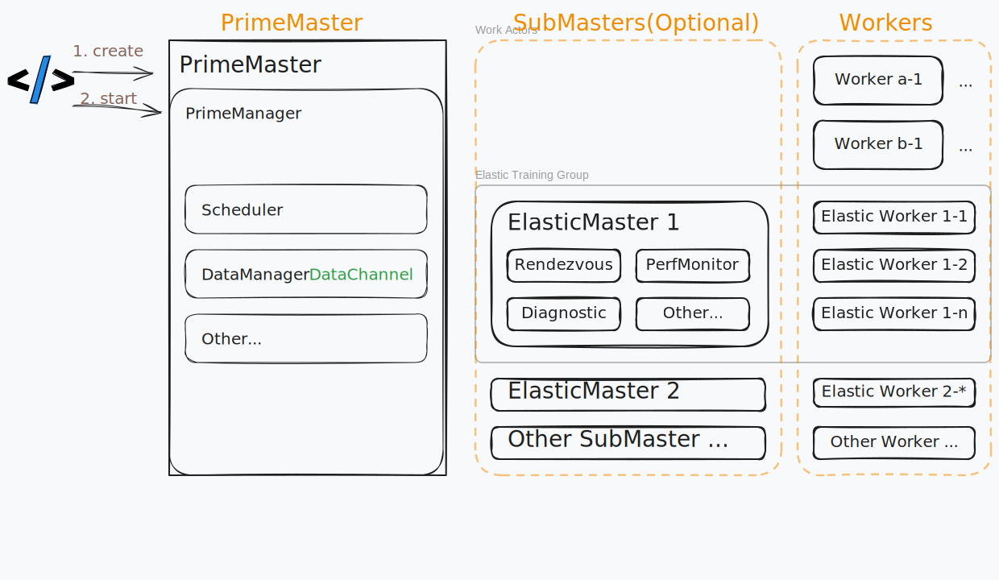

## Background

As machine learning workloads become increasingly complex, there is a growing need to support hybrid training paradigms that combine elastic training with other processing strategies. Traditional elastic training frameworks are optimized for scaling model training dynamically, but often lack the flexibility to integrate with heterogeneous tasks such as data preprocessing, reinforcement learning environments, or custom compute-intensive operations.

Hybrid training addresses these challenges by enabling the orchestration of diverse workloads within a unified framework. This approach allows for seamless coordination between elastic model training and auxiliary tasks, such as large-scale data transformation, environment simulation, or multi-stage pipelines. By managing the lifecycle and resource allocation for both elastic and non-elastic components, hybrid training frameworks can maximize resource utilization, improve throughput, and simplify the development of complex machine learning systems.

Typical scenarios include:

- **Reinforcement Learning (RL) Environments:** Multiple training tasks may need to run in parallel, with environment simulation requiring significant CPU resources and coordination with model training.
- **Data Fusion and Preprocessing:** Integrating data processing with model training, where various preprocessing or transformation tasks must be performed alongside or prior to training, often involving different computation patterns and resource requirements.

By supporting these hybrid scenarios, the framework enables users to build more flexible, efficient, and scalable machine learning pipelines that can adapt to a wide range of real-world requirements.

This document outlines the design and architecture of a hybrid training framework that integrates elastic training with other processing paradigms, providing a comprehensive solution for complex machine learning workloads.

> This is also an architecture design for [Unified MPMD Control](./unified-mpmd-control-proposal.md)

## Core Design

### Architecture Overview



The hybrid training framework integrates both elastic and non-elastic training paradigms to support diverse workloads. In this architecture, the `PrimeMaster` is responsible for orchestrating the entire hybrid training process, while the `ElasticMaster` and `ElasticWorker` components focus on elastic training tasks.
> The `ElasticMaster` and `ElasticWorker` represent the original elastic training architecture, while the `PrimeMaster` is the newly introduced component.

The architecture is designed to be modular and extensible, allowing for the integration of various training strategies and workloads. The key components include:

**PrimeMaster:**

- Oversees the lifecycle management of hybrid training jobs.
- Schedules and monitors various training/processing workloads.
- Maintains a registry of all nodes and their assigned roles.
- Stores and manages the global state of the training process.

**ElasticMaster (one example of SubMasters):**

- Manages one elastic training process with lots of `ElasticWorker` instances.
- Performs node health checks for the elastic training.
- Provides rendezvous services for worker coordination.
- Monitors training progress and collects relevant metrics.

**ElasticWorker (specialized Worker for elastic training):**

- The worker nodes that execute elastic training workloads.
- Created by the `PrimeMaster` and managed by the `ElasticMaster`.

**Worker:**

- Represents general processing nodes. Could execute various workloads, such as data preprocessing, training trainer, or custom compute operations.

### Sequence Diagram

```mermaid
sequenceDiagram
    autonumber
    participant Driver
    box Prime Master
        participant HybridMaster
        participant HybridManager
        participant Scheduler
    end

    Driver ->> HybridMaster : create(config)
    HybridMaster ->> HybridManager : create(config)
    Driver ->> HybridMaster : start()
    HybridMaster ->> HybridManager : prepare()
    activate HybridManager
    HybridManager ->> HybridManager : Placement.allocate()
    HybridManager ->> Scheduler : create_nodes()
    create participant Workers # Rename
    Scheduler ->> Workers : create()
    Scheduler ->> Workers : status() [Ping]
    Workers -->> HybridMaster : get_nodes_by_role()
    HybridManager ->> HybridManager : Nodes Check
    HybridManager ->> Workers : self_check()
    HybridManager ->> Workers : check_child() [SubMaster]
    HybridMaster ->> HybridManager : start()
    HybridManager ->> Workers : start() [Trainer/SubMaster]
    HybridMaster -->> Driver : 
    note right of Driver : Running

    loop RUNNING
        HybridManager ->> HybridManager : monitor()
        HybridManager ->> Workers : status()
    end

    deactivate HybridManager
    HybridManager ->> HybridManager : stop()
    HybridManager ->> Workers : stop()
```

### Entension Points

The hybrid training framework is designed to be extensible, allowing users to customize and extend its functionality to suit various workloads. The key extension points include:

- **Worker Customization:** Users can implement custom `WorkerLoad` classes to handle specific workloads, such as data preprocessing or reinforcement learning tasks. This allows for flexible integration of different processing strategies within the hybrid training framework.
- **Custom SubMaster:** Custom `SubMaster` implementations can be created to manage specific training processes, enabling tailored orchestration of elastic workloads.

The `Worker/SubMaster` is driven by `HybridManager` through lifecycle hooks, allowing it to manage the lifecycle of each workload. This design enables users to easily extend the framework to support new processing paradigms without modifying the core architecture.

Common Hooks include:

- `__init__`: Initialize the node with configuration.
- `status`: Get the running status of the node.
- `self_check`: Perform self-checks to ensure the node is healthy.
- `check_child`: Check the status of child nodes (for SubMaster).
- `start`: Start the node's processing. (e.g., start training loop or monitoring)

### 稳定性

#### Pre check

#### Fault Tolerance

The hybrid training framework incorporates fault tolerance mechanisms to ensure robustness and reliability during training. Key features include:

- **Node Health Checks:** Regular health checks are performed on all nodes to detect failures early. If a node becomes unresponsive, the framework can reallocate tasks to healthy nodes.
- **Dynamic Node Management:** The framework can dynamically add or remove nodes based on workload requirements. If a node fails, the `HybridManager` can reassign its tasks to other available nodes, ensuring continuous operation.
- **Transactional State Management:** The global state of the training process is managed in a transactional manner by `HybridManager`, allowing for recovery from failures without losing progress. `HybridMaster` could failover to another `HybridMaster` if needed. `Node` is designed to be stateless, could recover by reloading its state from `HybridManager`.

## Usage Patterns

### Elastic Training (SubMaster Driven)

Elastic training is a core feature of the DLRover framework, enabling dynamic scaling of training resources based on workload demands. Within the hybrid training architecture, elastic training is seamlessly integrated and managed by the `HybridMaster`, which oversees the orchestration and lifecycle management of all elastic workloads.

The `HybridMaster` coordinates the creation, preparation, and execution of elastic training jobs, delegating the management of elastic-specific processes to the `ElasticMaster` (also referred to as `SubMaster`). The `ElasticMaster` is responsible for:

- Performing regular node health checks to ensure the reliability of the training cluster.
- Providing rendezvous services to facilitate coordination and communication among elastic workers.
- Monitoring training progress and collecting relevant metrics for adaptive scaling and fault tolerance.

The sequence diagram below illustrates the flow of elastic training within the hybrid framework:
> Communication between the `ElasticMaster` and `ElasticWorker` remains consistent with previous designs. This document focuses primarily on the hybrid architecture and simplifies the communication details.


### Distributed Data Processing (Workers Self-Loop)

In distributed data processing scenarios, each `Worker` node operates in a self-driven loop. Upon starting, the worker continuously pulls data from a `DataChannel`, processes the data using a user-defined `process` method, and writes the results to another `DataChannel`. This loop persists until a stop signal is received, enabling efficient and scalable parallel data processing across multiple workers.

Source -> Tokenizer[Self-Loop] -> DataChannel -> Sampler[Self-Loop] -> DataChannel -> Trainer[Self-Loop] -> Model Output


### Reinforcement Learning (Trainer Driven)

In reinforcement learning (RL) scenarios, the hybrid framework supports multiple specialized roles such as `Actor`, `Critic`, and `Rollout`. The `Actor` and `Critic` are typically managed as elastic training tasks, while `Rollout` nodes handle inference or environment simulation. The overall training process is orchestrated by a dedicated `Trainer` or by the `Actor` itself, which coordinates the interactions among all roles. This design enables flexible scaling and efficient resource allocation for complex RL workflows, supporting scenarios like distributed policy optimization, multi-agent training, and large-scale environment simulation.


