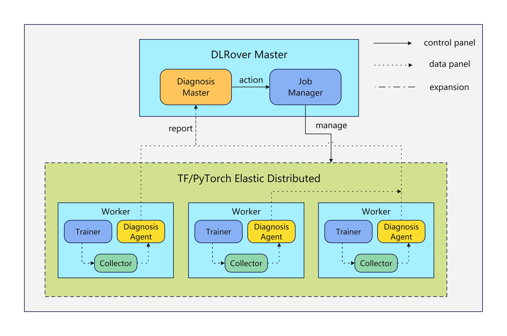

# Proactive Diagnosis to Enhance Training Fault Tolerance

## Background

If you have already used DLRover or read any related introductions, you would 
know that one important role of DLRover is to enhance the availability of 
training tasks, meaning it can automatically handle faults and resume training 
when encountering occasional exceptions. In the initial design, fault tolerance 
during training was performed passively, meaning that only when a runtime 
process or container failed and exited would the DLRover Master be notified and 
attempt the corresponding fault-tolerant actions. However, as production scale 
gradually increased, it became apparent that relying solely on passive fault 
tolerance could not cover all exception scenarios. Therefore, the first 
positive fault tolerance mechanism: 'the heartbeat mechanism' was implemented. 
But considering that in distributed training, the training agent side also 
employs a multi-process implementation, the aforementioned single heartbeat 
mechanism cannot cover various exception scenarios that occur during actual 
training operations (it can only cover some common cases).

Therefore, a comprehensive, scalable framework is needed to gradually improve 
the diagnosis and handling of corresponding exception scenarios.

## Target

- Be capable of proactive probing.
- Requires flexible and scalable implementation.
- Be able to reuse the current fault tolerance mechanisms.

## Design

The proactive diagnostic framework is mainly composed of the following roles:
- [Diagnosis Master](#Diagnosis-Master)
- [Diagnosis Agent](#Diagnosis-Agent)

These components are distributed across the Master and Worker Nodes, 
working together to achieve the main functionality of proactive diagnostics.



Below is a more detailed introduction to the relevant concepts.

### Diagnosis Master
The diagnosis-master is implemented and runs in the Master node, with the main 
responsibilities of driving pre-execution checks and runtime diagnostic logic(
across all the workers).

Runtime diagnostics primarily rely on an asynchronous scheduled thread and a 
list of potential issues along with corresponding solutions(currently hardcoded). 
During the training progress, this system continuously performs diagnostics and 
determines the necessary actions to be executed. The specific diagnostic process 
is shown in the following diagram, which is implemented through a simple inference chain. 
The final actions can be either an event output or a specific fault-tolerance operation.


Then it will interact with other core roles of the master, such as the 
job-manager, to assist in the lifecycle management of training.

### Diagnosis Agent
The diagnosis-agent is implemented and runs on the worker node, with the main 
responsibilities of driving data collection on the training worker side, 
executing some basic diagnostic logic, and reporting necessary information to 
Master.


### Other Concepts
#### Metric Collection

- Common Metric

  
    Common metrics mainly refer to metric information collected directly using 
    common tools such as psutil or nvml.

- XPU_TIMER Metric
    

    XPU timer metrics refer to the metrics output by the XPU-Timer. 
    The collection of this metric is indirectly achieved by using an HTTP 
    client to access the data exported by the XPU-Timer to Prometheus.


## Implementation
Next, we will primarily introduce some of the existing implementations based on 
this diagnostic framework. 

This part of the work will have a long cycle and work in progress for now.
Current implemented:
- Heartbeat timeout. 

    To figure out whether the core thread of training worker is alive.

- Training hang. 

    [Details](#training-hang-detectionbasic) for basic ability.
    [Details](#training-hang-fault-toleranceadvanced) for advanced ability.

### Training Hang Detection(Basic)

```
prerequisite: XPU-Timer is deployed and in used.
```

Currently, the basic capability is to determine whether a Hang situation exists. 
This implementation mainly relies on the metrics reported by the XPU-Timer, 
making decisions based on the global Worker metrics over a certain period to 
determine whether the current training has stalled.


### Training Hang Fault Tolerance(Advanced)

```
prerequisite: XPU-Timer is deployed and in used.
```

This is an advanced capability. Besides determining whether a Hang situation 
exists, it also precisely identifies which worker and which device is causing 
it, and executes fault-tolerant operations accordingly.

WIP
