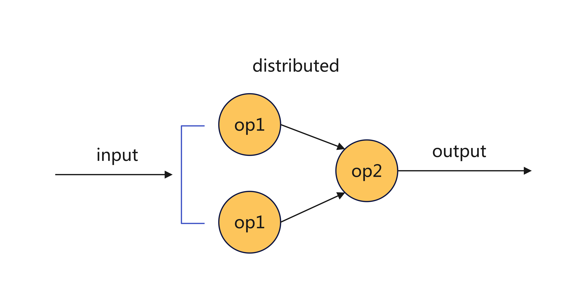

# Reinforcement Learning in DLRover(Experimental)

## Background

Refer to the [overview](./dlrover-overview.md), DLRover has already been 
introduced, with its definition being: "An Automatic Distributed Deep Learning 
System." In our previous discussions and practices, we primarily focused on the 
PRE_TRAIN and SFT scenarios (single SPMD). Among the three major scenarios of 
deep learning (supervised learning, unsupervised learning, and reinforcement 
learning), to date, reinforcement learning remains unsupported. Therefore, 
this article primarily aims to provide solutions based on DLRover for 
large-scale reinforcement learning scenarios, thereby further extending 
coverage of deep learning scenarios. 

Notice: 'reinforcement learning' will be abbreviated as 'RL' in the following 
text.  

## The Difference

In a single sentence: it has evolved from a single computation group to a 
multi-role computation graph.

The upper part of the diagram mainly illustrates the implementation of DLRover 
in the current supervised/unsupervised learning scenarios: DLRover primarily 
takes on the management tasks of the control plane, managing a group of SPMD 
(training workers). DLRover does not handle any management of the data 
interaction between training processes.

The lower part of the diagram focuses on the design approach of DLRover for 
reinforcement learning scenarios (taking the relatively complex PPO setup as 
an example):  
- Evolved from managing a single SPMD group to managing multiple groups.  
- The control plane is further refined into a Master and Trainer Controller.  
- Data plane interactions between different SPMD groups are also incorporated 
into management by the Trainer Controller.    


## Design

### Architecture
The diagram below represents the overall architecture of DLRover's solution in 
RL scenarios, where DLRover is positioned at the center.  


Based on the diagram above, there are several core design points to explain:

1. **DLRover's Role**: DLRover itself is not an algorithm framework (as 
mentioned earlier). Therefore, its role in the entire RL architecture remains 
primarily focused on the control plane management. Thus, it can be seen as 
further refining and improving the hybrid control mode(single controller + 
multi-controller). 
   - API and Driver: resolve input parameter and drive the rl job
   - Master: the main daemon process as an ray actor
     - JobManager: job lifecycle management   
       - scheduler: actor and placement group management
       - executor: to invoke with 'trainer' 
     - DiagnosisManager: runtime job diagnosis for stability
     - FailoverCoordinator: handle failure and do failover
     - JobContext: the job runtime context
   - Trainer and Workload's basic abstraction

2. **Pluggable RL Workload**: To support various algorithms and models while 
meeting the controllable requirements of the control plane, DLRover provides 
an independent abstract definition for RL implementation. Further details can 
be found [below](#pluggable-rl-workload).

3. **Ray as the Distributed Backend**:  
   - Since RL scenarios involve multiple roles (e.g., Actor/Rw/Ref/Critic), 
   asynchronous computation control between roles is key to improving performance.  
   - For different production scenarios and resource specifications, affinity 
   or anti-affinity scheduling for different types of roles is crucial for RL 
   workflow orchestration. Ray easily enables these implementations through 
   APIs such as placement groups.  
   - By leveraging Ray's built-in actor fault tolerance combined with DLRover's
   current practices in stability management, the overall process reliability 
   can be enhanced in a more cost-effective and flexible manner.    


### Pluggable RL Workload
Currently, due to the hybrid control model(single controller + multi-controller), 
the algorithm implementation and engineering implementation for different RL 
scenarios are strongly coupled. Specifically, for each RL algorithm, denoted 
as N, and each model framework, denoted as M, there are at least N * M Workload 
implementations. This implementation typically has the following 
characteristics: low generalizability, high coupling, rapid iteration cycles, 
and high implementation and debugging costs.


<div align="center">
    
</div>

To address the need for reusability and extensibility across both internal and 
external implementations while reducing refactoring costs, the MultiController 
component (i.e., the Trainer and Worker) is abstracted and separated. Users can 
implement any algorithm or framework based on a combination of `BaseTrainer` 
and `BaseWorkload`, thereby enabling seamless integration into the workflow.


### Computational Graph
Before diving into the computational graph of Reinforcement Learning (RL), 
let’s first revisit the development of distributed computing. In the earliest 
stage, computation was single-node, where a single machine could handle all 
calculations and implementations. This is illustrated as follows: 
 
<div align="center">
    
</div>

With the growth of data scale, single-machine computation could no longer meet 
the demands, which led to the birth of distributed computing. However, since 
the data is split while the result format still needs to remain consistent 
with the original form, implementing distributed computing is not as simple as 
directly splitting single-node computations across multiple nodes. It instead 
involves splitting the data, performing computation, and merging the results 
(referencing the concept of Map-Reduce). This resulted in the basic 
computational structure as shown below:

<div align="center">
    
</div>

Building upon this foundation, we have seen many widely
recognized computation engines, from early Hadoop to later Spark and Flink 
(data + stream parallelism). With the arrival of the AI era, distributed 
computing has undergone further evolution, expanding the dimensions of 
parallel computation even further, although we won’t delve into those details 
here. 

Let's return to the topic of RL. In order to better manage the internal 
computational process of RL, we use a DCG (Directed Cyclic Graph) to represent 
the entire computational graph. Vertices represent various instances of RL 
roles, while edges represent the interaction relationships between these 
instances. 

The computational graph here has several key differences compared to the 
distributed computing described earlier:  
1) It is a cyclic self-contained graph.  
2) Each node is no longer the implementation of a single operator but a 
   collection of multiple operators.  
3) The collaboration between operators is not necessarily fully 
   upstream-downstream synchronous but rather asynchronous.    

<div align="center">
    
</div>

Through the relationship between vertices and edges, DLRover, as the 
control-plane manager, can gain a clearer understanding of the interaction 
logic between all working roles, allowing for greater potential to improve 
overall stability and performance effectively. 
For example, if an anomaly occurs, the relationship topology allows us to 
identify the affected upstream and downstream components immediately, enabling 
more effective fault-tolerant operations.  

<div align="center">
    
</div>

However, because the current computation in RL is strongly coupled with the 
algorithm and model architecture, we are still studying on how to provide an 
abstract, fully generalized representation of the computational graph 
independent of the algorithm and framework. 

> The current implementation of computation does not fully rely on the 
> computational graph and is still achieved through manually written trainer 
> logic. Please refer to the relevant code for details.

As a result, many higher-level optimizations in 
performance or stability are still tied to the specific implementation of the 
algorithm to some extent. Therefore, on the algorithm framework side, in order 
to meet the demands of large-scale production, it is necessary not only to 
implement the basic RL workflow but also to leverage the aforementioned 
capabilities exposed by **DLRover** for further development, enhancing its 
performance and stability. 


### SubDag Based Scheduling(Concept)
For general RL scenarios, the scheduling of all workloads is conducted as a 
whole, meaning that both training and inference are scheduled uniformly based 
on roles. However, to accommodate larger scales and different types of models, 
there are undoubtedly optimization strategies based on model parallelism. 
Therefore, in terms of scheduling, **DLRover** will represent the actual 
computational graph's topology in finer granularity, namely at the 
sub-dag(Directed Cyclic Graph)level. By utilizing the optimized sub-dag and 
considering the current cluster resources, **DLRover** implements more 
fine-grained scheduling, as illustrated in the diagram below:

- A general execution graph representation: as shown in the "Preview Execution" 
layer below.  
- An optimized execution graph representation based on sub-dag: as shown in 
the "Optimized Execution" layer below.    


### Affinity Scheduling
RL as a typical heterogeneous computing scenario, involves both training and 
inference. Under varying resource configurations and model architectures, the 
deployment strategies for training and inference workloads have to meet 
high-performance computing requirements. For example, common approaches 
include the **collocation way** (sharing the same device) and the 
**separation way** (using different devices). Moreover, some roles may be 
further divided internally, such as the "PD Separation Deployment" strategy on 
the inference side. Consequently, workload placement and GPU resource 
assignment require finer-grained management.

To support the aforementioned flexible combinations, DLRover offers the 
following three affinity (or anti-affinity) scheduling strategy and each of 
them can be combined with each other:  


### Fault Tolerance

#### Persisted Runtime Context
Before discussing fault tolerance, a necessary prerequisite must be 
established: a persistable runtime context. This context stores all essential 
and critical information required during job execution, such as the physical 
execution graph, runtime worker key information records, training key 
information records, and core job states, among others. All core control plane 
operations of the DLRover Master are centered around this runtime context, 
including the fault tolerance operations that will be introduced shortly.

Additionally, this context must be persistable and recoverable. The DLRover 
Master operates as a resident process throughout the lifecycle of the 
computation process, but it is also susceptible to unexpected issues. If the 
Master encounters an exception and restarts, it needs to recover the 
corresponding context from the persistence system to continue safeguarding the 
entire RL computation process.  


#### Basic Level Failover
A basic failover implementation essentially build two actions: 
fault detection and job restarting into an automated process.

- Any worker who implements 'BaseWorkload' will proactively report the latest 
runtime information. 
- Master will receive runtime info report and determine whether it has a 
failure issue
- Failover Coordinator will handle the specified failure in different strategy

The diagram below illustrates 'Global Failover', which is the implementation 
process at the basic failover level: 

<div align="center">
    
</div>


#### Advanced Level Failover(Concept)
An advanced failover implementation essentially reduces the scope of failure 
impact from global to local, thereby minimizing the effects of failures and 
improving stability. However, since this part of the implementation will be 
coupled with the multi-controller layer, it requires extending the abstract 
interfaces provided by DLRover in conjunction with the algorithm framework.

TODO(another doc to share this)


### API
Considering that DLRover itself is independent of specific algorithm frameworks, 
an abstraction layer has been introduced at the user access level to meet the 
integration requirements of different frameworks. DLRover exposes the RL 
computational graph through an API similar to a computation graph(refer to the 
explanation above) style. At the same time, it retains entry points for runtime 
training parameter configurations (which are internally parsed and passed 
through), thereby maximizing compatibility with the use of various 
configuration parameters across different frameworks.

A simple example is shown as follows:  
```python
from dlrover.python.rl.api.api import RLJobBuilder

rl_job = (
            RLJobBuilder()
            # how many nodes for training
            .node_num(3)
            # how many devices per node
            .device_per_node(2)
            # the full configurations for training with dict or omega-config format
            .config({"c1": "v1"}) 
            # the global envs for training with dict format
            .global_env({"e0": "v0"})  
            # trainer's module and class
            # can be automatically populated when a default framework integration implementation is available
            .trainer(
                "dlrover.python.rl.tests.test_class", "TestInteractiveTrainer"
            )
            # actor's module and class
            # can be automatically populated when a default framework integration implementation is available
            .actor("dlrover.python.rl.tests.test_class", "TestActor")
                # total number of the actor
                .total(2)
                # number of the actor per node
                .per_node(1)
                # envs for actor, higher priority than 'global_env'
                .env({"e1": "v1"})
            # rollout's module and class
            # can be automatically populated when a default framework integration implementation is available
            .rollout("dlrover.python.rl.tests.test_class", "TestRollout")
                .total(2).per_node(1)
            # reference's module and class
            # can be automatically populated when a default framework integration implementation is available
            .reference("dlrover.python.rl.tests.test_class", "TestReference")
                .total(2).per_node(1)
            .build()
        )

# submit the job for running
rl_job.submit("test")
```

In the future, the DLRover project will also integrate implementations with 
some commonly used open-source frameworks, offering default integration 
implementations and user entry points on the DLRover side, enabling users to 
utilize it directly out of the box.  


## Conclusion
This article provides only a preliminary introduction to some of the core 
designs of the RL scenario. More detailed designs and implementation specifics 
for certain parts will be covered in dedicated documents in the future.  
