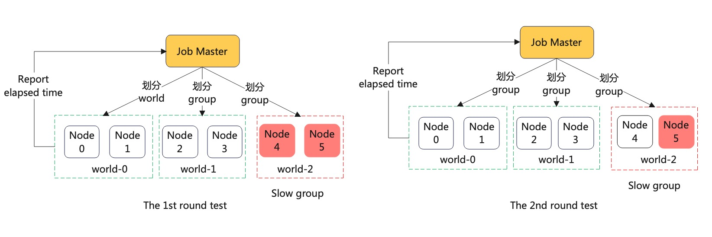

# Automatically Detect the Straggler

The design describes how to automatically and quickly detect the straggler
using DLRover.

## Background

In acollective communication job, the straggler (e.g. slow node) will significantly
affect the performance of training. The reason of the straggler may be slow RDMA,
slow nvlink or unknown hardware failure.
If there are many nodes in a cluster, it is difficult to detect which node is the straggler.
A manually method to detect the straggler is binary search. The user manually splits the cluster
into 2 small cluster and run a same training job to find the slow cluster. Then, the user
repeats the search step on the slow cluster until finding the straggler. The method is
very time-comsuming and fussy to users.

## Target

Before the training starts, users can use DLRover to check whether there is a straggler
in the job cluster.

## System Design

### Straggler Detection with Automatic Group

A DLRover elastic job has a master and workers. The master can split the nodes into many small
cluster. The node in the small cluster can run a PyTorch DDP training task. We can collect the
time to execute the DDP task on each cluster after all clusters finish the task. After the
first round test, we can collect the elapsed time of each node and sort nodes by the time.
Then we start the second round test. The job master groups the slow node and fast node to run
a DDP training task and collect the elapsed time of each node. If elapsed times of the node
in 2 round tests are both slower than others, the node is the straggler with the large
probability.

We show the detail with 6 nodes in a job. In the first round, the job master splits nodes
into groups [{0,1}, {2, 3}, {4,5}] to run a DDP training task. After the task is finished,
the node reports the elapsed time to the job master. The elapsed times of nodes are
{0:t00, 1:t10, 2:t20, 3:t30, 4:t40, 5:t50}. If the difference of elapsed times of all nodes
is not very significant, we can decide there is no straggler. Otherwise, the nodes run
the second round test Here.

We suppose that t00 = t10 < t20 = t30 << t40 = t50.
In the second round, the job master split the nodes into groups [{0, 5}, {1, 4}, {2, 3}]
to run a DDP training task and collect the elapsed times of nodes {0:t01, 1:t11, 2:t21, 3:t31, 4:t41, 5:t51}.
After the two round test, we can get the minimum time of each node in the 2 round tests like
`t0 = min(t00, t01), t1 = min(t10, t11), ...`. If the time of node is much bigger than others,
we can detect the node as a straggler. For example, the node 5 is straggler if
t5 >> max(t0, t1, t2, t3, t4).

<div align="center">

</div>

### Straggler Detection Agent

The agent on each node can launch sub-processes to run a training script and collect the elapsed time.
The elapsed time if from the begining to the end of all subprocesses on the node.
Then, the agent will report the elapsed time to the master and the master
decide where there are straggler with elapsed times of all nodes.

```python
class StragglerDetectionElasticAgent():

    def run(self):
        for round in range(2):
            start = time.time()
            succeed = self._run_straggler_detect(15)
            elapsed_time = time.time() - start
            if not succeed:
                elapsed_time = 100000  # Failed
            self._master_client.report(elapsed_time)
            if not self._check_exist_straggler():
                return
            

    def _run_straggler_detect(self, monitor_interval, timeout=300):
        self._initialize_workers(self._worker_group)
        start = time.time()
        while True:
            assert self._worker_group.state != WorkerState.INIT
            time.sleep(monitor_interval)
            run_result = self._monitor_workers(self._worker_group)
            state = run_result.state
            self._worker_group.state = state
            if state == WorkerState.HEALTHY:
                if time.time() - start > timeout:
                    logger.error(f"Timeout {timeout} to check network.")
                    return False
                continue
            return state == WorkerState.SUCCEEDED
```

### Training Task to Detect the Straggler

We can select a GPT model with a mock dataset to test the performance of each node.
The model size should be as big as possible without OOM to utilize the bandwidth and computation
kernels of the accelerator. We can automatically configure the model size according to
the DRAM of the accelerator. For example, if the accelerator is the RTX4090 with 24GB
DRAM, we can select a 1.5B model.

### How to Use Straggler Detection

Users only need to set `--straggler-detection` in the command to run `dlrover-run` like

```yaml
spec:
  distributionStrategy: AllreduceStrategy
  optimizeMode: single-job
  replicaSpecs:
    worker:
      replicas: 4
      template:
        spec:
          restartPolicy: Never
          containers:
            - name: main
              # yamllint disable-line rule:line-length
              image: registry.cn-hangzhou.aliyuncs.com/intell-ai/dlrover:pytorch-example
              imagePullPolicy: Always
              command:
                - /bin/bash
                - -c
                - "dlrover-run --straggler-detection --nnodes=$NODE_NUM \
                  --nproc_per_node=2 --max_restarts=3  \
                  examples/pytorch/mnist/cnn_train.py --num_epochs 2 \
                  --training_data /data/mnist_png/training/ \
                  --validation_data /data/mnist_png/testing/"
              resources:
                limits:
                  cpu: "1"
                  memory: 2Gi
                requests:
                  cpu: "1"
                  memory: 2Gi
```
