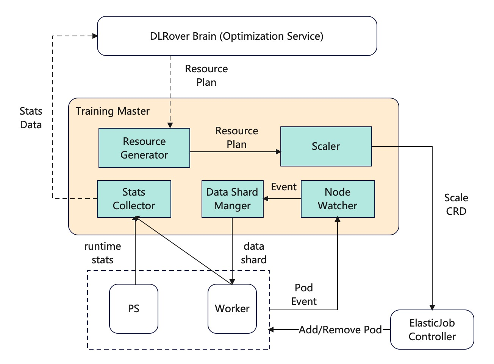

# Training Master of DLRover

The design describes the architecture of the training master of DLRover.
The master is responsible to controll the training of a single job and
provide the following services:

- Dynamic data sharding. The master can dispatch training data shards
to workers according to the computation capability of the worker.
- Collect runtime statistics, including the workload of each parameter
server and worker, training throughput, training process.
- Scale up/down Pods. The master generates a Scale CRD to scale up/down
parameter servers or workers.

If we have deployed a Brain service, the training master can report
statistics of a job to the Brain and get resource optimization plans
from the Brain to scale the job. Otherwise, the training master
need to store statistics in the memory and generate the resource
optimization plan by those runtime statistics. The latter cannot support
the fault-tolerance of the master because the data is missing if the master
fails.

We have implemented a training master of k8s ElasticJob and developers
can implement interfaces to customize their training master on other
distributed systems.

## Architecture of the Training Master

The master contains 5 components:

- Resource Generator: it generates resource configuration plans for the job.
- Scaler: it generates Scale CRDs according to resource plans.
- Stats Collector: it collects the runtime statistics for the job, including
the resource usage of each Node, training throughput and the global step.
- Data Shard Manager: it splites the training dataset into shards and dispatches
shards to workers. Each shard only contains indices of training samples not
the data of samples.
- Node Watcher: it watches events of nodes and notifies Data Shard Manager to
recover the shard of failed workers or notify Scaler to add the memory
of OOM nodes.

The design of the training master is shown as

<div align="center">

</div>

## Interface Detail of Components

Here, we introduce the interface of those components.

### StatsCollector

`StatsCollector` collects runtime statistics fo each node and training
throughput. It can report those statistics data to a remote storage like
database.

```Python
class StatsCollector(metaclass=ABCMeta):
    def __init__(self, job_uuid):
        self._job_uuid = job_uuid
        self._node_resource_usage = {}

    def collect_node_resource_usage(self, node_name, resource):
        """Collect the resource usage of the node_name node.
        Args:
            node_name: string, the name of node
            resource: the resource usage of the node.
        """
        self._node_resource_usage[node_name] = resource

    @abstractmethod
    def report_resource_usage(self):
        pass
```

We can implement `report_resource_usage` to report the runtime statistics
(e.g. CPU/memory usage) of all parameter servers and workers
to DLRover Brain to persist them in a database like MySQL.
Even if the training master breaks down, we can launch a new
Pod for the master without the loss of data. Using the data in a
database, we can evaluate the performance of optimization algorithms
and update our optimization algorithms.
For simplity, we can store those statistics in the memory of
the training master. But those data will be missing if
the training master breaks down and we can not track the
performace of optimization algorithms.

### ResourceGenerator

`ResourceGenerator` generates an optimization resource plan for the job.

```Python
class ResourceGenerator(metaclass=ABCMeta):
    def __init__(self, job_uuid):
        self._job_uuid = job_uuid

    @abstractmethod
    def generate_plan(self, stage, config={}):
        pass
```

The interface `generate_plan` generates a resource configuration plan for the
job at the stage. We can implement a ResourceGenerator to query a resource
plan from the optimizer of DLRover Brain service.

For simplity, we can implement a `ResourceGenerator` to
generate a resource plan according to the local runtime
statistics in the training master. However, the DLRover Brain service
can acquire the information of all jobs including completed and running
jobs. The optimizer of the DLRover Brain can more quickly
generate a more optimal resource plan. It can short the
searching time of optimization. What's, using the optimizer
of DLRover Brain, we can support the fault-tolerance of the
master because all statistics are persisted in a database by DLRover Brain.

### Scaler

`Scale` scales up/down nodes of the job.

```Python
class Scaler(metaclass=ABCMeta):
    def __init__(self, job_name, cluster):
        self._job_name = job_name
        self._cluster = cluster

    @abstractmethod
    def scale(self, resource_plan):
        pass
```

We can implement the `scale` for different distributed systems. For example
we develop a `k8sScaler` to generate a `Scale` CRD to scale up/down Pods
of an ElasticJob.

```Python
class k8sScaler(Scaler):
    def __init__(self, job_name, cluster):
        super(k8sScaler, self).__init__(job_name, cluster)
    
    def scale(self, resource_plan):
        crd = self.generate_scale_crd_by_plan(resource_plan)
        self.apply_crd(crd)
```

### NodeWatcher

`NodeWatcher` monitors the training nodes of the job and get the event
of nodes. The event of a node contains `Pending`, `Creating`, `Running`,
`Succeed`, `Failed` and so on. After it get the event of a node, it will
send the event to `DataShardManger` and `Scaler`.

```Python
class NodeWatcher(metaclass=ABCmeta):
    def __init__(self, job_uuid):
        self._job_uuid = job_uuid

    @abstractmethod
    def watch(self):
        """Wath events of nodes"""
        pass

    @abstractmethod
    def list(self):
        """List all nodes of the job"""
        pass
```

For example, we can implement a PodWatcher for k8s.

```Python
class PodWatcher(NodeWatcher):
    def __init__(self, job_name):
        super(PodWatcher, self).__init__(job_name)

    def watch(self):
        while True:
            resource_version = self._get_list_watch_resource_version()
            try:
                stream = watch.Watch().stream(
                    self.client.list_namespaced_pod,
                    self.namespace,
                    label_selector=ELASTIC_JOB_KEY + "=" + self.job_name,
                    resource_version=resource_version,
                    timeout_seconds=60,
                )
                for event in stream:
                    process(event)
            except Exception as e:
                time.sleep(30)

    def list(self):
        pod_list = self.client.list_namespaced_pod(
            self.namespace,
            label_selector=ELASTIC_JOB_KEY + "=" + self.job_name,
        )
        return pod_list
```

### DataShardManager

`DataShardManger` splits the training dataset into shards by the sample index.
After a worker start to training, `DataShardManager` dispatch the shard
to the worker. After the worker uses up samples in the shard, it will
report a shard status to `DataShardManger`.
The shard only contains indices of smaples not the sample
data.

```Python
class DataShardManger(metaclass=ABCmeta):
    @abstractmethod
    def create_shards(self):
        """Split the dataset and create shards"""
        pass

    @abstractmethod
    def recover_shard(self, shard_id):
        """Recover a dispatched shard if a worker fails"""
        pass

    @abstractmethod
    def get_shard(self, worker_id):
        """Return a shard for the worker with worker_id"""
        pass

    @abstractmethod
    def report_shard_status(self, shard_id):
        """The worker reports the status of the shard"""
        pass
    
    @abstrctmethod
    def checkpoint(self):
        """Checkpoint uncompleted shards"""
        pass

    @abstractmethod
    def restore_checkpoint(self, checkpoint):
        """Restore uncompleted data shards from a checkpoint"""
        pass
```
