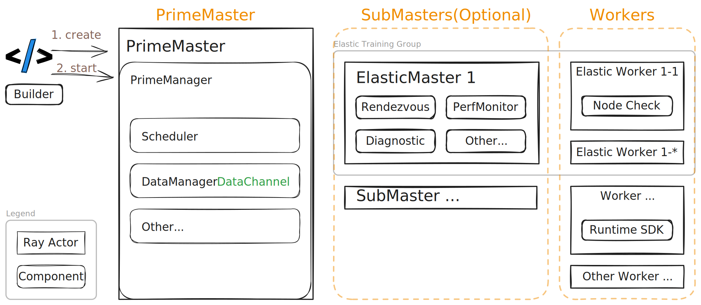

## Background

As machine learning workloads become increasingly complex, there is a growing need to support unified training paradigms
that combine elastic training with other processing strategies. Traditional elastic training frameworks are optimized
for scaling model training dynamically, but often lack the flexibility to integrate with heterogeneous tasks such as
data preprocessing, reinforcement learning environments, or custom compute-intensive operations.

Unified training addresses these challenges by enabling the orchestration of diverse workloads within a unified
framework. This approach allows for seamless coordination between elastic model training and auxiliary tasks, such as
large-scale data transformation, environment simulation, or multi-stage pipelines. By managing the lifecycle and
resource allocation for both elastic and non-elastic components, unified training frameworks can maximize resource
utilization, improve throughput, and simplify the development of complex machine learning systems.

Typical scenarios include:

- **Reinforcement Learning (RL) Environments:** Multiple training tasks may need to run in parallel, with environment
  simulation requiring significant CPU resources and coordination with model training.
- **Data Fusion and Preprocessing:** Integrating data processing with model training, where various preprocessing or
  transformation tasks must be performed alongside or prior to training, often involving different computation patterns
  and resource requirements.

By supporting these unified scenarios, the framework enables users to build more flexible, efficient, and scalable
machine learning pipelines that can adapt to a wide range of real-world requirements.

This document outlines the design and architecture of a unified training framework that integrates elastic training with
other processing paradigms, providing a comprehensive solution for complex machine learning workloads.

> This is also an architecture design for [Unified MPMD Control](./unified-mpmd-control-proposal.md)

## Core Design

### Architecture Overview

The unified training framework integrates both elastic and non-elastic training paradigms to support diverse workloads.
In this architecture, the `Controller/PrimeMaster` is responsible for orchestrating the entire unified training process,
while the
`Backend`(including `ElasticMaster` and `ElasticWorker`) components focus on elastic training tasks.
> The `ElasticMaster` and `ElasticWorker` represent the original elastic training architecture, while the `PrimeMaster`
> is the newly introduced component.

The architecture is designed to be modular and extensible, allowing for the integration of various training strategies
and workloads. The key components include:

#### Controller/PrimeMaster

- Oversees the lifecycle management of unified training jobs.
- Schedules and monitors various training/processing workloads.
- Maintains a registry of all actors and their assigned roles.
- Stores and manages the global state of the training process.

#### Backend

One backend consists of `Worker` components and, optionally, `SubMaster` components, which are responsible for executing
specific workloads.

##### Worker

The actual processing nodes executing the `WorkLoad`. Workers could run independently or collectively.

##### SubMaster

- Optional, but recommended for scenarios with complex orchestration needs.
- Manages a group of `Worker` instances, providing additional orchestration and management capabilities.
- Handles job-specific logic, such as dynamic resource allocation and workload balancing.

#### ElasticBackend (example for Backend)

##### ElasticMaster

- Manages one elastic training process with lots of `ElasticWorker` instances.
- Performs node health checks for the elastic training.
- Provides rendezvous services for worker coordination.
- Monitors training progress and collects relevant metrics.

##### ElasticWorker (specialized Worker for elastic training)

- The worker nodes that execute elastic training workloads.
- Created by the `PrimeMaster` and managed by the `ElasticMaster`.

### Sequence Diagram

From the perspective of `PrimeMaster`, both `SubMaster` and `Worker` are treated as `Actor` instances, implemented using
`ray.Actor`.

### Extension Points

The unified training framework is designed with extensibility in mind, enabling users to tailor its functionality to
accommodate diverse workloads. Key extension points include:

- **Worker Customization:**  
  Users can implement custom `WorkerLoad` classes to handle specialized tasks such as data preprocessing, reinforcement
  learning, or other domain-specific operations. This flexibility allows seamless integration of varied processing
  strategies within the unified training pipeline.

- **Custom Backend(Advanced):**  
  Users may define their own `SubMaster` and corresponding `Worker` implementations to orchestrate specific training
  workflows. This supports fine-grained control over elastic workload management and enables backend customization for
  specialized use cases.

The `Worker` and `SubMaster` components are orchestrated by the `PrimeManager` via stages and lifecycle hooks, which
govern the
initialization, execution, and monitoring of each workload. This hook-based design empowers users to extend the
framework with new processing paradigms—without altering the core architecture.

### Common Lifecycle Hooks

- `__init__`: Initializes the node with the provided configuration.
- `status`: Retrieves the current runtime status of the node.
- `check_child`: Monitors the status of child nodes (applicable to `SubMaster`).
- `start`: Launches the node’s processing logic (e.g., training loop, monitoring routine).

### Core Lifecycle Stages

- `INIT`: The initial stage of the actor lifecycle.
- `READY`: The actor has completed its setup and is ready to handle RPC requests.
- `RUNNING`: Indicates that the task is actively running; set after the `start` hook is invoked.
- `FINISH` / `FAILED`: Terminal stages that signify the completion or failure of the task.

### Stability

#### Pre-Check

- Each worker performs a self-check before entering the READY state to ensure it can handle assigned tasks.
- The SubMaster (e.g., `ElasticMaster`) runs `check_workers` to verify that all workers are prepared before starting the
  training process. For example, the `ElasticMaster` conducts a rendezvous and communication check prior to launching
  elastic training.

#### Fault Tolerance

The unified training framework is designed with robust fault tolerance to maintain reliability throughout the training
lifecycle. Key mechanisms include:

- **Node Health Monitoring:** All nodes undergo regular health checks to promptly detect failures. If a node becomes
  unresponsive, the framework reallocates its tasks to healthy nodes.
- **Dynamic Node Management:** Nodes can be added or removed dynamically based on workload demands. Upon node failure,
  the `PrimeManager` reassigns tasks to available nodes, ensuring uninterrupted operation.
- **Transactional State Management:** The global training state is managed transactionally by the `PrimeManager`,
  enabling recovery from failures without loss of progress. The `PrimeMaster` can fail over to a backup if necessary.
  Nodes are stateless and can recover by reloading their state from the `PrimeManager`.

#### Failover

The framework provides comprehensive failover strategies to ensure operational continuity:

- If an `ElasticWorker` fails during `node_check`, the `ElasticMaster` restarts all abnormal workers and retries
  `node_check` until all workers are ready.
- If an `ElasticWorker` fails during elastic training, the `ElasticMaster` stops all running workers, performs
  `node_check`, and restarts the training process.

## Driving Patterns

There are three different driving patterns for the unified training framework:

- SubMaster Driven: The `PrimeManager` drives the `SubMaster` and its workers, which are specialized for elastic
  training.
- Worker Self-Loop: The `Worker` nodes operate in a self-driven loop, continuously pulling data, processing it, and
  writing results to a `DataChannel`.
- Trainer Driven: The `Trainer` orchestrates the training process, coordinating interactions among various roles such as
  `Actor`, `Critic`, and `Rollout` in reinforcement learning scenarios.

### Elastic Training (SubMaster Driven)

Elastic training is a core feature of the DLRover framework, enabling dynamic scaling of training resources based on
workload demands. Within the unified training architecture, elastic training is seamlessly integrated and managed by the
`PrimeMaster`, which oversees the orchestration and lifecycle management of all elastic workloads.

The `PrimeMaster` coordinates the creation, preparation, and execution of elastic training jobs, delegating the
management of elastic-specific processes to the `ElasticMaster` (also referred to as `SubMaster`). The `ElasticMaster`
is responsible for:

- Performing regular node health checks to ensure the reliability of the training cluster.
- Providing rendezvous services to facilitate coordination and communication among elastic workers.
- Monitoring training progress and collecting relevant metrics for adaptive scaling and fault tolerance.

The sequence diagram below illustrates the flow of elastic training within the unified framework:
> Communication between the `ElasticMaster` and `ElasticWorker` remains consistent with previous designs. This document
> focuses primarily on the unified architecture and simplifies the communication details.

### Distributed Data Processing (Workers Self-Loop)

In distributed data processing scenarios, each `Worker` node operates in a self-driven loop. Upon starting, the worker
continuously pulls data from a `DataChannel`, processes the data using a user-defined `process` method, and writes the
results to another `DataChannel`. This loop persists until a stop signal is received, enabling efficient and scalable
parallel data processing across multiple workers.

Source -> Tokenizer[Self-Loop] -> DataChannel -> Sampler[Self-Loop] -> DataChannel -> Trainer[Self-Loop] -> Model Output

### Reinforcement Learning (Trainer Driven)

In reinforcement learning (RL) scenarios, the unified framework supports multiple specialized roles such as `Actor`,
`Critic`, and `Rollout`. The `Actor` and `Critic` are typically managed as elastic training tasks, while `Rollout` nodes
handle inference or environment simulation. The overall training process is orchestrated by a dedicated `Trainer` or by
the `Actor` itself, which coordinates the interactions among all roles. This design enables flexible scaling and
efficient resource allocation for complex RL workflows, supporting scenarios like distributed policy optimization,
multi-agent training, and large-scale environment simulation.

## FAQ

### What is the difference between `Trainer` , `PrimeMaster` and `SubMaster`?

- The `Trainer` is the main orchestrator for the entire training process, coordinating interactions among various roles such as
`Actor`, `Critic`, and `Rollout`. It manages the overall training logic, including data collection, model updates, and
performance monitoring.
- The `PrimeMaster` is a higher-level orchestrator that manages the lifecycle of the entire unified training job, but it does not
directly handle the training logic. Instead, it oversees the `SubMaster` and its workers, which are specialized for elastic
training tasks. The `PrimeMaster` is responsible for job scheduling, resource allocation, and global state management.
- The `SubMaster`, on the other hand, is a specialized component that manages one role, providing
additional orchestration and management capabilities, like rendezvousing and fault tolerance.
