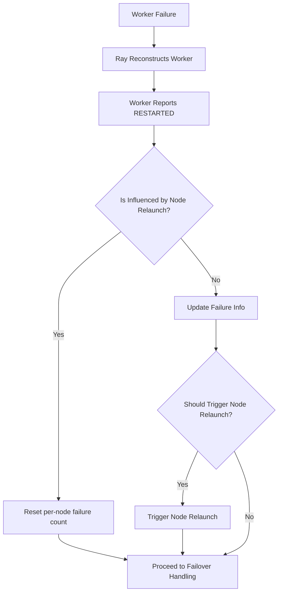
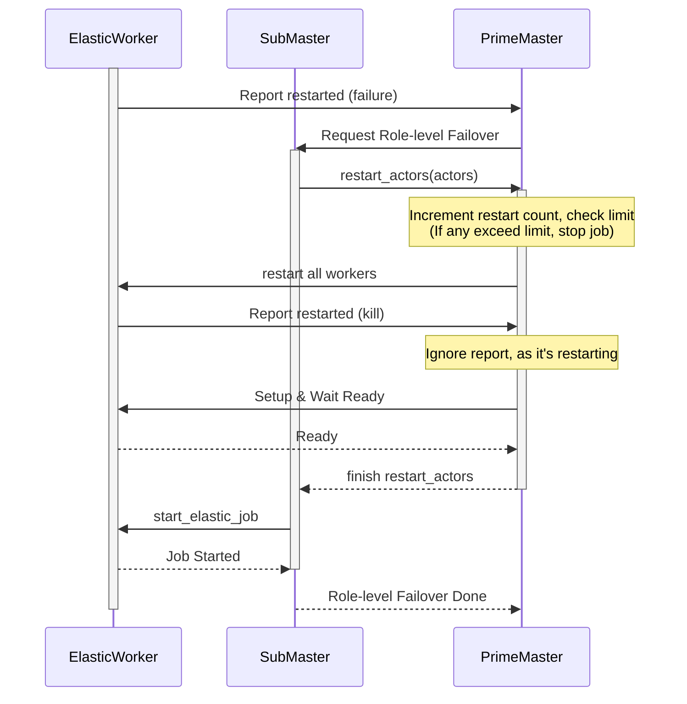
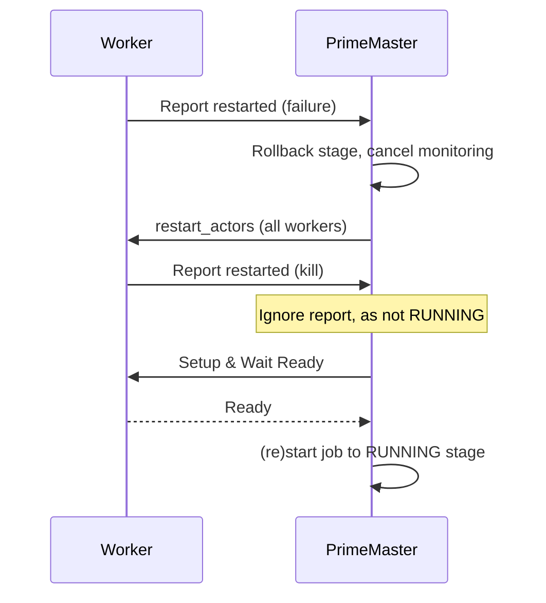
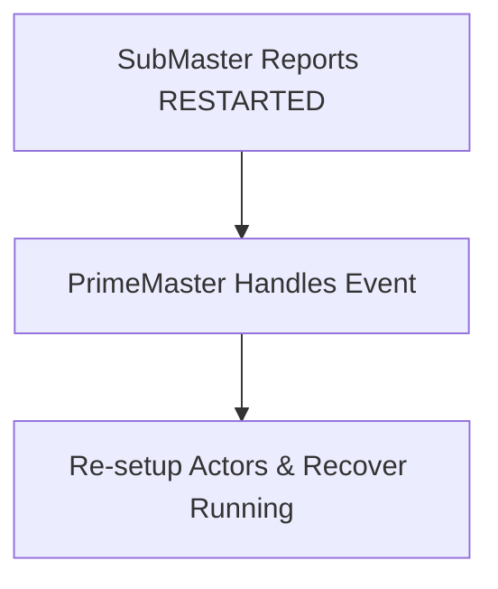
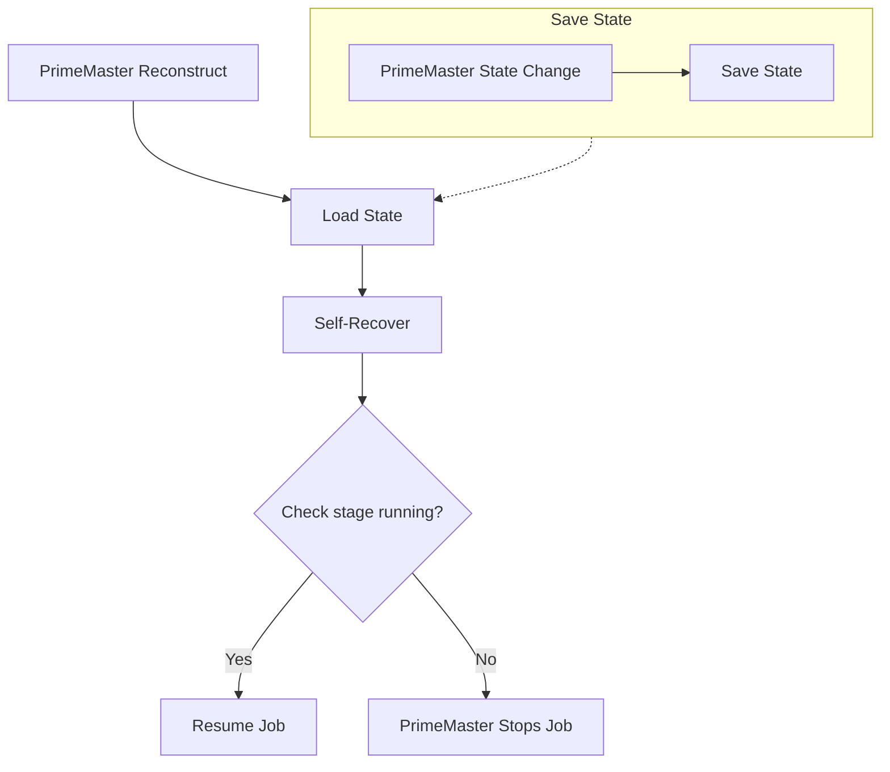
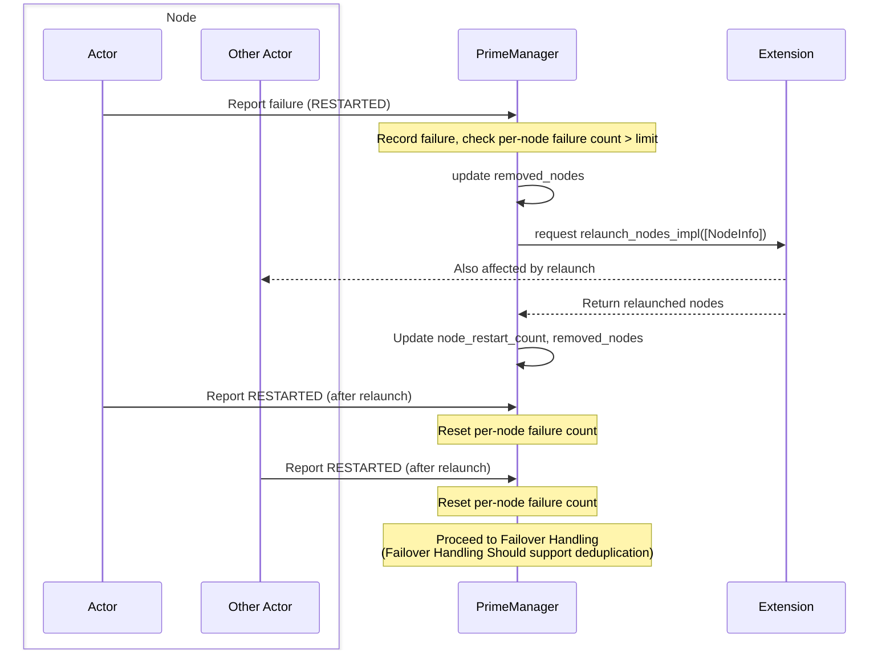

# Unified Failover Design & Scenarios

## Overview

This document describes the failover (fault tolerance) mechanisms in DLRover 
Unified, a distributed training system. It covers the core logic, component interactions, 
and key scenarios for handling failures at different levels (worker, submaster, 
node, and PrimeMaster). The structure is as follows:

- **Core Failover Logic:** Main decision flow for handling actor failures.
- **Worker Failover:** How different types of workers (with/without SubMaster) and SubMaster recover from failures.
- **PrimeMaster Failover:** Self-healing and state management of the global controller.
- **Node Relaunch:** Multi-component process for replacing faulty nodes and restarting all affected actors.

Each section includes diagrams and concise explanations to help understand the 
system's robustness and recovery strategies.

---

## Core Failover Logic: deal_with_actor_restarting

When a worker (actor) fails in DLRover Unified, the system starts the failover 
process from Ray reconstructing the worker and the worker reporting a RESTARTED 
event. The manager then determines the recovery strategy based on the failure context:

- If the failure is due to node relaunch (the node is in removed_nodes), reset the per-node failure count and do not treat it as a failure.
- Otherwise, update the corresponding failure record.
- If the per-node failure count exceeds its configured limit, trigger node relaunch to replace the faulty node (then return to failover handling).
- Otherwise, proceed to failover handling (such as restarting the job or recovering running state). Role-specific handling (e.g., SubMaster, role-level failover, restart count limit) is managed in subsequent steps.

This logic ensures node-level limits are enforced, and failover is triggered 
only when necessary. Role-specific recovery and restart count limits are handled 
in later steps.

---

## Worker Failover

DLRover Unified handles worker failures via automatic restart or job termination 
when restart limits are reached.

### 1. ElasticWorker (with SubMaster)

If the failed worker belongs to a role with SubMaster (ElasticMaster), 
role-level failover is supported. The failover handling is:

- ElasticWorker detects failure and reports RESTARTED to PrimeMaster.
- PrimeMaster requests SubMaster to perform role-level failover and restart the affected actors.
- PrimeMaster increments restart counts and checks if any actor exceeds the restart limit; if so, the job is stopped to prevent infinite retries.
- If within limits, PrimeMaster restarts all workers and waits for them to be ready, ignoring intermediate restart reports.
- Once all workers are ready, SubMaster starts the elastic job and notifies PrimeMaster that role-level failover is complete.
- The process supports deduplication and multiple recovery attempts, ensuring consistency and high availability.

This process ensures that role-level failover is coordinated by SubMaster and 
controlled by PrimeMaster, with restart limits enforced to prevent infinite 
retries. SubMaster always restores its own state before actor recovery.

### 2. Other Worker (no SubMaster)

If the failed worker does not belong to a role with SubMaster, role-level failover is not supported:

- Worker detects failure and reports RESTARTED to PrimeMaster.
- PrimeMaster initiates job-level restart: rolls back stage, cancels monitoring task, and calls `restart_actors` for all workers.
- Reports from actors during non-RUNNING stage are ignored.
- After all actors are ready, PrimeMaster re-enters RUNNING stage and restarts job monitoring.

This process ensures that job-level failover is managed by PrimeMaster, with all s
tate transitions and actor restarts coordinated for global consistency.

### 3. SubMaster Failover

When SubMaster (such as: ElasticMaster) fails, the system ensures recovery and 
role consistency. SubMaster is uniformly designed as a stateless object, with 
all its internal state derived from the PrimeMaster's state management, 
allowing for direct retries:

**Test Coverage:**

- `test_manager_handle_actor_restart`, `test_failover_training`, `test_comm_fault`, `test_request_stop_cases`

---

## PrimeMaster Failover

PrimeMaster is the unique, self-healing, and core stateful component in DLRover 
Unified. Its state save/load mechanism is critical for global job consistency 
and recovery:

- PrimeMaster maintains the authoritative job state and orchestrates all failover logic.
- On any state change, PrimeMaster saves its current state to persistent storage, ensuring that both itself and all workers are in a globally consistent state.
- When a failure occurs, PrimeMaster is reconstructed and loads the last saved state from persistent storage. This separation of Save and Load guarantees that job progress is never lost.
- After loading, PrimeMaster performs self-recover. Only if the restored stage is RUNNING (the long-lived stage), failover proceeds and job monitoring resumes. For other short-lived stages, or if any exception occurs during recovery, PrimeMaster safely terminates the job to avoid inconsistency.

This design ensures distributed jobs can always recover from failures in a 
consistent and reliable manner, with all exceptions and abnormal branches leading 
to a safe stop.

**Test Coverage:**

- `test_manager_save_load`, `test_manager_failover`, `test_some_misc_cases`

---

## Node Relaunch

Node relaunch is a coordinated process managed by PrimeManager to maintain job 
reliability when a node's per-node failure count exceeds its configured limit. 
All actors on the same node—including Other Actor—are affected and restarted 
together. The process involves:

- Actor reports failure (RESTARTED) to PrimeManager.
- PrimeManager records the failure, checks per-node failure count, and updates removed_nodes if relaunch is needed.
- PrimeManager requests Extension to relaunch the node; Extension notifies all affected actors (including Other Actor).
- Extension returns relaunched nodes to PrimeManager, which updates node_restart_count and removed_nodes.
- After relaunch, all actors on the node report RESTARTED again; PrimeManager resets their per-node failure count.
- PrimeManager proceeds to failover handling for all affected actors, with deduplication to avoid repeated recovery.

This ensures that faulty nodes are replaced and all actors on the node are 
consistently restarted, minimizing disruption and maintaining global state 
consistency.
