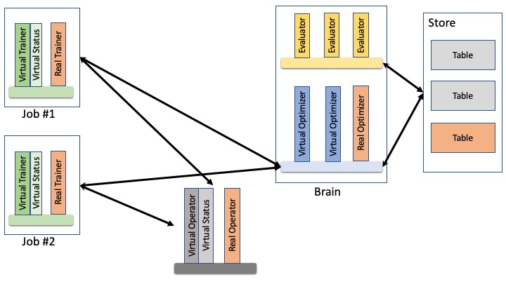

# DLRover Virtual Environment Design

## Background

The cluster mode of DLRover is designed to train deep learning model automatically
in production environment. The correctness and robustness of DLRover is
critical to obtain the required DL models. Therefore, there is high demand for complete and
reliable testing on DLRover before each update.

DLRover consists of multiple components and those components coordinate with each
other to train the DL models. Since DLRover can run quite different training jobs, e.g.,  
Tensorflow and PyTorch, for different DL models, the job relevant components
(e.g., operators) are quite different from each other. Unit tests indeed guarantee
the function correctness of the single component. We still need to test the coordination
among different components.

Meanwhile, new algorithms (e.g., auto-configure and optimization) are in frequent
iteration. For a new algorithm, we need to guarantee the efficiency of this algorithm
as well as the correctness. However, currently we can only run several sample jobs
on gray cluster and observe the algorithm's efficiency that usually shows inaccurate
results compared to production environment. Furthermore, a new algorithm requires
non-trivial time to have complete test. During each iteration, we need to compare
multiple algorithms and pick up the best one. There is high demand to test multiple
algorithms simultaneously.

## Design Goal

Based on the background, we have listed the design goals of virtual environment:

1. We can conduct complete test for the whole system in each virtual environment.
2. The test can be based on the jobs in production environment.
3. It could not interfere DLRover's function in production environment.
4. It supports that multiple virtual environments execute in isolation.
5. It can measure the efficiency of new algorithm.

## Design

<div align="center">

</div>

Similar to virtual machines,  each **Virtual Environment** can run a different "DLRover" system.
Among those DLRover systems, there is at most one system can be labelled
as **Real** while all others can only be **Virtual**. Generally, only the real system
is to run and optimize DL training jobs and virtual systems are for testing.
However, if a case is observed, e.g., too many jobs fail, the real system will be
switched to virtual and a pre-chosen virtual system takes the control and start to
train DL models.

DLRover consists of four major components: Brain, Trainer, Store and Job Operator
(i.e., training framework related, like Tensorflow, PyTorch etc.). Each component
has its own virtual environment. Note that two virtual DLRovers could share the same
virtual components. For example, DLRover #1 and DLRover #2 could have different virtual
Trainers but use the same virtual Brain.

### Virtual Brain

The core part in the Brain is Optimizer and Optimizer is allowed to have multiple
different implementations. Therefore, we can implement different Optimizers for
different virtual Brain.

Evaluator is another key part in Brain virtual environment. Evaluator is to measure
or compare the efficiency of the algorithms. Similar to Optimizer, Evaluator also
allows different implementations.

### Virtual Store

Store is used to keep necessary data for DLRover. Each virtual environment can have
separate data store, e.g., tables in MySQL.

### Virtual Operator

Operator is used to modify/kill/launch jobs virtually or really. Note that, if a virtual
operator update jobs virtually, it needs to obtain corresponding cluster status for those
virtual job operations.

### Virtual Trainer

Each virtual Trainer has three major tasks:

1. To query optimization plans from virtual Brain.
2. To convert optimization plans to ScalePlan and send to virtual operator.
3. Based on ScalePlan, to simulate job's virtual status and persist relevant data to store.

The simulator interface is as following:

```go
type JobStatus struct {
 Speed float
 ...
}

type JobSimulator interface {
 UpdateJob(plan *OptimizePlan) error
 GetJobStatus() *JobStatus
}
```
