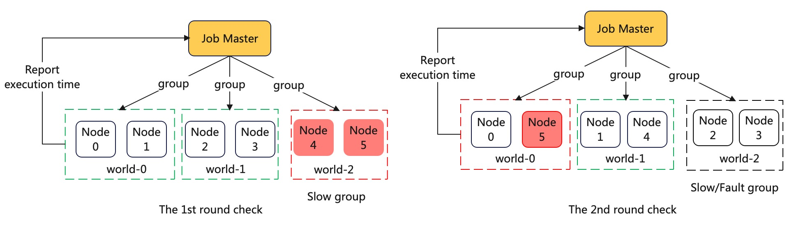

# Introduction to Check the Node Healthy using DLRover

The document introduces how to use DLRover to check the slow or fault node
in a distributed job on a k8s cluster.

## System Design

In a distributed job, DLRover will launch a job master process to group the nodes.
Before starting the training subprocess, The job master initially divides all nodes
into multiple worlds in pairs. The two nodes in each world execute an allgather task
and a matmul task. After tasks are completed, each node will reports the execution time
to the job master. If the timeout happens in the allgather task, the execution time
will be 3600s. If the execution times of all nodes are not 3600s, the job master will
print the execution time in the log. Users can find the slow node with the execution
time.

If the execution times of some nodes are 3600s, there may be fault node in the distributed
job. However, we cannot disagnose which node are fault. Because, the execution times
of two nodes in group both are 3600s to execute the allgather task if anyone is faulty.
Now, the job master will sort nodes by the execution time and
group together the node with the longest execution time and the one with
the shortest execution time. All nodes will execute the check task again. According to
the execution time of two rounds check, the job master can diagnose the node is faulty
whose execution time in two rounds both are 3600s.

For example, if there are 6 nodes in a job, the 1st round of division results might be
[{1,2}, {3,4}, {5,6}]. If allgather fails in the group {5, 6}, the node 5 and 6 are the
potential faulty nodes. Therefore, the 2nd round of division would be [{1,2}, {3,5}, {4,6}].
If {4,6} fails, it indicates that node 6 is the faulty node. The node 6 will exit with
an exception.

<div align="center">

</div>

## Check Node Healthy in Distributed Job with dlrover-run

We can use `dlrover-run` to replace the `torchrun` to check the node health in
a distributed PyTorch job. The `dlrover-run` is developed based `torchrun` and
`dlrover-run` support all arguments of `torchrun`.

### Check Node Healthy in a DLRover ElasticJob

The DLRover ElasticJob can relaunch a new Pod to replace the fault Pod and can
scale up/down Pods to train if the number of available nodes changes during
the training. If you can develop a k8s CRD on a cluster, we strongly suggest you deploy the
ElasticJob CRD on the cluster by the following steps.

```bash
git clone git@github.com:intelligent-machine-learning/dlrover.git
cd dlrover/dlrover/go/operator/
make deploy IMG=easydl/elasticjob-controller:master  # GO 1.18.
# Grant permission for the DLRover master to Access CRDs.
kubectl -n dlrover apply -f config/manifests/bases/default-role.yaml
```

After deploying the ElasticJob, we can submit a distributed job with
the `dlrover-run --network-check` in the job yaml like

```yaml
command:
    - /bin/bash
    - -c
    - "dlrover-run --network-check --nnodes=3:$NODE_NUM --nproc_per_node=2 --max_restarts=3  \
        examples/pytorch/mnist/cnn_train.py --num_epochs 5 \
        --training_data /data/mnist_png/training/ \
        --validation_data /data/mnist_png/testing/"
```

Then, we submit the job yaml to the cluster like

```bash
kubectl -n dlrover apply -f examples/pytorch/mnist/elastic_job.yaml
```

After the job starts, we can check the execution time of nodes to execute the check
task in the log of job master. The name of job master is like "elasticjob-{JOB-NAME}-dlrover-master".
We can find the execution time of each node by the command

```bash
kubectl -n dlrover logs elasticjob-torch-mnist-debug-dlrover-master | grep elapsed
```

```text
Round 0: The node elapsed time are {2: 20.307, 3: 20.265, 0: 206.872, 1: 151.752}
Round 1: The node elapsed time are {2: 20.307, 3: 20.265, 0: 23.174, 1: 135.961}
Round 2: The node elapsed time aree {2: 21.491, 0: 22.685, 3: 20.889, 1: 23.097}
```

In the [experiment](../tech_report/fault_tolerance_exps.md) to find thestraggler node,
the execution time of Node 1 is much bigger than others, so the node 1 is probably a slow node.

### Check Node Healthy in a Kubeflow/PyTorch Job

If you cannot deploy an ElasticJob CRD on the k8s cluster, you also can use
`dlrover-run` in a [Kubeflow/PyTorch](https://www.kubeflow.org/docs/components/training/pytorch/)
job to check the node health. The Kubeflow/PyTorch job
is commonly used on the k8s cluster to manage a PyTorch distributed job. We only need to set
the `NODE_RANK` and `DLROVER_MASTER_ADDR` before `dlrover-run`. `dlrover-run` will
launch a job master process in the master Pod of the PyTorch job.
For example, the `PyTorchJob` has set the `RANK`, `MASTER_ADDR` and `MASTER_PORT`
into environments. We can run `dlrover-run` like

```bash
NODE_RANK=$RANK DLROVER_MASTER_ADDR=$MASTER_ADDR:$MASTER_PORT \
dlrover-run --network-check --nnodes=$NODE_NUM --nproc_per_node=$NUM_TRAINERS  train_script.py
```

Then, we can search the execution time on the master Pod of PyTorchJob.

```bash
kubectl -n dlrover logs elasticjob-torch-mnist-debug-dlrover-master | grep elapsed
```

We can find the slow of fault node by the execution time.
