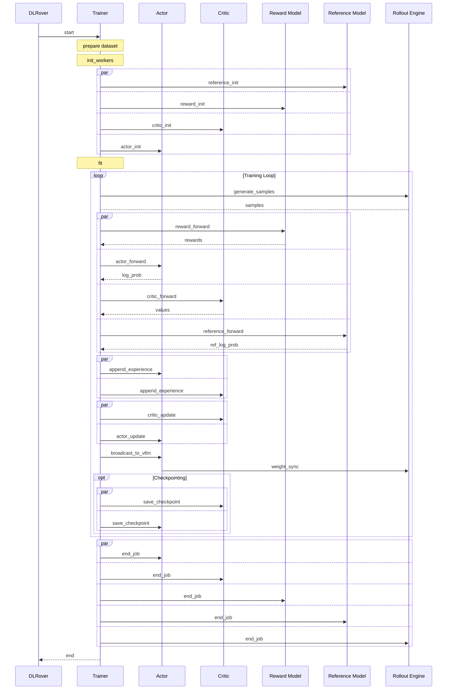

# 03. Multi-Role Training (OpenRLHF)

This guide demonstrates how to express and submit a multi-role OpenRLHF training job. The examples below follow the patterns used in `examples/unified/rl/openrlhf/ppo/main.py`.

## Overview

Multi-role training lets you define and orchestrate
multiple specialized workloads—such as actors, critics,
rollout engines, trainers, and reward models—each with
its own resource needs and execution entry point.
By composing these roles into a single distributed
configuration, you can flexibly scale and manage
complex reinforcement learning workflows.

For RL scenarios, two core training workloads—**Actor** and **Critic**—must
be trained simultaneously, reflecting the greater complexity of RL compared
to standard supervised fine-tuning (SFT) pipelines.

Key components:

- **Submitter**: Parses command-line arguments,
  assembles workload descriptors
  (`ResourceDesc`, `ElasticWorkloadDesc`,
  `SimpleWorkloadDesc`), constructs a `DLConfig`, and
  launches the control plane via `PrimeMaster`.
- **Trainer**: Acts as the central RL controller,
  manages the training loop, aggregates experiences,
  performs optimization steps, handles checkpointing,
  and exposes monitoring endpoints.
- **Actor (Policy)**: Executes policy rollouts using
  elastic GPU-backed instances.
- **Critic**: Runs value-function estimation workers,
  typically as elastic GPU jobs for PPO.
- **Rollout Engines**: Performs environment simulations
  or policy evaluations (e.g., VLLM), often modeled
  as `SimpleWorkloadDesc`.
- **Value & Reward Models**: Evaluates value or reward
  functions using multi-GPU elastic workers.
- **Reference Models (Optional)**: Supports behavior
  cloning or KL-control via secondary policy
  evaluations.

## Example Implementation

This section walks through the concrete implementation in
`examples/unified/rl/openrlhf/ppo`, showing how each key component
maps to its source file, how workloads are declared in `main.py`,
and where the trainer and runtime communication is handled.

This example is based on the OpenRLHF PPO, LICENSEd under Apache 2.0. Requirements include `torch`, `vllm`, and `openrlhf`. Computing Resources includes 8*80G GPUs, or equivalent.

```bash
cd examples/unified/
bash rl/openrlhf/ppo/run.sh
```

It's not necessary to run this example, we will explain the
key concepts and patterns used in this multi-role training job.
You can use DLRover to submit your own multi-role jobs
by following the same patterns.

> DLRover itself is not an algorithm framework, and therefore does not natively
support any specific RL algorithm implementation. As a result, a complete RL
computation requires users to leverage the fundamental capabilities provided
by DLRover to implement the corresponding algorithm and ensure its execution.

### Directory Structure

- `main.py`: The entrypoint to submit the multi-role job.
- `ppo_trainer.py`: Implements the **Trainer**, managing the RL training loop.
  - `trainer.py`: The core logic for trainer.
- `remote_call.py`: Defines all RPC for roles to communicate.
- RL Roles:
  - `ppo_actor.py`: Implements the Actor role, handling policy rollouts.
  - `ppo_critic.py`: Implements the Critic role, estimating value functions.
  - `ppo_rollout.py`: Implements the Rollout Engine, simulating environments.
  - `ppo_reward.py`: Implements the Reward Model, evaluating rewards.
  - `ppo_reference.py`: Implements the Reference Model, used for behavior cloning.
- Misc
  - `common.py`: Contains common utilities for roles.
  - `run.sh`: A script to run `main.py` with appropriate arguments.
  - `utils/experience_maker.py`: A class for generating and managing experiences.

- **Submitter / Entrypoint**: `examples/unified/rl/openrlhf/ppo/main.py`
- **Actor (Policy Worker)**: `examples/unified/rl/openrlhf/ppo/ppo_actor.py`
- **Critic (Value Estimator)**: `examples/unified/rl/openrlhf/ppo/ppo_critic.py`
- **Rollout Engine**: `examples/unified/rl/openrlhf/ppo/ppo_rollout.py`
- **Trainer (RL Controller)**: `examples/unified/rl/openrlhf/ppo/ppo_trainer.py`
- **Reward Model**: `examples/unified/rl/openrlhf/ppo/ppo_reward.py`
- **Reference Model**: `examples/unified/rl/openrlhf/ppo/ppo_reference.py`

### Workload Declaration and Submission (main.py)

`main.py` Contains argument parsing, workload assembly, and job submission logic.

The core part is the `submit()` function, which defines the multi-role workloads
and submits them to the `PrimeMaster`.

```python
# examples/unified/rl/openrlhf/ppo/main.py
# Inside submit()

# 1. Create a job builder
builder = RLJobBuilder().config(args_2_omega_conf(args))

# 2. Define workloads / roles
builder.trainer(f"{P}.ppo_trainer.PPOTrainerActor").resource(cpu=4)
(
    builder.actor(f"{P}.ppo_actor.PolicyModelActor")
    .resource(accelerator=1)
    .nnodes(args.actor_num_nodes)
    .nproc_per_node(args.actor_num_gpus_per_node)
)
(
    builder.critic(f"{P}.ppo_critic.CriticModelRayActor")
    .resource(accelerator=0.4)
    .nnodes(args.critic_num_nodes)
    .nproc_per_node(args.critic_num_gpus_per_node)
)
(
    builder.rollout(f"{P}.ppo_rollout.VLLMActor")
    .resource(accelerator=1)
    .total(args.vllm_num_engines)
)
# optional reference role
if args.init_kl_coef != 0:
    (
        builder.role(RLRoleType.REFERENCE.name)
        .train("{P}.ppo_reference.PPOReferenceActor")
        .resource(accelerator=0.4)
        .nnodes(args.ref_num_nodes)
        .nproc_per_node(args.ref_num_gpus_per_node)
    )
(
    builder.role(RLRoleType.REWARD.name)
    .train("{P}.ppo_reward.RewardModelRayActor")
    .resource(accelerator=0.4)
    .nnodes(args.reward_num_nodes)
    .nproc_per_node(args.reward_num_gpus_per_node)
)

# 3. Build and submit
job = builder.build()
# optional modifications before submission
if args.skip_node_check:
    for workload in job.workloads.values():
        if workload.backend == "elastic":
            workload.comm_pre_check = False
print(job.model_dump_json(indent=2))
if not args.dry_run:
  job.submit(args.job_name)
```

### Trainer & Runtime Communication

After submitting, DLRover orchestrates all roles, then invokes user entry points.
In this case, we use trainer-driven pattern to manage the training loop.
All other roles will quickly setup, and wait for rpc calls.

The training loop is defined in `ppo_trainer.py`, which handles the
communication between the trainer and other roles like Actor, Critic, Reward Model,
and Reference Model. The trainer orchestrates the entire training process,
including generating samples, computing rewards, updating policies, and managing
checkpoints.

The sequence diagram below illustrates the communication flow between the roles during training:



### How the RPC Works

The communication between the roles is handled through remote procedure calls (RPCs) defined in `remote_call.py`. Each role implements its own RPC methods to interact with the trainer and other roles.

1. Define RPC methods in `remote_call.py`:

    - File name and function name just for reference, you can use any name.
    - Async methods are recommended returning `Future[xxx]`.
    - Batch methods input lots `Sequence` and return `FutureSequence[xxx]`. Will only blocking when iterating the result.

    ```python
    # remote_call.py
    def vllm_wakeup() -> None:...

    def vllm_generate(
        prompt_token_ids: Sequence[List[int]], params: "SamplingParams"
    ) -> FutureSequence["RequestOutput"]: ...

    def actor_forward(
        sequences: Sequence[torch.Tensor],
        action_mask: Sequence[torch.BoolTensor],
        attention_mask: Sequence[torch.LongTensor],
    ) -> Sequence[torch.Tensor]:...
    ```

2. Use the function in any place where you need to call the remote method:

    ```python
    # utils/experience_maker.py
    from .. import remote_call
    class SamplesGenerator:
      def __generate_vllm(self, *args, **kwargs):
        #...
        all_outputs = remote_call.vllm_generate(
          all_prompt_token_ids, sampling_params
        )
        #...
    ```

3. Implement and bind the RPC methods in Role classes:

    - Here `remote_call` is used for RPC name, if not provided, it will use the method name as the RPC name. And you need keep consistent in next step.
    - All `@rpc` methods in entrypoint module top-level and entrypoint class will be automatically exported.
    - You could use `@rpc(export=True)` to export any method in any place. But be careful about the timing, method should be exported before the RPC call.

    ```python
    # ppo_rollout.py
    class VLLMActor:
      @rpc(remote_call.vllm_wakeup)
      def wake_up(self):
          self.llm.wake_up()

      @rpc(remote_call.vllm_generate)
      def generate(self, prompt_token_ids, params):
          ...

    ```

4. Implement the interface orchestration in `remote_call.py`:
    - In pervious steps, we finished the RPC method definition and binding. The last step is to orchestrate the interface calls.
    - Keep in mind that all functions is normal PYTHON functions, you can use any logic to implement them.

    ```python
    # remote_call.py
    # 1. Simple and Blocking call
    def vllm_wakeup() -> None:
        group(RLRoleType.ROLLOUT).call(vllm_wakeup).result()

    # 2. Async broadcast call, return Future
    def reference_init(strategy, model_path: str) -> Future:
      return group(RLRoleType.REFERENCE).call(
          reference_init, strategy, model_path
      )
    
    # 3. Batch call, return FutureSequence(subclass of Sequence)
    def vllm_generate(
        prompt_token_ids: Sequence[List[int]], params: "SamplingParams"
    ) -> Sequence["RequestOutput"]: 
        return group(RLRoleType.ROLLOUT).call_batch(
            vllm_generate,
            len(prompt_token_ids),
            prompt_token_ids,
            params,
        )

    # 4. Call multiple roles in parallel, and wait
    def end_job() -> None:
      """End the job by calling the end_job method on the group."""
      futures = [
          group(role).call(end_job)
          for role in [
              RLRoleType.ROLLOUT,
              RLRoleType.REFERENCE,
              RLRoleType.REWARD,
              RLRoleType.ACTOR,
              RLRoleType.CRITIC,
          ]
      ]
      for future in futures:
          future.result()

    # 4. Utility to cache RoleGroup
    @lru_cache(maxsize=None)
    def group(role: RLRoleType) -> RoleGroup:
        """Get the role group for the given role."""
        return RoleGroup(role.name)

    # 5. Also, you could add any custom remote_call utilities here
    @contextmanager
    def vllm_running(enable_sleep: bool):
        """Context manager to handle vLLM sleep and wakeup."""
        if enable_sleep:
            vllm_wakeup()
        try:
            yield
        finally:
            if enable_sleep:
                vllm_sleep()
    ```
