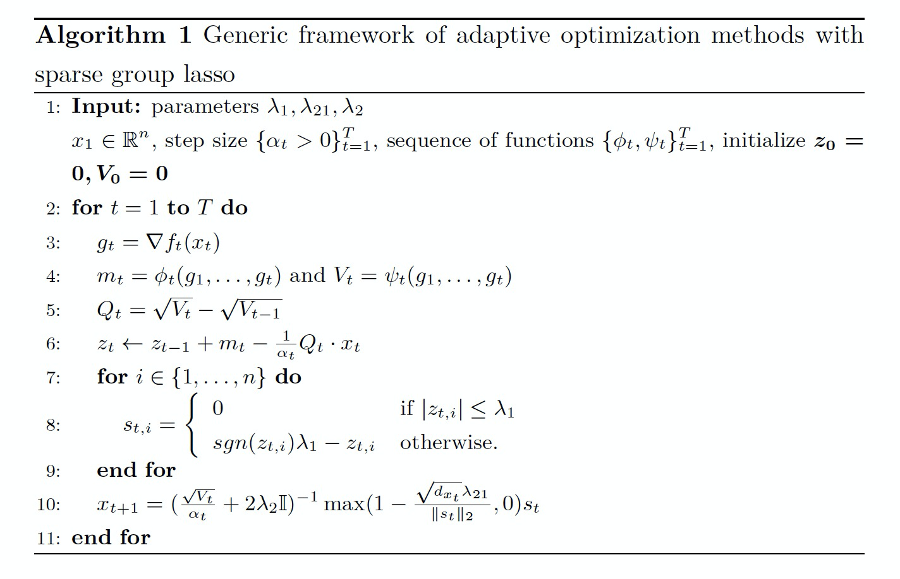

# TFPlus
<div id="top" align="center">


   <h3> <a href="https://arxiv.org/pdf/2107.14432.pdf">Optimizer Paper </a> |
   <a href="./docs/tutorials.md"> Tutorials </a> |
   <a href="./docs/optimizer_api.md"> API Doc </a> 
   <p></p>

   [](https://github.com/intelligent-machine-learning/dlrover/stargazers)
   [](https://github.com/intelligent-machine-learning/dlrover/actions/workflows/main.yml)
   [](https://www.codefactor.io/repository/github/intelligent-machine-learning/dlrover)


   | [English](README.md) | [中文](docs/README-zh-Hans.md) |

</div>

TFPlus is a high-performance TensorFlow extension library developed in-house by Ant Group. It supports core businesses such as search and promotion within the Ant Group, supporting ultra-large scale sparse training. TFPlus has accumulated essential functionalities and performance optimizations for core sparse scenarios. It has deeply optimized the performance in terms of IO, operators, graph optimization, distribution, and collective communication for sparse models. Also, it provides special optimizers, fault tolerance, elasticity, incremental updates, etc., unique to sparse scenarios.<br />TFPlus encapsulates the Ant Group's core capabilities for large-scale sparse training. Its main features are:

-  Provide highly efficient TF operator extensions in a plug-in manner;
-  Support high-performance sparse Embedding training in recommendation scenarios: Kv Variable;
-  Offer high-performance, self-developed deep learning optimizers: Group Adam, Group Adagrad.
> We will promote the construction of the DLRover open-source system and gradually open source all the functions of TFPlus.

## TFPlus Installation
There are two ways to install TFPlus: installing the whl package we released on GitHub directly or building it locally.
### GitHub Release Installation
First, you need to install TensorFlow 2.13.0. Please note that TFPlus is currently optimized and supported only for the CPU version of TensorFlow.  
Next, go to the [release page](https://github.com/intelligent-machine-learning/dlrover/releases) of the [GitHub repository](https://github.com/intelligent-machine-learning/dlrover) to obtain the latest download link for tfplus whl package.
```shell
pip install tensorflow-cpu==2.13.0

# Install the latest version of TFPlus through pip:
pip install [Github release path]

# To ensure successful TFPlus installation, you can try importing TFPlus and print its version:
python -c "import tfplus; print(tfplus.__version__)"
```
Currently, the PyPI version of TFPlus is tested and supported only on Linux. If the installation is not successful, please install our image locally and use it within the image, or build it directly locally, see [Local Build Installation](#local-build).

<a id="local-build"></a>
### Local Build Installation
Another optional installation method is local building, which requires more time (depending on your machine's performance).<br />You can download and launch our Docker image by running the following command:
```shell
git clone https://github.com/intelligent-machine-learning/dlrover.git
cd dlrover
# For GPU image: easydl/tfplus:tf213_dev_gpu
docker run -it --net=host -v ${PWD}:/v -w /v easydl/tfplus:tf213_dev /bin/bash

# Then, execute the build script in the initiated Docker container:
cd tfplus/dev/scripts
bash build_and_test.sh
```
### Precautions

-  TFPlus uses TensorFlow 2.13.0, so you need to install the corresponding version of TensorFlow first;
-  TFPlus currently only supports CPU training. We plan to add GPU support in future versions;
-  TFPlus currently has only been tested and supported under the Linux platform;
-  Although TFPlus is based on TF2 for functionality expansion, it currently only supports static graph mode (Graph Execution) training under TF1. The default Eager Execution of TF2 is not supported yet.
## How-To-Use
To use the Embedding capabilities of the Kv Variable, all you need to do is a simple replacement when building Tensor variables:
```python
# Use get_kv_variable to replace tf.compat.v1.get_variable to build embedding
# get_kv_variable only needs to specify embedding_dim, no need to define the number of features
from tfplus.kv_variable.python.ops.variable_scope import get_kv_variable
user_embeddings = get_kv_variable(
    name="user_dynamic_embeddings",
    key_dtype=tf.int64,
    embedding_dim=32,
    initializer=tf.compat.v1.keras.initializers.RandomNormal(-1, 1))

# Use embedding_lookup for embedding feature lookup
import tfplus
from tensorflow.python.ops.embedding_ops import embedding_lookup
user_id_weights = embedding_lookup(params=self.user_embeddings,
                                   ids=user_id_val,
                                   name="user-id-weights")
```
After using the Kv Variable, the corresponding optimizer also needs to be replaced with the implementation of TFPlus
```python
# TFPlus currently supports four optimizers
# Including two common Adam, Adagrad and two Group Lasso-based Group Adam, Group Adagrad (Sparse Group Ftrl)
from tfplus.kv_variable.python.training import AdagradOptimizer
from tfplus.kv_variable.python.training import AdamOptimizer
from tfplus.kv_variable.python.training import GroupAdamOptimizer
from tfplus.kv_variable.python.training import SparseGroupFtrlOptimizer

opt = GroupAdamOptimizer(
       learning_rate = 0.001,
       initial_accumulator_value=0.0,
       beta1=0.9,
       beta2=0.999,
       epsilon=1e-8,
       l1_regularization_strength=0.0,
       l2_regularization_strength=0.0,
       l21_regularization_strength=0.0,
       use_locking=False,
       name="GroupAdam",
       accum_name=None,
       linear_name=None)

```
For a detailed usage guide on the Kv Variable and the optimizer, as well as end-to-end training examples, please refer to:
-  [Tutorials](./docs/tutorials.md)
-  [Kv Variable Api Doc](./docs/kv%20variable_api.md)
-  [Optimizer Api Doc](./docs/optimizer_api.md)
## Plug-in TF Operator Extension
TFPlus is compatible with **TensorFlow 2.13.0**, and it has expanded on the basis of TF2 by introducing plug-in extensions specifically for sparse CTR models, notably a sparse Embedding operator (which we call KvVariable) and high-performance, self-developed optimizers that are compatible with the KvVariable operator.<br />Presently, TFPlus plugin library supports the following features:

-  Kv Variable (core Embedding capability)	
   - High-performance Embedding Ops
   - Dynamic expansion and partitioning of Embedding weights
   - Single-node training and PS/Worker cluster training
-  High-performance optimizer
   - Common optimizers compatible with Kv Variable
      - Adam
      - Adagrad
   - In-house deep-learning optimizers based on Sparse Group Lasso
      - Group Adam
      - Group Adagrad
## Kv Variable
Kv Variable is an Embedding parameter server implementation based on TensorFlow. It is primarily used by Ant Group to solve computational and storage problems related to sparse Embedding in deep learning. Utilizing the distributed hash storage method, it supports computation, query, insertion, dynamic expansion, partitioning, and resilience of sparse feature parameters.<br />Tensorflow's tf.Variable is used to build a basic Tensor, which utilizes dense matrix storage and access, requiring predefined shapes. In TFPlus, we've implemented a brand-new Embedding-oriented Variable, the Kv Variable. Its internal data type uses Key-Value format storage and supports the following functionalities:

-  The key (Key) of KvVariable supports various data types, including [int, int32, int64, string];
-  KvVariable does not need to define the number of features (i.e., the 0th dimension of Embedding), only the embedding_dimension needs to be defined. New emerging features will be dynamically added to the training, and frequency filtering is supported;
-  KvVariable can be used for Embedding computation in recommendation scenarios, and it is also suitable for constructing Embedding for text input in NLP;
-  KvVariable supports data partitioning (i.e., Partitioned Variable), which partitions ultra-large-scale Embedding layers, supporting custom partition_strategy with different partitioning strategies to evenly distribute features over various partitions;
-  The import and export of Kv Variable parameters are fully compatible with TensorFlow's official interface and format, requiring no additional code modifications.
## In-house High-performance Optimizer
With the integration of Kv Variable's custom Embedding operators, the optimizer's gradient updating operator has to be modified accordingly. TFPlus provides implementations for commonly used optimizers in the industry and Ant Group's in-house high-performance optimizers.

-  Common optimizers compatible with Kv Variable
   - Adam
   - Adagrad
-  In-house deep-learning optimizers based on Sparse Group Lasso
   - Group Adam
   - Group Adagrad

Lasso and Group Lasso can be utilized to sparsify and compress the model, thereby automatically selecting important features. We've incorporated Sparse Group Lasso functionality into a series of adaptive optimizers in deep learning, thus creating a new class of optimizers. Group Lasso series optimizers have been extensively used in search, advertisement, and recommendation scenes within Ant Group. Please refer to Algorithm 1 for specific algorithms.


<br /><br />

When $\lambda_{1},\ \lambda_{2}, \ \lambda_{21}$ (which correspond to the regularization coefficients of $\ell_{1}, \ \ell_{2}, \ \ell_{21}$, respectively) are all $0$, the Group Lasso class optimizer degrades to a common optimizer, with the correlations as follows:

| **Group Lasso Class Optimizer** | **Common Optimizer** |
| --- | --- |
| Group AdaGrad (SparseGroupFtrl) | AdaGrad |
| Group Adam | Adam |

> For more details about Sparse Group Lasso optimizers, please take a look at our paper [Adaptive Optimizers with Sparse Group Lasso for Neural Networks in CTR Prediction](https://arxiv.org/pdf/2107.14432.pdf), ECML PKDD '21.
## Support This Project
We hope that by sharing our research with the community, we can benefit more people and open up more possibilities for deep learning optimization research. Thank you for your attention and support for our work. We also welcome contributions to our code or any issue and opinion raised.<br />If you have used our optimizers in your research and found them useful, we encourage you to cite us. Your citation is an excellent endorsement and support for our work.<br />You can use the following citation:
```bibtex
@inproceedings{yue2021adaptive,
  title={Adaptive Optimizers with Sparse Group Lasso for Neural Networks in CTR Prediction},
  author={Yue, Y and Liu, Y and Tong, S and others},
  booktitle={Machine Learning and Knowledge Discovery in Databases. Research Track: European Conference, ECML PKDD 2021, Bilbao, Spain, September 13–17, 2021, Proceedings, Part III 21.},
  pages={314-329},
  year={2021},
  publisher={Springer International Publishing},
}
```
## License
Apache License 2.0
