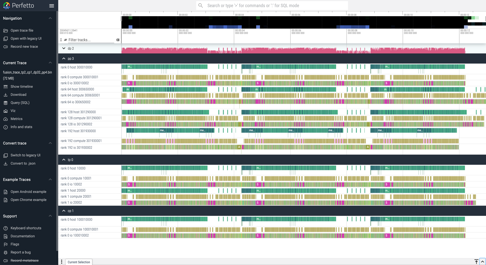

# xpu-timer: Easy Profiling for Distributed Training

xpu-timer is a profiling tool specifically designed for **distributed training tasks**, aimed at solving the following problems:
- Difficulty in aggregating and analyzing performance for distributed tasks
- Training slowdown and hotspot machine investigation
- Training hangs

offering the following features:

- Aggregates and reports performance metrics for **matrix multiplication/collective communication/device memory** to Prometheus.
- Dumps performance data for **matrix multiplication/collective communication/device memory**, provides timeline visualization, and basic performance analysis tools:
  - Performance comparison across different timelines.
  - Analysis/replay for matrix multiplication performance.
  - Analysis for NCCL performance.
  - Compact data size with low storage overhead.
- Traces arbitrary Python functions with dynamic injection capability, including built-in analysis for `gc` and `torch.dataloader`.
- Detects and locates training hangs, with runtime stack visualization for all tasks.
- Captures training process anomalies with plugin-based reporting for Python and LWP thread exceptions.
- Requires **no modification** to user code and operates as a fully transparent tool.
- **Low overhead (0.5%)**; it resides in the training process with an external management interface for on-demand profiling. Overhead is **0%** when aggregation statistics are not needed.
- Supports various hardware platforms and training frameworks(deepspeed/megatron, TF/jax should work, but not tested).
- **Lazy initialization**: Will not start if the process does not invoke the GPU.


## Limitations

- Supports only Linux systems.
- Training frameworks must dynamically link device libraries (e.g., PyTorch requires dynamically linking `libcudart.so`; `libnccl` also requires `libcudart.so`).
- NCCL version must be ≤ 2.21.5.
- Python tracing is incompatible with the Torch profiler, causing errors when Torch traces Python stacks.

## Installation

Compilation is recommended for installation, using Bazelisk as the build tool. Please ensure Bazelisk is installed.

```bash
bash build.sh nvidia --ssl-path /home/to/openssl --sdk-path /home/to/cuda --build-type release
```

Successful builds generate wheel packages in the `dist_bin` directory. For example, the NVIDIA build produces:

1. **py_xpu_timer-1.0+cu121-cp38-cp38-linux_x86_64.whl**: Used in training processes. Depends on Python/CUDA versions; newer CUDA versions are backward-compatible.
2. **py_xpu_timer-1.0+lite-py3-none-any.whl**: Provides timeline generation and analysis tools, independent of Python versions.

```bash
#ls -l dist_bin
total 19084
-rw-r--r-- 1 root root 6409057 Nov 29 16:46 py_xpu_timer-1.0+cu121-cp38-cp38-linux_x86_64.whl
-rw-r--r-- 1 root root 3351436 Nov 29 16:46 py_xpu_timer-1.0+lite-py3-none-any.whl
```


## Usage

### Launching Scripts

Prepend `xpu_timer_launch` to your training script. This is suitable for simple commands. For complex commands, wrap the training task in a shell script.

```bash
xpu_timer_launch python training.script
```


### Metric Reporting

When xpu-timer starts, it launches a daemon process that opens two ports by default:

- **18888**: For external management.
- **18889**: For exposing Prometheus metrics.

Use `curl 127.0.0.1:18889/metrics` to view current metrics, which include:

- Matrix bucket TFLOPS and collective communication bucket bus bandwidth.
- Matrix/collective communication bucket latency (max/min/avg/p99, in microseconds).
- Device memory copy/GC/dataloader counters.
- Whether the training job is hanging.

<details>
<summary>Click to expand detailed metrics</summary>

Below is an example of metrics for a 2-GPU test. Real training with multiple GPUs typically generates around 100 metrics:

- **XPU_TIMER_COMMON_HANG**: Indicates whether the training has hung.
- **XPU_TIMER_COMMON_DATA_LOADER_COUNT**: The number of calls to the Torch DataLoader.
- **XPU_TIMER_COMMON_GC_COUNT**: The number of garbage collection (GC) calls.

The metric levels are bucketed based on operation throughput to prevent a dimensional explosion in Prometheus.


```bash
# TYPE XPU_TIMER_COLL_KERNEL_AVG_LATENCY gauge
XPU_TIMER_COLL_KERNEL_AVG_LATENCY{algorithm="RING_LL",dtype="fp16",ip="NOT_SET",job_name="NOT_SET",level="3",local_rank="1",operation="AllReduce",pod_name="NOT_SET",rank="1",small="0",transport="IntraNode"} 370
XPU_TIMER_COLL_KERNEL_AVG_LATENCY{algorithm="RING_LL",dtype="fp16",ip="NOT_SET",job_name="NOT_SET",level="3",local_rank="1",operation="AllGather",pod_name="NOT_SET",rank="1",small="0",transport="IntraNode"} 388
XPU_TIMER_COLL_KERNEL_AVG_LATENCY{algorithm="RING_LL",dtype="fp16",ip="NOT_SET",job_name="NOT_SET",level="3",local_rank="0",operation="AllGather",pod_name="NOT_SET",rank="0",small="0",transport="IntraNode"} 388
XPU_TIMER_COLL_KERNEL_AVG_LATENCY{algorithm="RING_LL",dtype="fp16",ip="NOT_SET",job_name="NOT_SET",level="3",local_rank="0",operation="AllReduce",pod_name="NOT_SET",rank="0",small="0",transport="IntraNode"} 365
XPU_TIMER_COLL_KERNEL_AVG_LATENCY{algorithm="RING_LL",dtype="fp16",ip="NOT_SET",job_name="NOT_SET",level="2",local_rank="1",operation="AllReduce",pod_name="NOT_SET",rank="1",small="0",transport="IntraNode"} 534
XPU_TIMER_COLL_KERNEL_AVG_LATENCY{algorithm="RING_LL",dtype="fp16",ip="NOT_SET",job_name="NOT_SET",level="1",local_rank="1",operation="AllReduce",pod_name="NOT_SET",rank="1",small="0",transport="IntraNode"} 66
XPU_TIMER_COLL_KERNEL_AVG_LATENCY{algorithm="RING_LL",dtype="fp16",ip="NOT_SET",job_name="NOT_SET",level="1",local_rank="0",operation="AllReduce",pod_name="NOT_SET",rank="0",small="0",transport="IntraNode"} 41
XPU_TIMER_COLL_KERNEL_AVG_LATENCY{algorithm="RING_LL",dtype="fp16",ip="NOT_SET",job_name="NOT_SET",level="2",local_rank="1",operation="AllGather",pod_name="NOT_SET",rank="1",small="0",transport="IntraNode"} 561
XPU_TIMER_COLL_KERNEL_AVG_LATENCY{algorithm="RING_LL",dtype="fp16",ip="NOT_SET",job_name="NOT_SET",level="1",local_rank="1",operation="AllGather",pod_name="NOT_SET",rank="1",small="0",transport="IntraNode"} 67
XPU_TIMER_COLL_KERNEL_AVG_LATENCY{algorithm="RING_LL",dtype="fp16",ip="NOT_SET",job_name="NOT_SET",level="2",local_rank="0",operation="AllGather",pod_name="NOT_SET",rank="0",small="0",transport="IntraNode"} 736
XPU_TIMER_COLL_KERNEL_AVG_LATENCY{algorithm="RING_LL",dtype="fp16",ip="NOT_SET",job_name="NOT_SET",level="1",local_rank="0",operation="AllGather",pod_name="NOT_SET",rank="0",small="0",transport="IntraNode"} 43
# TYPE XPU_TIMER_COLL_KERNEL_MAX_LATENCY gauge
XPU_TIMER_COLL_KERNEL_MAX_LATENCY{algorithm="RING_LL",dtype="fp16",ip="NOT_SET",job_name="NOT_SET",level="3",local_rank="1",operation="AllReduce",pod_name="NOT_SET",rank="1",small="0",transport="IntraNode"} 374
XPU_TIMER_COLL_KERNEL_MAX_LATENCY{algorithm="RING_LL",dtype="fp16",ip="NOT_SET",job_name="NOT_SET",level="3",local_rank="1",operation="AllGather",pod_name="NOT_SET",rank="1",small="0",transport="IntraNode"} 389
XPU_TIMER_COLL_KERNEL_MAX_LATENCY{algorithm="RING_LL",dtype="fp16",ip="NOT_SET",job_name="NOT_SET",level="3",local_rank="0",operation="AllGather",pod_name="NOT_SET",rank="0",small="0",transport="IntraNode"} 391
XPU_TIMER_COLL_KERNEL_MAX_LATENCY{algorithm="RING_LL",dtype="fp16",ip="NOT_SET",job_name="NOT_SET",level="3",local_rank="0",operation="AllReduce",pod_name="NOT_SET",rank="0",small="0",transport="IntraNode"} 376
XPU_TIMER_COLL_KERNEL_MAX_LATENCY{algorithm="RING_LL",dtype="fp16",ip="NOT_SET",job_name="NOT_SET",level="2",local_rank="1",operation="AllReduce",pod_name="NOT_SET",rank="1",small="0",transport="IntraNode"} 543
XPU_TIMER_COLL_KERNEL_MAX_LATENCY{algorithm="RING_LL",dtype="fp16",ip="NOT_SET",job_name="NOT_SET",level="1",local_rank="1",operation="AllReduce",pod_name="NOT_SET",rank="1",small="0",transport="IntraNode"} 87
XPU_TIMER_COLL_KERNEL_MAX_LATENCY{algorithm="RING_LL",dtype="fp16",ip="NOT_SET",job_name="NOT_SET",level="1",local_rank="0",operation="AllReduce",pod_name="NOT_SET",rank="0",small="0",transport="IntraNode"} 93
XPU_TIMER_COLL_KERNEL_MAX_LATENCY{algorithm="RING_LL",dtype="fp16",ip="NOT_SET",job_name="NOT_SET",level="2",local_rank="1",operation="AllGather",pod_name="NOT_SET",rank="1",small="0",transport="IntraNode"} 562
XPU_TIMER_COLL_KERNEL_MAX_LATENCY{algorithm="RING_LL",dtype="fp16",ip="NOT_SET",job_name="NOT_SET",level="1",local_rank="1",operation="AllGather",pod_name="NOT_SET",rank="1",small="0",transport="IntraNode"} 74
XPU_TIMER_COLL_KERNEL_MAX_LATENCY{algorithm="RING_LL",dtype="fp16",ip="NOT_SET",job_name="NOT_SET",level="2",local_rank="0",operation="AllGather",pod_name="NOT_SET",rank="0",small="0",transport="IntraNode"} 772
XPU_TIMER_COLL_KERNEL_MAX_LATENCY{algorithm="RING_LL",dtype="fp16",ip="NOT_SET",job_name="NOT_SET",level="1",local_rank="0",operation="AllGather",pod_name="NOT_SET",rank="0",small="0",transport="IntraNode"} 76
# TYPE XPU_TIMER_COLL_KERNEL_P99_LATENCY gauge
XPU_TIMER_COLL_KERNEL_P99_LATENCY{algorithm="RING_LL",dtype="fp16",ip="NOT_SET",job_name="NOT_SET",level="3",local_rank="1",operation="AllReduce",pod_name="NOT_SET",rank="1",small="0",transport="IntraNode"} 373
XPU_TIMER_COLL_KERNEL_P99_LATENCY{algorithm="RING_LL",dtype="fp16",ip="NOT_SET",job_name="NOT_SET",level="3",local_rank="1",operation="AllGather",pod_name="NOT_SET",rank="1",small="0",transport="IntraNode"} 389
XPU_TIMER_COLL_KERNEL_P99_LATENCY{algorithm="RING_LL",dtype="fp16",ip="NOT_SET",job_name="NOT_SET",level="3",local_rank="0",operation="AllGather",pod_name="NOT_SET",rank="0",small="0",transport="IntraNode"} 391
XPU_TIMER_COLL_KERNEL_P99_LATENCY{algorithm="RING_LL",dtype="fp16",ip="NOT_SET",job_name="NOT_SET",level="3",local_rank="0",operation="AllReduce",pod_name="NOT_SET",rank="0",small="0",transport="IntraNode"} 376
XPU_TIMER_COLL_KERNEL_P99_LATENCY{algorithm="RING_LL",dtype="fp16",ip="NOT_SET",job_name="NOT_SET",level="2",local_rank="1",operation="AllReduce",pod_name="NOT_SET",rank="1",small="0",transport="IntraNode"} 543
XPU_TIMER_COLL_KERNEL_P99_LATENCY{algorithm="RING_LL",dtype="fp16",ip="NOT_SET",job_name="NOT_SET",level="1",local_rank="1",operation="AllReduce",pod_name="NOT_SET",rank="1",small="0",transport="IntraNode"} 84
XPU_TIMER_COLL_KERNEL_P99_LATENCY{algorithm="RING_LL",dtype="fp16",ip="NOT_SET",job_name="NOT_SET",level="1",local_rank="0",operation="AllReduce",pod_name="NOT_SET",rank="0",small="0",transport="IntraNode"} 93
XPU_TIMER_COLL_KERNEL_P99_LATENCY{algorithm="RING_LL",dtype="fp16",ip="NOT_SET",job_name="NOT_SET",level="2",local_rank="1",operation="AllGather",pod_name="NOT_SET",rank="1",small="0",transport="IntraNode"} 562
XPU_TIMER_COLL_KERNEL_P99_LATENCY{algorithm="RING_LL",dtype="fp16",ip="NOT_SET",job_name="NOT_SET",level="1",local_rank="1",operation="AllGather",pod_name="NOT_SET",rank="1",small="0",transport="IntraNode"} 74
XPU_TIMER_COLL_KERNEL_P99_LATENCY{algorithm="RING_LL",dtype="fp16",ip="NOT_SET",job_name="NOT_SET",level="2",local_rank="0",operation="AllGather",pod_name="NOT_SET",rank="0",small="0",transport="IntraNode"} 772
XPU_TIMER_COLL_KERNEL_P99_LATENCY{algorithm="RING_LL",dtype="fp16",ip="NOT_SET",job_name="NOT_SET",level="1",local_rank="0",operation="AllGather",pod_name="NOT_SET",rank="0",small="0",transport="IntraNode"} 76
# TYPE XPU_TIMER_COLL_KERNEL_MIN_LATENCY gauge
XPU_TIMER_COLL_KERNEL_MIN_LATENCY{algorithm="RING_LL",dtype="fp16",ip="NOT_SET",job_name="NOT_SET",level="3",local_rank="1",operation="AllReduce",pod_name="NOT_SET",rank="1",small="0",transport="IntraNode"} 368
XPU_TIMER_COLL_KERNEL_MIN_LATENCY{algorithm="RING_LL",dtype="fp16",ip="NOT_SET",job_name="NOT_SET",level="3",local_rank="1",operation="AllGather",pod_name="NOT_SET",rank="1",small="0",transport="IntraNode"} 388
XPU_TIMER_COLL_KERNEL_MIN_LATENCY{algorithm="RING_LL",dtype="fp16",ip="NOT_SET",job_name="NOT_SET",level="3",local_rank="0",operation="AllGather",pod_name="NOT_SET",rank="0",small="0",transport="IntraNode"} 388
XPU_TIMER_COLL_KERNEL_MIN_LATENCY{algorithm="RING_LL",dtype="fp16",ip="NOT_SET",job_name="NOT_SET",level="3",local_rank="0",operation="AllReduce",pod_name="NOT_SET",rank="0",small="0",transport="IntraNode"} 361
XPU_TIMER_COLL_KERNEL_MIN_LATENCY{algorithm="RING_LL",dtype="fp16",ip="NOT_SET",job_name="NOT_SET",level="2",local_rank="1",operation="AllReduce",pod_name="NOT_SET",rank="1",small="0",transport="IntraNode"} 516
XPU_TIMER_COLL_KERNEL_MIN_LATENCY{algorithm="RING_LL",dtype="fp16",ip="NOT_SET",job_name="NOT_SET",level="1",local_rank="1",operation="AllReduce",pod_name="NOT_SET",rank="1",small="0",transport="IntraNode"} 47
XPU_TIMER_COLL_KERNEL_MIN_LATENCY{algorithm="RING_LL",dtype="fp16",ip="NOT_SET",job_name="NOT_SET",level="1",local_rank="0",operation="AllReduce",pod_name="NOT_SET",rank="0",small="0",transport="IntraNode"} 23
XPU_TIMER_COLL_KERNEL_MIN_LATENCY{algorithm="RING_LL",dtype="fp16",ip="NOT_SET",job_name="NOT_SET",level="2",local_rank="1",operation="AllGather",pod_name="NOT_SET",rank="1",small="0",transport="IntraNode"} 561
XPU_TIMER_COLL_KERNEL_MIN_LATENCY{algorithm="RING_LL",dtype="fp16",ip="NOT_SET",job_name="NOT_SET",level="1",local_rank="1",operation="AllGather",pod_name="NOT_SET",rank="1",small="0",transport="IntraNode"} 52
XPU_TIMER_COLL_KERNEL_MIN_LATENCY{algorithm="RING_LL",dtype="fp16",ip="NOT_SET",job_name="NOT_SET",level="2",local_rank="0",operation="AllGather",pod_name="NOT_SET",rank="0",small="0",transport="IntraNode"} 730
XPU_TIMER_COLL_KERNEL_MIN_LATENCY{algorithm="RING_LL",dtype="fp16",ip="NOT_SET",job_name="NOT_SET",level="1",local_rank="0",operation="AllGather",pod_name="NOT_SET",rank="0",small="0",transport="IntraNode"} 31
# TYPE XPU_TIMER_COLL_KERNEL_BANDWIDTH gauge
XPU_TIMER_COLL_KERNEL_BANDWIDTH{algorithm="RING_LL",dtype="fp16",ip="NOT_SET",job_name="NOT_SET",level="3",local_rank="1",operation="AllReduce",pod_name="NOT_SET",rank="1",small="0",transport="IntraNode"} 45.93095417789758
XPU_TIMER_COLL_KERNEL_BANDWIDTH{algorithm="RING_LL",dtype="fp16",ip="NOT_SET",job_name="NOT_SET",level="3",local_rank="1",operation="AllGather",pod_name="NOT_SET",rank="1",small="0",transport="IntraNode"} 43.85070509521358
XPU_TIMER_COLL_KERNEL_BANDWIDTH{algorithm="RING_LL",dtype="fp16",ip="NOT_SET",job_name="NOT_SET",level="3",local_rank="0",operation="AllGather",pod_name="NOT_SET",rank="0",small="0",transport="IntraNode"} 43.79435620663069
XPU_TIMER_COLL_KERNEL_BANDWIDTH{algorithm="RING_LL",dtype="fp16",ip="NOT_SET",job_name="NOT_SET",level="3",local_rank="0",operation="AllReduce",pod_name="NOT_SET",rank="0",small="0",transport="IntraNode"} 46.59294149846048
XPU_TIMER_COLL_KERNEL_BANDWIDTH{algorithm="RING_LL",dtype="fp16",ip="NOT_SET",job_name="NOT_SET",level="2",local_rank="1",operation="AllReduce",pod_name="NOT_SET",rank="1",small="0",transport="IntraNode"} 31.8160403813797
XPU_TIMER_COLL_KERNEL_BANDWIDTH{algorithm="RING_LL",dtype="fp16",ip="NOT_SET",job_name="NOT_SET",level="1",local_rank="1",operation="AllReduce",pod_name="NOT_SET",rank="1",small="0",transport="IntraNode"} 2.603336643495531
XPU_TIMER_COLL_KERNEL_BANDWIDTH{algorithm="RING_LL",dtype="fp16",ip="NOT_SET",job_name="NOT_SET",level="1",local_rank="0",operation="AllReduce",pod_name="NOT_SET",rank="0",small="0",transport="IntraNode"} 4.204587008821171
XPU_TIMER_COLL_KERNEL_BANDWIDTH{algorithm="RING_LL",dtype="fp16",ip="NOT_SET",job_name="NOT_SET",level="2",local_rank="1",operation="AllGather",pod_name="NOT_SET",rank="1",small="0",transport="IntraNode"} 30.33042238460168
XPU_TIMER_COLL_KERNEL_BANDWIDTH{algorithm="RING_LL",dtype="fp16",ip="NOT_SET",job_name="NOT_SET",level="1",local_rank="1",operation="AllGather",pod_name="NOT_SET",rank="1",small="0",transport="IntraNode"} 2.566382770435634
XPU_TIMER_COLL_KERNEL_BANDWIDTH{algorithm="RING_LL",dtype="fp16",ip="NOT_SET",job_name="NOT_SET",level="2",local_rank="0",operation="AllGather",pod_name="NOT_SET",rank="0",small="0",transport="IntraNode"} 23.14064270498119

# TYPE XPU_TIMER_MM_KERNEL_AVG_LATENCY gauge
XPU_TIMER_MM_KERNEL_AVG_LATENCY{dtype="bf16",ip="NOT_SET",job_name="NOT_SET",level="3",local_rank="1",operation="Matmul",pod_name="NOT_SET",rank="1"} 813
XPU_TIMER_MM_KERNEL_AVG_LATENCY{dtype="bf16",ip="NOT_SET",job_name="NOT_SET",level="3",local_rank="0",operation="Matmul",pod_name="NOT_SET",rank="0"} 814
# TYPE XPU_TIMER_MM_KERNEL_MAX_LATENCY gauge
XPU_TIMER_MM_KERNEL_MAX_LATENCY{dtype="bf16",ip="NOT_SET",job_name="NOT_SET",level="3",local_rank="1",operation="Matmul",pod_name="NOT_SET",rank="1"} 1175
XPU_TIMER_MM_KERNEL_MAX_LATENCY{dtype="bf16",ip="NOT_SET",job_name="NOT_SET",level="3",local_rank="0",operation="Matmul",pod_name="NOT_SET",rank="0"} 1175
# TYPE XPU_TIMER_MM_KERNEL_P99_LATENCY gauge
XPU_TIMER_MM_KERNEL_P99_LATENCY{dtype="bf16",ip="NOT_SET",job_name="NOT_SET",level="3",local_rank="1",operation="Matmul",pod_name="NOT_SET",rank="1"} 1175
XPU_TIMER_MM_KERNEL_P99_LATENCY{dtype="bf16",ip="NOT_SET",job_name="NOT_SET",level="3",local_rank="0",operation="Matmul",pod_name="NOT_SET",rank="0"} 1175
# TYPE XPU_TIMER_MM_KERNEL_MIN_LATENCY gauge
XPU_TIMER_MM_KERNEL_MIN_LATENCY{dtype="bf16",ip="NOT_SET",job_name="NOT_SET",level="3",local_rank="1",operation="Matmul",pod_name="NOT_SET",rank="1"} 451
XPU_TIMER_MM_KERNEL_MIN_LATENCY{dtype="bf16",ip="NOT_SET",job_name="NOT_SET",level="3",local_rank="0",operation="Matmul",pod_name="NOT_SET",rank="0"} 451
# TYPE XPU_TIMER_MM_KERNEL_FLOPS gauge
XPU_TIMER_MM_KERNEL_FLOPS{dtype="bf16",ip="NOT_SET",job_name="NOT_SET",level="3",local_rank="1",operation="Matmul",pod_name="NOT_SET",rank="1"} 5.280589286285117
XPU_TIMER_MM_KERNEL_FLOPS{dtype="bf16",ip="NOT_SET",job_name="NOT_SET",level="3",local_rank="0",operation="Matmul",pod_name="NOT_SET",rank="0"} 5.275724476108587
# TYPE XPU_TIMER_COMMON_HANG gauge
XPU_TIMER_COMMON_HANG{ip="NOT_SET",job_name="NOT_SET",local_rank="1",pod_name="NOT_SET",rank="1"} 0
XPU_TIMER_COMMON_HANG{ip="NOT_SET",job_name="NOT_SET",local_rank="0",pod_name="NOT_SET",rank="0"} 0
# TYPE XPU_TIMER_COMMON_START_DUMP gauge
XPU_TIMER_COMMON_START_DUMP{ip="NOT_SET",job_name="NOT_SET",local_rank="1",pod_name="NOT_SET",rank="1"} 0
XPU_TIMER_COMMON_START_DUMP{ip="NOT_SET",job_name="NOT_SET",local_rank="0",pod_name="NOT_SET",rank="0"} 0
# TYPE XPU_TIMER_COMMON_END_DUMP gauge
XPU_TIMER_COMMON_END_DUMP{ip="NOT_SET",job_name="NOT_SET",local_rank="1",pod_name="NOT_SET",rank="1"} 0
XPU_TIMER_COMMON_END_DUMP{ip="NOT_SET",job_name="NOT_SET",local_rank="0",pod_name="NOT_SET",rank="0"} 0
# TYPE XPU_TIMER_COMMON_POOL_QUEUE_SIZE gauge
XPU_TIMER_COMMON_POOL_QUEUE_SIZE{ip="NOT_SET",job_name="NOT_SET",local_rank="1",pod_name="NOT_SET",rank="1"} 12
XPU_TIMER_COMMON_POOL_QUEUE_SIZE{ip="NOT_SET",job_name="NOT_SET",local_rank="0",pod_name="NOT_SET",rank="0"} 13
# TYPE XPU_TIMER_COMMON_WORK_QUEUE_SIZE gauge
XPU_TIMER_COMMON_WORK_QUEUE_SIZE{ip="NOT_SET",job_name="NOT_SET",local_rank="1",pod_name="NOT_SET",rank="1"} 2
XPU_TIMER_COMMON_WORK_QUEUE_SIZE{ip="NOT_SET",job_name="NOT_SET",local_rank="0",pod_name="NOT_SET",rank="0"} 1
# TYPE XPU_TIMER_COMMON_GC_COUNT gauge
XPU_TIMER_COMMON_GC_COUNT{ip="NOT_SET",job_name="NOT_SET",local_rank="1",pod_name="NOT_SET",rank="1"} 3
XPU_TIMER_COMMON_GC_COUNT{ip="NOT_SET",job_name="NOT_SET",local_rank="0",pod_name="NOT_SET",rank="0"} 3
# TYPE XPU_TIMER_COMMON_DATA_LOADER_COUNT gauge
XPU_TIMER_COMMON_DATA_LOADER_COUNT{ip="NOT_SET",job_name="NOT_SET",local_rank="1",pod_name="NOT_SET",rank="1"} 0
XPU_TIMER_COMMON_DATA_LOADER_COUNT{ip="NOT_SET",job_name="NOT_SET",local_rank="0",pod_name="NOT_SET",rank="0"} 0
```
</details>

### Dumping Timelines

Use port **18888** to trigger timeline dumps. Key parameters:

- `dump_path`: Directory to save the dump (created if non-existent).
- `dump_count`: Number of events to trace; each matrix multiplication or NCCL operation counts as one event.
- `dump_time`: UTC timestamp for synchronous dumping across workers.
- `dump_kernel_type`: Bitmask for selecting data types to dump (default: all enabled).
  - Bit 0: Dump matrix multiplication.
  - Bit 1: Dump NCCL.
  - Bit 2: Dump host functions.

To trace Python functions, set the `XPU_TIMER_HOST_TRACING_FUNC` environment variable before process startup. Use formats like:

1. `module@object@function` (e.g., `torch.utils.data.dataloader@_BaseDataLoaderIter@__next__`).
2. `module@object` (e.g., `torch.distributed.all_gather`).
3. `object` (global functions, usually defined in entry files).
4. Separate multiple functions with commas.

```bash
XPU_TIMER_HOST_TRACING_FUNC=torch@distributed@all_reduce,torch@distributed@broadcast
```

Trigger the dump:

```bash
curl -H 'Content-Type: application/json' -d "{\"dump_path\":\"/root/output\", \"dump_count\": 10000, \"dump_time\": $(date +%s), \"dump_kernel_type\": 7}" 127.0.0.1:18888/HostingService/DumpKernelTrace
```


```bash
#ls -l
total 224
-rw-r--r-- 1 root root 110260 Nov 29 11:17 00000-00002.timeline
-rw-r--r-- 1 root root   2111 Nov 29 11:17 00000-00002.timeline.meta
-rw-r--r-- 1 root root 110319 Nov 29 11:17 00001-00002.timeline
-rw-r--r-- 1 root root   2111 Nov 29 11:17 00001-00002.timeline.meta
```


After dumping, generate the timeline:

```bash
xpu_timer_gen_trace_timeline --path /root/output
```
```bash
optional arguments:
  -h, --help            show this help message and exit
  --path PATH, -p PATH
  --no-matmul
  --no-nccl
  -c C
  --timeline-version TIMELINE_VERSION
  --no-launchtime
  --groups GROUPS       Group configurations like "tp4-cp2-dp4-pp2"
  --output OUTPUT       Output name for timeline file
```

By default, the timeline is generated based on the entire data parallel (dp) group. If you are using 3D parallelism, you can input the group order according to Megatron's group configuration. The default communication group priority is `tp-cp-dp-pp`. You can enable concurrency with the `-c` option, which defaults to 16.

In timeline, all nccl operations in same communicator will be marked together.


<details>
<summary>Click to view timeline examples</summary>

> a timeline with 2 gpus
```bash
# xpu_timer_gen_trace_timeline 
git commit is da98fe70877a77128cee8b9bdd0414d5107ce862
build time is 2024-11-29 10:08:09
build type is release
build platform is NVIDIA
build platform version is cu121
generate perfetto timeline for dp with parallel16: 100%|##############################################################################################| 2/2 [00:00<00:00,  4.74it/s]
Write dp: 100%|######################################################################################################################################| 2/2 [00:00<00:00, 131.42it/s]
Serizlize tarce to bytes, it's slow...
Serializing to ./matmul_dp2.bin: 100%|##########################################################################################################| 8.28k/8.28k [00:00<00:00, 107MB/s]
Stack count is low (0). Did something go wrong?
ERROR: No stack counts found

#ls -lh
total 832K
-rw-r--r-- 1 root root 108K Nov 29 11:17 00000-00002.timeline
-rw-r--r-- 1 root root 2.1K Nov 29 11:17 00000-00002.timeline.meta
-rw-r--r-- 1 root root 108K Nov 29 11:17 00001-00002.timeline
-rw-r--r-- 1 root root 2.1K Nov 29 11:17 00001-00002.timeline.meta
-rw-r--r-- 1 root root 8.1K Nov 29 21:03 matmul_dp2.bin  <---------- matmul playback data
-rw-r--r-- 1 root root    0 Nov 29 21:03 merged_tracing_kernel_stack  <------ call stack data, disabled by default
-rw-r--r-- 1 root root 586K Nov 29 21:03 trace_dp2.bin  <--------- timeline
-rw-r--r-- 1 root root  579 Nov 29 21:03 tracing_kernel_stack.svg  <------ call stack data, disabled by default

```

Visualize timelines at [Perfetto UI](https://ui.perfetto.dev/), load the `trace_dp2.bin`


> a timeline with tp4-dp58-pp4

Only the first communication group in each parallel group will be visualized.




</details>

### Hang Detection

xpu-timer periodically checks if matrix multiplication or NCCL kernels hang. If kernels taking over 300 seconds, xpu-timer will run `py-spy` and `pstack/gdb` to dump all Python/LWP stacks and dumping to `/root/timeline`. Set `XPU_TIMER_HANG_TIMEOUT` to adjust the timeout.

Run the stacktrace viewer:

```bash
xpu_timer_stacktrace_viewer --path /path/to/stack
```

The output will include `cpp_stack.svg` and `py_stack.svg`.

Each layer of the call stack undergoes rank merging, with the format:

`func@source_path@stuck_rank|leak_rank`

1. **func**: The current function name. If `gdb` cannot retrieve it, it will display `??`.
2. **source_path**: The address of the symbol in the process, such as a shared object (`.so`) or source file.
3. **stuck_rank**: The ranks whose stacks have reached this point. Consecutive rank numbers are folded into a range (e.g., `rank 0,1,2,3` → `0-3`).
4. **leak_rank**: The ranks whose stacks have not reached this point. Rank numbers are also folded into ranges.

The merged stack is visualized with different colors to distinguish stack types. In Python stacks, the colors are typically cyan and green:

1. **Cyan**: CPython/Python.
2. **Red**: C/system-related.
3. **Green**: Torch/NCCL.
4. **Yellow**: C++.
5. **Purple**: Process state.


```bash

#ls -l
total 2400
-rw-r--r-- 1 root root 352105 Nov 30 09:18 00000-00008.stacktrace
-rw-r--r-- 1 root root 175643 Nov 30 09:18 00001-00008.stacktrace
-rw-r--r-- 1 root root 351610 Nov 30 09:18 00002-00008.stacktrace
-rw-r--r-- 1 root root 197734 Nov 30 09:18 00003-00008.stacktrace
-rw-r--r-- 1 root root 347217 Nov 30 09:18 00004-00008.stacktrace
-rw-r--r-- 1 root root 171251 Nov 30 09:18 00005-00008.stacktrace
-rw-r--r-- 1 root root 359732 Nov 30 09:18 00006-00008.stacktrace
-rw-r--r-- 1 root root 194859 Nov 30 09:18 00007-00008.stacktrace
-rw-r--r-- 1 root root  89136 Nov 30 09:27 cpp_stack
-rw-r--r-- 1 root root 171114 Nov 30 09:27 cpp_stack.svg
-rw-r--r-- 1 root root   6009 Nov 30 09:27 py_stack
-rw-r--r-- 1 root root  27167 Nov 30 09:27 py_stack.svg

```

<details>
<summary>Click to expand stack examples</summary>

In this example, only `rank6` performed a barrier operation to simulate an actual hang scenario.


</details>

### Process Exit Status Reporting

- **Python Status Reporting**: xpu-timer overrides `sys.excepthook` using the CPython API. Users should ensure their business logic does not overwrite this hook.
- **LWP Status Reporting**: xpu-timer registers the signals `SIGABRT`, `SIGBUS`, `SIGFPE`, `SIGPIPE`, `SIGSEGV`, and `SIGTERM`. Upon trigger, the original signal handler is still invoked, and errors from LWP are logged to `/tmp/xpu_hook{RANK}.log`.

The reporting system uses a file plugin for injection. User-defined plugins need to implement the following two functions:


```python
def xpu_timer_parse_python_exception(exc_type, exc_value, exc_traceback, infos):
    # type of args (type(e), e, e.__traceback__, dict)
    # infos = {
    #     "time": 1730289517,
    #     "rank": 1,
    #     "ip": "NOT_SET",
    #     "pod_name": "NOT_SET",
    #     "job_name": "NOT_SET",
    # }
    print("not impl")


def xpu_timer_parse_cpp_exception(stack_infos):
    stack_infos = {
        "signal": 6,
        "rank": 1,
        "ip": "",
        "pod_name": "NOT_SET",
        "job_name": "NOT_SET",
        "frame_infos": [
            {
                "address": 139980864896635,
                "offset": 139980861281622,
                "function_name": "xpu_timer::SignalHandler::pushSignal()"
            },
            {
                "address": 139980864896845,
                "offset": 123,
                "function_name": "xpu_timer::SignalHandler::customSignalHandler(int, siginfo_t*, void*)"
            },
            {
                "address": 139980864088528,
                "offset": 141,
                "function_name": "__restore_rt"
            },
            {
                "address": 139980861001525,
                "offset": 0,
                "function_name": "gsignal"
            },
            {
                "address": 139980860909783,
                "offset": 325,
                "function_name": "abort"
            },
            {
                "address": 139980841611008,
                "offset": 299,
                "function_name": "__gnu_cxx::__verbose_terminate_handler()"
            },
            {
                "address": 139980841604156,
                "offset": 192,
                "function_name": "__cxxabiv1::__terminate(void (*)())"
            },
            {
                "address": 139980841604238,
                "offset": 7,
                "function_name": "__cxxabiv1::__unexpected(void (*)())"
            },
            {
                "address": 139980841604149,
                "offset": 0,
                "function_name": "__cxxabiv1::__terminate(void (*)())"
            },
            {
                "address": 139975904543157,
                "offset": 0,
                "function_name": "c10d::ProcessGroupNCCL::ncclCommWatchdog() [clone .cold]"
            },
            {
                "address": 139980841725589,
                "offset": 291,
                "function_name": "execute_native_thread_routine"
            },
            {
                "address": 139980864042210,
                "offset": 26,
                "function_name": "start_thread"
            },
            {
                "address": 139980861801907,
                "offset": 226,
                "function_name": "clone"
            },
            {
                "address": 0,
                "offset": 67,
                "function_name": "??"
            }
        ],
        "time": 1730289517
    }
    print("not impl")
```

Register plugins using the following environment variable:

```bash
export XPU_TIMER_EXIT_HOOK_PLUGIN=/path/to/your.py,/another/py_plug.py
```

## Demo

You can use our devel image to run demo. All deps are installed.

```bash
docker run -it --rm --gpus all --entrypoint bash easydl/xpu-timer-dev:1.0

cd /build/demo/train_fsdp/
bash train.sh
```

And you can dump timeline through curl command, it will dump 2000 events to /root/output

```bash
curl -H 'Content-Type: application/json' -d "{\"dump_path\":\"/root/output\", \"dump_count\": 2000, \"dump_time\": $(date +%s), \"dump_kernel_type\": 7}" 127.0.0.1:18888/HostingService/DumpKernelTrace

cd /root/output
xpu_timer_gen_trace_timeline

```

1. **Build Docker Image**:

```bash
cd docker
docker build --tag xpu-timer:latest \
             --file Dockerfile .
```

2. **Compile xpu-timer**: After running the image, execute the following command:

```bash
bash build.sh nvidia
```

3. **Install xpu-timer**: Once compilation is complete, the wheel package will be generated in the `dist_bin` directory.

```bash
pip install dist_bin/py_xpu_timer-1.1+cu124-cp311-cp311-linux_x86_64.whl 
```

4. **Run xpu-timer**:

```bash
cd demo/train_fsdp
pip install -r requirements.txt
xpu_timer_launch python -m torch.distributed.launch --nproc_per_node=8 train_fsdp.py
```

After launching, you can use `curl 127.0.0.1:18889/metrics` to check metrics or use the control interface on port 18888 to issue commands to dump the timeline.


## FAQ

### xpu-timer is not booted

xpu-timer only boot when all gpus are used for training, you can set env var `XPU_TIMER_DEBUG_MODE=1` to skip this check.


### location of xpu-timer's log

```bash
ls -1 /tmp
xpu_hook.log.0
xpu_hook.log.1
xpu_hook.log.2
xpu_hook.log.3
xpu_hook.log.4
xpu_hook.log.5
xpu_hook.log.6
xpu_hook.log.7
xpu_timer_daemon.log
xpu_timer_daemon.pid
```

## Known Issues

- Using `transformer_engine` in 3D parallelism incurs a **5% performance impact**. [The reason is that during sequence parallelism in `te`, inserting a `cudaEvent` prevents `dw/dx` from overlapping.](https://github.com/NVIDIA/TransformerEngine/issues/1353)