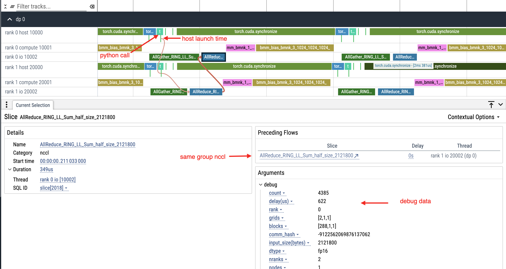
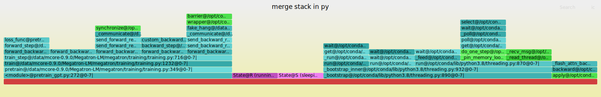

# xpu-timer: easy profiling for distributed training

xpu-timer 是一款专门用于 `分布式训练任务 `的 profiling 工具，用于解决
- 分布式任务难以聚合分析性能
- 训练降速，热点机排查
- 训练 hang

提供如下功能特性

- 聚合统计训练中的 `矩阵乘/集合通讯/device memory` 性能，并上报 prometheus
- dump `矩阵乘/集合通讯/device memory` 性能数据，并绘制 timeline 可视化，并提供基础性能分析工具
  - 不同 timeline 之间性能比对分析
  - matmul 性能分析/性能回放
  - nccl 性能分析
  - 数据量小，存储压力小
- trace 任意 python 函数，且可动态进行注入，内置 gc/torch.dataloader 分析
- 训练 hang 检测/定位，所有任务运行时栈可视化
- 训练进程异常截获，插件式上报 python/lwp 线程异常
- 无需修改用户代码，完全旁路
- 低开销(0.5%)，常驻于训练进程，并提供外部管控接口，随时 profile，如果不需要聚合统计功能则开销为 0%
- 可支持多种硬件平台(国产卡暂未开放)，多种训练框架(torch/deepspeed/megatron, TF/jax 等还未尝试)
- lazy init，如果进程没有调用 gpu，则不会启动


## 限制

- xpu-timer 只支持 linux 系统
- 训练框架需要动态链接设备库，如 pytorch 需要动态链接 libcudart.so，libnccl 也需要动态链接 libcudart.so
- nccl 版本需要 <= 2.21.5
- python tracing 使用了 `PyEval_SetProfile`，[pytorch 也用到了，因此与 torch profiler 不兼容](https://github.com/pytorch/pytorch/blob/d745b2b5163e821585d0701ebaf16a38f4d57eab/torch/csrc/profiler/orchestration/python_tracer.h#L35)，会导致 torch trace python stack 时报错

## 安装

安装推荐进行编译安装，构建工具使用 [bazelisk](https://github.com/bazelbuild/bazelisk)，请自行安装

```bash
bash build.sh nvidia --ssl-path /home/to/openssl --sdk-path /home/to/cuda --build-type release
```

构建成功后会在 `dist_bin` 中生成 wheel 包，以 nvidia 为例，会生成两个包

1. py_xpu_timer-1.0+cu121-cp38-cp38-linux_x86_64.whl 是训练进程所使用的包，与 python 版本/cuda 版本相关，原则上高版本 cuda 兼容低版本
2. py_xpu_timer-1.0+lite-py3-none-any.whl 是生成 timeline/分析工具的包，与 python 版本无关

```bash
#ls -l dist_bin
total 19084
-rw-r--r-- 1 root root 6409057 Nov 29 16:46 py_xpu_timer-1.0+cu121-cp38-cp38-linux_x86_64.whl
-rw-r--r-- 1 root root 3351436 Nov 29 16:46 py_xpu_timer-1.0+lite-py3-none-any.whl
```

## 使用

### 启动脚本

在训练脚本前加入 `xpu_timer_launch`，该方法适用于简单的命令，若命令复杂，请将训练任务包装到 shell 脚本中

```bash
xpu_timer_launch python training.script
```

### 指标投递

当 xpu-timer 启动后，会在机器中启动一个 daemon 进程，该进程默认会打开两个端口

- 18888 用于外部进行统一管控
- 18889 用于暴露 prometheus 指标

你可以 `curl 127.0.0.1:18889/metrics` 来查看当前的 metrics 指标，指标包含如下几种

- 矩阵分桶 TFLOPS，集合通讯分桶 bus bandwidth
- 矩阵/集合通讯的分桶 max/min/avg/p99 latency(单位微秒)
- device memory copy/gc/dataloader counter
- 训练作业是否 hang 住

<details>
<summary>点击展开指标详情</summary>

以下是一个 2 卡测试的指标，实际训练每卡大致产生 100 条指标

- XPU_TIMER_COMMON_HANG，训练是否 hang
- XPU_TIMER_COMMON_DATA_LOADER_COUNT，torch dataloader 调用次数
- XPU_TIMER_COMMON_GC_COUNT，gc 调用次数

指标中的 level 是按照操作的吞吐进行分桶，避免 prometheus 维度爆炸

```bash
# TYPE XPU_TIMER_COLL_KERNEL_AVG_LATENCY gauge
XPU_TIMER_COLL_KERNEL_AVG_LATENCY{algorithm="RING_LL",dtype="fp16",ip="NOT_SET",job_name="NOT_SET",level="3",local_rank="1",operation="AllReduce",pod_name="NOT_SET",rank="1",small="0",transport="IntraNode"} 370
XPU_TIMER_COLL_KERNEL_AVG_LATENCY{algorithm="RING_LL",dtype="fp16",ip="NOT_SET",job_name="NOT_SET",level="3",local_rank="1",operation="AllGather",pod_name="NOT_SET",rank="1",small="0",transport="IntraNode"} 388
XPU_TIMER_COLL_KERNEL_AVG_LATENCY{algorithm="RING_LL",dtype="fp16",ip="NOT_SET",job_name="NOT_SET",level="3",local_rank="0",operation="AllGather",pod_name="NOT_SET",rank="0",small="0",transport="IntraNode"} 388
XPU_TIMER_COLL_KERNEL_AVG_LATENCY{algorithm="RING_LL",dtype="fp16",ip="NOT_SET",job_name="NOT_SET",level="3",local_rank="0",operation="AllReduce",pod_name="NOT_SET",rank="0",small="0",transport="IntraNode"} 365
XPU_TIMER_COLL_KERNEL_AVG_LATENCY{algorithm="RING_LL",dtype="fp16",ip="NOT_SET",job_name="NOT_SET",level="2",local_rank="1",operation="AllReduce",pod_name="NOT_SET",rank="1",small="0",transport="IntraNode"} 534
XPU_TIMER_COLL_KERNEL_AVG_LATENCY{algorithm="RING_LL",dtype="fp16",ip="NOT_SET",job_name="NOT_SET",level="1",local_rank="1",operation="AllReduce",pod_name="NOT_SET",rank="1",small="0",transport="IntraNode"} 66
XPU_TIMER_COLL_KERNEL_AVG_LATENCY{algorithm="RING_LL",dtype="fp16",ip="NOT_SET",job_name="NOT_SET",level="1",local_rank="0",operation="AllReduce",pod_name="NOT_SET",rank="0",small="0",transport="IntraNode"} 41
XPU_TIMER_COLL_KERNEL_AVG_LATENCY{algorithm="RING_LL",dtype="fp16",ip="NOT_SET",job_name="NOT_SET",level="2",local_rank="1",operation="AllGather",pod_name="NOT_SET",rank="1",small="0",transport="IntraNode"} 561
XPU_TIMER_COLL_KERNEL_AVG_LATENCY{algorithm="RING_LL",dtype="fp16",ip="NOT_SET",job_name="NOT_SET",level="1",local_rank="1",operation="AllGather",pod_name="NOT_SET",rank="1",small="0",transport="IntraNode"} 67
XPU_TIMER_COLL_KERNEL_AVG_LATENCY{algorithm="RING_LL",dtype="fp16",ip="NOT_SET",job_name="NOT_SET",level="2",local_rank="0",operation="AllGather",pod_name="NOT_SET",rank="0",small="0",transport="IntraNode"} 736
XPU_TIMER_COLL_KERNEL_AVG_LATENCY{algorithm="RING_LL",dtype="fp16",ip="NOT_SET",job_name="NOT_SET",level="1",local_rank="0",operation="AllGather",pod_name="NOT_SET",rank="0",small="0",transport="IntraNode"} 43
# TYPE XPU_TIMER_COLL_KERNEL_MAX_LATENCY gauge
XPU_TIMER_COLL_KERNEL_MAX_LATENCY{algorithm="RING_LL",dtype="fp16",ip="NOT_SET",job_name="NOT_SET",level="3",local_rank="1",operation="AllReduce",pod_name="NOT_SET",rank="1",small="0",transport="IntraNode"} 374
XPU_TIMER_COLL_KERNEL_MAX_LATENCY{algorithm="RING_LL",dtype="fp16",ip="NOT_SET",job_name="NOT_SET",level="3",local_rank="1",operation="AllGather",pod_name="NOT_SET",rank="1",small="0",transport="IntraNode"} 389
XPU_TIMER_COLL_KERNEL_MAX_LATENCY{algorithm="RING_LL",dtype="fp16",ip="NOT_SET",job_name="NOT_SET",level="3",local_rank="0",operation="AllGather",pod_name="NOT_SET",rank="0",small="0",transport="IntraNode"} 391
XPU_TIMER_COLL_KERNEL_MAX_LATENCY{algorithm="RING_LL",dtype="fp16",ip="NOT_SET",job_name="NOT_SET",level="3",local_rank="0",operation="AllReduce",pod_name="NOT_SET",rank="0",small="0",transport="IntraNode"} 376
XPU_TIMER_COLL_KERNEL_MAX_LATENCY{algorithm="RING_LL",dtype="fp16",ip="NOT_SET",job_name="NOT_SET",level="2",local_rank="1",operation="AllReduce",pod_name="NOT_SET",rank="1",small="0",transport="IntraNode"} 543
XPU_TIMER_COLL_KERNEL_MAX_LATENCY{algorithm="RING_LL",dtype="fp16",ip="NOT_SET",job_name="NOT_SET",level="1",local_rank="1",operation="AllReduce",pod_name="NOT_SET",rank="1",small="0",transport="IntraNode"} 87
XPU_TIMER_COLL_KERNEL_MAX_LATENCY{algorithm="RING_LL",dtype="fp16",ip="NOT_SET",job_name="NOT_SET",level="1",local_rank="0",operation="AllReduce",pod_name="NOT_SET",rank="0",small="0",transport="IntraNode"} 93
XPU_TIMER_COLL_KERNEL_MAX_LATENCY{algorithm="RING_LL",dtype="fp16",ip="NOT_SET",job_name="NOT_SET",level="2",local_rank="1",operation="AllGather",pod_name="NOT_SET",rank="1",small="0",transport="IntraNode"} 562
XPU_TIMER_COLL_KERNEL_MAX_LATENCY{algorithm="RING_LL",dtype="fp16",ip="NOT_SET",job_name="NOT_SET",level="1",local_rank="1",operation="AllGather",pod_name="NOT_SET",rank="1",small="0",transport="IntraNode"} 74
XPU_TIMER_COLL_KERNEL_MAX_LATENCY{algorithm="RING_LL",dtype="fp16",ip="NOT_SET",job_name="NOT_SET",level="2",local_rank="0",operation="AllGather",pod_name="NOT_SET",rank="0",small="0",transport="IntraNode"} 772
XPU_TIMER_COLL_KERNEL_MAX_LATENCY{algorithm="RING_LL",dtype="fp16",ip="NOT_SET",job_name="NOT_SET",level="1",local_rank="0",operation="AllGather",pod_name="NOT_SET",rank="0",small="0",transport="IntraNode"} 76
# TYPE XPU_TIMER_COLL_KERNEL_P99_LATENCY gauge
XPU_TIMER_COLL_KERNEL_P99_LATENCY{algorithm="RING_LL",dtype="fp16",ip="NOT_SET",job_name="NOT_SET",level="3",local_rank="1",operation="AllReduce",pod_name="NOT_SET",rank="1",small="0",transport="IntraNode"} 373
XPU_TIMER_COLL_KERNEL_P99_LATENCY{algorithm="RING_LL",dtype="fp16",ip="NOT_SET",job_name="NOT_SET",level="3",local_rank="1",operation="AllGather",pod_name="NOT_SET",rank="1",small="0",transport="IntraNode"} 389
XPU_TIMER_COLL_KERNEL_P99_LATENCY{algorithm="RING_LL",dtype="fp16",ip="NOT_SET",job_name="NOT_SET",level="3",local_rank="0",operation="AllGather",pod_name="NOT_SET",rank="0",small="0",transport="IntraNode"} 391
XPU_TIMER_COLL_KERNEL_P99_LATENCY{algorithm="RING_LL",dtype="fp16",ip="NOT_SET",job_name="NOT_SET",level="3",local_rank="0",operation="AllReduce",pod_name="NOT_SET",rank="0",small="0",transport="IntraNode"} 376
XPU_TIMER_COLL_KERNEL_P99_LATENCY{algorithm="RING_LL",dtype="fp16",ip="NOT_SET",job_name="NOT_SET",level="2",local_rank="1",operation="AllReduce",pod_name="NOT_SET",rank="1",small="0",transport="IntraNode"} 543
XPU_TIMER_COLL_KERNEL_P99_LATENCY{algorithm="RING_LL",dtype="fp16",ip="NOT_SET",job_name="NOT_SET",level="1",local_rank="1",operation="AllReduce",pod_name="NOT_SET",rank="1",small="0",transport="IntraNode"} 84
XPU_TIMER_COLL_KERNEL_P99_LATENCY{algorithm="RING_LL",dtype="fp16",ip="NOT_SET",job_name="NOT_SET",level="1",local_rank="0",operation="AllReduce",pod_name="NOT_SET",rank="0",small="0",transport="IntraNode"} 93
XPU_TIMER_COLL_KERNEL_P99_LATENCY{algorithm="RING_LL",dtype="fp16",ip="NOT_SET",job_name="NOT_SET",level="2",local_rank="1",operation="AllGather",pod_name="NOT_SET",rank="1",small="0",transport="IntraNode"} 562
XPU_TIMER_COLL_KERNEL_P99_LATENCY{algorithm="RING_LL",dtype="fp16",ip="NOT_SET",job_name="NOT_SET",level="1",local_rank="1",operation="AllGather",pod_name="NOT_SET",rank="1",small="0",transport="IntraNode"} 74
XPU_TIMER_COLL_KERNEL_P99_LATENCY{algorithm="RING_LL",dtype="fp16",ip="NOT_SET",job_name="NOT_SET",level="2",local_rank="0",operation="AllGather",pod_name="NOT_SET",rank="0",small="0",transport="IntraNode"} 772
XPU_TIMER_COLL_KERNEL_P99_LATENCY{algorithm="RING_LL",dtype="fp16",ip="NOT_SET",job_name="NOT_SET",level="1",local_rank="0",operation="AllGather",pod_name="NOT_SET",rank="0",small="0",transport="IntraNode"} 76
# TYPE XPU_TIMER_COLL_KERNEL_MIN_LATENCY gauge
XPU_TIMER_COLL_KERNEL_MIN_LATENCY{algorithm="RING_LL",dtype="fp16",ip="NOT_SET",job_name="NOT_SET",level="3",local_rank="1",operation="AllReduce",pod_name="NOT_SET",rank="1",small="0",transport="IntraNode"} 368
XPU_TIMER_COLL_KERNEL_MIN_LATENCY{algorithm="RING_LL",dtype="fp16",ip="NOT_SET",job_name="NOT_SET",level="3",local_rank="1",operation="AllGather",pod_name="NOT_SET",rank="1",small="0",transport="IntraNode"} 388
XPU_TIMER_COLL_KERNEL_MIN_LATENCY{algorithm="RING_LL",dtype="fp16",ip="NOT_SET",job_name="NOT_SET",level="3",local_rank="0",operation="AllGather",pod_name="NOT_SET",rank="0",small="0",transport="IntraNode"} 388
XPU_TIMER_COLL_KERNEL_MIN_LATENCY{algorithm="RING_LL",dtype="fp16",ip="NOT_SET",job_name="NOT_SET",level="3",local_rank="0",operation="AllReduce",pod_name="NOT_SET",rank="0",small="0",transport="IntraNode"} 361
XPU_TIMER_COLL_KERNEL_MIN_LATENCY{algorithm="RING_LL",dtype="fp16",ip="NOT_SET",job_name="NOT_SET",level="2",local_rank="1",operation="AllReduce",pod_name="NOT_SET",rank="1",small="0",transport="IntraNode"} 516
XPU_TIMER_COLL_KERNEL_MIN_LATENCY{algorithm="RING_LL",dtype="fp16",ip="NOT_SET",job_name="NOT_SET",level="1",local_rank="1",operation="AllReduce",pod_name="NOT_SET",rank="1",small="0",transport="IntraNode"} 47
XPU_TIMER_COLL_KERNEL_MIN_LATENCY{algorithm="RING_LL",dtype="fp16",ip="NOT_SET",job_name="NOT_SET",level="1",local_rank="0",operation="AllReduce",pod_name="NOT_SET",rank="0",small="0",transport="IntraNode"} 23
XPU_TIMER_COLL_KERNEL_MIN_LATENCY{algorithm="RING_LL",dtype="fp16",ip="NOT_SET",job_name="NOT_SET",level="2",local_rank="1",operation="AllGather",pod_name="NOT_SET",rank="1",small="0",transport="IntraNode"} 561
XPU_TIMER_COLL_KERNEL_MIN_LATENCY{algorithm="RING_LL",dtype="fp16",ip="NOT_SET",job_name="NOT_SET",level="1",local_rank="1",operation="AllGather",pod_name="NOT_SET",rank="1",small="0",transport="IntraNode"} 52
XPU_TIMER_COLL_KERNEL_MIN_LATENCY{algorithm="RING_LL",dtype="fp16",ip="NOT_SET",job_name="NOT_SET",level="2",local_rank="0",operation="AllGather",pod_name="NOT_SET",rank="0",small="0",transport="IntraNode"} 730
XPU_TIMER_COLL_KERNEL_MIN_LATENCY{algorithm="RING_LL",dtype="fp16",ip="NOT_SET",job_name="NOT_SET",level="1",local_rank="0",operation="AllGather",pod_name="NOT_SET",rank="0",small="0",transport="IntraNode"} 31
# TYPE XPU_TIMER_COLL_KERNEL_BANDWIDTH gauge
XPU_TIMER_COLL_KERNEL_BANDWIDTH{algorithm="RING_LL",dtype="fp16",ip="NOT_SET",job_name="NOT_SET",level="3",local_rank="1",operation="AllReduce",pod_name="NOT_SET",rank="1",small="0",transport="IntraNode"} 45.93095417789758
XPU_TIMER_COLL_KERNEL_BANDWIDTH{algorithm="RING_LL",dtype="fp16",ip="NOT_SET",job_name="NOT_SET",level="3",local_rank="1",operation="AllGather",pod_name="NOT_SET",rank="1",small="0",transport="IntraNode"} 43.85070509521358
XPU_TIMER_COLL_KERNEL_BANDWIDTH{algorithm="RING_LL",dtype="fp16",ip="NOT_SET",job_name="NOT_SET",level="3",local_rank="0",operation="AllGather",pod_name="NOT_SET",rank="0",small="0",transport="IntraNode"} 43.79435620663069
XPU_TIMER_COLL_KERNEL_BANDWIDTH{algorithm="RING_LL",dtype="fp16",ip="NOT_SET",job_name="NOT_SET",level="3",local_rank="0",operation="AllReduce",pod_name="NOT_SET",rank="0",small="0",transport="IntraNode"} 46.59294149846048
XPU_TIMER_COLL_KERNEL_BANDWIDTH{algorithm="RING_LL",dtype="fp16",ip="NOT_SET",job_name="NOT_SET",level="2",local_rank="1",operation="AllReduce",pod_name="NOT_SET",rank="1",small="0",transport="IntraNode"} 31.8160403813797
XPU_TIMER_COLL_KERNEL_BANDWIDTH{algorithm="RING_LL",dtype="fp16",ip="NOT_SET",job_name="NOT_SET",level="1",local_rank="1",operation="AllReduce",pod_name="NOT_SET",rank="1",small="0",transport="IntraNode"} 2.603336643495531
XPU_TIMER_COLL_KERNEL_BANDWIDTH{algorithm="RING_LL",dtype="fp16",ip="NOT_SET",job_name="NOT_SET",level="1",local_rank="0",operation="AllReduce",pod_name="NOT_SET",rank="0",small="0",transport="IntraNode"} 4.204587008821171
XPU_TIMER_COLL_KERNEL_BANDWIDTH{algorithm="RING_LL",dtype="fp16",ip="NOT_SET",job_name="NOT_SET",level="2",local_rank="1",operation="AllGather",pod_name="NOT_SET",rank="1",small="0",transport="IntraNode"} 30.33042238460168
XPU_TIMER_COLL_KERNEL_BANDWIDTH{algorithm="RING_LL",dtype="fp16",ip="NOT_SET",job_name="NOT_SET",level="1",local_rank="1",operation="AllGather",pod_name="NOT_SET",rank="1",small="0",transport="IntraNode"} 2.566382770435634
XPU_TIMER_COLL_KERNEL_BANDWIDTH{algorithm="RING_LL",dtype="fp16",ip="NOT_SET",job_name="NOT_SET",level="2",local_rank="0",operation="AllGather",pod_name="NOT_SET",rank="0",small="0",transport="IntraNode"} 23.14064270498119

# TYPE XPU_TIMER_MM_KERNEL_AVG_LATENCY gauge
XPU_TIMER_MM_KERNEL_AVG_LATENCY{dtype="bf16",ip="NOT_SET",job_name="NOT_SET",level="3",local_rank="1",operation="Matmul",pod_name="NOT_SET",rank="1"} 813
XPU_TIMER_MM_KERNEL_AVG_LATENCY{dtype="bf16",ip="NOT_SET",job_name="NOT_SET",level="3",local_rank="0",operation="Matmul",pod_name="NOT_SET",rank="0"} 814
# TYPE XPU_TIMER_MM_KERNEL_MAX_LATENCY gauge
XPU_TIMER_MM_KERNEL_MAX_LATENCY{dtype="bf16",ip="NOT_SET",job_name="NOT_SET",level="3",local_rank="1",operation="Matmul",pod_name="NOT_SET",rank="1"} 1175
XPU_TIMER_MM_KERNEL_MAX_LATENCY{dtype="bf16",ip="NOT_SET",job_name="NOT_SET",level="3",local_rank="0",operation="Matmul",pod_name="NOT_SET",rank="0"} 1175
# TYPE XPU_TIMER_MM_KERNEL_P99_LATENCY gauge
XPU_TIMER_MM_KERNEL_P99_LATENCY{dtype="bf16",ip="NOT_SET",job_name="NOT_SET",level="3",local_rank="1",operation="Matmul",pod_name="NOT_SET",rank="1"} 1175
XPU_TIMER_MM_KERNEL_P99_LATENCY{dtype="bf16",ip="NOT_SET",job_name="NOT_SET",level="3",local_rank="0",operation="Matmul",pod_name="NOT_SET",rank="0"} 1175
# TYPE XPU_TIMER_MM_KERNEL_MIN_LATENCY gauge
XPU_TIMER_MM_KERNEL_MIN_LATENCY{dtype="bf16",ip="NOT_SET",job_name="NOT_SET",level="3",local_rank="1",operation="Matmul",pod_name="NOT_SET",rank="1"} 451
XPU_TIMER_MM_KERNEL_MIN_LATENCY{dtype="bf16",ip="NOT_SET",job_name="NOT_SET",level="3",local_rank="0",operation="Matmul",pod_name="NOT_SET",rank="0"} 451
# TYPE XPU_TIMER_MM_KERNEL_FLOPS gauge
XPU_TIMER_MM_KERNEL_FLOPS{dtype="bf16",ip="NOT_SET",job_name="NOT_SET",level="3",local_rank="1",operation="Matmul",pod_name="NOT_SET",rank="1"} 5.280589286285117
XPU_TIMER_MM_KERNEL_FLOPS{dtype="bf16",ip="NOT_SET",job_name="NOT_SET",level="3",local_rank="0",operation="Matmul",pod_name="NOT_SET",rank="0"} 5.275724476108587
# TYPE XPU_TIMER_COMMON_HANG gauge
XPU_TIMER_COMMON_HANG{ip="NOT_SET",job_name="NOT_SET",local_rank="1",pod_name="NOT_SET",rank="1"} 0
XPU_TIMER_COMMON_HANG{ip="NOT_SET",job_name="NOT_SET",local_rank="0",pod_name="NOT_SET",rank="0"} 0
# TYPE XPU_TIMER_COMMON_START_DUMP gauge
XPU_TIMER_COMMON_START_DUMP{ip="NOT_SET",job_name="NOT_SET",local_rank="1",pod_name="NOT_SET",rank="1"} 0
XPU_TIMER_COMMON_START_DUMP{ip="NOT_SET",job_name="NOT_SET",local_rank="0",pod_name="NOT_SET",rank="0"} 0
# TYPE XPU_TIMER_COMMON_END_DUMP gauge
XPU_TIMER_COMMON_END_DUMP{ip="NOT_SET",job_name="NOT_SET",local_rank="1",pod_name="NOT_SET",rank="1"} 0
XPU_TIMER_COMMON_END_DUMP{ip="NOT_SET",job_name="NOT_SET",local_rank="0",pod_name="NOT_SET",rank="0"} 0
# TYPE XPU_TIMER_COMMON_POOL_QUEUE_SIZE gauge
XPU_TIMER_COMMON_POOL_QUEUE_SIZE{ip="NOT_SET",job_name="NOT_SET",local_rank="1",pod_name="NOT_SET",rank="1"} 12
XPU_TIMER_COMMON_POOL_QUEUE_SIZE{ip="NOT_SET",job_name="NOT_SET",local_rank="0",pod_name="NOT_SET",rank="0"} 13
# TYPE XPU_TIMER_COMMON_WORK_QUEUE_SIZE gauge
XPU_TIMER_COMMON_WORK_QUEUE_SIZE{ip="NOT_SET",job_name="NOT_SET",local_rank="1",pod_name="NOT_SET",rank="1"} 2
XPU_TIMER_COMMON_WORK_QUEUE_SIZE{ip="NOT_SET",job_name="NOT_SET",local_rank="0",pod_name="NOT_SET",rank="0"} 1
# TYPE XPU_TIMER_COMMON_GC_COUNT gauge
XPU_TIMER_COMMON_GC_COUNT{ip="NOT_SET",job_name="NOT_SET",local_rank="1",pod_name="NOT_SET",rank="1"} 3
XPU_TIMER_COMMON_GC_COUNT{ip="NOT_SET",job_name="NOT_SET",local_rank="0",pod_name="NOT_SET",rank="0"} 3
# TYPE XPU_TIMER_COMMON_DATA_LOADER_COUNT gauge
XPU_TIMER_COMMON_DATA_LOADER_COUNT{ip="NOT_SET",job_name="NOT_SET",local_rank="1",pod_name="NOT_SET",rank="1"} 0
XPU_TIMER_COMMON_DATA_LOADER_COUNT{ip="NOT_SET",job_name="NOT_SET",local_rank="0",pod_name="NOT_SET",rank="0"} 0
```
</details>

### dump timeline

18888 端口用于触发 dump timeline，如下所示

- dump_path 表示数据 dump 到哪里，如果文件夹不存在，则会创建一个新的文件夹
- dump_count 表示会 trace 多少条 event，任何 matmul/nccl 都算 1 条 event
- dump_time utc 秒级时间戳，这里用于同步 worker dump 时间，让所有 rank 同时 dump 数据
- dump_kernel_type，表示 dump 的数据类型，采用 bit 掩码的方式，默认都打开
  - 0 位表示是否 dump matmul
  - 1 位表示是否 dump nccl
  - 2 为表示是否 dump host function

在进程启动前，可以通过环境变量 `XPU_TIMER_HOST_TRACING_FUNC` 来注入函数需要 trace 的 python 函数，格式为如下三种

1. module@object@function，如 torch.utils.data.dataloader@_BaseDataLoaderIter@__next__
2. module@object，如 torch.distributed.all_gather
3. object，此时是全局定义的函数，一般在定义的入口文件中
4. 多个函数 , 进行分割

xpu-timer 内置 trace 的函数有

- torch.utils.data.dataloader@_BaseDataLoaderIter@__next__
- torch@cuda@synchronize
- torch.cuda@Event@synchronize
- torch.cuda@Event@wait
- torch.cuda@Stream@synchronize
- torch.cuda@Stream@wait_event
- torch.cuda@Stream@wait_stream
- torch@autograd@backward
- torch@autograd@grad
- megatron.core.pipeline_parallel@schedules@forward_step
- megatron.core.pipeline_parallel@schedules@backward_step


```bash
XPU_TIMER_HOST_TRACING_FUNC=torch@distributed@all_reduce,torch@distributed@broadcast,torch@distributed@all_gather 
```

```bash
curl -H 'Content-Type: application/json' -d "{\"dump_path\":\"/root/output\", \"dump_count\": 10000, \"dump_time\": $(date +%s), \"dump_kernel_type\": 7}" 127.0.0.1:18888/HostingService/DumpKernelTrace
```

dump 成功后会有如下数据，以下是一个 2 卡的任务，这里每个 timeline 有 10000 条 event

```bash
#ls -l
total 224
-rw-r--r-- 1 root root 110260 Nov 29 11:17 00000-00002.timeline
-rw-r--r-- 1 root root   2111 Nov 29 11:17 00000-00002.timeline.meta
-rw-r--r-- 1 root root 110319 Nov 29 11:17 00001-00002.timeline
-rw-r--r-- 1 root root   2111 Nov 29 11:17 00001-00002.timeline.meta
```

进入目录后，运行 `xpu_timer_gen_trace_timeline`

```bash
optional arguments:
  -h, --help            show this help message and exit
  --path PATH, -p PATH
  --no-matmul
  --no-nccl
  -c C
  --timeline-version TIMELINE_VERSION
  --no-launchtime
  --groups GROUPS       Group configurations like "tp4-cp2-dp4-pp2"
  --output OUTPUT       Output name for timeline file
```

默认 timeline 会按照全 dp group 来进行生成，如果你是 3d 并行，可以按照 megatron 的 group 顺序输入，默认通讯组优先级为 `tp-cp-dp-pp`，-c 可以开启并发，默认 16

在 timeline 中，相同通讯域下的同一个算子会被连起来，matmul 算子相同 shape 的也会连接起来

<details>
<summary>点击展开 timeline demo</summary>

> 一个 2 卡测试 timeline
```bash
# xpu_timer_gen_trace_timeline 
git commit is da98fe70877a77128cee8b9bdd0414d5107ce862
build time is 2024-11-29 10:08:09
build type is release
build platform is NVIDIA
build platform version is cu121
generate perfetto timeline for dp with parallel16: 100%|##############################################################################################| 2/2 [00:00<00:00,  4.74it/s]
Write dp: 100%|######################################################################################################################################| 2/2 [00:00<00:00, 131.42it/s]
Serizlize tarce to bytes, it's slow...
Serializing to ./matmul_dp2.bin: 100%|##########################################################################################################| 8.28k/8.28k [00:00<00:00, 107MB/s]
Stack count is low (0). Did something go wrong?
ERROR: No stack counts found

#ls -lh
total 832K
-rw-r--r-- 1 root root 108K Nov 29 11:17 00000-00002.timeline
-rw-r--r-- 1 root root 2.1K Nov 29 11:17 00000-00002.timeline.meta
-rw-r--r-- 1 root root 108K Nov 29 11:17 00001-00002.timeline
-rw-r--r-- 1 root root 2.1K Nov 29 11:17 00001-00002.timeline.meta
-rw-r--r-- 1 root root 8.1K Nov 29 21:03 matmul_dp2.bin  <---------- 矩阵性能回放数据
-rw-r--r-- 1 root root    0 Nov 29 21:03 merged_tracing_kernel_stack  <------ call stack 数据，默认不开
-rw-r--r-- 1 root root 586K Nov 29 21:03 trace_dp2.bin  <--------- timeline 数据
-rw-r--r-- 1 root root  579 Nov 29 21:03 tracing_kernel_stack.svg  <------ call stack 数据，默认不开

```

之后打开 `https://ui.perfetto.dev/`，即可加载 trace_dp2.bin



> 一个 tp4-dp58-pp4 的 timeline

只会画每个并行组中的第一个通讯组


</details>

### hang 检测

当 xpu-timer 启动后，会轮询 rank 上的 matmul/nccl kernel，如果一个 kernel 300 秒没有完成，则会认为任务卡住，并且会 dump python call stack 和 lwp stack，默认会放到 `/root/timeline` 下，可以通过 `XPU_TIMER_HANG_TIMEOUT` 来指定 kernel 超时秒数

通过运行

```bash
xpu_timer_stacktrace_viewer --path /path/to/stack
```
会生成 `cpp_stack.svg` 和 `py_stack.svg`

每一层 call stack 均进行了 rank 合并，格式为

func@source_path@stuck_rank|leak_rank
1. func 当前函数名，如果 gdb 获取不到会显示 `??`
2. source_path，这个符号在进程中的那个 so/source 地址
3. stuck_rank 代表哪些 rank 的栈进入到这里，连续的 rank 号会被折叠为 start-end，如 rank 0,1,2,3 -> 0-3
4. leak_rank 代表哪些栈没有进入到这里，这里 rank 号也会被折叠

合并后的栈如下所示，用不同的颜色区分栈的类别，在 python 栈上可能只有青色和绿色
1. 青色是 cpython/python
2. 红色是 C/其他系统相关
3. 绿色是 torch/nccl
4. 黄色是 c++
5. 紫色的栈是进程状态

```bash

#ls -l
total 2400
-rw-r--r-- 1 root root 352105 Nov 30 09:18 00000-00008.stacktrace
-rw-r--r-- 1 root root 175643 Nov 30 09:18 00001-00008.stacktrace
-rw-r--r-- 1 root root 351610 Nov 30 09:18 00002-00008.stacktrace
-rw-r--r-- 1 root root 197734 Nov 30 09:18 00003-00008.stacktrace
-rw-r--r-- 1 root root 347217 Nov 30 09:18 00004-00008.stacktrace
-rw-r--r-- 1 root root 171251 Nov 30 09:18 00005-00008.stacktrace
-rw-r--r-- 1 root root 359732 Nov 30 09:18 00006-00008.stacktrace
-rw-r--r-- 1 root root 194859 Nov 30 09:18 00007-00008.stacktrace
-rw-r--r-- 1 root root  89136 Nov 30 09:27 cpp_stack
-rw-r--r-- 1 root root 171114 Nov 30 09:27 cpp_stack.svg
-rw-r--r-- 1 root root   6009 Nov 30 09:27 py_stack
-rw-r--r-- 1 root root  27167 Nov 30 09:27 py_stack.svg

```

<details>
<summary>点击展开 hang svg</summary>

这个例子里在 只在 rank6 上进行了 barrier 操作，来模拟实际 hang 的情况




</details>

### 进程退出状态上报

- python 状态上报，xpu-timer 会通过 cpython api 去覆盖 `sys.excepthook`，用户需要注意自己业务逻辑是否会覆盖该 hook
- lwp 状态上报，xpu-timer 会注册 `SIGABRT,SIGBUS,SIGFPE,SIGPIPE,SIGSEGV,SIGTERM` 信号量，但是触发后会继续传递原始的 signal handler，同时 lwp 的错误会放到 /tmp/xpu_hook{RANK}.log 中

上报以文件插件形式进行注入，用户的插件需要实现如下两个函数

```python
def xpu_timer_parse_python_exception(exc_type, exc_value, exc_traceback, infos):
    # 入参数为 (type(e), e, e.__traceback__, dict)
    # infos = {
    #     "time": 1730289517,
    #     "rank": 1,
    #     "ip": "NOT_SET",
    #     "pod_name": "NOT_SET",
    #     "job_name": "NOT_SET",
    # }
    print("not impl")


def xpu_timer_parse_cpp_exception(stack_infos):
    stack_infos = {
        "signal": 6,
        "rank": 1,
        "ip": "",
        "pod_name": "NOT_SET",
        "job_name": "NOT_SET",
        "frame_infos": [
            {
                "address": 139980864896635,
                "offset": 139980861281622,
                "function_name": "xpu_timer::SignalHandler::pushSignal()"
            },
            {
                "address": 139980864896845,
                "offset": 123,
                "function_name": "xpu_timer::SignalHandler::customSignalHandler(int, siginfo_t*, void*)"
            },
            {
                "address": 139980864088528,
                "offset": 141,
                "function_name": "__restore_rt"
            },
            {
                "address": 139980861001525,
                "offset": 0,
                "function_name": "gsignal"
            },
            {
                "address": 139980860909783,
                "offset": 325,
                "function_name": "abort"
            },
            {
                "address": 139980841611008,
                "offset": 299,
                "function_name": "__gnu_cxx::__verbose_terminate_handler()"
            },
            {
                "address": 139980841604156,
                "offset": 192,
                "function_name": "__cxxabiv1::__terminate(void (*)())"
            },
            {
                "address": 139980841604238,
                "offset": 7,
                "function_name": "__cxxabiv1::__unexpected(void (*)())"
            },
            {
                "address": 139980841604149,
                "offset": 0,
                "function_name": "__cxxabiv1::__terminate(void (*)())"
            },
            {
                "address": 139975904543157,
                "offset": 0,
                "function_name": "c10d::ProcessGroupNCCL::ncclCommWatchdog() [clone .cold]"
            },
            {
                "address": 139980841725589,
                "offset": 291,
                "function_name": "execute_native_thread_routine"
            },
            {
                "address": 139980864042210,
                "offset": 26,
                "function_name": "start_thread"
            },
            {
                "address": 139980861801907,
                "offset": 226,
                "function_name": "clone"
            },
            {
                "address": 0,
                "offset": 67,
                "function_name": "??"
            }
        ],
        "time": 1730289517
    }
    print("not impl")
```

并通过 `export XPU_TIMER_EXIT_HOOK_PLUGIN=/path/to/your.py,/another/py_plug.py` 来注册


## Demo

可以使用已经有的 devel 镜像

```bash
docker run -it --rm --gpus all --entrypoint bash easydl/xpu-timer-dev:1.0

cd /build/demo/train_fsdp/
bash train.sh
```

之后可以运行 dump timeline 命令，在 /root/output 下会产出 2000 个 event 的 timeline

```bash
curl -H 'Content-Type: application/json' -d "{\"dump_path\":\"/root/output\", \"dump_count\": 2000, \"dump_time\": $(date +%s), \"dump_kernel_type\": 7}" 127.0.0.1:18888/HostingService/DumpKernelTrace

cd /root/output
xpu_timer_gen_trace_timeline
```

1. **构建镜像**

```bash
cd docker
docker build --tag xpu-timer:latest \
		     --file Dockerfile .
```

2. **编译 xpu-timer**：运行镜像后，执行下面的命令编译

```bash
bash build.sh nvidia
```
2. **安装 xpu-timer**：编译完成后会在`dist_bin`目录生成`wheel`包

```bash
pip install dist_bin/py_xpu_timer-1.1+cu124-cp311-cp311-linux_x86_64.whl 
```

3. **运行 xpu-timer**：

```bash
cd demo/train_fsdp
pip install -r requirements.txt
xpu_timer_launch python -m torch.distributed.launch --nproc_per_node=8 train_fsdp.py
```

在启动后可以使用 `curl 127.0.0.1:18889/metrics` 查看指标，通过 18888 的管控接口发送命令 dump timeline

## FAQ

### xpu-timer 没有生效

xpu-timer 默认使用的卡数是**全部卡数**才会启动，你可以通过 `XPU_TIMER_DEBUG_MODE=1` 环境变量来绕过这些检查。

### xpu-timer 的日志在哪里

```bash
ls -1 /tmp
xpu_hook.log.0
xpu_hook.log.1
xpu_hook.log.2
xpu_hook.log.3
xpu_hook.log.4
xpu_hook.log.5
xpu_hook.log.6
xpu_hook.log.7
xpu_timer_daemon.log
xpu_timer_daemon.pid
```

## Known Issue

- 使用 `transformer_engine` 的 3d 并行性能会有 5% 的影响，[原因为 te 序列并行时反向如果插入 cudaEvent 会导致 dw/dx 无法 overlap](https://github.com/NVIDIA/TransformerEngine/issues/1353)

